# 你从另外一个角度看问题的时候-会发现你认为的优势可能根本就不存在---P1---赏味不足---BV1

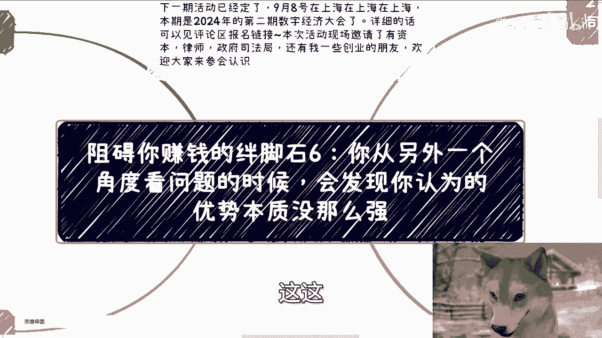

## 概述
在本节课中，我们将探讨一个常见的认知误区：当你从另一个角度审视问题时，会发现你自认为的优势可能并不存在，或者其力量远没有你想象的那么强大。我们将通过故事和分析，帮助你重新理解什么是真正的商业价值。

---

## 开场与活动通知
下期活动已定于9月8日在上海举行，是2024年的第二期数字经济大会。活动邀请了资本律师和我的创业伙伴，欢迎大家通过评论区链接报名参与。这些人都是我认识多年的朋友，比较可靠。

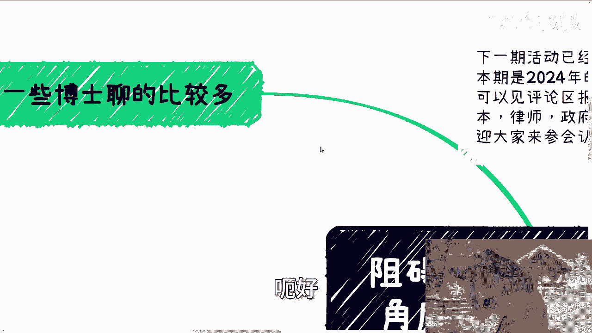

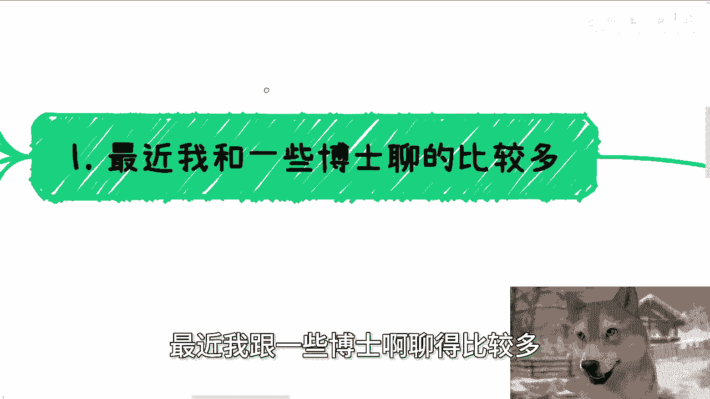

---

## 故事引入：关于“优势”的讨论
最近我与一些博士交流较多，谈话中常常会提到“优势”这个概念。前两天看到一条评论，说要多考证书，否则会落后于人。我以前就说过，很多听起来有道理的逻辑，其实是空洞的。比如这条评论，如果当面问我，我会问：具体是什么证书？什么时候用？有多大作用？没有会怎样？能赚多少钱？我敢打赌，提问者自己也不清楚。

我与博士们主要讨论了几个被认为是优势的点：
1.  在公司层面，能参与更多项目，看到更多东西。
2.  拥有博士学历，在卷的环境中让自己更有优势。
3.  相比身边人，更清楚自己的窘境，因此会更注意社交积累。

我们今天假设你们都拥有以上三点。在你们的认知里，拥有这些会比现在更强。接下来，我们基于这个假设展开讨论。

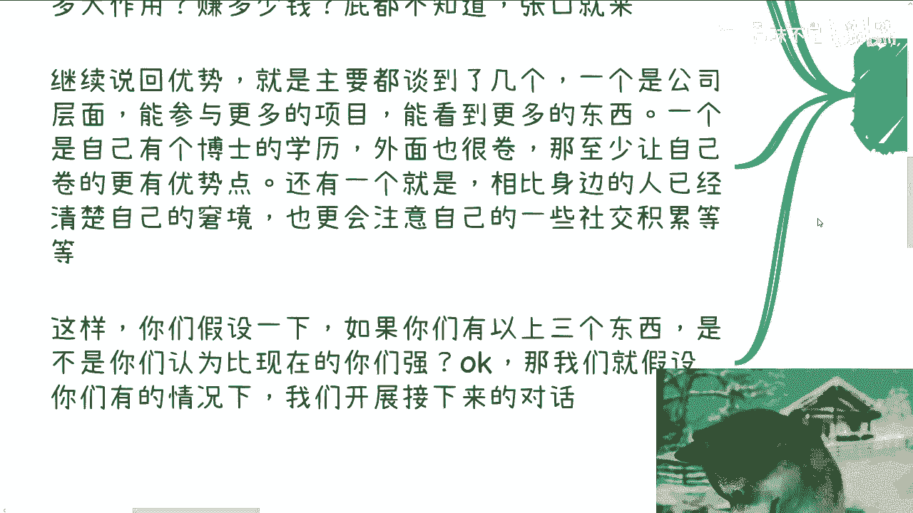

---

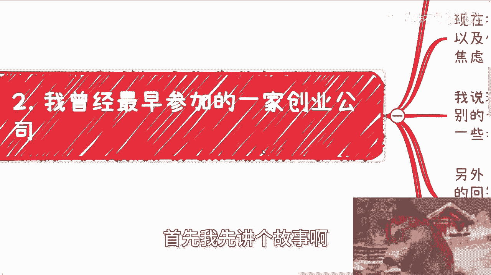

## 第一个故事：精英的十年后
我曾经最早加入的一家创业公司，初创团队中有清华和上海交大的毕业生，还有从微软和日本留学归来的人。他们都是计算机科学领域的佼佼者，参加过ACM竞赛。

十多年过去了，有人问我这些人现在怎么样，是否也会焦虑未来、担心失业。我与他们一直断断续续保持着联系，其中还有人曾向我借过钱。现在，这些人大多还在公司里，拿着固定工资。相比当年，他们多出来的是房贷、子女教育费用和老人开销。

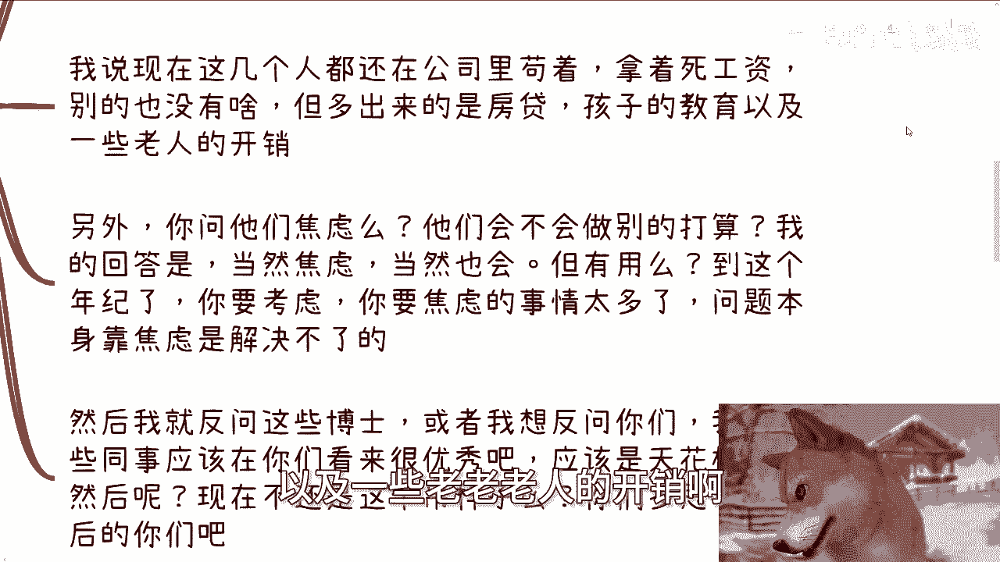

你问他们焦虑吗？会不会做其他打算？答案是肯定的，他们肯定焦虑，也肯定会想做打算。但有用吗？到了三十多岁的年纪，需要考虑和焦虑的事情太多了：房子、保险、停车、工作、老人、孩子……焦虑能解决问题吗？每天焦头烂额有什么用？

我想反问博士们，也想反问你们：我的这些同事，在你们看来应该很优秀，是天花板级别了吧？但十多年后的今天，不还是这个样子吗？请多思考一下你们的未来。

---

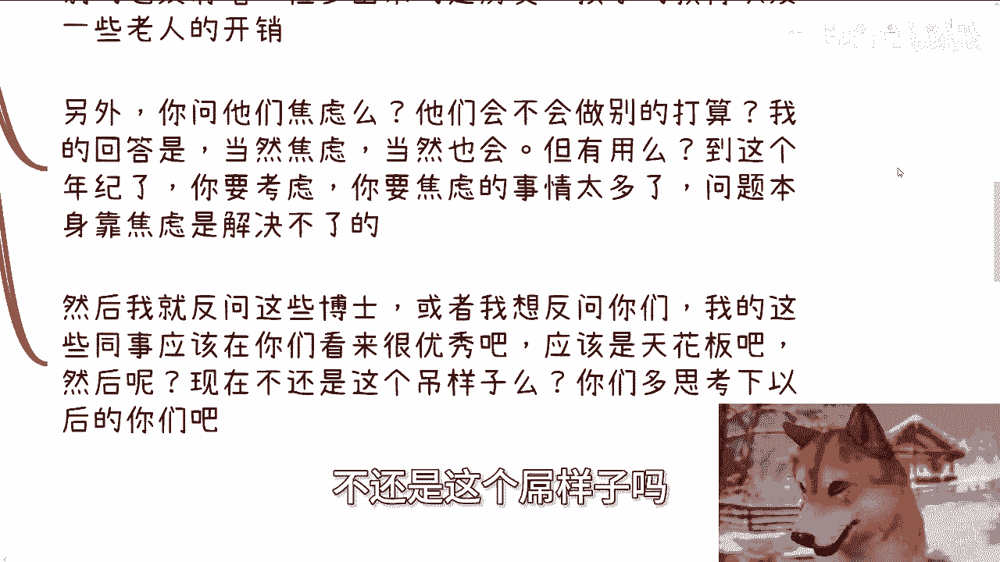

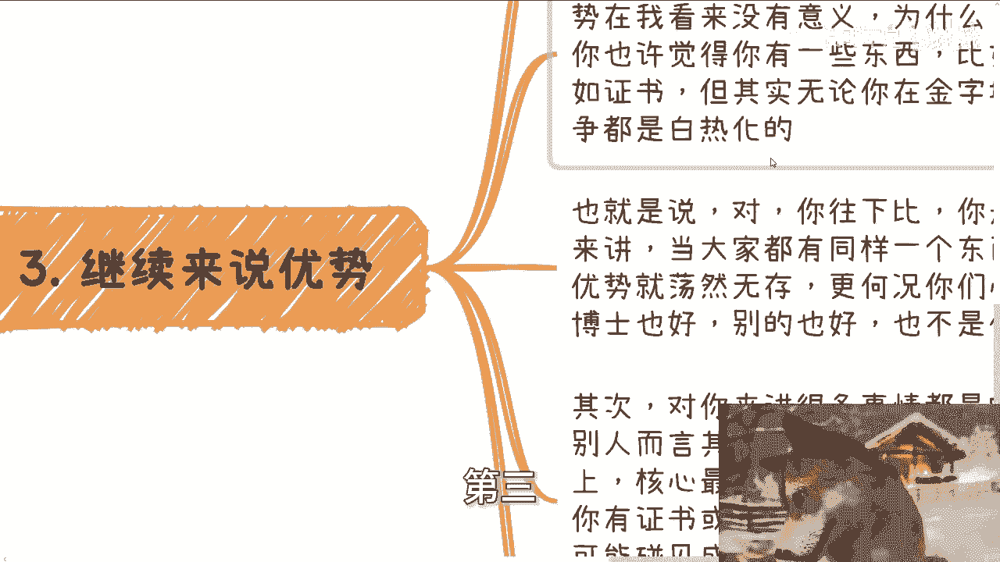

## 核心分析：为什么“优势”可能无效？
上一节我们通过一个故事看到了所谓“优势”的长期局限性。本节中，我们来深入分析其背后的原因。

假设你们拥有之前提到的三个优势，可能会很开心。但我的对话是这样展开的：

**第一，你的优势可能没有意义。** 因为世界是立体的。你或许觉得自己有博士学历、教职、证书等优势。但当你站在宏观角度思考，会发现无论在金字塔的哪一层，竞争都是白热化的。你的优势是相对于下层而言的，但你会去和下层比吗？不会。你心里可能看不上他们，否则你就不会去考博士。但在同级别中，当大家都有同样的头衔时，你还有什么优势？所以，“我考了博士就有优势”这句话，听起来有道理，但事实上可能没有。

**第二，很多事情对你而言是第一次，但对别人已是常态。** 社会交往的核心最终是与人打交道。不管你做何种生意或项目，最终都要与人打交道。你说你是博士，或有证书、有团队，请问有优势吗？没有。因为对你而言，获得这些可能拼尽了全力，但对社会上其他人而言，他们可能已经见过成百上千个像你这样有证书、有头衔的人。你对对方有优势吗？没有。

因此，你需要向对方展现不同的东西。更何况现在是2024年，不是2004年。商业价值，我用最直白的话告诉大家：**你得让对方明白，你是个会赚钱的人。除此之外，别的都是假的。** 在2004年，你手上的东西或许有用，但放到2024年，可能毫无用处。

---

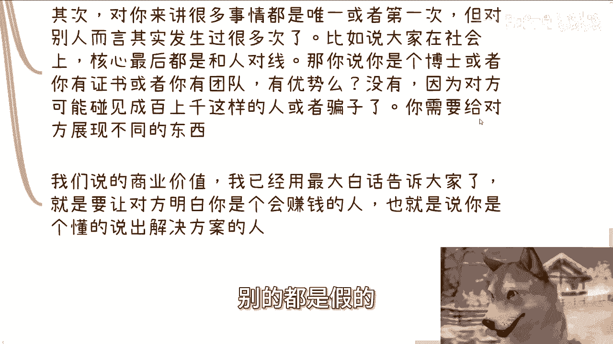

## 实战举例：如何展现真正的价值
上一节我们分析了传统“优势”的无效性，本节我们来看看在具体场景中，什么才是对方看重的价值。

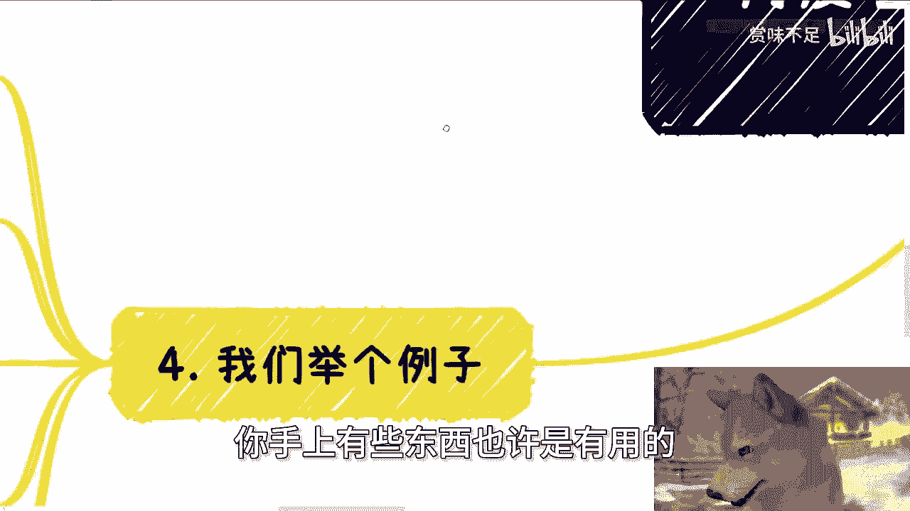

举个例子，假设你在与一个有业务或资源的人交谈。我们先不论这些业务和资源本身是否赚钱。如果你在聊完后能提出以下几点，这就是你的价值：

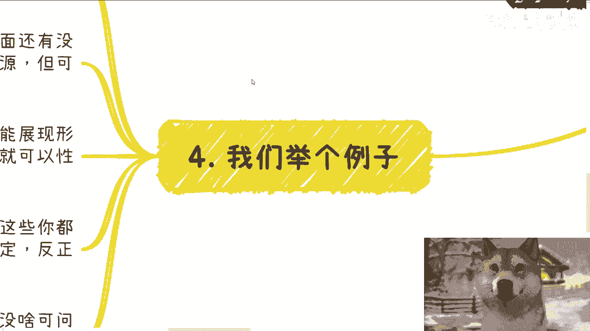

以下是你能提出的关键点：
1.  **发现增量市场：** 指出这些资源或业务在哪些增量市场中还有赚钱的可能。也就是说，资源本身不用大动，但换个赛道、方向或合作模式，就能赚更多钱。
2.  **改变展现形式：** 资源不变，但改变其展现形式或营销方式，就有可能重新定价，从而以更高的性价比获得收益。

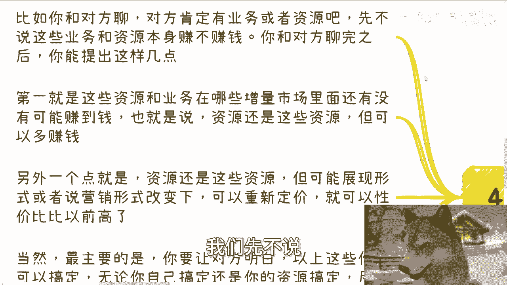

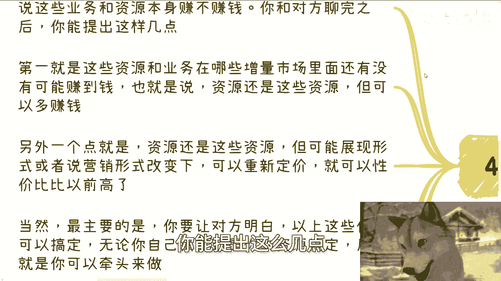

当然，最重要的是你要让对方明白，以上你说的这些解决方案，你都有能力搞定。无论是你自己搞定，还是动用你的资源搞定，你要让对方相信你能牵头做好。

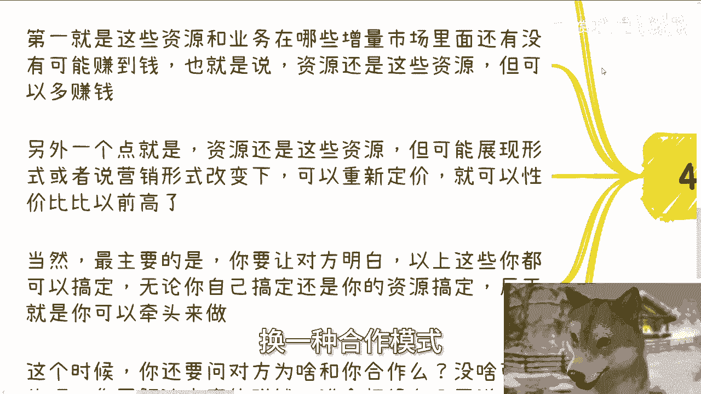

这时，你们可能又会问：对方为什么要跟我合作？讲到这里前提应该很清楚了：**如果你拥有这些思维方式，或者拥有提出解决方案的能力，对方不会问这个问题。** 因为你的解决方案能赚钱，谁会拒绝？无论从哪种合作方式看，对方都不吃亏，何乐而不为？

---

## 如何获得解决问题的能力？
那么，最核心的问题来了：如何才能想出这些解决方案？

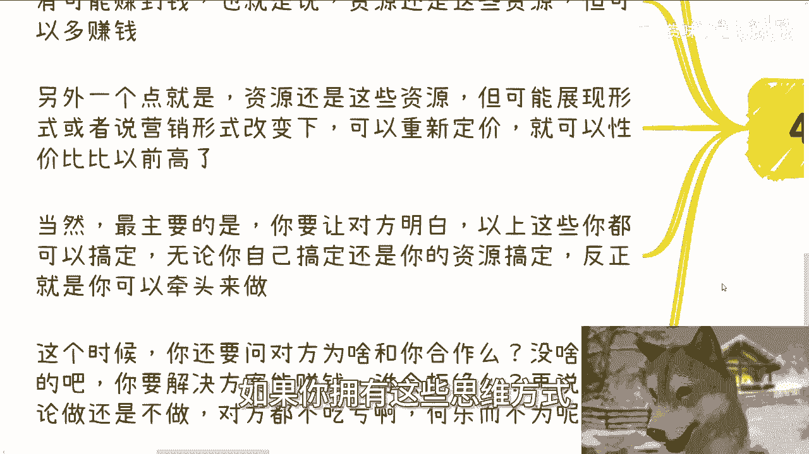

以下是几种常见的途径及其局限性：
*   **看书？** 不能。因为书籍是经过审核的，很多敏感或实战的内容不会出现在上面。
*   **靠老师教？在学校学？** 没有。学校不会教你如何赚钱。
*   **靠大佬带？** 哪个大佬会无缘无故来带你？

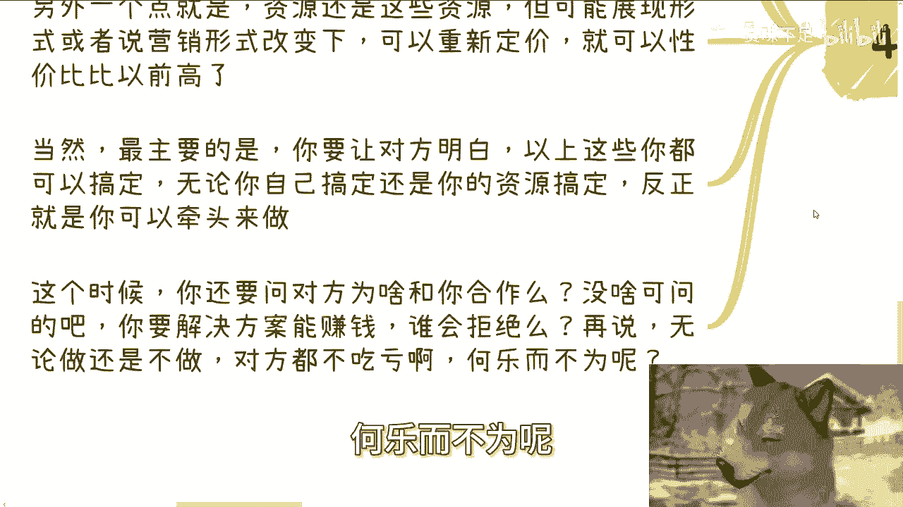

那怎么办？只能通过你不断地去交流、一层一层地去做业务实践。没有别的选择。你所谓的那些优势，都是社会灌输给你的。就像我一直说的，你们要赚钱，最大的前提就是**抛弃以前被灌输的所有认知**，比如学历等。你们觉得它们有用，是因为别人灌输给你们“这有用”，但真的有用吗？不一定。或者说，它们仅仅在成为“工具人”的层面有意义。

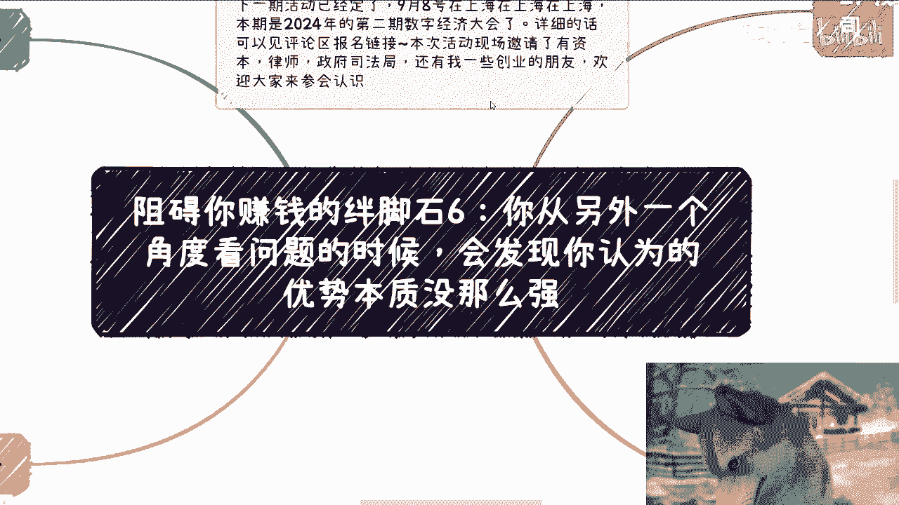

这就好像资本家定义了一个战场，让你们自相残杀。你不但不去反驳资本家，不去向外寻找出路，反而还在那里说：“我要把刀磨得更快，在自相残杀中让别人死得更快。”这是你们应该做的吗？

---

## 总结与后续
本节课中，我们一起学习了如何换个角度看“优势”。我们通过故事看到，即使拥有光鲜的学历和背景，长期也可能陷入困境。我们分析了传统优势在立体、白热化的竞争中可能无效，因为真正的商业价值在于证明自己“会赚钱”。最后，我们探讨了如何在交流中通过提出增量解决方案来展现价值，并指出这种能力只能通过持续实践和交流获得。

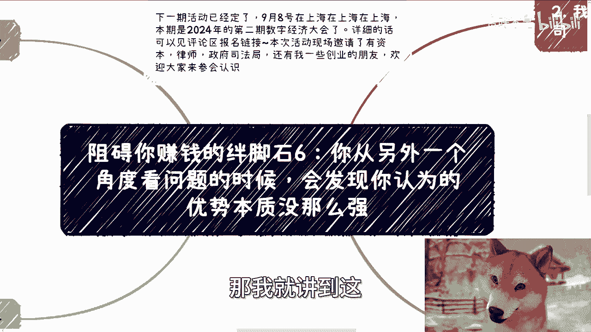

请认真思考一下。关于职业规划、商业规划、副业、与人合作、估值、股权、融资等各个方面，如果你希望通过与我的沟通获得更接地气的建议或规划，少走弯路，可以整理好对应的问题和个人背景信息。

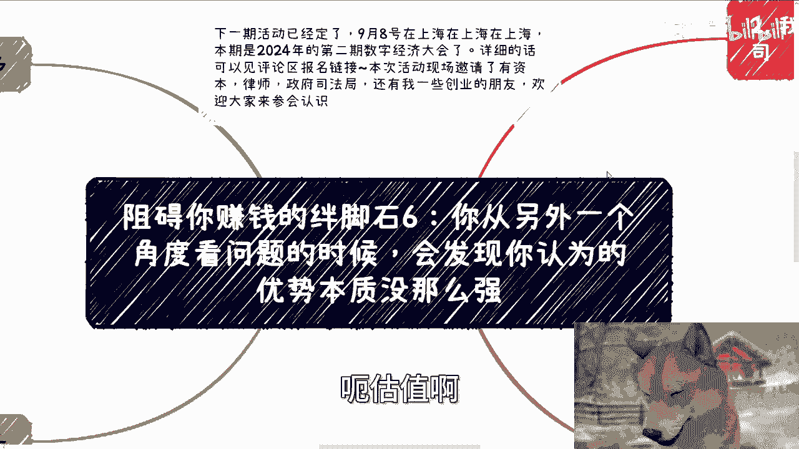

---