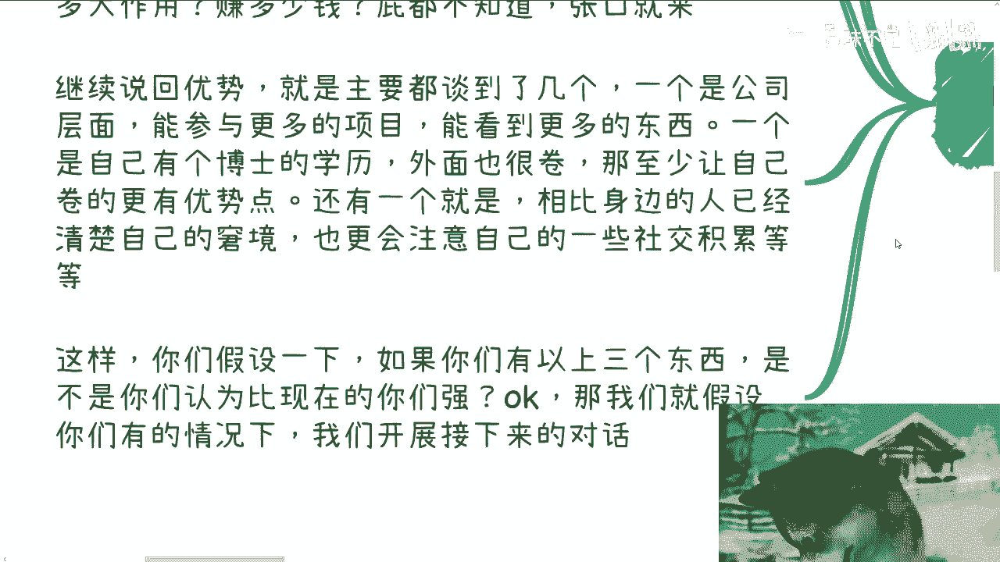
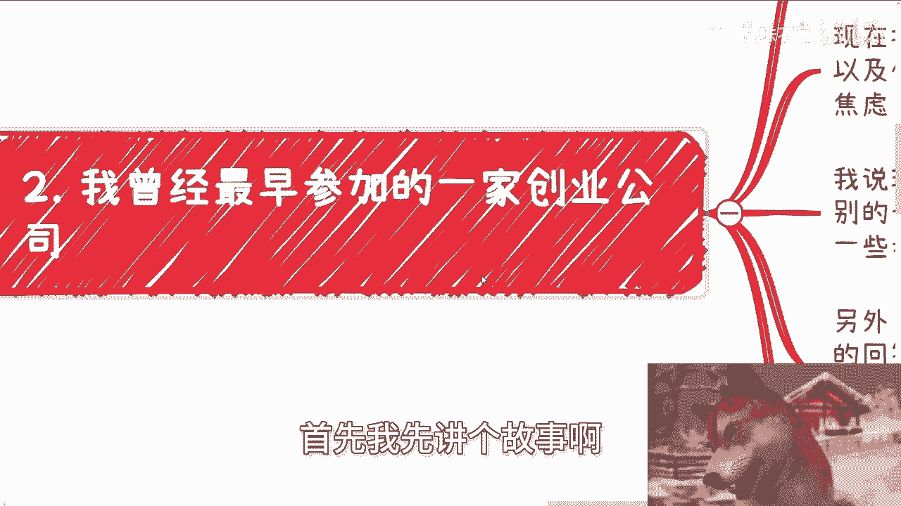
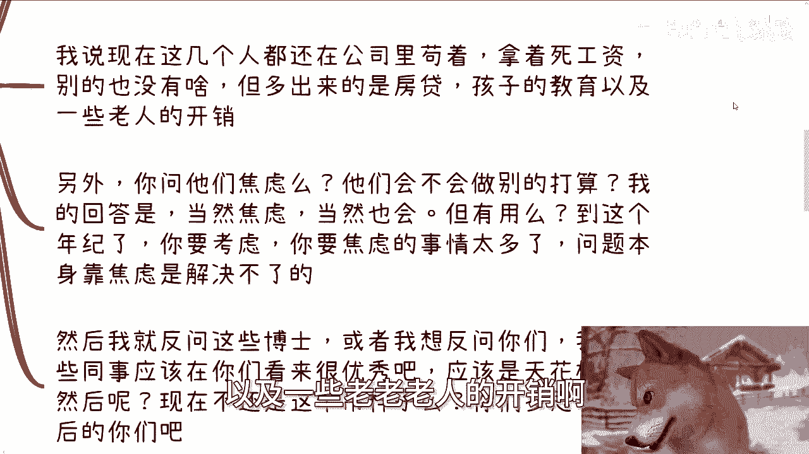
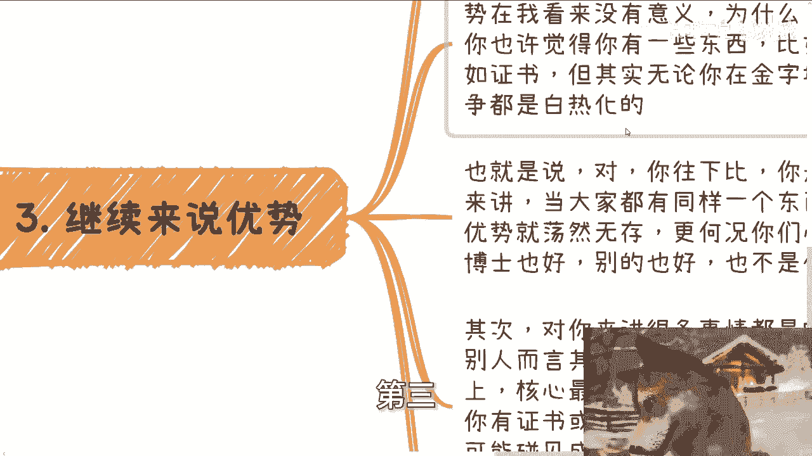
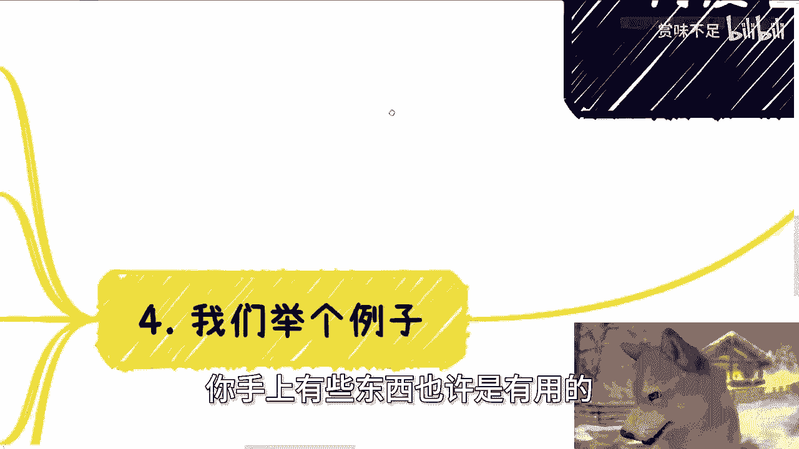
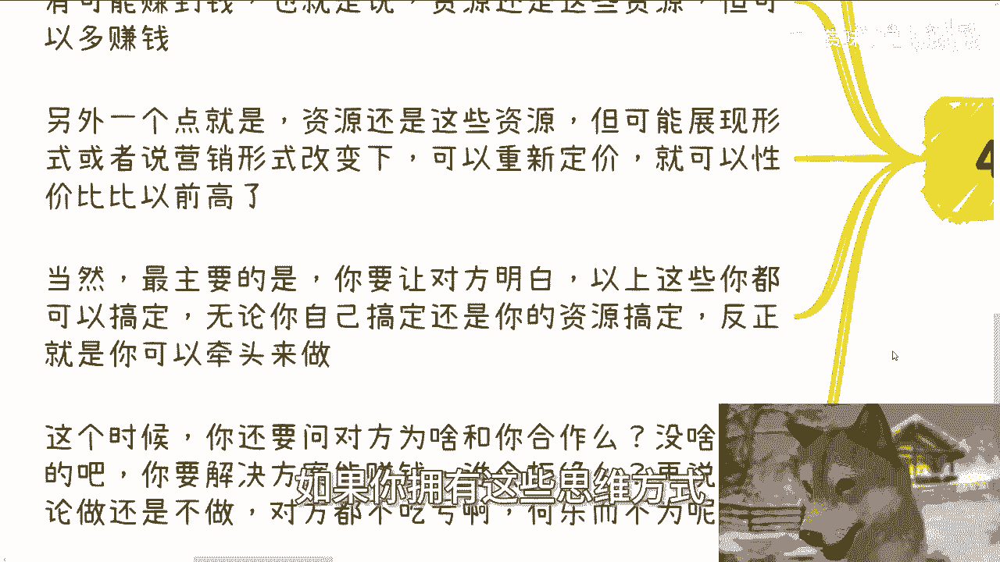
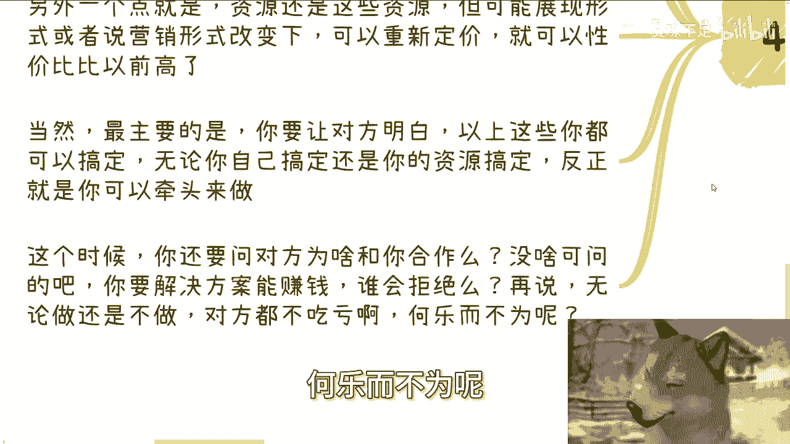
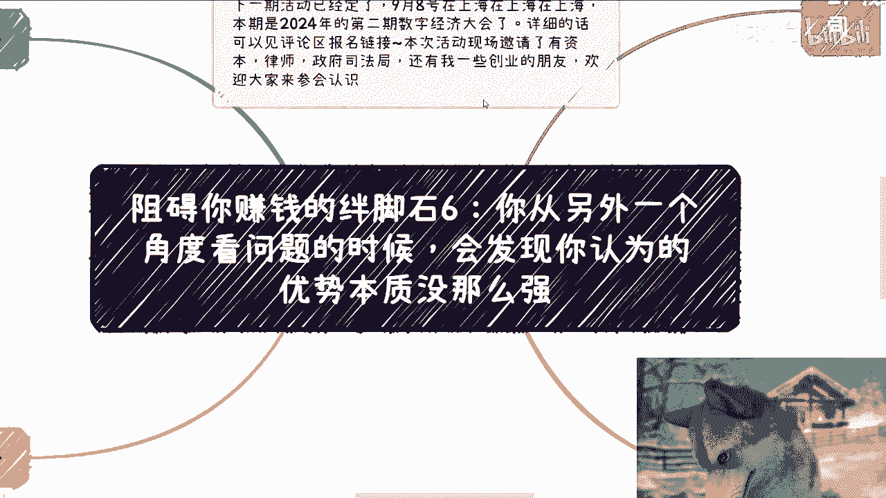
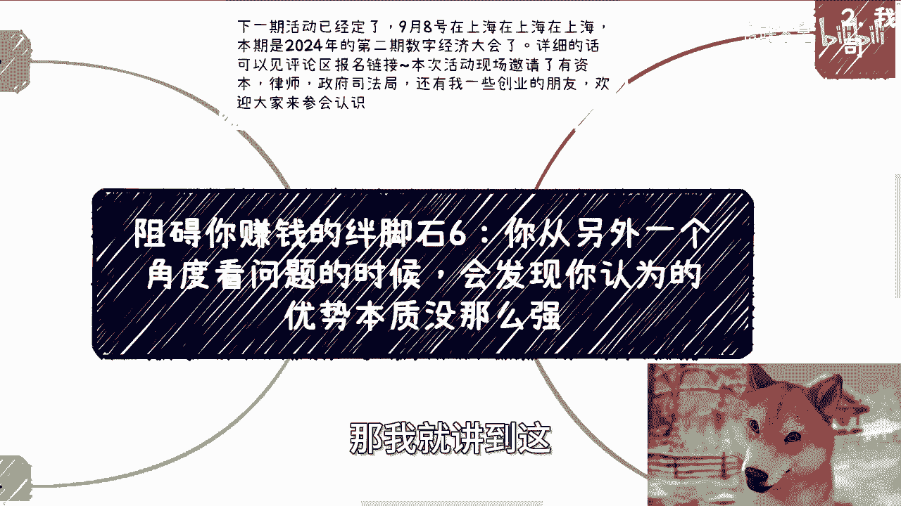

# 你从另外一个角度看问题的时候，会发现你认为的优势可能根本就不存在 - P1 - 赏味不足 - BV1dRpueiEEz

好大家好，今天我们来讲阻碍你赚钱的绊脚石六啊哈，嗯是我先说一下这个主题啊，就你从另外一个角度啊，这个看待问题的时候，会发现你认为的这个优势本质可能没有这么强，或者没有这么优势啊，我为什么在笑啊。

是因为他妈的这个B站那个直播间，就我录录播录制的这个软件，他妈的更新了，更新之后，他他整个整个界面都变了，你知道吗，这这哈。

我觉得啊本来我可能还能分得清楚对吧，我我这个这个这个这个叫什么，有没有录进去啊，或者怎么样的，我可以跟你们讲，我现在他妈的我一脸懵逼，我根本就不知道他妈的，我现在是录录录进去还是没录进去啊。

然后另外一方面呢是我家这个咪咪啊，我家咪咪他妈的疯了妈的，一听到完美左边跑，跑到右边，右边跑到左边，卧槽啊，好首先这样子啊，下期活动已经定了9月8号好吧，在上海，那么本期呢是2024年的第二期。

数字经济大会，那么详细的话呢可以建评论区报名链接，那么本次呃活动啊，那个我也邀请了有资本律师啊，还有我的一些创业的伙伴，反正欢迎大家过来都可以认识认识，反正这些人呢都是我这个认识很多年的。

肯定还是比较靠谱的啊，额好。

那么接下来我们来讲故事对吧，因为讲故事还是比较好玩的对吧，第一啊最近我跟一些博士啊聊的比较多。

聊聊的过程当中呢往往都会提到一个事情，那就是所谓的优势啊，那包括前两天呢还有一个评论也是笑到我了，就说什么啊，要考更多的证书对吧，他妈的不考更多的证书等用，到时候岂不是落后于别人对吧，我以前就说过啊。

就是很多话跟很多逻辑，但大家讲出来的时候觉得好像有他妈道理，但是其实他妈的都是空的，这就好像这个评论你要我讲就是就是他妈的，如果当面啊，你要让我说当面说啊，我就问啥证书呢，什么时候用得到呢，多大作用呢。

我没有怎么了呢，能赚多少钱呢，我敢打赌，你屁都不知道，张口就来，对吧啊，继续说回优势啊，就是我跟这个几个博士主要谈到这么几个点，一个是公司层面能参与更多的项目啊，能看到更多东西。

一个呢是自己会有一个博士的这个学历啊，就外面相对很卷，但至少让自己卷的更有优势嘛，啊还有一个就是相比身边人呢，已经清楚地掌握了自己的这个窘境啊，所以说也会更呃注意自己的一些社交积累啊。

这样啊我们今天假设一下，如果你们都拥有以上三个东西，那么我相信对于你们来讲。

你们的认知会认为，至少你们有这三个东西比你们现在是强的对吧，OK啊OK啊好，那我们假设你们有的情况下面，那么我们展开接下来的这个讨论和分析啊，首先我先讲个故事啊。

我曾经最早参加的一家创业公司呃，我曾经最早参参加那些创业公司呢，基本上初创的几个人都是上海交大的啊，然后有有一个清华的，三个交大的，然后呃两工作的话是两个微软出来的，一个是日本留学回来的啊。

那么我们就这么说啊，就是说呃一方面他们都是上交出来的，另外一方面呢都是打ACM比赛出身的啊，懂的人应该都知道，他们都是cs当中的佼佼者啊，现在呢已经就是十多年过去了啊，他们问我，他说这些人怎么样。

以及他们是不是也很担心未来会失业啊，他们会不会很焦虑，我说我就这么讲啊，我呢也的确跟他们也一直，断断续续保持着联系啊，然后这当中还有部分还问我借过钱啊，我说现在这几个人呢还在公司里苟着，拿着死工资。

别的也倒没什么，但是唯一相比当年多出来的是什么，多出来的是房贷，孩子的教育以及一些老年老老人的开销啊。

另外你问我他们焦虑吗，他们会不会做别的打算，我的回答是yes，肯定焦虑，肯定会做别的打算，但是问题有用吗，你明白吗，就是说当他们到30多岁的时候，到了这个年纪的时候，他要去考虑的。

他要去焦虑的事情多了去啦对吧，有房子，有保险，有停车，有工作对吧，有有有有有那个呃老人有小孩儿，卧槽，你觉得他焦虑有用吗，他焦虑能解决问题吗，他每天焦头烂额有卵用啊对吧，然后我就反问这些博士。

或者我想反问你们，我的这些同事，应该在你们看来应该很优秀吧对吧，应该很天天花板吧，然后呢我想告诉你们的是，十多年后的今天，不还是这个吊样子吗。

对不对，你们多思考一下你们的未来啊，第三我们继续今天这个主题来说这个优势啊。

呃假设你们有我说的这三个东西，你们可能会很开心啊，我跟他们的对话是这样展开的，我说第一你的优势在我看来没有意义，为什么，因为这个世界是立体的，你也许觉得你有些东西，比如说博士，比如说教职，比如说证书。

对不对好，但其实你有没有想过这个世界是立体的，也就是说，当你站在一个宏观的角度去思考问题的时候，你会发现你无论在金字塔的哪个label，本质竞争都是白热化的，也就是说对，也就是说你今天有一些优势。

你是往下比，你是有优势的，但是你会往下比吗，不会呀，你你想是不是，比如说你今天是个博士，我跟你说来，你你去跟本科跟专科比会本来不会的呀，我说不好听点，你从心里面是看不上人家的，对不对。

你会拥有博士应该有的骄傲，别别来杠，你心中肯定是这么想的，否则你就不会去考博士，对不对，但是同级别来讲，当大家都有同样一个东西，同样一个头衔的时候，那么你想想看你还有什么优势，对不对。

就是这句话就从你们的口口中讲出来的时候，你会发现你们听上去很有道理，你说我考了一个博士，我觉得是有优势的，但是事实上呢没有对吧，其次对你来讲，很多事情都是唯一或者第一次，但对别人而言，其实发生过很多次。

比如说大家在社会上核心，到最后都是跟人兑现嘛对吧，我不管你们，你们你们到底是做什么样的生意，还还是说是做什么项项目，你最终不还是跟人打交道吗对吧，那你说你是个博士，或者你有证书，或者你有团队。

或者你有anyway，各种各样的东西，请问有优势吗，没有为什么，因为对你而言，你有这些东西，你可能很努力，你可能拼了九牛二虎之力，但是对于社会上的别人来讲，他可能已经碰见过成百上千的，像你这样有证书。

有头衔，有团队的人或者骗子，那我就问你对对方有优势吗，有吗，有个屁对不对，所以你需要对对方展现不同的东西，更何况现在是2024年，他妈不是2004年，明白吗啊所以我们说的商业价值。

我已经用最大的最大的大白话告诉大家了，就是你得让对方明白，你是个会赚钱的人，除此之外别的都是假的。

因为还是那句话，就是你今天如果是2004年，你手上有些东西也许是有用的。

但是你放到2024年，然并卵，一切都然并卵，对吧嗯第四我们举个例子啊，文文过来过来过来听到吗，哎不要动了。

过来啊，第四我们来举个例子，比如说啊你跟对方聊，对方肯定有业务或者资源吧对吧，那么我们先不说这些业务跟资源本身赚不赚钱。

你和对方聊完之后，你能提出这么几点。

这就是你的价值，第一这些资源跟业务在哪些增量市场里面，还没还还还有还啊，就是还有可能没有赚到钱的，也就是说资源还是这些资源他不用动，但是呢你可能换个赛道，换几个方向。

换一种合作模式就可以赚到更多的钱对吧。

这是第一个，第二个资源还是这些资源，但可能展现形式或者说营销形式改变一下，那就有可能重新定价对吧，那么也就是说我们可以在不，你就是说不不大动干戈的情况下面，我们可以那个性价比比以前更高对吧。

当然最重要的是你要让对方明白以上说的那些，比如说你讲出来五个解决方案，六个解决方案，你讲出来这些解决方案你都是可以搞定的，也就是说无论你自己搞定还是你的资源搞定，你让对方明白，反正你能搞定。

就是你能牵头来做好，那么这个时候我相信我，你们不管现在是博士还是硕士，还是说是已经工作很多年的人啊，你们就会又会问那个问题，你就会问对方为啥跟我合作，大哥讲到现在你应该很清楚前提是什么。

如果你拥有这些思维方式。

或者你拥有这些就是能提出解决方案的能力，对方不会问的，因为你要你的解决方案能赚钱，谁会拒绝呢，再说无论从这个合作方式来讲，无论对方做还是不做，对方不吃亏啊，何乐而不为呢，对不对。

好那么回到最核心的问题上面，你们说那我怎么能想出这些解决方案，怎么能你们想想看第一看书能吗，不能因为书这种东西都是审核过的对吧，也就是说很多敏感的东西不会出现在上面，第一第二怎么来，靠老师教吗。

学校读吗，没有的，学校不会教你赚钱，三你靠别人大佬来带你吗，哪个大佬吃完来带你啊，对不对，那怎么来，那不得只能通过你去去不停的交流，不停地做业，那个业务一层一层去做吗，你还能怎么样呢，还能怎么样呢。

没别的选择。

对不对，你所谓这些优势都是这个社会灌输给你的，就像我一直跟你们讲的，你们要赚钱，最大的前提就是抛抛弃你们以前所有的认知，什么学历啊，什么别的各种各样的东西啊，你们觉得有用是为什么。

是因为别人灌输给你们觉得有用，是真的有用吗，不是对吧，或者来说仅仅是在牛马，在做工具人的层面是有用的，有意义吗，对不对，这就好像资本家呃呃呃呃定义了一个战场，让你们自相残杀，你在那边不但不去反驳资本家。

不但不去往外寻找出路，你还在那边说，的，我要我要把这个刀磨锋利一点，我要自相残杀的，让别人死的更快一点，这是你们应该做的吗，对不对啊，行好吧，那我就讲到这好吧。

你们可以在真的想想看啊，然后活动的话就是8号在上海啊，然后剩下的话就是说职业规划啊，包括一些商业规划，就工作上面包括做额这个这个副业上面，或包括跟别人合作上面，额估值啊。

股权啊，融资啊，各个方面，你们希望通过跟我的沟通，能够得到一些更接地气的建议或规划的话，让你们少走点弯路的话，那么你们可以整理好对应的问题和个人背景。

