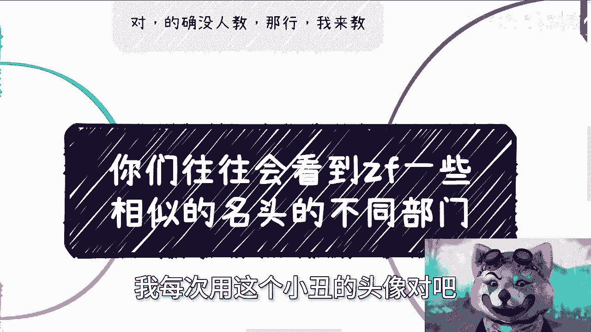
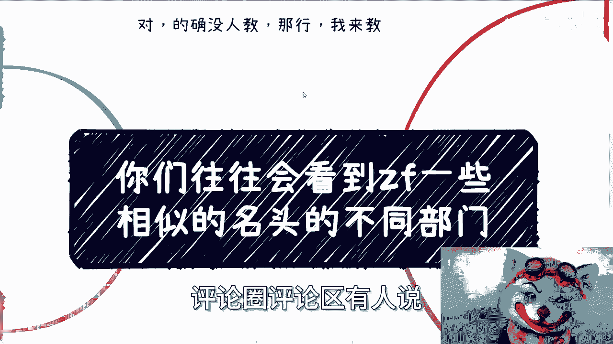
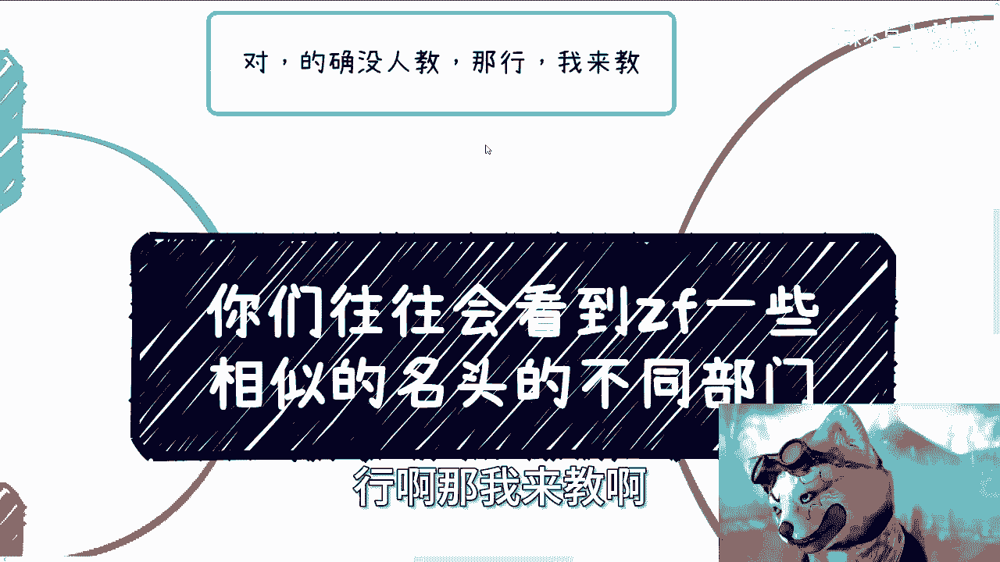
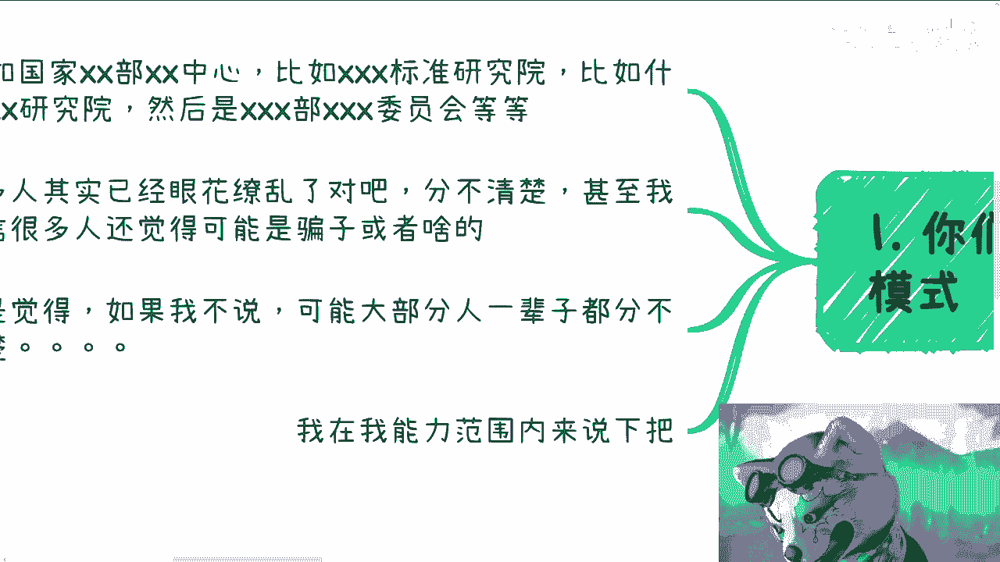
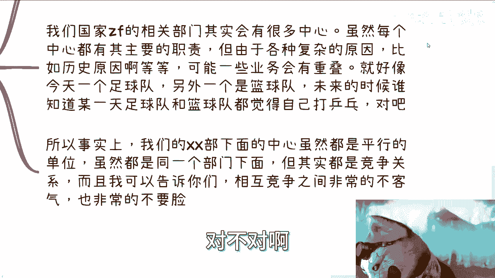
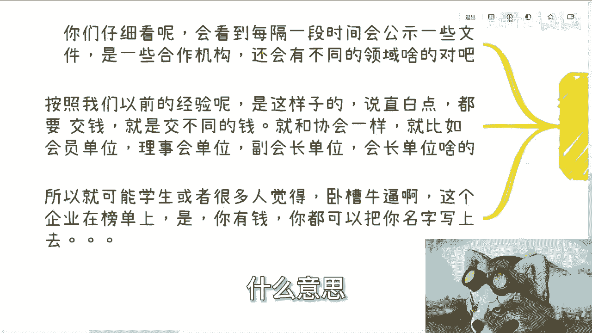
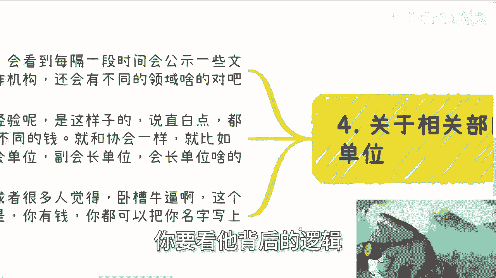

# 你们往往会看到xx部门xx中心-来听故事了呀---P1---赏味不足---BV1jK4y1q7sa_

在本节课中，我们将学习如何理解常见的政府机构名称（如“XX部XX中心”），并剖析其背后的“白名单”合作体系。我们将拆解这些概念，帮助你建立清晰的认知框架，避免因信息差而产生误解或被误导。

***

## 概述：机构名称的迷惑性

你们往往会看到一些政府相关的、相似的名头，以及不同的部门。这些部门下面还会有不同的中心，甚至有不同的委员会。很多人其实对这些东西没有感知，觉得好像都是国家部门或国家单位，但是搞不清楚为什么这么乱，甚至分不清楚，可能还会觉得是骗子。

***

## 第一节：核心概念——“白名单”企业

首先，我们要知道一个核心概念：政府相关部门都有所谓的“白名单”企业。

所谓“白名单”企业，基本上都是政府相关部门的商业合作方。有的专门提供外包服务，有的则是专门的供应商，各司其职。这就好比政府是一个整体，它需要手、脚、心脏等各种“零件”来组成一个完整、可运行的体系，而白名单企业就是这些“零件”。

***

## 第二节：政府部门的运作模式

上一节我们介绍了“白名单”企业的概念，本节中我们来看看政府部门的具体运作模式。

政府部门几乎所有的事情，都会寻找白名单供应商来做。当然，这并不是说政府部门不做事，而是他们做的事，跟大众普遍理解的可能不是一回事。至于具体原因和内容，在此不便展开。

我们这里重点讲的是第一类——白名单合作方。他们往往与相关部门打配合。例如，他们在外面发布什么年报、标准或报告。很多人觉得这些标准很好，也没有向大家收费。

然而，这可以理解为“放长线钓大鱼”或“养肥了再说”。这些标准出来后，会转化成所谓的“评测”。随后，你们会发现政府的一些招投标项目，甚至是一些产业园、研究院的项目，会要求企业通过某些特定标准的评测。

这说得直白一点，就是“打配合”。一般一个项目的费用从几万到几十万不等，虽然几百万的没见过，但二三十万的比比皆是。其核心逻辑就是利用信息差。

***

## 第三节：如何辨别机构的真伪

理解了运作模式后，我们来看看如何辨别这些“XX部XX中心”的真伪。

首先，判断它是不是真的，可以从网站备案入手。大部分虚假网站甚至没有备案。你可以在网站底部查看备案信息，例如“京ICP备……”或对应省份的备案号。

其次，你可以到其声称的上级单位（如某个“部”）的官网去查询，看是否真的有这个“中心”或“委员会”存在。

我国政府相关部门确实会有很多分中心，每个分中心虽有主要职责，但由于各种复杂的历史或现实原因，未来在业务上可能会出现重叠。这就好比一个部门下有负责足球的中心和负责篮球的中心，但未来为了拓展业务，两者都可能声称自己能负责乒乓球，从而产生竞争。

事实上，到今天这个阶段，大部分所谓“XX部”下面的中心，虽然是平行单位，且都在同一个部门下面，但它们之间是**竞争关系**，而且竞争可能非常激烈。

***

## 第四节：红头文件与公示名单的解读

上一节我们学会了辨别机构真伪，本节我们来解读常见的“红头文件”和公示名单。

相关部门会定期公示一些文件，也就是所谓的合作单位名单。这些单位往往是市面上的企业，并被标注在不同的领域，如工业互联网、机器人、新能源等。

按照经验，说得直白一点，这一切都与钱有关。你交了不同的钱，就能获得不同的名头。这类似于在协会中，挂“会员单位”、“理事会单位”、“副会长单位”或“会长单位”的头衔，所需费用从2万到100万不等。

因此，很多学生、创业者或缺乏社会经验的人，一旦对方拿出红头文件，就会觉得“卧槽，牛逼”。但正如前面所说，一旦你产生这种想法，就离被骗不远了。因为企业出现在这个榜单上，往往只说明它“交钱”了。这意味着，只要你有钱，理论上也可以上榜。

所以，不要动不动就觉得“卧槽牛逼”，你要看透它背后的商业逻辑。

***

## 总结

本节课中，我们一起学习了如何解读复杂的政府相关机构名称。我们剖析了“白名单”企业的概念，了解了政府部门与这些企业之间的配合模式，掌握了辨别机构真伪的方法，并学会了理性看待红头文件与公示名单背后的商业逻辑。

核心在于，面对这类信息时，应避免简单的“崇拜”心理，而要尝试理解其背后的运行规则和利益关系。很多东西如果没人点破，可能一辈子都无法看透。希望本课内容能帮助你建立一个更清晰、更理性的认知框架。