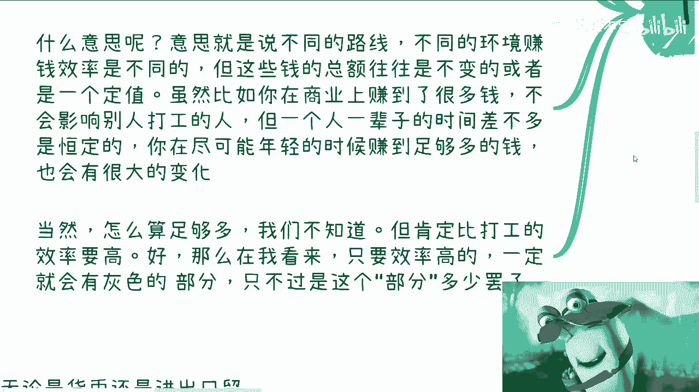
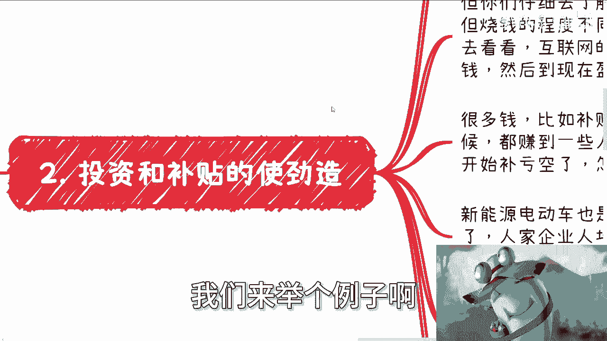
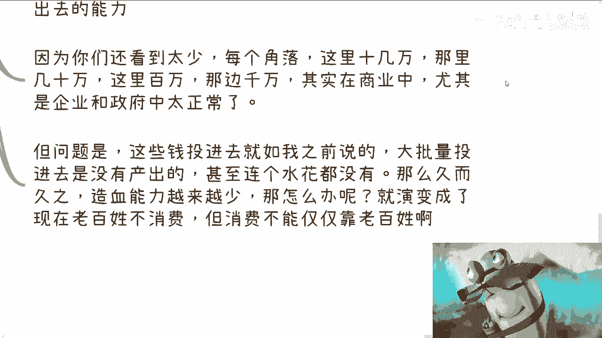
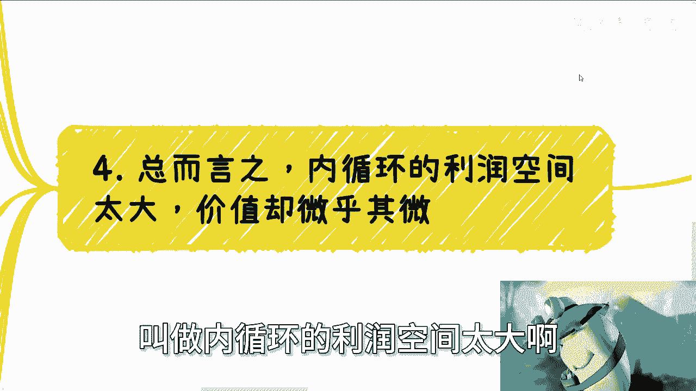

# 你们都问我，钱去哪儿了，我们来说说吧 - P1 - 赏味不足 - BV1H64y1A7Ya

好啊大家好啊，我们这一期呢讲的是啊，也不是这一期吧，就是其实很多时候很多人问我，他说钱到哪去了啊，呃我们来浅浅的说一下啊，为什么浅浅的呢，是因为他深深的说不了对吧。

那深深的等未来大家什么时候线下有机会对吧，私下聊的时候说说，你说像嗯每次办活动对吧。

那个线下这么多人，这个我围在旁边，我也不敢讲啊，这万一有谁捅出去了，很烦啊，同样的我来给你们翻译一下，就打嘎来猛五个钞票到哪里都起来。

我来收尾啊，杠杠啊，首先先说一下大前提啊。

我们先说客观的情况呃，不要去就是什么意思啊，就是说我们所有讲的事情，我可以跟你们说是客观事实，但是呢你们不要去判断这个客观事实是好是坏，因为为什么主要两个原因，第一个原因是你判断它好坏没有用对吧。

第二个事情是本身也没有所谓的好跟坏，你怎么判断它好跟坏呢对吧，因为你判断它坏往往是因为你不是既得利益者，从既得利益者来讲，这是好的，那你怎么去看他坏好跟坏呢，对不对啊，那么在我看来。

我觉得未来如果有可能的话，最大的优势或者最大的理想化的状态，就是你们能够去了解这些事情。

从而利用这些事情去赚到钱，那我觉得已经是最大的欣慰的地方啊，那么为什么浅浅的呢，因为深深的没法说对吧，人多嘴杂，说多了风险高，你哪怕放到充电视频也风险很高啊，那么就如我们之前说的啊。

在不额外印钞的情况下面，国家啊除了金融，除了证券，除了国债，基金等各种各样的方式去吸引或者去引呃，引导资金的流通，你玩啊，我们先从不额外进出总额情况来讲，那么它的总量是恒定的对吧。

也就是说在某一个时间周期里面，它的总量是恒定的，那么意味着什么，意味着有人赚就有人亏了，哎或者来说有的人多赚了就有的人少赚了对吧，因为赚跟亏也是相对的啊，那么什么意思呢，意思就是说呃我们每一个人啊。

在不同的路线上面，不同的环境赚钱的效率是不一样的啊，但这些钱的总额往往是不变，或者它是一个定值啊，呃比如说你今天在商业上面赚到了很大一笔钱，你赚的再多，你不会影响各个企业打工人的薪资是吧。

但是呢你虽然不会影响，但是从个人角度来讲，你的确在别人或者同样年龄，同样的年龄的时候，同样年轻的时候，你赚到了别人可能10年20年的钱，那么你尽可能赚到足够钱，足够多的钱的时候，那么对你来讲。

对市场来讲也会有很大的变化啊，那么当然这个地方就是我们说啊，怎么叫做足够多啊，我们不知道，我们先不去定义啊，但是你肯定比打工的效率要高，而且高很多啊，那么在我看来，只要你效率高啊。

我这件事情我也在咨询的时候跟所有人都说过，就是在我看来，只要你效率高的，一定就会有所谓的灰色部分哦，只不过就是这个灰色部分占比多少而已，那么换而言之是什么意思呢，就是但凡你是打工呃。

踏踏实实做事情，没有灰色部分的，那么在我看来你根本赚不到钱，就这么简单啊，你们要是觉得不是这样子的，你们举个例子出来啊，看看没有灰色部分能赚到钱的啊，你们想想看有什么东西。

反正我是想不出来啊，那么好，第二个我们来举个例子啊。

投资跟补贴的啊，然后使劲造什么意思呢，就前两天一直在说这个新能源电动车啊，说补贴啊，然后呢网上很多人也说啊，国外也在补贴啊，那国外也在造啊，对吧啊啊啊，这个这个造不是那个造的意思。

是折腾的意思啊，这话没错啊，而且呢我跟你讲，各个领域各个细节都在折腾，你，比如说啊创新公司，比如说天使投资，比如说政府补贴，比如说项目扶持基金等等等等等等，比如说产业园的建立啊，你们但凡往前去了解一点。

你们就会明白各地方都在折腾，包括海南，对不对啊，好这样子啊，我就在这个地方给你们讲一个故事啊，你们去查一下海南澄迈县，澄迈县里面的生态园，这个园区在还没有造的时候，我就已经在那边啊。

造完我应该是可能前100名还是前200名的人，在这个园区里面，我可以告诉你们，这个圆圈非常的漂亮，而且这个园区里面造的也非常的好啊，然后这个时间大概什么时候，大概是在20118年左右哦，海南的澄迈县。

但是我就告诉你们当时多么风光，你知道吗，就是一周以内几乎全球的人都在往那边挤，领导根本接待不过来，但是我告诉你们现在什么情况荒废，就这么简单对吧，那我就告诉你们钱从哪来呢，好我们继续往下看啊。

OK你们仔细去了解一下，你说海外在折腾，国内在折折腾啊，这句话没有错，但是没有意义，为什么，因为大家都在折腾，但折腾的程度不一样啊，你你你老是在说啊，我们也在折腾，海外在折腾。

那你为什么说我们不好呢对吧，我没有说我们不好，我说的是我们烧的程度实在是过分了啊，包括我们烧下去盈利的部分也过分了对吧，我别的不说，你们去看看滴滴，你们去看看UBER，你们自己去看看他们的融资。

看看他们的盈利，你们自己去对比，我就不说了，对互联网的企业在中国烧钱，烧出来的企业烧了多少钱，然后到现在盈利有多少，你们自己去对比啊，很多钱补贴什么，每年都在少啊，在经济好的时候，他烧呢就肆无忌惮的烧。

因为大家也没什么感觉，那么赚到了一些人的口袋里去，但是经济不好的时候，就要开始补亏空了，那你想怎么办啊，我们打个比方啊，比如说新能源电动车，都说海外有补贴，我给你讲，笑死了，你去看看。

真的不是说谁好谁不好，我们就拿事实来说话，你去看看人家企业产值，人均产值多少，我们人均产值多少啊，我就跟你们这么说吧，啊我刚毕业那段时间，我去看到很多的项目申报啊，明明这个项目只要十个人。

也明明比如说只要比如说八个八个本科，两个硕士，但是包上去的时候一定是什么，比如说20个人，30个人，50个人，100个人，海战术，为什么，因为聪明人太多了，因为中国的这些人都知道。

每个环节应该怎么赚钱对吧，那有的人要说了，他说那些事情跟我们有什么关系呢，你要明白啊，所有的这些事情都是击鼓传花，为什么，因为金额金钱的中国，一个国家的一个你的这个额度是定值对吧。

你这你这个地方耗掉一点，那个地方耗掉一点，那么最后亏空谁来补呢，这个补不就是击鼓传花吗，你们想想看最后一棒是谁，不就是我们吗，你们搞笑吗，你不是在对吧，好然后第三啊，我们来说商业上一直所谓的造血能力啊。

呃我跟你们这么说，烧钱这个模式没问题啊，一直没有问题，就是我们所谓的资本运作融资A轮烧到B轮，B轮刷到C轮没有问题，这个模式没有问题对吧，就像我跟你们讲什么意思，就是你击鼓传花传呗，没问题啊。

没有说击鼓传花不好啊，你知道不好的是什么，不好的是你击鼓传花，传的是空气啊，对不对，或者你传的本身就是一个就是一个亏的事情，没有造血能力的事情对吧，你就像什么，你就像我们说融资啊，你就像我们说集资对吧。

你今天集资急的是个空气，那你当然是非法的，但是你集资集特集个电影呢，对啊，你几个有用的东西呢，怎么了，谁说不能集资了，你当时那个流浪地球周边还集资呢，谁说不能集资了，对不对，你魔兽。

你模式一直我觉得没有问题，问题在哪，包括补贴和扶持也没有问题，包括一些信创，有很多小伙伴可能根本就不知道信创是什么，我跟你们讲啊，你们去了解一下信创，你们真的去了解一下信创，你们会发现这背后的钱烧的。

你们根本就是就根本就是就怎么说呢，就是就烧的可以说超出你们想象，你们你在你们在在他们看来，这就是个数字，不是钱的问题啊，而且我跟你们讲，很多创新的项目研究等等也没有问题，但是有什么问题啊。

比如你今天总总值就是100万，那么你其中拿20%拿过来烧，这一点问题都没有，但是国内这么多年在互联网上面烧了太多的钱，个人里面的每一个环节油水也太多，但是烧下来的钱钱呢却没有产出多大的利益，你明白吧。

也就是像我们刚刚说的，你是在烧钱，你是在击鼓传花，但是你烧烧出来的是偷空气啊对吧好了，或者来说啊就是说产出太慢啊，也就是说我们说的造血能力根本跟不上花出去，或者说消耗的能力啊，好我就跟你们说。

简单来讲我给你们打个比方，滴滴对吧，那有很多人要说了，那滴滴收税有好处的呀，老百姓要打车啊对吧，怎么样好，我就跟你们这么说，今天就算不少钱，今天就算普通的投资怎么了，滴滴这种公司做不出来吗。

哎我就奇了怪了哦，按照这么个说法，那以前十页对吧，所有的实业餐饮业对吧，或者说互联网早年比如说2000年黄页对吧，前端到后面怎么了，都是烧钱烧出来的啊，不烧钱做不了企业了，哎我怎么奇了怪了，对不对啊。

这就好，这就好像我杀了1万个人，要救一个人，那照你这么说，我必须出来这么多人，必须牺牲这么多人才能救这个人，诶，我怎么奇了怪了，以前就是要牺牲这么多人吗，对不对，我跟你讲啊，因为你们看到的还太少。

每个角落我给你，我就告诉你们每个角落这里是几万，那你几10万，这里几百万，那你几千万，这是很常见的事情啊，但是问题是你最终就会发现这点钱投进去了，就是我之前说的大批量投进去，它是没有产出。

甚至就是说是产出微乎其微，甚至没有产出，甚至连个水花都没有，那么你一次两次没问题，每个城市一一个两个也没问题对吧，但是你久而久之造血能力越来越少，那怎么办呢，那就到最后你从整个上层就会感觉到是什么。

叫做老百姓不消费，叫做叫做好像是这个没有消费能力，但真正是没有没是真正事实是没有消费能力吗，不是啊对吧，是今天就像我刚刚说的，你100万里面这个100万投出去，连20万的价值都没有产出，你怎么办呢。

对吧好，那么你会发现总而言之是什么意思呢，叫做内循环的利润空间太大哦。

价值却微乎其微，什么意思呢，就是说你比如说市场上有非常多的人，是做利差的，比如说那种外汇啊，无论是我跟你们讲货币还是进出口贸易，我觉得这都没问题，因为什么，因为这是需求，这是人，这是金融本质。

这是经济本质的需求，因为而且无论谁来买，基本上都是有用途，或者说它可能是衣食住行实业的一部分，但是中国的互联网产业，或者泛互联网产业以及补贴，他把一个本来很好的事情，变成了一个巨大的一个DEBUFF。

你简单来讲，你比如说100万下来，我这么说吧，你可以用20万的油水，但是至少你得产出80万的价值吧对吧，我不是说他马上要产出利益啊，不是说马上要赚到钱，而是说这个东西它得有价值对吧。

就像就像我们说今天造一个造一个大对吧，或者造一个造一个什么什么东西，它在未来的时间里面它是有价值的，而不是说今天做了一个东西好，做完就做完了，没有了啊，这个钱花掉就花掉了啊，该赚的人就赚到了。

没了没了对吧，你要说有水，你要说有赚头，这个没有问题，但是现在是什么概念，就我所见的所有项目当中，现在基本上是倒过来的，也就是说他100万下去，他可能只有20万的价值，甚至20万没有10万的价值。

10万他妈都没有对吧，但是问题来了，就是你100万是内循环的钱啊对吧，就这个钱不是境外的，你是境内的钱，那么就等于什么，就等于不停的在亏空啊，那么你时间一长没有造血能力，那我就问嘛，没有造血能力。

血从哪来啊，那我说不好听的吸血对吧，你没有做选择就吸啊，怎么办呢，那同样的一些企业跟那个行业的补贴，是补贴本身是好事，但是你过度补贴，你就变成了被薅羊毛的那一方了对吧，你补贴一定是要有规范。

一定要有制度，一定要根据实际情况来，而不是说不停的打肿脸充胖子对吧，就是我就不停的补补了，就是他妈的牛逼啊，就让大家觉得牛逼没有用的对吧，其实这就跟我们那个金融的二级市场，说的事情是一样的。

你但凡做过二级市场，你就会明白，如果你要做市场啊，一定是要有足够的资金盘对吧，就像我就资金盘你们可能不了解，但你们可以去了解一下对吧，资金盘是在我们做二级市场里面，用的最多的这么一个合作啊。

那么你没有资金盘，或者你没有足够的资金盘，你拉的虚高，或者你砸的足够狠，你最终你整个盘控不住啊，为什么，因为你手上没有足够的筹码，你怎么控啊对吧，这就好像就是说你拉高需要让别人觉得。

卧槽这个东西有价值虚高对吧，然后有投资价值对吧，你砸的很多，那是希望再继续吸筹对吧或者怎么样，但是问题是什么，当你没有足够的筹码，无论是你拉的足够高，还是来砸的足够多，你最终依然赚不到钱啊，对吧对吧。

而且更何况你这个盘子就失控了，你整个市值怎么控制啊，一个道理呀，你说你说整个市场已经这个样子了对吧，你已经你已经就是相对来讲，本来应该有80%抽嘛，但是通过不停的亏空，你只有20%充满。

那接下来怎么办呢，那很简单嘛，你按照我们二级市场的做法，你要么就是那个增发对吧，增发股票没问题的，但增发股票你会减少市场的，你会对市场造成巨大的冲击，然后有可能会大大降低那个那种参与者的信心。

一样的道理，对不对，然后通胀，然后呢问题然后呢对不对，就是为什么我们一直说金融要循环要循环，因为你得真正的循环啊，你不是靠打肿脸充胖子，也不是靠一些虚假的东西去消耗，或者去所谓的这个这个这个这个增发。

或者所谓的这个这个叫什么，谈话一些没有用的对吧，你说从疫情之后缩短而缩减预算预算，我问下来几乎所有的地方什么医疗对吧，包括什么航空，包括那个呃政府的各种各样产业园都在缩减，对这句话没有错。

而且这个行为也没有错，但是问题是问题是什么，你早他妈该缩减了对吧，你现在缩减，我真的我有时候觉得好笑，就是就是就是你们知道吗。

就是就是这种行为在我看来有种什么感觉啊，就是该赚到的人早就跑了，现在缩减这个苦的不是那些人，你明白吧。

唉所以啊我们最后来总结一下，就是你们不要一直问你说钱到钱从哪啊，钱到哪去了，前去的地方太多了，但是本质上呢钱去哪并不重要，重要的是这些钱去了之后，它不产生价值，就像我一直举的一个例子是什么。

就是就像今天有一个齿轮啊，然后有有有有这么说吗，有一个机械里面有一堆齿轮对吧，然后呢你会发现诶往里面投钱，他开始转，往里面投钱，他开始转对吧，但是你会发现这个器械内部的齿轮在空转。

它相互之间是没有咬合的，怎么办，就这种感觉，无解我跟你讲，真的无解，当下没有办法熬，我跟你讲有没有办法有的熬，就那句话，看谁活得长啊，行就这么着啊，你们有什么。

