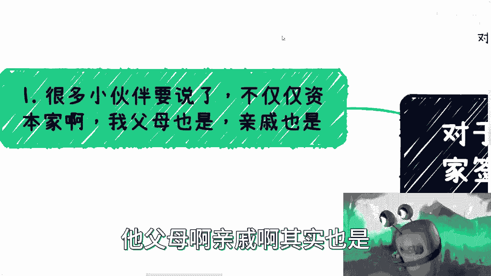
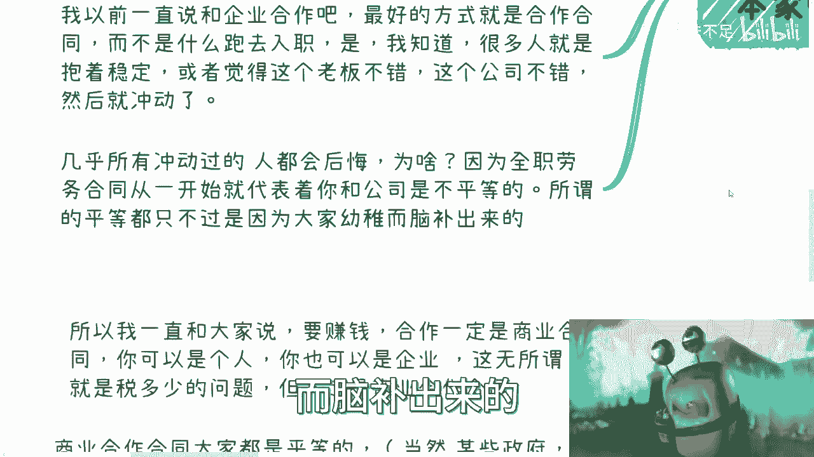
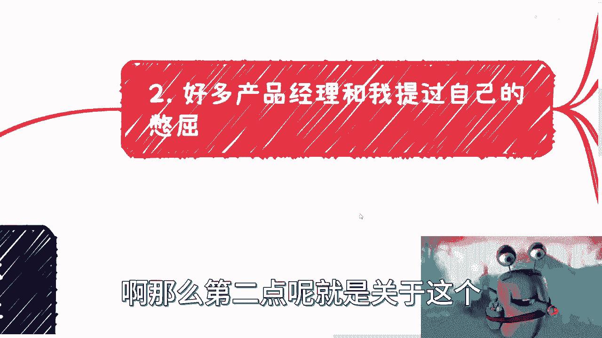
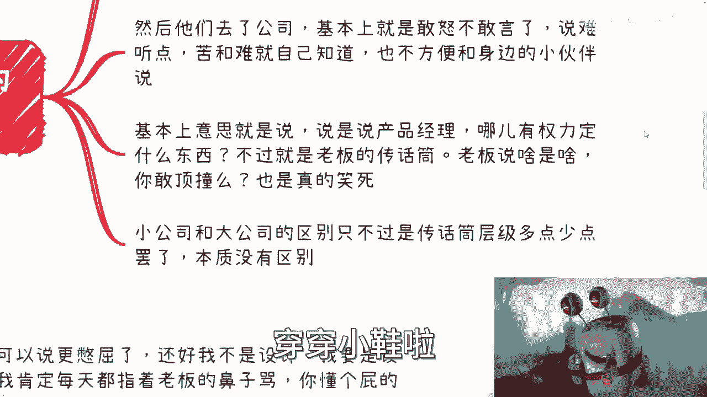
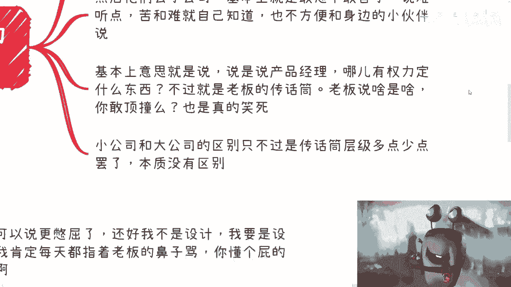
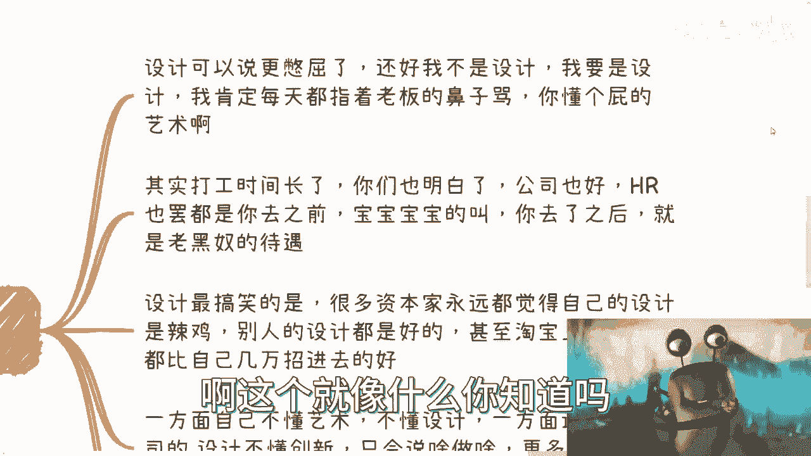
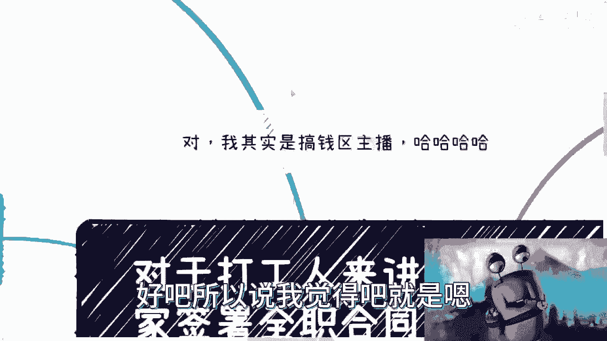

# 你和资本家签署全职合同的那一刻开始就是不平等条约---P1---赏味不足---BV1EK4y1c7A



在本节课中，我们将探讨一个核心观点：从你与资本家签署全职劳动合同的那一刻起，一份不平等条约便已形成。我们将分析这种关系下的常见困境，并与另一种更平等的合作模式——商业合作进行对比，帮助你建立更清晰的职场认知。

## 不平等条约的起点

上一节我们介绍了课程主题，本节中我们来看看全职劳动合同为何被视为不平等关系的起点。





签署全职劳动合同，意味着你与公司建立了雇佣关系。这种关系从本质上是不平等的。许多人在入职前可能与老板相谈甚欢，甚至产生“这个老板懂得为员工着想”的错觉。然而，这些想法往往是基于不成熟的脑补。一旦签署合同，关系的性质就发生了根本改变。

这类似于恋爱中的“上头”现象，热情消退后，现实往往不尽如人意。

## 常见岗位的困境


理解了不平等关系的起点后，我们来看看在这种关系下，不同岗位会面临哪些具体困境。



以下是几个典型岗位所面临的憋屈处境：




1.  **产品经理的传话筒困境**
    许多怀揣抱负的人成为产品经理，希望创造产品、实现想法。但现实中，尤其在中小公司，产品经理往往没有决定产品方向或功能列表的权利。这个岗位实质上成为了老板的传话筒。老板决定一切，员工难以顶撞。在大公司，可能只是传话筒的层级更多，本质并无区别。



2.  **设计岗位的艺术与权力冲突**
    设计岗位的处境可能更为憋屈。设计师常常面临不懂艺术的老板的指指点点。老板可能一方面不懂设计，另一方面又抱怨设计缺乏创新，仅仅将设计师视为美工。然而，内部设计师与外部设计师的创造力差异往往不大，问题多出在老板的心理作用上。


3.  **普遍的职场政治与内耗**
    许多公司内部都存在类似“后宫戏”的心理斗争和潜规则。员工可能需要在老板面前争宠、应对同事的打小报告或“穿小鞋”行为。入职前，公司或HR可能对你关怀备至；入职后，待遇可能急转直下，这是普遍存在的现象。


## 另一种选择：商业合作

在分析了全职雇佣的种种困境后，本节我们来看看一种更平等的替代方案：商业合作。

要摆脱不平等关系，一个核心建议是选择商业合作合同。这可以是个人或公司名义签署，核心在于建立平等的合作关系。


以下是商业合作模式的主要特点：

*   **地位平等**：合作双方是平等的商业伙伴关系。对方没有资格进行居高临下的指责或PUA。如果合作不愉快，你可以选择终止合作。
*   **权责清晰**：基于签署的商业合同，双方的权利和义务有明确界定。对方不能无理由地催促进度或要求24小时待命。
*   **情绪价值更高**：即使报酬固定，这种模式也能让人工作得更开心、更少憋屈，整体性价比通常高于全职工作。
*   **主动权在手**：你对自己的工作方式和时间有更大的掌控权。

当然，商业合作也有其挑战，主要在于市场上存在大量试图“白嫖”方案或劳动力的不诚信行为。因此，保护自身权益至关重要，务必在开始工作前签订合同并明确付款方式。

**核心行动公式：**
```
开始工作前检查项 = 合同已签署 && 预付款已支付
若检查项为假，则风险极高。
```

## 个人成长与发展的真相

最后，我们探讨一个相关的重要话题：在雇佣关系下的个人成长。


将个人成长与发展的希望完全寄托于一份全职工作是不现实的。公司没有义务关心你的个人提升，其核心逻辑是支付报酬换取劳动，甚至希望用100元的成本获取500元的价值。主动权掌握在公司手中。

因此，有清晰规划和头脑的人，不会将个人发展的希望完全寄托于任何一份工作上。网络上许多关于如何“跪舔”领导、处理同事关系的技巧，在本质上可能只是“过家家”游戏中的技能，无法改变不平等关系的本质。


## 课程总结



本节课中我们一起学习了以下核心内容：

1.  **全职劳动合同的本质**：它确立了一种先天不平等的雇佣关系。
2.  **常见岗位困境**：产品经理、设计师等岗位在雇佣关系下容易沦为执行工具，面临职场政治与个人价值无法实现的冲突。
3.  **平等的替代方案**：商业合作合同能建立更平等的伙伴关系，带来更高的自主权和情绪价值，但需警惕市场风险。
4.  **个人发展的主动权**：真正的个人成长和发展主动权在于自己，不能寄希望于雇佣你的公司。

希望本课能帮助你更清醒地认识职场关系的本质，至少做到心中有数，而非活在被构建出的“象牙塔”里。关于赚钱，方式远不止打工和创业两种，关键在于找到适合自己且相对平等的路径。