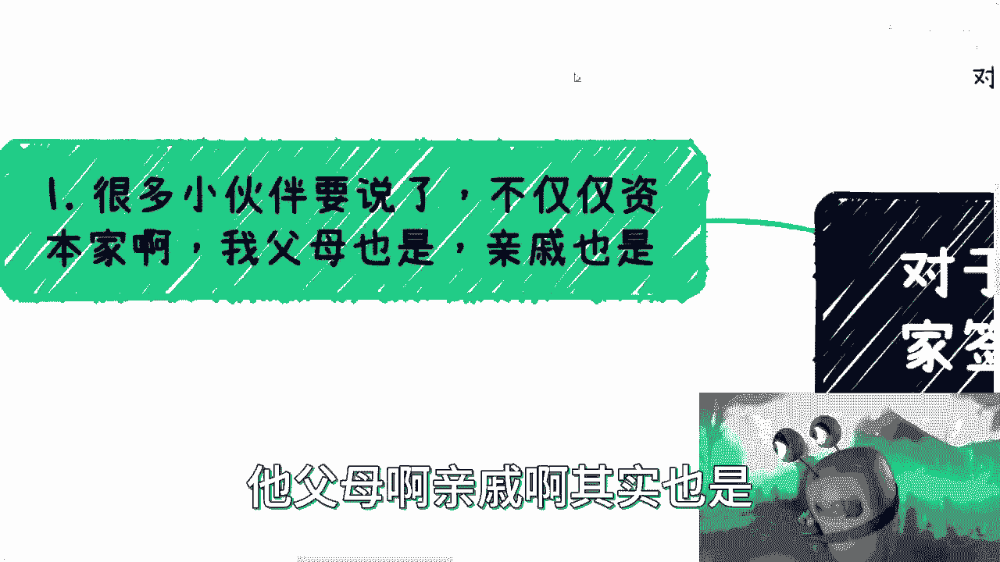
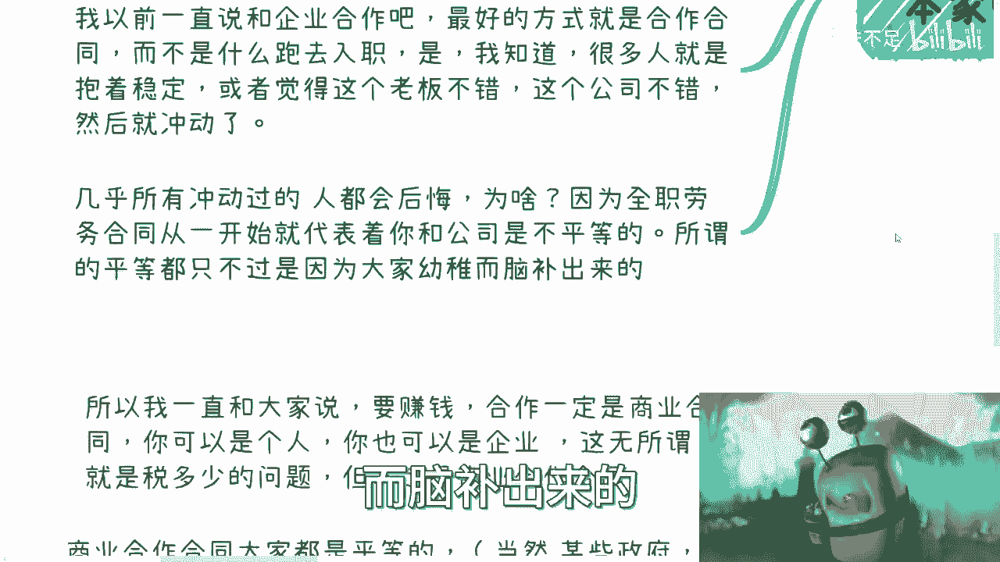
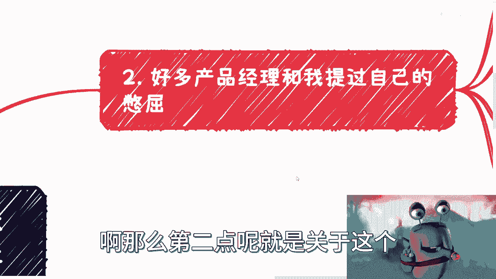
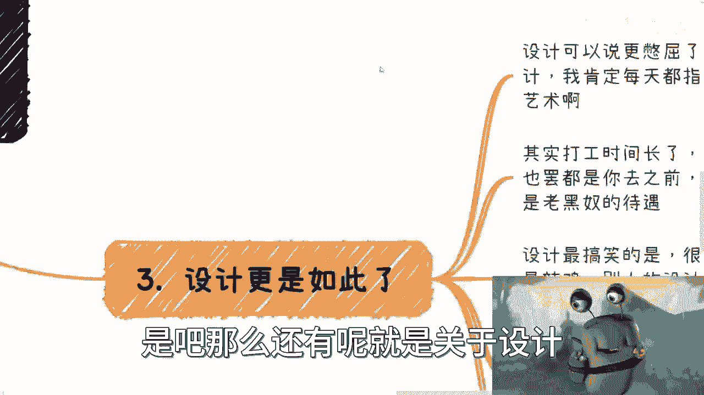
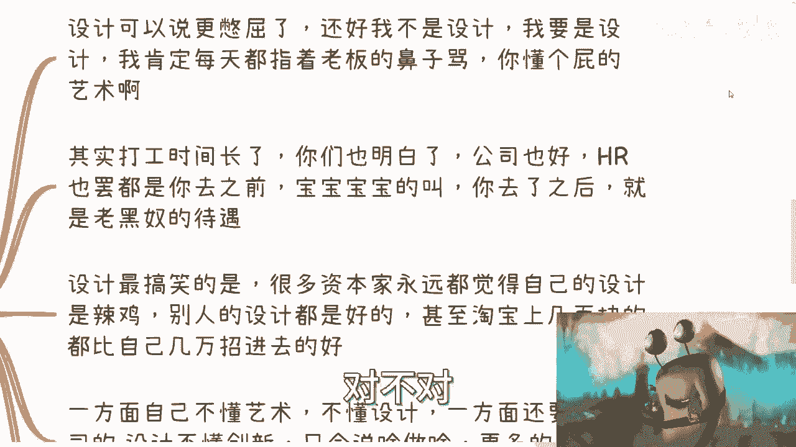
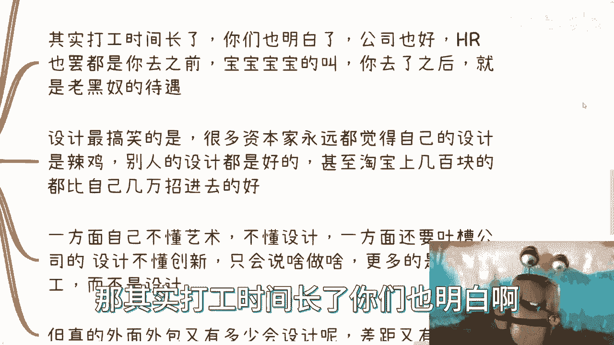
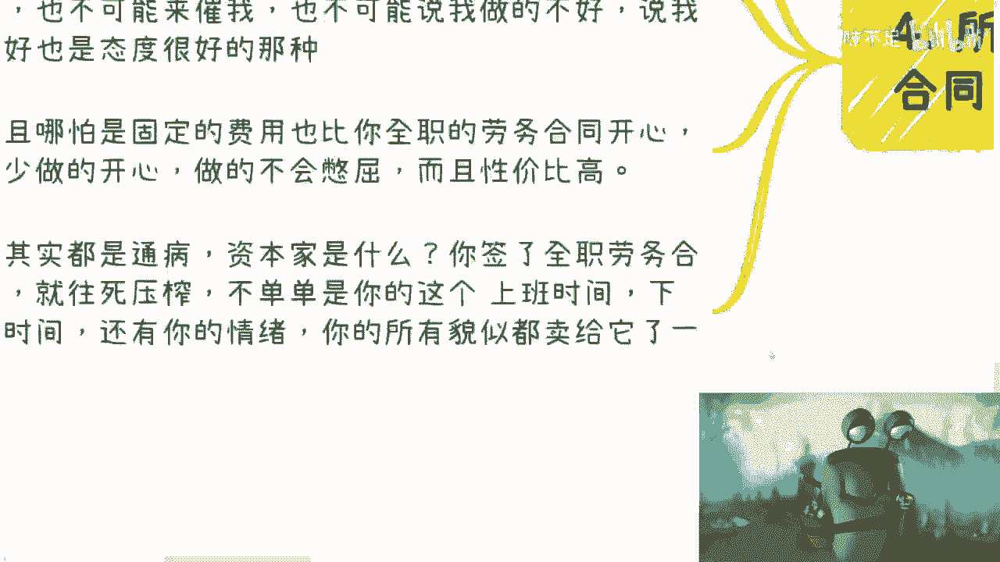

# 你和资本家签署全职合同的那一刻开始就是不平等条约 - P1 - 赏味不足 - BV1EK4y1c7AF

啊大家好啊，我真的觉得这个蜗牛比小小熊猫可爱，是不是小熊猫看多了啊，对就是我是搞全区搞搞前驱啊，搞钱区up主是吧，嗯嗯对于我我这次这个主题啊，对于打工人来讲呢，你跟资本家签署全职合同的那一刻开始。

就是不平等条约啊，为什么呢，是这样子的啊，最近咨询的小伙伴呢，在这当中也提到了很多，关于他们上班的这些问题啊，首先第一点啊，很多小伙伴要说他说这个问题呢，他不仅仅是资本家，他父母啊。

亲戚啊，也是为什么呢，因为很多人呢其实是一路小，就从小时候一路被PUA过来的，就是反正呢就是说白了就是自己怎么怎么不行，别人家的孩子呢怎么怎么都行，那么以至于现在很多小伙伴长大之后。

发现大家貌似都很行啊，就自己不行，唉其实也不知道为什么，你说人生在世就活一辈子呃，为什么要让这种有的没的思想去束缚自己，然后还影响到未来的发展，我表示不理解对吧，然后甚至还有很多家长给他洗脑啊。

说这就是命啊，这就是你这辈子的命运啊，我他妈也是服了我啊，真的是他妈的中国小城市是真啊，我以前一直说呢跟企业合作啊，我跟你们，我跟你们说，你们所有人咨询我的时候，我都会跟他们讲，我说你们要合作呢。

你就跟企业合作啊，最好的方式呢最好的方式呢就是商业合作，而不是说你跑到那边就就入职，你知道吗对吧，当然我也知道对吧，很多人呢他其实当时可能聊的很嗨啊，很上头他抱着呢就是稳定。

或者说觉得哎这个老板不错对吧，这个公司不错，然后就冲动了对吧，那几乎所有冲动过的人呢，他都会后悔，为什么呢，因为你从签全职劳务合同那一刻开始，代表着你跟公司是不平等的，而你一开始觉得哎我跟他关系很好。

我跟他很聊得来，我觉得他是一个懂得啊，叫什么，就是从员工角度出发的这么一个人，你所有的这些想法，只不过都是因为你们幼稚而脑补出来的对吧。

就这个样子，哎我跟你讲，这个就跟你们谈恋爱是一样的，就上头上完头之后，你们就会发现我的都一个吊样子，那么第二点呢。

就是关于这个，好多产品经理也跟我提过自己的憋屈啊，呃你看啊很多小伙伴在跟我聊的时候呢，就他很有抱负，你知道吗，他说啊我很想做点东西啊，我很想就是说创造点东西啊，我觉得比我有抱负啊，说要做产品经理啊。

说要有自己的想法，要自己去create相关的对吧，去去把这些想法实现啊，然后有非常多的成就感啊，所以选择产品经理，但很可惜的是什么呢对吧，他们去了一家公司啊，去了一些公司，说难听点是什么呢。

就是苦再苦再难对吧，他就自己知道，他怎么可能跟身边的小伙伴说呢，他不好意思说对吧，那是说自己呢，还是说公司呢，都不好说啊，基本上意思是说什么呢，就是说岗位本身说是说产品经理啊，哪有权利定东西呢。

你有权利定产品吗，我请问你有权利定所谓的feature list吗，对吧，你有权利去更改产品里面的走向吗，你没有啊是吧，就大部分这种产品经理，我可以说99%的产品经理啊，公司的产品经理是谁啊。

老板你知道吗，你在小公司产品经理就是老板，哪他妈需要产品经理啊，啊产品真真正的岗位定岗的这个产品经理，这个岗位就是一个传话筒没了啊，所以说就说本质上你就是一个老板的传话筒，老板说啥是啥，你敢顶撞吗。

我就问嘛，你敢顶撞吗，对吧。

哎就这么个道理啊，就是每家公司呢他都有种什么都有种，演这种后宫戏啊，后宫这种呃心理斗争的这种潜质，你知道吗，都是这样子的，就是你要么就跟老板争，你要么跟老板老板在那边玩平衡之术，你要么就是说啊。

这个动不动对你身边的小伙伴对吧，川川这个在老板这边打打小报告啦，穿穿小鞋了对吧。

就这样子的啊，那么有小伙伴要说了，那大公司会好很多啊，这个看你怎么比对吧，你就好像你说我今天这个在吃土啊，明天给我吃碗米大白饭啊，你说好很多，那也没毛病啊，但是你不能这么个比法对吧。

那小公司大公司区别呢，我觉得只不过就是传话筒的层级多了一点，少一点罢了，本质上没什么区别，你能定啥，你告诉我，你定完不是还有report吗。

你定啥，是吧。

那么还有呢就是关于设计，哎呀设计我跟你讲就更别谈啊，设计就相比产品更更憋屈啊，还好我不是设计，我就说我要是设计，我他妈每天都指着老板鼻子骂啊，你骂什么呢，骂就骂，你懂个屁艺术，你懂个屁设计啊。

你有什么资格对我指指点点，那可惜对吧，人家你跟人家签全职合同，那怎么没有资格对你指指点点呢，是不是啊，这个就像什么。

你知道吗，这个就像我当时在北京啊，这个我们那个合伙人跟我说，他说让我一起去跟某一个领导吧，也不算领导吧，就办政府机构的领导对吧，他说让我去吃饭，我说你确定你要让我去吗，你想清楚吗啊，我说你你跪舔他。

那是你的事情，我说你拍他马屁马屁对吧，你舔他他很舒服，那是你的事情，我说我做不到的，我说你确定让我去吗，让我去，我说今天下午我他妈不把它按在地上摩擦啊，你觉得可能吗，对不对。

对不对，一个道理啊啊我早就说过了啊，我看人的态度很简单，你要么就有东西让我信服，你要是没有东西让我幸福，给我滚，我管你是谁，有什么好吊的对吧，你不你不，我可以啊，你滚吧对吧，我也不想你，我管你是谁。

你再高的抬头，再高的level跟我也没什么关系，对不对，因为你没有什么东西觉得让我认可，你都是些虚的东西，有什么好说的啊，那其实打工时间长了，你们也明白啊。

公司也好，hr也好啊，在你去之前，宝宝宝宝宝宝的叫你去了之后呢，就是老黑奴，待遇就这么简单，对不对，无论怎么说，唉其实就那么回事，而且我跟你们讲，你们但凡做资本家，你们也会这样啊。

而且设计最搞笑是什么呢，就是资本家吧，永远都觉得自己的设计他妈的啊，别人的设计都很好，哎不知道我也不知道为什么你知道吗，就甚至淘宝上几百块的，都比自己几万块钱装进去好，就这样子啊。

一方面呢他咳咳咳不懂艺术啊，不懂设计，一方面呢他还要吐槽对吧，公司的设计不懂创新啊，就是大部分老板呢觉得设计呢他只是个美工啊，你根本没有什么创造性的这个东西在这里面。

但设计本身其实已经竭尽全力在那边创造了啊，而且你真的到外面去找外包，你说这么说吧，就是外面有没有设计，有你公司里面自己招的人有没有设计，那当然也有，大家都想做点事情对吧，所以说你说这个设计跟那个设计。

能有多大差别呢，其实都是老板心理作用啊。

所以你要赚钱呢，我觉得很简单，就要选择商业合作合同啊。

我之前也跟咨询的时候，我也跟他们说的很清楚啊，我说要赚钱一定是商业合同啊，你可以是个人签，你也可以是企业钱，这无所谓啊，就是税多税少的问题，看对方甲方愿不愿意跟你签对吧，但一定是商业合同的这么一个合作。

商业合作呢大家是平等的，当然啊我就说啊，某些就是说你要是把极端对吧，把央企国写某些case单独拿出来说，你说不平等，那我也可以理解啊，但是就是说单独拿出来先不说啊，就我们说普遍来讲。

你跟别人签这种商业合作合同，至少是平等的对吧，那至少什么呢，至少说一你做的开心啊啊，你不会说我每天在那边哎，就压力很大对吧，很内耗对吧，搞得很抑郁对吗，第二就是说至少对方不会人来吊我啊，你有什么资格我。

大家是平等的，你吊我干嘛呢对吧，就是我就这么说，我商业合作这么长时间，哪怕我就有意态度很不好，我跟你讲，对方对我态度都很好的，为什么，因为大家商业合作，你有什么资格对我态度不好呢，你对我态度不好。

我就不做嘛，对不啦，而且另外一方面就是说大家是签好商业合同的，你要觉得我不对，你要是觉得我不好，你要觉得我不对，你跟你打你自己脸有什么区别的，没有区别的呀对吧，而且他也不可能说一直在催我，对你。

你就态度好一点，说哎这个最近进度怎么样啊，对吧怎么样，那OK的，那他不可能24小时on call来催你的，不好意思啊，他也没这个资格，而且大概率呢就是说你可以觉得我做的不好啊，但是你说我做的不好。

也是态度很好的那种，你知道吗，不会出现那种什么什么老板什么的，说你或者你什么领导来PUA，你不可能的这种事情不可能出现的，而且吧哪怕我觉得是个固定的费用，也比你全职的那个劳务合同开心啊，至少做的开心。

做的不会憋屈，而且你你随便怎么样，都比你这个打工来的性价比高啊，虽然可能高不到哪里去啊，但性价比肯定高啊，所以说其实呢这都是一个通病，就是资本家是什么，就是你签了全职劳务合同，就是往死里压榨他。

不单单是你这个上班上班时间，甚至就是下班时间，还有你的情绪，你的所有的啊，反正就是说能够被利用的东西，貌似都是卖给他一样，就很奇怪，你知道吗，就随着时间的推移，而越是这样子，那当然啊商业合同。

商业合同也不是说都是只有好的一面，那不好的一面也有啊，就是我跟你们说的，满地都是骗子啊，满地都是想来白嫖的啊，就是他可能都不跟你签合同，就跟你签合同的，然后上面资金比较明确的。

都已经是就是很nice的哦，剩下更多的是什么，就是不签合同啊，能白嫖你工作就白嫖，你工作能白嫖，你方案就白嫖，你方案能白嫖，你这个人就白嫖，你这个人反正就是这个样子。

所以基本上就是我跟那些就说打工的小伙伴啊，我就问他们，我说你们最近在做什么啊对吧，然后他们跟我说啊，我做这个做那个做这个做那个对吧好，然后我每次都问他们，我说你们合同签了吗对吧，预付款有没有啊。

都没有的，那我说他都没有，你都干活了，不白打工吗，对不对，所以说这个呢，也就是说你不能说这是商业合同的弊端，而是说很多人因为不懂，所以容易就是说被坑。

好那么说完这个呢，我在最后呢，我其实还想提一嘴，就是我说这个人成长发展的事情对吧，我们昨天也说了，就是说个人成长和发展，在公司里面几乎是不可能的啊，这个不可能其实很大一部分原因还是取决于。

还是因为这个劳动合同的问题对吧，因为本质上提升也好，发展也好，这个是个人的事情，你说我把这个东西这个寄希望于公司女的，可能了，不现实的呀，人家没有这个义务啊，人家为什么来来关心你这个人。

发展和提升的事情对吧，我给你多少钱，你给我干多少活对吧，甚至就说我给你100块，你必须给我干500块，对不对，为什么，因为主动权在我手上呀，你有什么主动权没有的，你不做你给我滚呗对吧。

所以说就说我觉得有点脑子的对吧，有点规划的，都不会把希望寄托于一份工作上啊，当然我说的是成长和发展，赚钱就别说了，肯定没希望对吧好吧。

所以说我觉得吧就是嗯当然了。

我相信中国现在还是有非常多的这个人啊，他是抱有这种想法的，当然这种想法可能不是他自己的，被老师啊，被家长啊就PUA出来的啊，就觉得就是说啊你要发展，你要有职业规划对吧，包括就是说短视频。

包括网络上有非常多的账号来跟他们说啊，你们你们要怎么跪舔领导啊，你们怎么相处好同事之间的关系，你们要怎么样怎么样，那其实没有用啊，你知道吗，其实就是说过家家永远是过家家对吧。

你在过家家当中用了再高超的技术，在学习更更再多更多的技能对吧，他还是过家家啊，所以你指望说哎，我过家家能能在那边，这个这个这个过出一个怎么样的一个结果来，那本来就是不现实，好吧行吧，我觉得这个东西呢。

我就希望大家能够自己心里清楚，倒不是说一定改变吗，至少清楚吧，就不至于说这个20多岁，30多岁还活在被PUA的这么一个象牙塔里面，好吧行那就这么着吧，然后哎你看我这个真的蜗牛蛮狠蛮可爱好吧，然后有什么。

反正你们就是整理好问题，或者说就是副业啊对吧，包括未来的赚钱啊对吧，包括未包括就是说然后很多人也会问我嘛，他说除了打工和创业，还有什么东西很多啊，除了打工跟创业，剩下的赚钱方式多了去了。

难道只有打工创业才能赚钱吗对吧，卧槽赚钱方式多了去了好吧，然后赚钱的包括其他的好吧，你们就是也可以也可以整理好问题啊。

