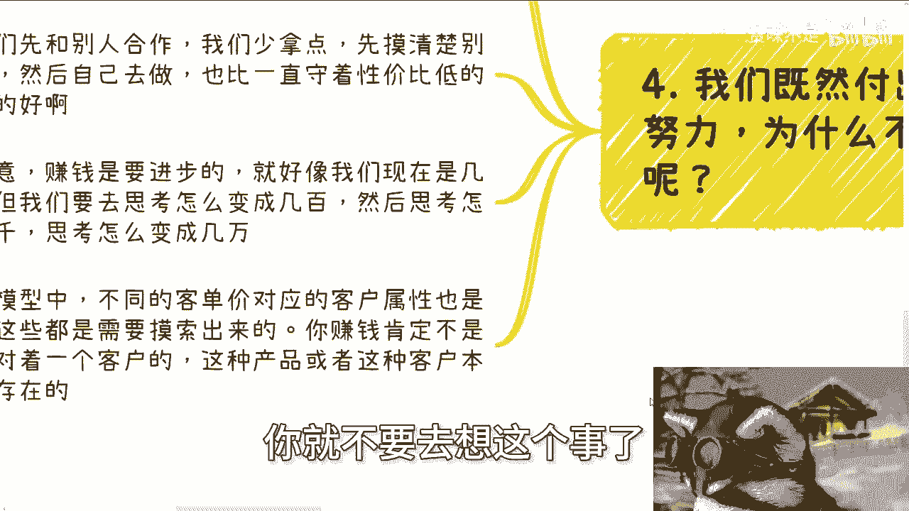

# 课程 P1：高利润业务的认知误区 🧠

在本节课中，我们将探讨一个常见的商业认知误区：个人想不出高利润的业务，并不代表这样的业务不存在。我们将分析为何个人思维会受限，以及如何突破这种限制，找到真正有价值的商业机会。

---

## 第一点：不要局限在自己的圈子里想

上一节我们概述了核心问题，本节中我们来看看第一个关键点：思维的局限性。

因为根据我的沟通经验，这几乎是所有人的通病。原因很简单：如果你的家庭背景不从政、不经商，没有特殊的人脉或行业壁垒，那么你所接受的教育全部来自于老师、学校、朋友和你自己的小圈子。一个通过九年义务教育和高等教育培养出来的“标准品”，几乎不可能接触到真正高性价比的赚钱机会。

所以，无论你是什么专业，绞尽脑汁也很难凭自己现有的认知想出来。说得直接一点：

以下是大多数人苦思冥想后仅有的两种常见思路：
1.  基于流行趋势或身边资源：例如做自媒体、电商，或者帮卖茶叶、水产的朋友带货。
2.  基于打工者思维：想着去哪里做兼职，然后开始钻牛角尖研究具体业务。

无论上述哪一种，在我看来都像是在“过家家”。这些尝试并没有真正切入社会的核心商业运作中。你做的都是散户间的游戏。请思考：这些业务与社会上已有的、高性价比的赚钱圈子或模式有交集吗？这种做事方式，怎么可能产生交集？

想了一圈后，很多人会得出两个结论：要么觉得死路一条，要么认为没什么好做，于是选择躺平。也有人开始投入时间、金钱和努力去尝试，但试错成本太高后便放弃了。当他们听到别人说“还有别的路”时，他们会反驳：“我都做过了，我都想过了，性价比都不高”，并认为我们在扯淡。

---

## 第二点：你不知道，不代表不存在

上一节我们分析了思维局限的表现，本节中我们来明确一个核心事实：认知之外仍有广阔天地。

世界上总存在性价比高的业务，只是你不知道，或者你知道了却不愿意相信普通人也能做。

在没有明确方向时，我常建议选择**泛互联网**或**泛金融**领域。原因如下：
*   从个人或“野路子”的角度看，在当前中国，只有互联网这种“虚”的领域，能让你有机会切入社会的潜规则层面。其他实体领域很难切入。
*   金融则是更底层的逻辑。无论什么行业，其背后的核心逻辑往往都是金融逻辑。

选择这两个方向中的任何一个，至少能为你未来打破“象牙塔”做出准备，创造更多可能性。选择其他领域，可能性则低得多。

同时，你们要记住：所谓的**赚钱模式**，到今天早已固化，不可能出现真正创新的模式。赚钱的底层逻辑没有变，变化的只是表面套用的业务。例如，今天套在新能源上，明天套在电动车上，后天套在“双碳”概念上，仅此而已。

---

## 第三点：一个核心例证——教育行业

上一节我们提到了认知盲区，本节中我们通过一个具体例子来深刻理解这一点。

以教育行业为例。很多人都知道，K12（中小学学科）教育此前受到了政策打压。我遇到过很多K12从业者，他们向我诉苦说很困难。

这让我非常困扰。因为教育是一个庞大的领域，一个方向困难，完全可以做别的。我感觉他们每天都在抱怨和钻牛角尖，说做不下去了。那么，为什么不去做别的呢？死盯着K12与趋势抗衡，个人如何抗衡得了？

但教育不止K12。以下是教育领域内其他可能的方向：
*   社会化技能教育
*   国家倡导的职业教育
*   学校的“1+X”证书教育
*   竞赛教育
*   学术科研教育
*   高校合作教育（包括专业共建、产教融合、必修课/选修课合作）
*   政企合作教育（包括咨询、培训、项目落地）
*   面向大众的知识变现
*   企业家的私董会变现
*   海内外的教育产业扶持

难道在任何一个时期，所有这些方向都很难做吗？说实在的，在我看来，其中很多在任何时期都很赚钱。但是，你让一个只做过K12的人去想，他就算想破头也想不出来。他会因此得出一个自以为正确的结论：“教育很难做”。然后基于这个结论行动，自然举步维艰。你跟他讲这些，他可能还会固执地反驳：“我做了这么多年，我能不知道吗？”

很多人就陷入了这种逻辑闭环，这毫无意义。

---

## 第四点：追求更高的性价比

上一节我们用案例说明了认知局限，本节中我们探讨如何行动：将努力投入到性价比更高的事情上。

既然付出了时间和努力，为什么不去做性价比更高的事呢？很多小伙伴跟我说的业务，客单价都是几十、几百块。但社会上高客单价的事情多了去了，为什么不做？

原因不在于不想做，而在于**不知道**，或者知道了但觉得**普通人做不了**。但无论哪种，都是因为没尝试过。

你说没有背书、没有嘉宾、没有场地？这些东西不难找，花时间去找，总比一直做低客单价的事情强。再退一步，就算自己暂时做不了，也可以先跟别人合作，少拿点，摸清别人的套路，然后再自己上手。这比一直守着低性价比的业务要好。

我们做生意赚钱是一个进步的过程。公式可以概括为：
**业务进化路径：低客单价 → 思考提升 → 中客单价 → 思考提升 → 高客单价**

在这个模型中，不同的客单价对应着完全不同的客户属性。你需要去了解和摸索这些模式。赚钱不可能用一个产品薅所有客户的羊毛，也不存在一种产品能同时完美服务于50元客户和5万元客户。这种产品和客户本身就不存在，就不要去空想了。

你本身就需要**多种不同的产品或服务**，来匹配和寻找**不同的客户群体**。这才是王道。

---

## 总结与行动建议

本节课中，我们一起学习了关于高利润业务的几个关键认知：
1.  个人思维受限于自身经验和圈子，很难凭空想出高利润模式。
2.  个人不知道的业务，不代表世界上不存在。
3.  通过教育行业的例子，我们看到了突破自身认知局限的重要性。
4.  商业追求的是不断提升的性价比，应从低客单价向高客单价演进，并匹配不同的产品与客户。

每个人都有自己的信息茧房。不要轻易得出一个结论，并坚信它是正确的，然后沿着它走下去，那将陷入死循环。就像一个游戏，你只探索了地图的10%，就不能断言整张地图只有一个宝箱和一只怪物。

道理很简单，但很多人困在其中想不明白。

**最后，关于职业规划、商业规划、股权融资、合同咨询，或者你有具体的业务想法、需要融资的商业计划书，以及希望我基于你手中的资源（“牌”）提供更多视角或规划支持，你可以整理好问题，通过私信联系我。**