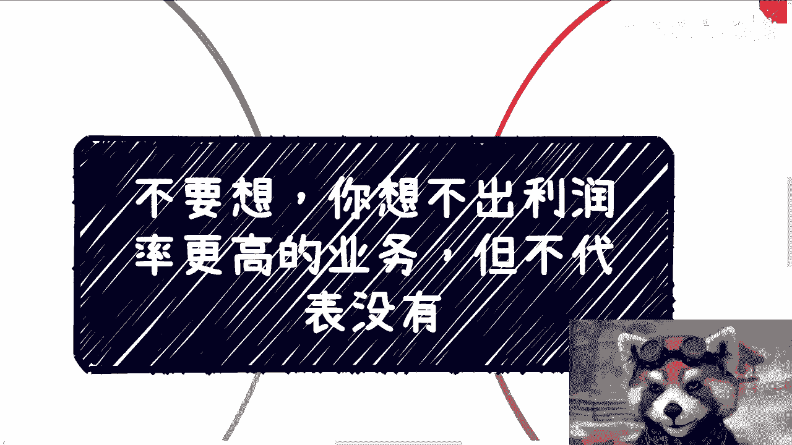
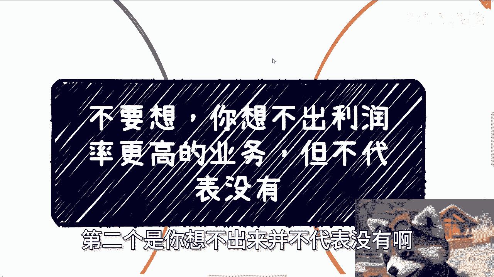
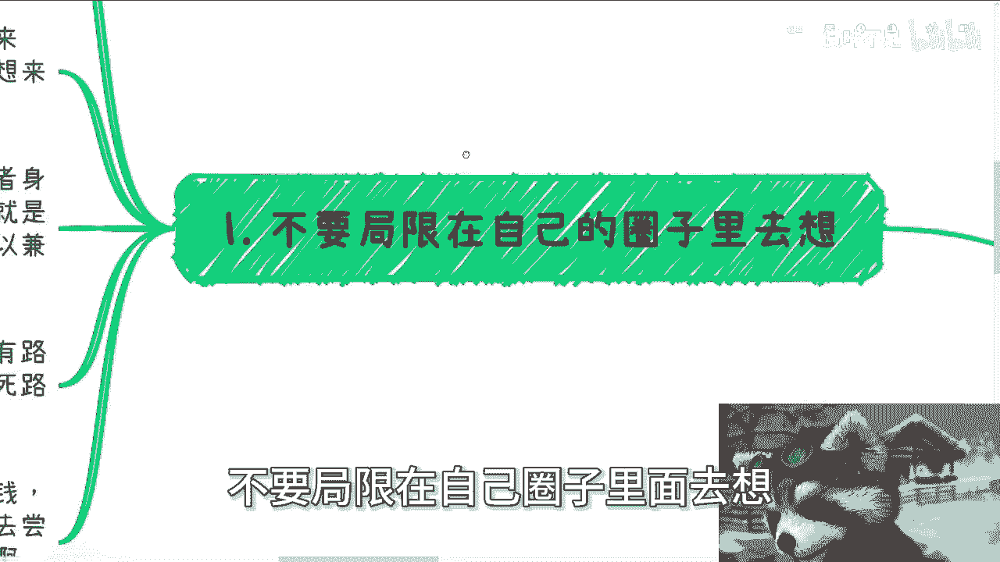
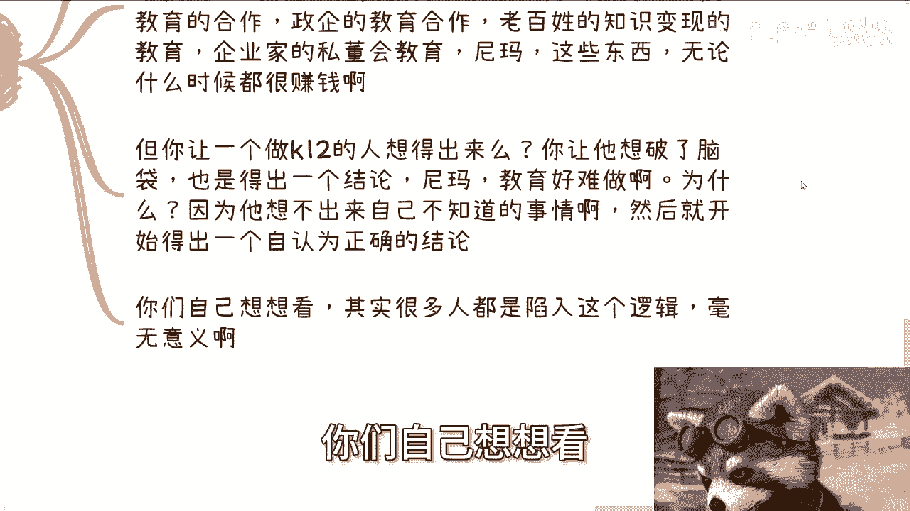
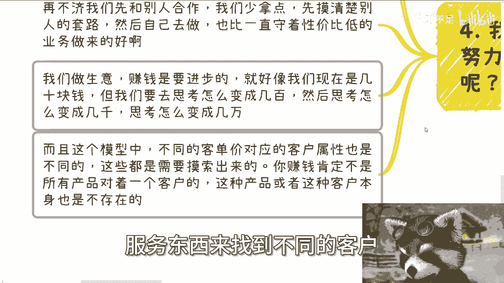

# 你想不出利润更高的业务，但也不代表没有 - P1 - 赏味不足 - BV1WJ4m1E7Jt

哈哈大家好啊，我我们今天来讲的是这个啊，叫做你不要想啊，你想不出利润率更高的业务，但不代表没有啊，这个当中有两个点，第一个点是你想不出更高的业务啊，利润率更高的业务，你不要去想，第二个是你想不出来。

并不代表没有啊。

这是两件事情啊，那么呃首先第一点啊，不要局限在自己的圈子里面去想。

因为这个在我现在沟通下来，已经发现是所有人的通用问题了，几乎每个人都有啊，就是你不要去想，你想不出来的，为什么，因为说白了你只要家里不从政，不从商，没有自己的关系或者壁垒哦，你得到的教育来自于你的老师。

你的学校，你的朋友，你自己的圈子，我就这么告诉你，你9年制义务教育加高等教育，你你你这么一个养出来的一个一个一个标品，你不可能接触到什么高性价比赚钱的可能性，我觉得是没有的，就这么简单啊。

所以你想破你的脑袋，你也是想不出来的哦，那么我不关心你是什么专业，你想来想去你是想不出来，说的不好听点就是什么。

我沟通了这么多人，大部分想来想去无非就两种可能性，一种就是比如说弄个自媒体啊，弄个电商啊，或者身边有什么朋友做茶叶的，做水产的带带货对吧，要么就是基于自己打工的思维，基于自己的认知去想。

我去哪做个兼职对吧，然后就是开始做呃，那个钻牛角尖啊，做什么业务，你想想看啊，无论我们这边说的第一种可能性，还是第二种可能性，都是我所说的过家家，你没有任何切入到这个社会的商业当中去，一个都没有。

你你明白吗，一个都没有，因为你做来做去都是自己在做，你做来做去也都是跟散户在玩过家家对吧，你说你这些业务跟哪个这个社会已有的，高性价比的这种赚钱的啊，圈子也好，怎么样会有交集吗，怎么有交际法。

就是这种做事方式，怎么有交际法对吧，然后想了一圈，发现诶好像没什么好的方向，没有路可以走对吧，没有发展好了，然后自己就会得出两个结论，要么就是死路一条，要么就觉得哎呀这个东西也没什么好做的。

就躺平了对吧，然后要么呢就是有的人就觉得哎呀，我现在就去开始付出时间，付出金钱，付出努力去做了对吧，然后又又开始做了一段时间之后，发现哦的试错成本太高了，怎么样怎么样啊，然后呢他就放弃了。

也不愿意去尝试，然后比如说他听到打个比方，听到我或者听到其他人跟他们说啊，你没有别的路对吧，有别的方式他就会觉得我都做过了呀，我都想过了呀，性价比都不高呀，然后就说我们就就说我们扯淡对吧。

就我跟你讲，真的就很神奇的哦，我待会给你们举例子啊，你你真的你参照那个例子。

你自己仔细想想看啊，然后第二还是那句话，你想不出来你不知道的东西，就是这个世界上总有性价比高的业务，只是你不知道，或者来说你知道了，你不愿意去接受，以及你不愿意去接受所谓普通人就能做对吧。

那么很多时候没有方向，更专业的时候，我都会说你选择泛互联网或和泛金融，为什么啊，因为当下中国只有泛互联网，从目前个人角度来讲，从野路子角度来讲，从你们能够切到这个社会的潜规则角度来讲。

只有互联网这种虚的东西能切别的东西，你切不动，你懂吗，然后金融的话就更别说了对吧，你至少万物无论什么行业，各行各业背后，它本身的核心逻辑都是金融逻辑吧对吧，所以你不管选择这两个里面的哪一个。

至少都能够为你未来想要去打破这个象牙塔，做出一定的准备对吧，你会有更多的可能性，你选别的东西没有可能性啊，或者说我不能说没有可能性吧，就是可能性很低啊，那么而且另外一点，你们要记住所谓的赚钱模式。

到了今天早就已经固化了，不可能出现什么所谓的创新的赚钱模式，不现实的，你知道吗，就是赚钱模式它就好像是一个底层的逻辑，没有变化，不停的变化，只有表面的业务，比如说今天套套新能源，明天套电动车。

后天套什么，比如说套什么双碳对吧，套什么东西，它只是表面层在套，好吧好，然后第三点啊，就是最最核心的例子，你们仔细听听看啊，我们比如说啊就拿教育来讲，很多人都知道，之前K12的教育不是被打压了吗。

对不对好，然后呢我碰到过很多K12的人，他们就会跟我说，陈老师我们觉得很困难，但是我每次听到别人跟我说这个事情，说我我跟你们说，我我他妈非常困扰，为什么，因为教育这个领域其实很庞大。

就是你一个东西如果很困难，你可以做别的东西啊，就是你知道吗，我们我跟他们接触下来，我就会感觉他们就在那边，每天就在那边抱怨，每天就在那钻牛角尖，然后就说我很困难，我做这个东西做不下去了。

那我就问你们为什么不去做别的东西呢，对吧，你单纯死盯着K12，你是男的呀，你跟大趋势去抗衡，你就是个人，你怎么抗衡呢，但问题是教育也不是只有K12啊，就是你社会化的技能教育，国家的职业教育。

学校的一加X教育竞赛，教育学术研究的教育，高校教育的合作，政企教育的合作，高校教育的合作里面包括政治啊，包括那个专业共建，包括包括产学语言的融合，包括呃必修课，选修课的合作，对吧，政企的教育合作。

包括咨询，包括培训，包括项目落地对吧，老百姓的知识变现，包括就是散户的这种知识变现，包括企业家的私董化，私董会被变现，在包括海内外的很多教育的这种这种产业扶持，这些都能做呀，啊你难道跟我说。

中国在某一个时期这些东西都很困难，你觉得可能吗啦对吧，而且说不好听点，在我看来，这些东西在某任何一个时期都很赚钱啊，但是你仔细想想看，你让一个做K12的人想的出来吗，你让你把他脑子他妈敲破了。

他也想不出来啊，你让他想100年，他也想不出来啊对吧，你让他想，他也得出个结论，尼玛教育很难做没了呀，为什么，因为他想不出来自己不好不知道的事情啊，然后他就开始得出一个自以为正确的结论。

然后就说我就从这个结论开始往下做，就觉得很难，你怎么跟他讲对吧，然后你跟他讲，他还会很固执的跟你说，扯淡，他妈我做了这么多，你可以甩了，我会不知道吗，知道个屁，对不对，我跟你们讲，你们自己想想看。

很多人其实就是陷入这个逻辑，没有任何意义对吧，第四点就是什么，就是我这个那个X的核心，就是你既然付出了时间，付出努力。

你为什么不去做性价比高的事呢对吧，你很多时候你比如说小伙伴跟我说，做业务啊，都是什么客单价，几十几百对吧，但社会上高客单价的事情多了去了，为什么我们不做呢对吧，我跟你讲，不是因为你们不做。

是因为你们不知道，就像我刚刚说的，要么是因为你们不知道，要么就是因为你要么就是因为你们知道了，你们觉得普通人做不了，但是不管你们是前者还是后者，是因为你们都没时间过，对不对，那么就像我这边说的。

你说没有背书，没有嘉宾，没有场地，这些东西不难找啊，你花点时间去找，总比你一直做一些客单价低的东西好吧，对不对，而且再不济，我们就算自己不做，我们先可以跟别人合作，我们少拿点，先摸清楚别人的套路。

然后自己去做，也比一直守着性价比低的业务做来好吧，对不对，就我们做业务赚钱是进步的对吧，就是我们做生意一定是要提升赚钱性价比的，不提升赚钱性价比，我们赚什么生意啊，啊这就好像我们现在是几十块生意。

但是我们要去思考怎么变成几百，然后思考怎么变成几千，然后思考怎么变成几万对吧，而且在这个模型当中，不同的客单价，对于不同的客户属性也是不一样的啊，这些模式你都是需要去了解去摸索出来的啊。

当然就是摸索不叫摸索吧，就了解出来对吧，你赚钱肯定不是所有产品盯着一个羊毛薅，而且这也不可能说所有的不同的产呃，一个产品对着不同的客户好，很难的，就是这种产品或者这种客户本身也是不存在的。

你想想看有怎么样的一个东西哦，50块钱盯着他好，5万块钱也盯着他好，有不啦，没有的呀，对不对啊，你说我今天50块钱既能耗C端，又能耗政府端，可能也不可能的呀，很难的，所以说这种产品跟这种客户本身不存在。

你就不要去想这个事了。

你本身就需要需要多个不同的产品服务东西，来找到不同的客户。

这才是王道啊，啊所以啊所以啊你们仔细想想看啊，每个人都有信息茧房对吧，你不要让自己得出一个结论，然后让自己还认为这个结论是一个正确的结论，然后往下走，那你永远就是死循环了，对不对。

你就像我们就像我跟他们打打比方，我说你们打一个游戏，你们对一张地图的探索率就10%，然后你来问我，诶诶那那个陈老师你知道吗，这张地图上面宝箱在什么地方，怪在什么地方，我他妈怎么知道哦。

我就以10%的探索率，我能告诉你怪在什么地方，宝箱在什么地方，对不对，但是你总不能得出这个结论，是说哦，因为我只有这10%的探索率，我只探索一个宝箱跟一个跟一个怪，你你得出结论就说好。

整张地图只有这一个宝箱跟一个怪，你能得出这个结论吗，不能吧，其实你仔细想想，这个道理很简单，但是但是你会发现很多人他就是困在里面，他们想不明白，你知道吗啊好那就这么着啊，然后那个职业规划好吧，商业规划。

然后股权融资啊，合同啊对吧，包括你们有什么自己要做的业务对吧，包括你们有什么商业计划书啊，要融资的啊，包括你们手上有什么牌，你们希望通过我的视角，能给你们更多的一些支持或者一些规划的话啊。

你们可以整理好问题。

在私信我，好吧啊。