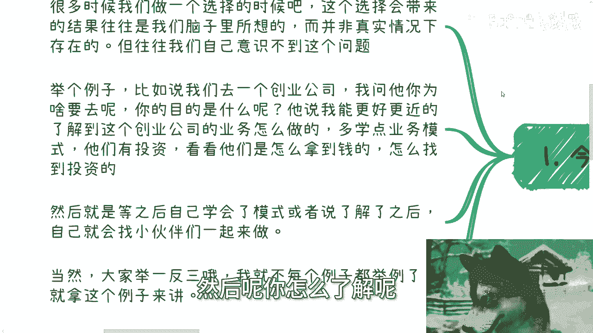
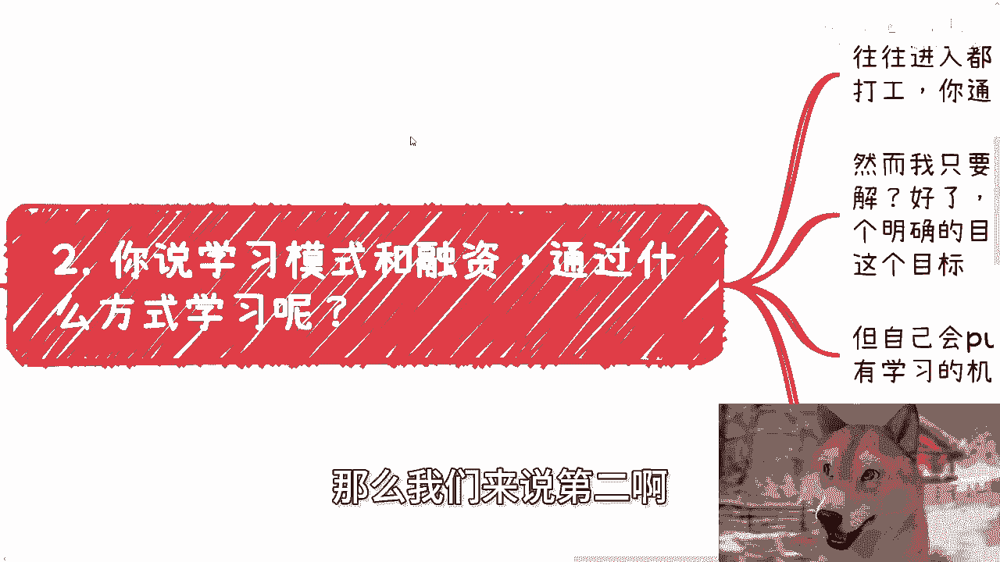
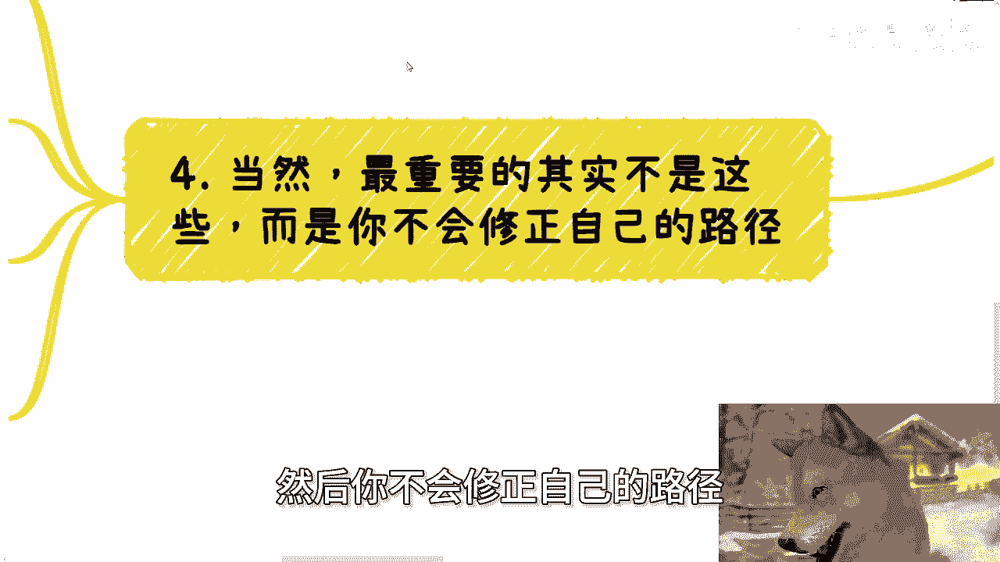

# 你想要的结果往往无法从你的投入中获取 - P1 - 赏味不足 - BV1EE4m1R7dp

好大家好，这个今天这个主题就很好玩啊，我靠他妈上来就提示我，电脑内存超过90%啊，不要不要不要不要给我关机就行啊。

我们今天这个主题呢叫做你想要的结果啊，往往并无法从你的这个头颅中获取啊，这个主题听上去有点抽象啊。

但但是其实我觉得真的是非常非常非常非常，通用的毛病啊。

这99。9%他妈的有这个毛病啊，额首先啊是这样子的，就很多时候呢我们做一个选择的时候啊，这个选择会带来的结果呢，往往是我们脑子里面所想的，就我们认为啊，我们做了一件事情能得到一个结果。

但并非我们做完这个事情，就一定能得到那个结果啊，但是呢我们自己并意识不到这个问题啊，举个例子，比如说你说啊，我们今天去一个创业公司，我问他，我说那你为什么要去呢，他说呃，我说你的目的是什么。

他说我能够更好的接近这个团队，了解这个创业公司业务怎么做，多学一点啊，这个业务和整个的这个运作模式啊，包括就是说我也想了解了解他们，比如说以前怎么融的资啊对吧，或者说在过程当中怎么拉到进一步拉到融资啊。

对吧，怎么拿到钱呢对吧等等等，怎么找到这些投资人的等等等啊，然后呢我就问就继续说啊，然后他就说哎等我了解了之后啊，学会了一些模式或者了解了之后，我就会找一些小伙伴一起来做对吧。

嗯好你听上去这个逻辑没什么毛病，你知道吧，真的没什么毛病啊，我就这么说，这个世界上这么想的人，他们自己都会觉得没什么毛病，除非啊除非我来反问他们，你懂吗，就是很多时候我敢打赌，就你们自己举一反三啊。

举一反三我就不去说了，就是很多很多事情都是一样的，就是你默认你觉得哎我去了，我就能了解知道东西，或者说我就要达到这个结果，这个流程对不对对，但是你在当中有个巨大的致命伤是什么，就是你去了这家创业公司。

然后呢你怎么了解呢，就是比如果哪一天你有个机会。

我来反问你的时候，我就问你，我说你怎么具体怎么了解呢，你不知道对吧啊，那么我们来说第二啊。

你说学习模式跟融资，那通过什么方式学习呢，对吧，你比如说你进去，我不管你今天是打工也好，还是说是合作也好，你先进入一个项目，或者新进入一个一个一个一个产业链，你总归是一个底层或者是一个牛马的角色。

那我就问你怎么学习，你是通过打工，通过日常的业务，你你能学吗，你定然学不了啊，对不对好，然而呢我只要往下细问，我说那你怎么学呢，你怎么了解呢，你怎么去知道他怎么融资的呢，对吧，我只要问啊。

对方一定说不知道对吧，那这个时候就说，大家相当于有了一个明确的目标，但其实你并不知道通过怎么样的一个过程，或者哪些手段达到这个目标，你只是PUA自己觉得我只要自己去做了，只要进去了就有机会学习。

这他妈不就是空对空嘛，对不对，就是你你拿了一个很模糊的，貌似看上去比较怎么说呢，说得通的逻辑来说服自己，但其实没卵用对吧，就很多时候都是这样子，就是你想达到一个目标，这就好像之前还有人跟我说。

他说哎陈老师我不要钱啊，他说我到你这个项目里面来学习，我就这么说啊，先不说我要不要人啊，这姑且就算我要人啊，那么我就问你，你来学啥呢，你你难道到我这边来做点项目，你就能学啦，那我就问你，你学什么呢。

你怎么学呢，学了对你有什么用呢，我只要问我敢打赌，对方一定不知道对吧，那你不知道你你你你你说选啥呢。

你不就是病急乱投医吗啊好然后第三点是什么。

就是另外一方面，就是我们了解信息的方式也并不是唯一的啊，我之前就跟大家讲过，你要去了解一件事情的细节，包括法律风险，包括各种各样的，就是说啊分支问题，那么你可能需要钻研，你可能需要有额长期的学习的时间。

你需要case by case的一个一个去脚踏实地的做了，你可能才会了解，但是你真的如果只想了解风险，只想了解里面的所谓的一些面子上的模式，或者怎么样子的，那你根本就不需要上面的这些钻研啊。

你可以日常跟人聊天，吃饭扯淡，或者网络上搜索搜索，或者找人咨询咨询都行啊对吧，并不是说你一定要去做一个完整的案例，甚至你去一家公司入职，这他妈完全就在浪费时间，你明白吗。

哦就是就拿我们刚刚一里面举的这个例子来讲，如果你真的想要了解一个项目的运作模式，或者说融资啊，或者说他怎么找投资人的这个事儿，你放在中国，放在全球面子上面，卧槽这种项目做的人多了去了。

他妈的能融到资的人也多了去了，你无你，你无非找到一些相关的人了解了解就行了呀，对吧哦，这事儿他妈非要入职吗，啊，你你明明一两个月或者网络上就能搞定的事情，非要进去做一两年，那么奇了怪了啊。

我就说不好听点，这辈子能有多少个一两年啊，给你去浪费，对不对啊，当然以上我们说的这些其实都不重要啊，我跟你们讲都不重要，重要的是什么，重要的是你会浪费无限自己的时间，然后你不会修正自己的路径。

什么意思啊，意思就是，因为当你认为你做了A就能得到B的时候，那么你大概率啊只会去做A，然后等A做完了啊，再去审视自己能不能得到这个B对吧，那这个时候就说你就像刚刚我们一里面提到的，他去一家创业公司。

他可能会大概率要做完一年两年，他才反过来看哎，哎我我有没有得到这个结果呢对吧，然后我开始反思，哎我的，为什么我没得到这个结果，对不对，但这个时候其实你的沉没成本已经很高了对吧。

而且大概率你根本就他妈得不到B，因为你在认为A能得到B的时候，你丝毫没有想过，我刚刚二和三里面所给你们讲的细节对吧，然后你看可能啊，你还你你你就算A得不到B对吧，你可能还意识不到问题。

你只不过觉得A可能方式不对啊，然后你继续去做C哦，然后你还得不到B，然后就已经有了A加C的沉没成本，然后你这个水球往前滚，你但凡意识不到你的沉没成本会越来越高，对吧哦。

那么这其实就是大部分人我觉得面临的问题，为什么，因为你不考虑具体到底怎么得到B，或者说到底你做什么事情能得到B，那么你就不会不停的去修正自己的路，那么你只会无限浪费自己的时间。

无非去无无无限的去增加你的承包成本。

对吧好，那么你会发现你只要在网络上，或者在在在在线下跟别人去聊这个问题的时候。

每每聊到四啊，每每聊到四啊，他一定会反问你一个问题，他说那我不做，我怎么知道怎么具体得到B呢。

对不对，好，我那天我昨天还不。

前天视频里面我就跟你们讲过了，如果你是一个连通过信息搜索信息，了解信息的方式都做不到啊，都无法摸清楚做什么事情，来得到B的这么一个人，指望你在做的过程当中能摸索到吗，啊你太看得起自己了，对不对，对吧。

所以说就说我们做事情，就是我们就说必须要有个明确的一个行为，再去做对吧，明确的一个行为得到一个明确的结果再去做，不是拿一个模糊的行为得到一个明确的结果，然后我就去做了，那这不就是浪费时间吗，对不对。

这就像我跟别人去做商业合作，做一个呃单子，人家跟我说，哎陈老师我们的目标是赚100万好，然后我问他，那我们怎么赚100万呢，哦陈老师我们先做对吧，哦我我跟你先画个饼啊，就就整个这样子这样子，然后呢。

谁做啊，你做啊，你你做他做，你们谁愿意做，谁愿意做，反正我不做对吧，但是你会发现很多人做事情都这个样子，非常的神奇啊，非常神奇，就是每次都是我反问他了，他觉得哎好像是这么个问题，但是我但凡不反问。

卧槽好了，他就一条路走到黑啊，行啊，就这么着吧好吧，然后那个职业规划商业规划啊，股权期权，商业计划书白皮书呃，分红分润啊，包括那个唉，你们觉得就是说有有什么牌或者没有什么牌，你们希望通过跟我的沟通啊。

通过我的一些视角，或者来说接地气的一些呃，呃，或者说我通过我对当下经济形势的一种判断啊，能够让我给你们一些，更接近于你们每个人的具体情况的一些呃，规划和建议的话，那么你们整理好个人的问题跟个人背景好吧。

我们再来走咨询啊，停啊就这么着。

