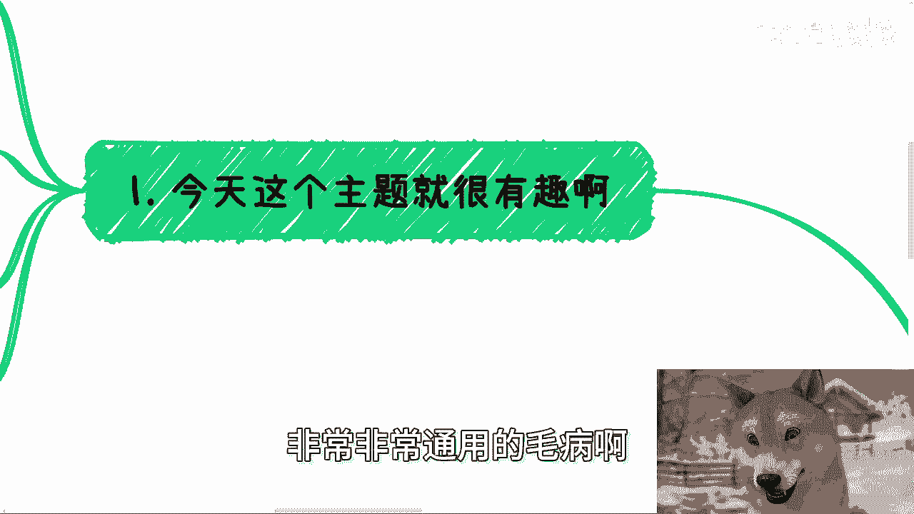
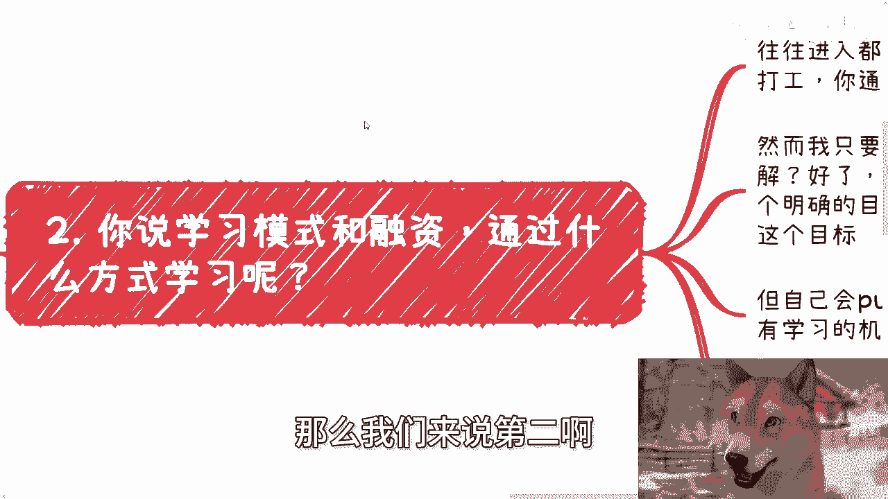
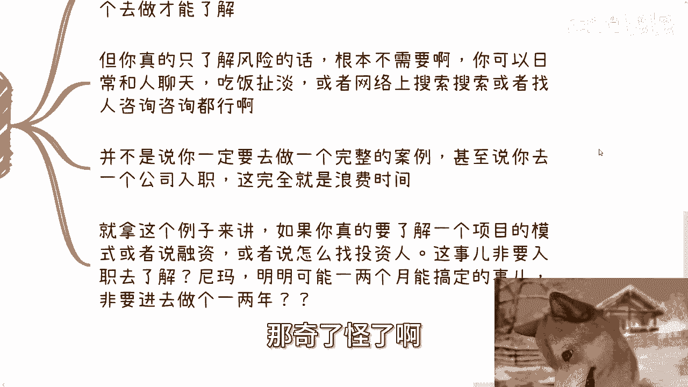
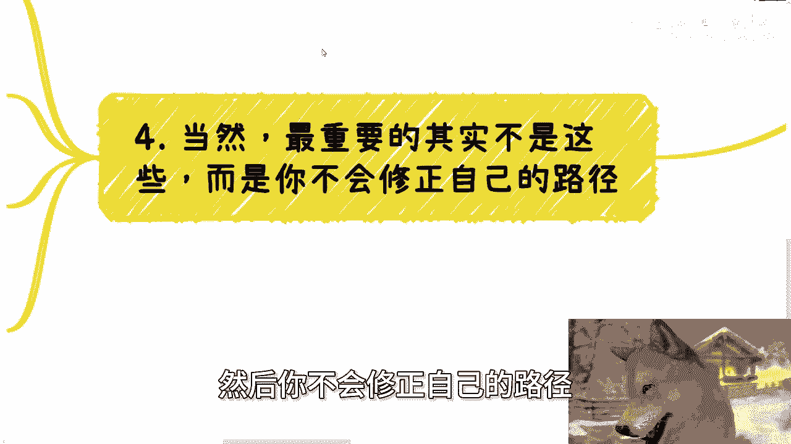
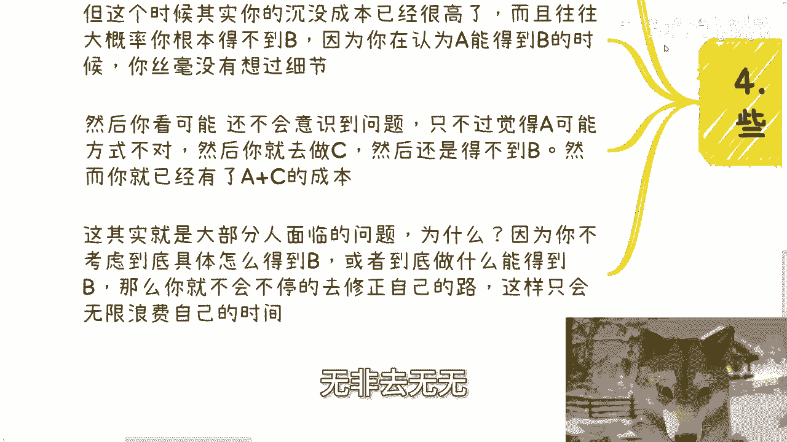
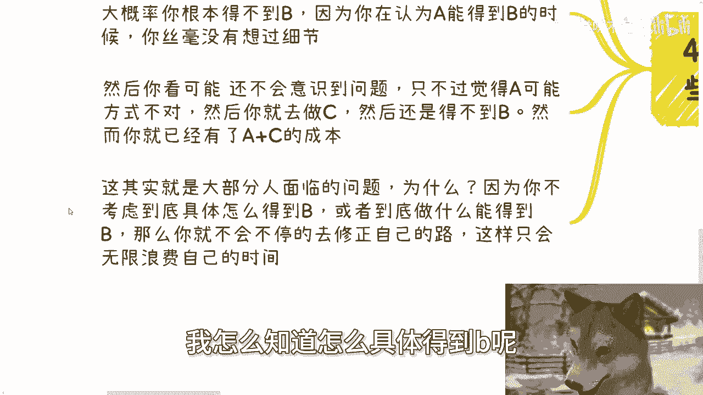

# 课程P1：你想要的结果往往无法从你的投入中获取 🎯




在本节课中，我们将探讨一个普遍存在的思维误区：人们常常认为只要采取了某个行动（A），就必然能获得期望的结果（B）。我们将通过具体例子分析这种思维的漏洞，并学习如何避免无效投入，更高效地达成目标。

## 概述：一个普遍的思维陷阱

很多时候，我们在做选择时，会预设一个行动（A）能带来期望的结果（B）。我们认为只要做了A，就能得到B。然而，现实往往并非如此，但我们自己却意识不到这个问题。

## 案例分析：进入创业公司的目标


上一节我们介绍了这个思维陷阱，本节中我们来看看一个具体例子。有人选择加入一家创业公司，他的目标是：**更好地接近团队、了解业务运作模式、学习如何融资**。



这个逻辑听起来似乎没有问题。但当我们深入追问时，问题就暴露出来了。

以下是几个关键的反问点，揭示了目标与行动之间的脱节：

1.  **如何具体了解？**
    当被问及“你具体打算怎么了解公司的运作和融资？”时，当事人往往答不上来。这说明他只有一个模糊的目标，却没有清晰的实现路径。


2.  **通过什么方式学习？**
    进入公司后，很可能处于执行层。此时再问“你计划通过什么具体方式学习融资知识？是参与会议、研读文件，还是直接请教创始人？”，对方通常没有明确的计划。这暴露了“只要进去就能学”的想法是空洞的。


3.  **了解信息的途径并非唯一**
    想了解一个项目的运作或融资，并非只有入职这一种耗时的方式。完全可以通过**网络搜索、行业报告、与人交流咨询**等更高效的途径获取信息。用一两年时间去验证一个本可以快速求证的想法，是巨大的时间浪费。

## 核心问题：路径缺失与成本累积

以上几点其实指向一个更核心的问题：**缺乏从A到B的具体路径规划**。



因为人们认为做了A就能得到B，所以他们会直接去做A，并在完成A后才审视是否得到了B。就像加入创业公司一两年后，才反思自己是否真的学到了想学的东西。



此时，**沉没成本**已经很高。如果得不到B，当事人可能意识不到是根本路径有问题，只会觉得“A的方式不对”，然后转向行动C，继续累积成本。如此循环，时间被无限浪费。

这个过程的本质可以概括为一个失败的逻辑公式：
```
模糊的行动A -> 期望的结果B
```
而正确的逻辑应该是：
```
明确的行动A + 具体的路径P -> 可预期的结果B
```

## 常见反驳与应对




每当讨论到路径规划的重要性时，常会听到这样的反驳：“**如果我不去做，我怎么知道具体怎么得到B呢？**”




对此，我们需要清醒认识：**如果一个人连通过信息搜集和分析来规划路径的能力都没有，那么指望他在盲目行动中“摸索”出路径，更是异想天开。** 这就像商业合作中，只说“目标是赚100万”，却不讨论“谁做什么、怎么做”一样，注定失败。

我们做事的准则应该是：**基于明确的行为和可预期的结果去行动，而不是用一个模糊的行为去赌一个明确的结果。**

## 总结

本节课我们一起学习了“投入未必能获得想要结果”这一思维误区。关键在于，我们不能想当然地认为行动A必然导向结果B，而必须**规划出从A到B的具体路径（P）**。在行动前，应多问自己“具体怎么做”，并积极寻找最高效的信息获取方式，避免陷入“用时间换答案”的高成本陷阱，从而更明智地管理自己的时间和精力。


---
**注**：关于职业规划、商业合作等具体问题，需要结合个人背景详细分析。