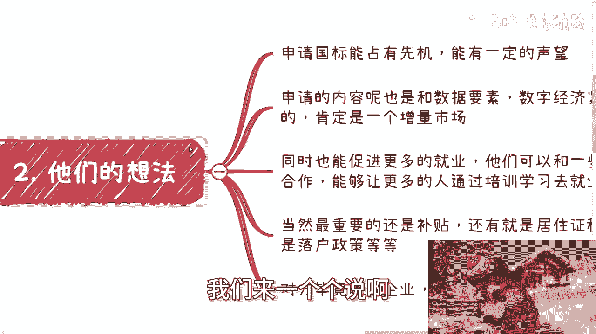

# 你想象中的需求和真实的需求的差异 - P1 - 赏味不足 - BV13WpnetExA

好大家好，今天我们来讲的这个是你想象当中的需求啊。

跟真实需求的这个差异啊，呃今天也是个故事啊。

这故事呢也蛮好玩的，嗯就前两天刚发生的啊。

最近有这么个案例啊，我正好也跟大家分享一下，就前两天呢，有个朋友给我介绍了一些新的老板啊，技术出身呃，这老板年纪也不小了啊，那正好呢就是他们企业呢，在做这个大语言模型啊，大数据啊，数据要素啊对吧。

然后啊，就反正跟肯定跟人工智能也多少带点边嘛，对吧等等等啊，反正就就最近的一些业务啊，然后呢啊正好就是说企业在做这方面的啊，所以介绍给我呢，为什么正好会引荐我呢，正好因为他们聊到了这个。

关于申请人社部职业技能等级证书，国标的事情啊，按照他们的想法呢，就是自己在人社部这边是有点关系的啊，那么能申请新的国标，那么就在那边讨论啊，申请这个东西怎么赚钱啊，对吧，赚钱情况怎么样啊。

有没有什么坑啊，对吧啊，我说实话，我其实跟他们聊之前，我就已经知道接下来谈话的情况了，为什么呢，因为无论谁啊，无论多么优秀，他很多事情不踩坑，你让他未卜先知。

这怎么可能呢，对不对，不现实点，人是什么生物了，就是你想不出你不知道的东西。

对不对啊，那么第二啊我们来一个个说啊。

他们的想法，他们的想法呢叫做申请国标呢，能占有先机啊，能有一定的声望。

第二呢就是申请的内容呢也跟数据要素啊，数字经济啊对吧，也是这个紧密贴合的啊，那么肯定算一个增量市场，同时呢也能促进更多的就业啊，他们可以跟一些机构啊，包括外包啊，谈好一些合作。

能够让更多的人通过培训学习去就业啊，当然啊最重要的还是补贴啊，还有就是说居住证积分，就说呃有些地方这不是所有的啊，有些地方呃人社部是拥有这个落户政策的，也就是说是能够落户加分的啊，你比如说上海啊。

上海就是有居住证积分的啊，那么呃跟我聊的这个呢毕竟是家企业啊，赚钱妥妥的肯定是第一位嘛，对吧好，那么接下来就是我跟他们说啊，我当时跟他们是这么讲的啊，以下这些话呢就是我怎么跟你们讲。

我就是怎么跟他们讲的啊，这我这没啥好遮掩的对吧，因为我不跟他们讲，他们踩坑了，我也赚不到钱，我跟他们讲了，他如果能赚钱，那我至少还能分杯羹，哼对不对啊，啊当然了，你们赚钱我就不指望分了啊。

你们就闷头赚就行了啊，那么我第一点我说国标呢有声望对吗，对的啊，但是呢不多啊，你你你说能大到哪里去吗，而且另外一方面你要看这个时代，你真的放在10年前，我觉得蛮好的啊，一定有的。

但你放到现在越来越多的人不在乎这个东西了，你越来越多的企业，甚至当地政府也开始不在乎这个东西了对吧，那你说能有多大呢，嗯第二申请的内容是增量市场吗，对的是没错，但是一般你从立项开始到写国标到审核啊。

到就是提交国标的材料啊，到最后审核下来，你快的话，我你看到没有，快的话，一年半到两年，就现在这个时代整个的这个叫什么，就是就是这个项也不叫项目周期，就是这个呃噱头的周期，或者说整个这个产业的周期对吧。

你们你们可以不知道，但是你们可以往前翻对吧，呃以往的比如说大数据啊，云计算啊对吧，什么移动互联网啊，安卓IOS啊，尤其是互联网的这种东西对吧，或者说是这种就是互联网金融这种东西。

它的生命周期越来越短对吧，你说快的话一年半到两年啊，快的话一年到一年半到两年，就现在这种像这种产业的生命周期，他妈半年说不定黄花菜就凉了啊，那么就业啊，我说就业呢你就别说了。

因为一方面就业本身就是个噱头，本身各行各业都是不可能有多少head on head count，开放出来的，这个东西不是我们来决定的，是呃整个大趋势来决定的，对不对，那么另外一方面。

就算你能真的培养出来，我当时就跟他们这么说啊，我说就算你真的能培训出来，一些真的有技能的人，真的能就业的人又如何呢，这才多少量啊啊，你是真的为了培训还是为了赚钱，你要是告诉我，你就是为了这点量。

在做慈善啊，然后最后的最后我发动了致命一击啊，哼就我说你最后说补贴跟落户口，落户落户对吧好，我们假设补贴跟落户是老百姓真正诉求，那么你从普罗大众来讲，如果我的目标是为了补贴跟落户。

那么我一定会去考一个什么花艺师啊，咖啡师啊，面点师啊对吧，包括那个珠珠三角那边，还有那个叫什么叫点心师对吧，还有那个好像是什么有些非遗的，反正各种各样的东西，我说这些东西又实用，可能也有很多人感兴趣。

也必然好考对吧，哦谁他妈的为了落户，为了补贴，为了点钱去考他妈什么数据要素，人工智能科技类的证书，有毛病啊啊自己跟自己过不去啊，你们面对中国14亿人的这种普罗大众，整个人社部的这个年龄段，下到18岁。

上到75岁对吧，你面向这么一个14亿人的普罗大众，你跟我说哎我要让他们去考数据要素，考一些新的东西，大哥啊，你哼认真的。

对不对啊，那么第四任何一件事情啊。

我们确定好了，客户跟诉求一切就能想得通啊。

什么意思，就是说这事本身就是个to c的事情，to c要赚钱就两种可能性，要么高单价，要么走量没了，你要么二选一，要么二选二对吧，那么人社部这个事，高单价不可能，因为我们不拥有定价权。

而且你你真的定了高价，很容易被举报啊，那么你只剩下走量了，对不对，好，那么什么叫走量，那就是不要试图用基数很小的噱头去吸引大众，好，我们回到三这个地方啊，你看啊，我刚刚问你们的是。

我说普罗大众谁会去考这种数据要素，人工智能或者科技类的，对不对对吧好，但是啊我们这个地方有个但是是什么，就是普罗大众考不考，并不在于他到底考什么证书，而是在于你到底拿什么东西吸引他，你明白吗啊。

这就比如说这个地方的技术证书或者就业，很难吸引，因为来学习技术或者奔着来就业的，他本来就是个小基数人群，那么你走增量市场，对不对对的，但是营销方式的切入点一定是什么呢，一定是这个东西有未来的市场。

未来会有非常多的岗位，未来会有会有非常多的福利，未来国家会有非常多的这个推动的政策，未来这个东西可能会跟各行各业有有结合点，对你给大众的营销感觉，就是未来会有很多的岗位，而不是现在未来会有很多东西。

而不是现在同时你就别人来考这个东西的时候，他不但是投资了，未来还会有补贴跟落户，那么吸引力就会高很多，但是那又回到办事上，你虽然听上去花里胡哨一大堆，但是最后是不是还是还是考的数据。

要是人工智能或者科技类的，对不对，但是又回到这个点上面，我们早就说过了，普罗大众是什么属性，普罗大众是根本就不关心他考的是什么，你只要告诉他这个东西未来有希望，你只要告诉他这个东西通过率很高。

比如说通过率95%以上，通过率百分之百，他就会来考啊，为什么不来考呢，对不对，我一样有补贴投资，未来为什么不来呢对吧，但是你同样的，你问他哎你考这玩意有什么用吗，不知道你考这个什么数据要素，什么东西吗。

不知道人工智能学什么，不知道他知道啥，他不用知道，因为他的目的，就是为了来薅这笔补贴和落后积分呢，他为什么要知道那些呢，所以说你就是真正我跟他们也是这么说的，我说你们营销的核心点其实是在于通过率。

是在于他们的学习周期跟考试周期对吧，你要是这个东西跟我说，哎我的学习周期就半个月对吧，考试通过率95%以上，干嘛啦，我干嘛不能考啦，啊不来考啊，是不是，然后你反过来想想看，如果你这些东西不宣传。

你就在那边宣传，哎我们的好就业啊，我们这个东西这个呃现在国家政策啊，这个然后这个呃学习学习呃叫什么呃，非常专业，谁来啊，有毛病啊对吧。

所以说这也是今天主题想要跟大家表达的，就是说你想象中的需求，你想象中的样子跟真实的样子他差异，你会发现他妈一个天一个地啊，那简直叫南辕北辙啊，对不对，你看似他做一件事情，我做一件事。

大家都是从同样做一件事情，你会发现我们的切入点是截然不同的效果，结果也是完全不同的，你们可以真的举一反三，我抛砖引玉引你们的玉啊，你们你们多看看手上的玉，好吧好行，就这么着吧啊那个职业规划，商业规划啊。

包括一些呃副业啊对吧，你们这个工作上面啊等等等啊，你们要是有任何的有想法或者有有一些问题啊，包括股权啊，融资啊啊合同啊和呃叫什么，就是呃跳槽啊等等等啊，你们有任何的这种东西，希望通过跟我的咨询啊。

能够给你们一些更额直接和接地气的建议，和规划的话，那么你们可以整理好对应的问题跟个人背景，好吧。

