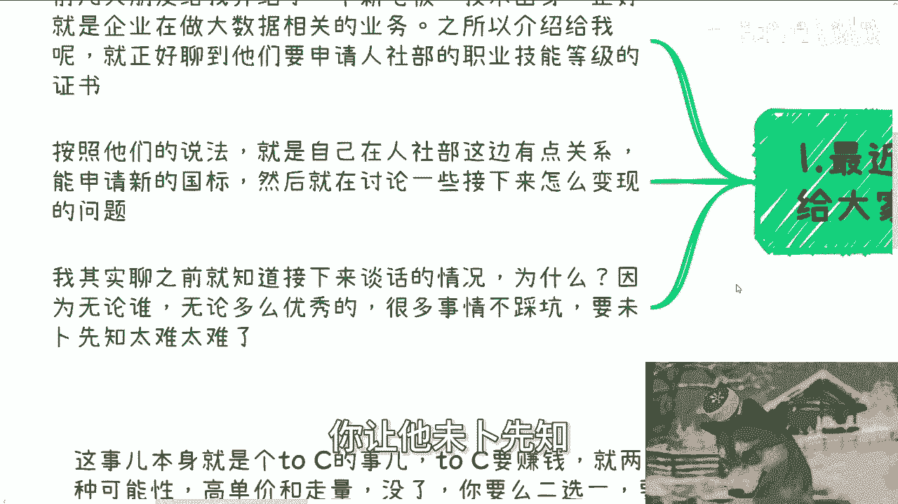

# 课程 P1：想象需求 vs. 真实需求 🎯

在本节课中，我们将通过一个真实案例，探讨人们在规划项目或业务时，**想象中的需求**与**真实的市场需求**之间存在的巨大差异。理解这种差异是避免决策失误、找准市场切入点的关键。

---

## 案例背景

前两天，一位朋友介绍了一位技术出身的老板给我认识。这位老板的企业正在涉足大语言模型、大数据、数据要素等与人工智能相关的领域。

他们当时正在讨论一个具体项目：向人社部申请关于数据要素、人工智能等方向的**职业技能等级证书国家标准**（简称“国标”）。他们的想法是，凭借一些人脉关系申请到新国标，并以此为基础开展业务。

---

## 想象中的需求

在深入交谈前，我就预见到了他们可能存在的认知偏差。人们往往无法预知自己未曾经历过的“坑”。以下是他们基于想象勾勒出的需求蓝图：

1.  **抢占先机与声望**：认为申请到国标就能在行业中占据先发优势，并提升企业声望。
2.  **贴合增量市场**：认为申请内容紧扣数据要素、数字经济等热点，属于增量市场。
3.  **促进就业**：计划与培训机构合作，通过培训帮助更多人学习新技能并就业。
4.  **政策红利**：看重证书背后的**政府补贴**和**居住证积分**（如上海落户政策），认为这是吸引用户的核心。

---

## 真实的需求分析

上一节我们介绍了项目方美好的设想，本节中我们来看看这些设想在现实中可能面临的问题。我当时向他们逐一分析了这些“想象需求”的不切实际之处。

**关于声望与先机**：国标能带来声望，但效力有限。更重要的是，时代变了。相比10年前，如今企业和个人对这类证书的重视程度已大不如前。

**关于市场周期**：申请国标是一个漫长的过程，从立项到获批，**快则需1.5到2年**。然而，当前科技风口（如大数据、AI）的产业周期越来越短，**可能半年就时过境迁**。等你拿到资质，市场热点早已转移。

**关于促进就业**：就业本身是个复杂命题，岗位数量不由培训决定，而由宏观经济和产业趋势决定。即便能培养出合格人才，数量也有限，靠此盈利规模太小。

**关于核心吸引力（补贴与落户）**：我向他们提出了关键质疑：如果普通大众的目标是为了获取补贴和落户积分，他们会选择考什么证书？

以下是大众更可能的选择：
*   花艺师
*   咖啡师
*   面点师
*   其他简单、实用、易通过的传统技能证书

谁会为了落户而去挑战“数据要素”、“人工智能”这类听起来就复杂、通过率未知的科技类证书呢？这无异于自我麻烦。

---

## 核心逻辑：确定客户与真实诉求

任何商业项目，只要确定了**真实客户**和他们的**核心诉求**，一切就清晰了。

人社部证书这件事本质是 **To C（面向消费者）** 的业务。To C业务盈利有两种基本模式：
1.  **高单价**
2.  **走量**

在这个项目中，**高单价**不成立（无定价权，且易被监管）。因此，只剩下 **走量** 这一条路。

**走量**意味着：不能用一个小众的噱头去吸引大众。关键在于营销的切入点。

---

## 营销切入点的转变

虽然最终考的证书仍然是“数据要素”或“人工智能”，但吸引用户报名的理由绝不能是“学习尖端技术”或“直接好就业”，因为关注这些的本身就是小众群体。

真正的营销核心应该围绕以下几点展开：
*   **强调未来前景**：宣传该领域未来市场广阔、政策扶持力度大、潜在岗位多。
*   **突出超高通过率**：例如，宣传 **通过率 > 95%**。
*   **缩短学习周期**：例如，宣传 **学习周期仅需半个月**。

普通大众并不关心证书的具体内容。只要告诉他们“这个证未来有用、通过率高、拿证快、还能领补贴和积分”，吸引力就会大增。他们的核心诉求就是**高效、低成本地获取政策红利**，而非学习知识本身。

---

## 总结与启示

本节课中我们一起学习了如何辨析想象需求与真实需求。

通过这个案例可以看到，想象与现实的差异可能“南辕北辙”。同样是做“申请国标”这件事，不同的切入点（是宣传“技术就业”还是宣传“高通过率与政策福利”）将导致截然不同的过程和结果。

关键在于：
1.  明确你面对的是**谁**（真实用户画像）。
2.  洞察他们**真正的核心诉求**是什么（往往是简单、直接的利益点）。
3.  围绕真实诉求设计产品和营销策略，而不是围绕自己的想象或一厢情愿。

希望这个案例能对你未来的职业规划、商业决策或副业探索有所启发。学会识别真实需求，是迈向成功的第一步。