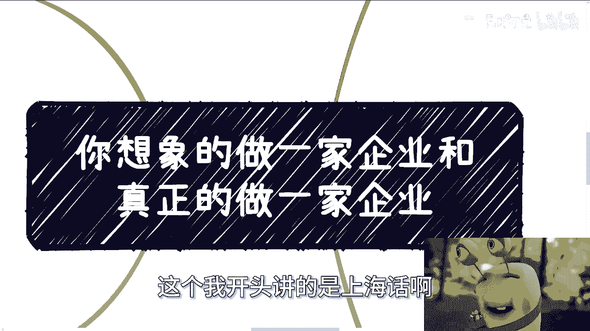
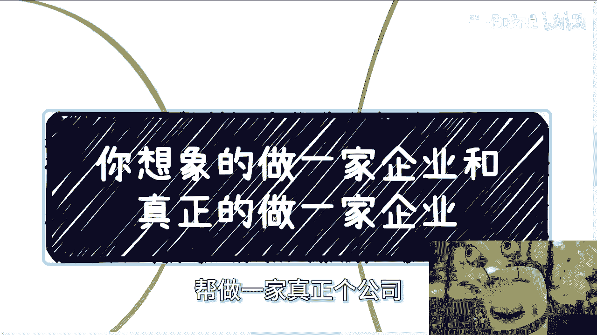
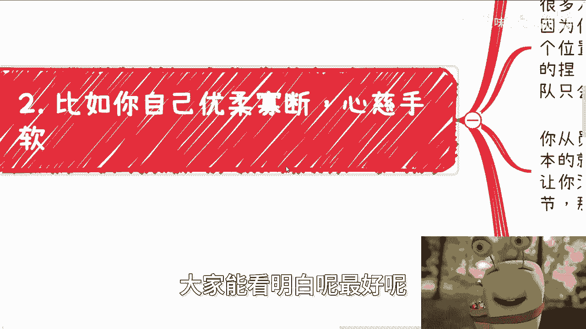

# 你想象做一家企业和真正去做一家企业 - P1 - 赏味不足 - BV1b94y1K73W

好啊大家好，这个我开头讲的是上海话啊。

不是不是广东话，很多人听成广东话啊。

打卡活好像差不多啊是吧，OK嗯然后我们今天这个主题呢讲的是企业啊。

我来给你们翻译一下，就是农向阳当中这位公子又能飞公司，对农田当中猪肝公司帮植物一家真正的公司啊。

喂养。

首先啊这是一个非常有趣的话题，就是你看啊很多人想要做企业对吧，那么之前呢一个咨询小伙伴就跟我说，他说他想做企业，我说问问他为什么要做啊，他说很有面子，也拿得出手啊，然后我就问他。

我说那你做企业的最终目的是什么，总归是赚钱嘛对吧，你跟我说，你做企业的最终目的不是赚钱，那你就别做了哦，我跟你讲，没有办法的，资本市场，商业市场你不要赚钱，我跟你讲，你什么都没做，为什么。

因为你既对不起自己，也对不起别人，而且你会死的很惨啊，那么做企业呢可能重要的是什么呢，就是觉得说自己的产品，自己的业务啊，自己的流量，还有就是找那个合作伙伴，资本很重要对吧好。

当然也有很多小伙伴来他的思想当中呢，觉得就是说路演就跟面试一样啊，需要需要做好准备，写好商业计划书，写好BP，需要去接受这个投资人的炮轰，好回答投资人的问题啊，就是需要更多的了解行业对吧等等等。

这些都没问题啊，都没问题好，还有就是包括做企业啊，他也觉得可能需要一些好的团队，需要一些更好的学历，需要让别人信服对吧，好以上的这些东西啊，我觉得都没有问题，但是有问题在哪里。

以上这些问题都是所谓的皮啊，那么皮这个东西你做的再好，本质上没有用，你得去关注它的核心啊，所以说就像我们这边写的这些东西，基本上都我写错了啊，都不是最痛的，这个点我们来看一下啊。

当然我这边也不可能全部列出来对吧，我只能列一些部分的，大家能看明白的，最好能看不明白。

我也没办法啊，比如你自己的优柔寡断，心慈手软，什么意思啊，这个是你性格当中，我不管你原本性格怎么样子，就是你要去做一家企业，或者你要去做一个商业，你就不能心慈手软，你就不能优柔寡断，为什么呢。

因为你的这件事对内也，对外也好，对你自己也好，都是致命伤啊，也就是说从一开始，你对你的员工或者对外界的竞争对手，其实注定都是输的啊，就如果第一天第一条那个讲的，就是说和团队相处这个难，他是个细节。

很多人他其实我说实话，他在做项目，或者他在思考问题的时候，他往往就不太会去思考这个点，也就是说你不能跟员工相处太多，以及你也不能从员工角度去思考，也就是说你要心狠啊，你要心狠手辣对吧。

但是很多人思考的时候呢，他不会从这个角度去想，他也不会去思考，说我跟团队到底怎么个合作对吧，或者怎么沟通啊，那么很多人就要说了，他说陈老师啊，你这话说的对吧，你果然不把我们当人是吧啊。

其实呢并不是因为还是那句话，你要么就坐这个位置，对大家是负责的，你要么就别坐这个位置对吧，我跟你们讲，你作为一个老板，你作为一个资本家，作为一个企业家，你对你不把你不把大家当人。

我觉得这已经是最大的对得起他们了，为什么，第一你和员工相处太多，所谓人性就是柿子挑软的捏，你明白吗，就是说你一旦让员工觉得你清理好，拿，捏完了，团队指挥内部分裂，因为你到时候只会听到啊，这边有什么八卦。

那边有什么八卦啊，这边有人挑挑拨离间，那边怎么样，你到时候怎么弄，我就问你怎么弄，你一个月可能利润就没有多少啊，你还要花时间，花精力花到这种事情上面，你怎么搞对吧，那当然啊，当然啊。

我这个地方讲的更多的是那种初创公司对吧，你要是真的，比如说利润率高了，你公司人也多了，那没问题啊，你可以当中找一个代理人嘛，就像你的经纪人是一样的，就像为什么很多公司他要空降个CEO。

就是让这个中间这个人跟员工去沟通，让中间这个人让hr跟员工去沟通，你不要跟员工沟通，你知道吗，你该怎么狠就怎么狠，对吧，因为你不把他们当人没问题，但是你该给的福利，该给的钱都要给嘛对吧。

但是你不要去跟他们有任何的，就是这种感多很多啊，也不知任何吧，就是不要过多的有这种感情上的交流啊，日常的交流啊，我觉得就比较少就可以了，没有必要，因为你要让员工就是就只知道有你这么一个人。

不要对你了解太多了就完了呀，你怎么怎么掌控啊，控制不了啊，以什么服人，以德服人吗，不好意思啊，德不值钱，那你拿什么夫人啊，你从员工角度考虑，我跟你讲，那更是大忌，因为你做一个企业最根本的是什么。

是活下去，因为只有你活下去，员工才能活下去，只有员工活下去，员工他们就说有工资才能发对吧，那么你很多事情从员工角度出发，只会让你没有大局观，因为没有办法，因为人嘛你关注一些东西。

就像现在非常多的打工人对吧，他关注的太细节，那么他就没有大局观，那么你一旦没有大局观，那么我就问嘛企业的方向谁来定对吧，企业这个战略怎么定，怎么赚钱呢，另外就说到商业市场上，本质上啊就是你死我活。

我觉得大部分人做企业，他的想法是好好做产品，好好做业务没有错啊，但是这种想法基本上就是打工打多了，或者电视剧看多了，就是那种就是说啊怎么样怎么样，然后一下子好像被被谁看中了，或者解决什么痛点了。

这种叫做什么，这种叫做理想化，没有意义的，你的优柔寡断跟心慈手软，只会让你的合作好伙伴白嫖你，甚至坑你，为什么，还是那句话，人性的根本是柿子挑软的捏，就像以前一直说会哭的娃有奶吃，为什么。

就是因为人性就这个样子啊，哦你难道觉得你是怀才不遇，不是的，而是你得先让别人看到你的才，而且别人看到你的才之后，还别人还得认可你的才，不要到最后你自我感动，只有你自己觉得你是才，那么到最后倒闭了。

拖欠款项也好，让员工回家也罢，虽然本质上社会上大家没有谁对得起谁啊，但是没有必要啊，什么意思呢，就是我们可以失败啊，我们可以甚至我们可以亏钱，但是我们失败和亏钱，总不能是因为自己的问题吧，你明白吗。

就是如果是市场做的不好对吧，你说整个大局对吧，我们已经尽力了，我们怎么样子做的不好，没问题啊，但是到最后你说哦，因为失败是因为自己的性格问题，那何必呢，自作孽，第三点。

我们再来说资本协会或者一些相关部门啊，你看啊，很多创业者或者做公司的人，我跟你讲这一点很重要，你们仔细听啊，或者做公司的人其实经验不丰富，或者第一次做资本这个角色，很多人觉得是高高在上的。

跟他们是不平等啊，那么也有些人会觉得资本是来帮助自己，而且就算不是帮助自己，至少也是这也是个合作关系是吧，好有没有问题啊，我们往下说，这事我跟你讲八二开啊，巴尔凯什么意思。

就是我认为少数的确是有帮助或者合作关系，这一说的啊，这没有毛病，但是大部分并不是什么意思呢，就是说好一点的话，你就是换个地方打工，就是你别觉得哎呀老子是个创业者，老子要开公司了对吧，没有区别的。

你只是换了个场地，换了种形式在打工啊，而且你们去了解一下很多创业者的老板，他其实是不太能给自己发很大工资的，因为投资人会对你们产生非常大的反感啊，那么正常一点的呢，就是通过投资人会通过各种信息差。

来割你的韭菜，我们往下看啊，如果你只是去打工啊，就是说虽然你是个创业者，但是你你你你相比投资人来讲，你是给投资人打工的话，我觉得他还好，无非就是说项目做着做着做着呢，可能跟你的初衷不符啦。

跟你的想法不一样了，投资人开始干涉你越来越多了对吧，一开始说哎我不干涉你，你有你的想法，你你放飞自我对吧，你freedom对吧，怎么样啊，但是后来不行啊，做着做着就是我跟你讲，社会上这种事情很多的嘛。

就是上来就是你好我好，大家好，然后做了一段时间，一两个月之后好翻脸了啊对吧，越来越来越怎么样，怎么样得寸进尺，对吧啊，或者说你甚至跟投资人会吵很多次架，但怎么说呢，无论市场上面说的多高大上。

你们记住一点，本质上地位是不平等的，我写到这个地方的时候，我也想到了什么呢，就是一样的道理，就是我们一直说啊，企业里面员工要平等，员工要什么公平对吧，都要要要要对员工有一个基本的保障，我还是那句话。

你们不要再去拿任何什么什么新闻上的，什么网络上的东西来说是没有用的啊，没有用的，这就我们就随便说啊，你说这两天有人说外卖对吧，有的人3年赚了102万，有的人说什么零零后创业怎么样怎么样。

但是然后呢我跟你们说啊，我看到这种东西，我的想法就一个就是这就是屁话，为什么，因为你为什么要去关注一个赚到钱的人，你们为什么不去关注背后千千万万，甚至上亿已经躺在那边奄奄一息，甚至已经已经已经是那个。

血流成河的这个尸体呢，为什么大家不去关注这些呢，因为什么，因为99。99%是失败的，后面那些人难道不是人吗，为什么没人关心呢，对不对啊，好那么我们说投资人割你韭菜什么意思啊，我们举个例子。

比如说你今天做了一个项目，是大数据或者AIGC啊，就是呃或者说别的哦，Anyway，无所谓，我们就称之为A然后呢投资人会跟你说，他有一个B的东西啊，可能是B这个项目A加B呢，类似于告诉你。

你可以1+1大于十，当然他会给你画饼啊，比如说以后股权怎么接盘啊，以后怎么融资啊对吧，以后怎么样子啊啊好，还是那句话吗，真正能懂的人我相信少啊，很多人他不懂啊，他被投资人一顿操作猛如虎之后。

自然会觉得投资人会跟自己是一对的哦，我们是一个team，而且很多人啊，不是我说你们大部分的人这个时候已经飘了，他就会觉得卧槽，我他妈财务自由了对吧，然后准备回家之后吹逼了你们，你们别笑，我跟你们讲。

很多人就这样，没有办法，这就是人性，但是最终你会发现自己不但是给投资人打工，甚至对这个项目来讲是1+1大于十，但是你跟你的团队其实等于打白工，而且呢你会发现B的大股东呢，其实也是自己的投资人。

那当然啊这个地方我又得说一嘴啊，有很多人说，那他妈的我上来查一查不就知道了吗，哥哥们姐姐们，很多事情是可以做的，你什么意思，你知道吗，就很多事情是可以做局的，他可以是大股东，但是他可以不展现在上面对吧。

无论是股权代持也好，还是别的方式也好，方法多了去了，你能知道个屁呀，啊你明白吗啊，所以说你会发现你不但给别人打工，你还帮别人养肥了别人的团队啊，那么到最后往往什么情况呢，就是你怎么死的不重要。

你就变成我刚刚说的，整个全呃，这个这个大众不关心的背后的一具尸体，而B呢哎跟投资人继续下一轮融资，怎么样怎么样怎么样，那你能说什么呢，对不对啊，协会相关部门我跟你们讲就更别说了，你们去聊你们就知道了。

本质上来，本质上就是吸血，那当然了，这个雪呢一年比一年贵啊，当然了，你也不能说他们帮不上什么忙，忙的也可以帮的，但是这是相互的啊，因为你想嘛也不可能，阿猫阿狗过来给个会员会员费，就当献血了嘛。

阿猫阿狗过来献个血都合作不可能的呀对吧，所以说这得看你是谁啊，你能提供什么没有办法，这就很实际啊啊。

好第四点啊，说到企业，那么很多人呢啊。

我可以说非常多的人向我表示过，他自己不想做一个拉皮条的企业对吧，好我跟你们讲啊，很多人跟我讲啊，不管是不是做企业，但是呢都想做一个有竞争力的企业或个人对吧，你们你们心里肯定这么想的啊，没有错啊。

啊不想拉皮条对吧，没有问题的，我跟你们讲话，谁都会说啊，有义务了，目标谁都会顶，有义务了，谁不想做有竞争企业，我不想吗，是我不想吗，啊所以是我不想我上不上上不了清华啊，就是我不想你，你想想看。

你们的这种想法，跟那些他妈的专家有什么区别对吧，我们不要拿这种不切实际的东西去蒙骗自己啊，我为什么一直跟你们提中介，为什么一直提资源整合，是因为这是在日长久的过程当中，我唯一的一个能够看到适合老百姓。

还有可能积累关系资源的这么一种方式，没有之一啊，剩下是什么，剩下都是你，我说的不好听，剩下的都是你们被蒙骗，在一种非常美好的世界当中，但实际上你们就在被割没有了呀对吧，难道我难不成我跟你们说来去融资。

去组团队啊，做产品做产业对吧，做业务啊，我可以说没问题，我要是这么说，我就一定是昧着良心，我就一定是就是明明知道市场不是这样这样子，但是我他妈睁眼说瞎话对吧，而且你们我相信你们当中总有人会相信我啊。

然后死都不知道怎么死，我跟你们说啊，市场上这种人很多啊，我跟你们讲啊，你们但凡出去真的做，你们就会发现市场上有一种商业逻辑是什么，你们知道吗，就是你们想做对吧，可以我跟你们合作，我可以出卖我的背书。

我可以出卖我的合作伙伴跟你合作，但是怎么办，我为什么要跟你合作，我需要你的股份，哎有很多人说，那那那你有什么好处呢，很简单，对于我来讲，我就广撒网啊，我一不出钱，你们管你们做，你们就给我打工。

我就瞎猫碰死耗子，100家企业当中有一家企业赚钱了，我就分红，有什么不好的，有的呀，然后我还会用我的方式，就像我刚刚说我还用我的方式，我也给你们介绍合作伙伴，然后合作伙伴赚的钱我可以分。

反正你们赚不赚钱跟我没屁关系，也有的很多的，对不对，就是我就说了啊，得或者任何别的东西有带感情，我我之前就跟你们讲，你们分析问题有感性和理性的，你们只要做商业，只要赚钱，只要有感性的东西在这里面。

你们早晚要被坑，没有办法的，我再给你举个例子，这就好像那这就好像我跟你们说啊，无论是微信还是私信，很多人会跟我说陈老师啊对吧，我怎么样怎么样，包括这次深圳线下也有的跟我说，哎陈老师能不能带我对吧。

就说我给你做做做做打打下手对吧，做助理不是我不要啊，我要啊，但是我就问嘛，我开了这个口子之后，我要了第一个后面怎么办，我为什么要只要你不要他呢对吧，而且更何况我要了你，我怎么知道你未来不会坑我呢对吧。

那当然有很多人说，那你不知道对我是不知道，那我为什么要做这件事情，我为什么要冒风险呢，我就这0。1%的风险，我都不愿意冒，对不对，就这么简单，你你明白吧，OK就这么着，你们反正商业上啊。

职业规划上面或者别的东西，反正有什么小问题的，你们就直接私信我好吧，然后如果能整理出来一个一个问题list的，或者说你觉得还需要详细讨论一下的。

