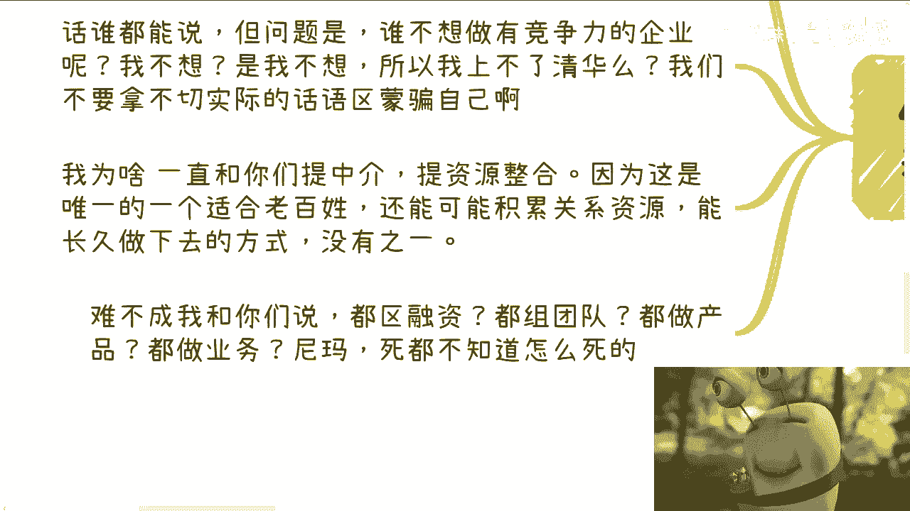

# 课程 P1：想象企业与真正经营企业的区别 🏢

在本节课中，我们将探讨“想象经营一家企业”与“真正去经营一家企业”之间的核心差异。我们将剖析那些在想象中被美化，但在现实中却至关重要的挑战与陷阱，帮助你建立更务实的企业经营认知。

---

## 主题引入

视频开头使用的是上海话，并非广东话。

很多人会听错。

听起来可能有些相似。

今天课程的主题是关于“企业”。

课程标题翻译过来是：“你想象做一家企业和真正去做一家企业”。

---

## 第一节：企业经营的根本目的 💰

这是一个非常有趣的话题。很多人想要创办企业。

之前一位咨询伙伴告诉我，他想做企业。我问他原因，他说这样很有面子，拿得出手。

我接着问他，做企业的最终目的是什么。最终目的总是**赚钱**。如果你说做企业的最终目的不是赚钱，那就别做了。

在资本市场和商业市场中，不追求赚钱是无法生存的。你既对不起自己，也对不起别人，而且会失败得很惨。

在想象中，做企业重要的是：觉得自己的产品好、业务好、有流量、能找到合作伙伴、资本很重要。

很多人的想法中，路演就像面试，需要做好准备，写好商业计划书（BP），需要接受投资人的提问，需要更多了解行业。

这些想法都没有问题。

还有人觉得做企业可能需要好的团队、更好的学历，需要让别人信服。

以上这些想法都没有问题，但问题在于：以上这些都是所谓的“皮”（表面）。皮做得再好，本质上没有用，必须关注核心。

就像下面列出的这些点，都不是最痛的关键。我们来看一下。

当然，这里不可能全部列出，只能列出部分大家能看明白的。

---

## 第二节：创业者性格的致命伤 ⚠️

上一节我们提到了关注核心的重要性，本节我们来看看第一个核心陷阱：创业者自身的性格弱点。

以下是创业者需要警惕的性格问题：

*   **优柔寡断与心慈手软**：无论你原本性格如何，经营企业或商业时，不能心慈手软，不能优柔寡断。这对内对外都是致命伤。从一开始，你对员工或竞争对手就可能处于劣势。
*   **与团队相处过密**：这是一个细节，但很多人思考问题时容易忽略。你不能与员工相处太多，也不能完全从员工角度思考问题。你需要果断，甚至需要“心狠”。
*   **错误的团队管理观念**：有人可能会质疑，认为这是不把员工当人看。但事实是，作为老板、资本家或企业家，不对员工投入过多个人感情，可能是对他们最大的负责。人性倾向于“柿子挑软的捏”。一旦员工觉得你好说话，团队内部容易产生分裂、八卦和挑拨离间。
*   **沟通策略**：对于初创公司，创始人应避免与员工有过多的日常感情交流。要让员工知道有你这个人，但不要了解太多。公司规模扩大后，可以设置代理人（如职业经理人、HR）来处理与员工的沟通。
*   **摒弃“以德服人”**：在商业中，“德”不值钱。企业的根本是**活下去**。只有企业活下去，员工才能活下去。从员工角度出发思考问题，会让你失去大局观，无法制定企业战略和方向。
*   **商业市场的本质**：商业市场本质上是**你死我活**的。许多人理想化地认为只要好好做产品、业务就能成功，这种想法往往源于打工经历或电视剧影响，是不切实际的。
*   **性格导致的失败**：优柔寡断和心慈手软只会让合作伙伴白嫖你甚至坑你。人性本质就是欺软怕硬。失败可以是因为市场环境，但如果是因为自己的性格问题，那就是自作孽。

---

## 第三节：与资本和机构打交道的现实 🏦

了解了自身性格的挑战后，我们来看看外部环境中的关键角色：资本和相关机构。

很多创业者或初次经营公司的人经验不足，对“资本”这个角色存在误解。

*   **资本的两种面孔**：大约20%的情况下，资本可能是帮助者或合作者。但80%的情况下并非如此。
*   **换地打工**：好一点的情况是，你只是换了个地方、换了一种形式为投资人打工。很多创业者老板并不能给自己开很高的工资，因为会引起投资人的反感。
*   **信息差割韭菜**：更常见的情况是，投资人会利用信息差来“割韭菜”。例如，你有一个A项目，投资人告诉你他有一个B项目，鼓吹A+B能产生“1+1>10”的效果，并给你画饼（如后续融资、股权变现）。很多不懂的创业者会飘飘然，觉得和投资人是一个团队，甚至觉得自己财务自由了。
*   **局中局**：最终你会发现，你不仅在为投资人打工，还可能是在帮投资人养肥另一个团队（B项目）。B项目的大股东可能正是你的投资人（通过股权代持等方式隐藏）。你最终可能失败得无声无息，而B项目则和投资人继续下一轮融资。
*   **协会与相关部门**：与一些协会或相关部门打交道，本质上可能是一种“吸血”行为。当然，它们也能提供一些帮助，但这是相互的，取决于你能提供什么价值。不可能随便交个会员费就能获得深度合作。

---

## 第四节：务实的企业生存策略 🛠️

面对资本的风险，创业者更需要务实的生存策略。本节我们探讨一种被低估但至关重要的模式。

很多人表示不想做“拉皮条”式（即中介或资源整合）的企业，都想做有核心竞争力的企业或个人。

这种想法就像“谁不想上清华”一样，是美好的目标，但往往不切实际。

*   **中介与资源整合的价值**：在长期实践中，**中介**和**资源整合**是我看到的、唯一可能适合普通老百姓积累关系和资源的方式。其他方式大多让人沉浸在被割韭菜的美好幻想中。
*   **现实的商业逻辑**：市场上存在一种常见的商业逻辑：你想做事，可以。我用我的背书记和合作伙伴与你合作，但条件是我要占你的股份。对我而言，这是广撒网，我不出钱，你们运作，相当于为我打工。100家企业里有一家成功，我就能分红。我还可以通过介绍合作伙伴赚取分成，而你们的成败与我关系不大。
*   **商业中的理性决策**：在商业、赚钱领域，一旦掺杂感性因素，早晚会被坑。这就像很多人私信请求“带一带”或做助理。如果我开了这个口子，为什么要选A而不选B？我为什么要冒哪怕0.1%的风险？商业决策需要极度理性。

---

## 总结与互动 📝

本节课我们一起学习了想象企业与真实经营企业间的巨大鸿沟。

我们剖析了三个核心层面：
1.  **内在性格**：创业者必须克服优柔寡断、心慈手软，并与团队保持适当距离，以维持决策理性和公司稳定。
2.  **外部资本**：需要清醒认识资本的本质，警惕“换地打工”和“局中局”陷阱，理解与协会等机构打交道的现实规则。
3.  **生存策略**：摒弃不切实际的幻想，重视**中介**与**资源整合**这类务实的起步模式，并在商业决策中保持绝对理性。

商业世界残酷而现实，成功的背后是无数未被看见的失败。理解这些差异，是迈向真实经营的第一步。

如果你在商业或职业规划上有具体问题，可以整理出来。

