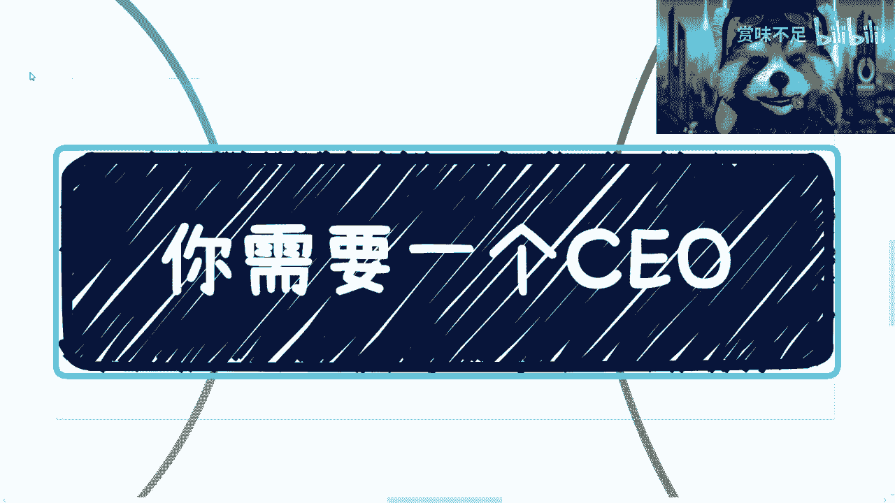
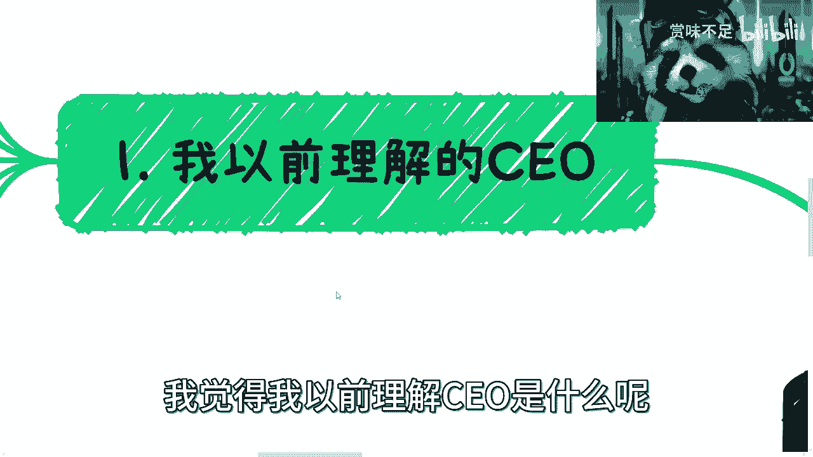
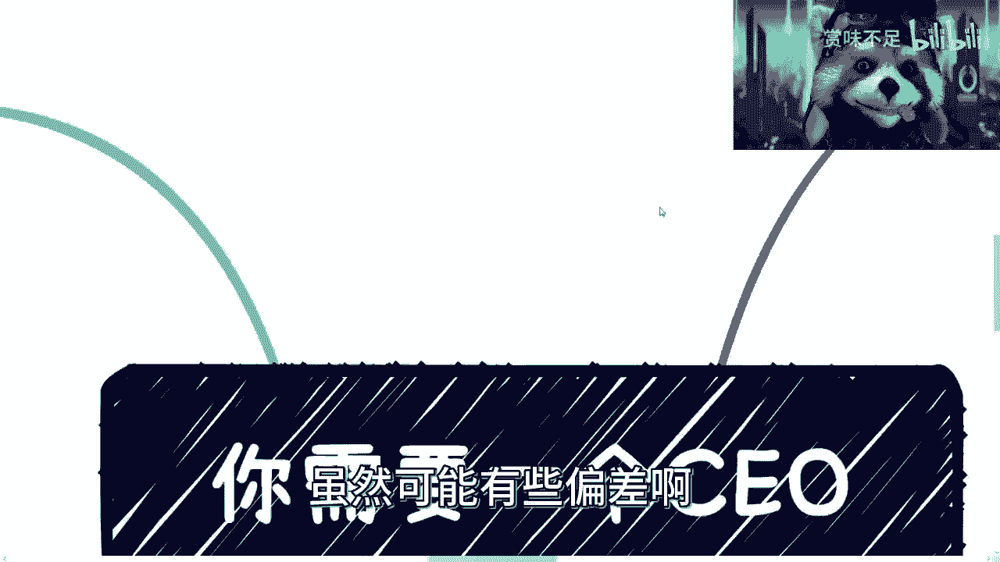
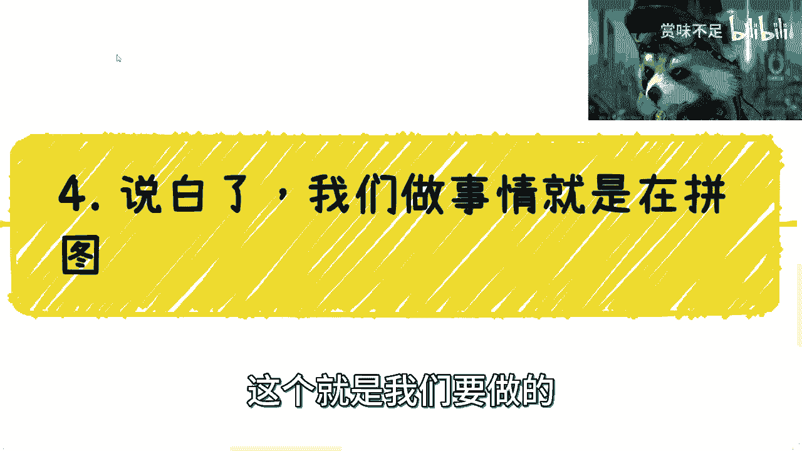
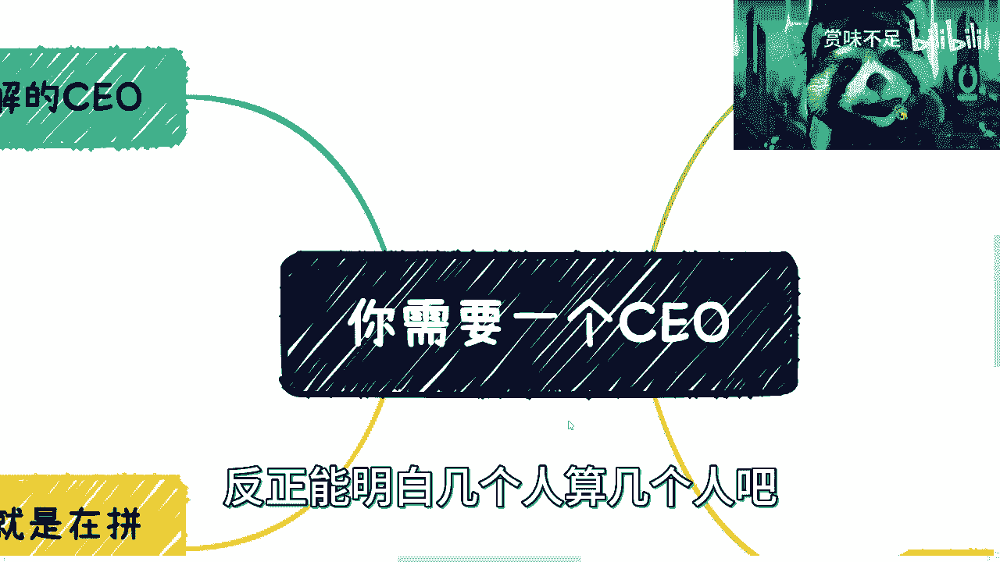

# 你的项目或者企业往往需要一个CEO - P1 - 赏味不足 - BV1824y1F7oA

啊啊各位小伙伴大家好啊，呃今天我们讲的这个主题呢是你需要一个ceo啊。

我觉得首先两点吧。

我觉得第一点呢是我觉得大部分人都需要，第二点呢。

我也觉得大部分人对ceo的理解可能不到位啊，呃我以前反正是不到位的。

那首先在这之前呢，我觉得要讲三件事情啊，分享几个故事对吧，第一呢呃有人私信我，他说吕老师啊，你他让我给他个简历啊，他说否则我怎么知道500块钱一个小时值不值，我给他回复是这么说的，首先呢我觉得值啊。

你觉得值不值，那是你的事情，你要觉得不值，你可以不找我不就结束了嘛，对不对，这是第一点啊，第二点呢，我个人是觉得我也就是要你510个小时，我又不是要你5000个小时，我要今天要你5000个小时。

你让我给你任何的东西，我觉得都是应该的对吧，但是问题在于对于我来讲，第一对吧，无论是隐私保护也好，还是各个方面也好，我也可以去选择不给是吧，这是第一点，第二点就我觉得我要跟你说5000块钱一个小时。

那你基本上就可以直接举报我了，也不用来找我，是不是啊，这我觉得这第一点啊，嗯第二点呢就有人跟我说啊，他说领导呢都喜欢做事漂亮又听话的对吧，他说那为什么刘老师说做事漂亮和听话的，没有用啊。

我跟你们讲故事很简单，领导是不是喜欢做事漂亮又听话的，没有错啊，但是我们就说国内14亿人做事漂亮又听话的，也不止你一个人，对不对啊，要找随便找是吧，所以我跟你讲，关键在于什么呢。

关键在于你是不是能够在整个金字塔的中上层，你是不是能够跟这个领导打好关系，或者你是不是这个领导的亲戚对吧，我也说的直白一点对吧，你说至于下面做事情的人，你不做无所谓啊。

外面排队多的是who care是吧啊，所以呢我觉得就是说所有人啊，就是考虑这个问题的时候，你们要考虑到点子上对吧，你所有东西都是用打工的思维去考虑，那就是无解了对吧，第三点呢就是说我跟你讲啊。

别啥事呢都想自己做对吧，你就像昨天晚上我说大家出去认识人是吧，哎呀我跟你说啊，方法论呢漫天都是啊，有很多人会跟你们讲啊，你们出去呢这个没有目的性是没有用的啊，你们出去呢这个关系不对等也是没有用的。

这不是废话嘛对吧，但是问题是有没有用，取决于你们第一步到底怎么走啊对吧，你总不能你总不可能说我今天走了第一步啊，走出去第一步好，我因为没有目的没有关系，所以跟我没有用对吧。

然后呢第二种是你现在走出去第一步了啊，然后呢你说啊这个啊没有关系，没有没有这个对的啊，然后呢我对别人也没有价值，我也不知道要干嘛，所以我就不走第一步了对吧，就问题在于说你不管最终有没有价值。

也不管最终能不能找到你合适的人，你总归是要走出，所有的人都是第一步都这么走的对吧，那你指望什么呢，你指望说啊我去花个三四十万读个emba啊，我就不走第一步了，我直接跳过去，可能吗，不可能可能个屁啊。

是不是啊，你每天就是你不去走，你每天找方法论是没有意义的，然后你听别人跟你讲，嗯好像貌似很有道理，然后呢对吧，然后呢跟你有什么关系呢，没有关系的啊，就像很多人跟你说，我刚刚说了，你你关系不对的。

没有目的，是是是你说的对对吧，我也觉得我没有目的，然后呢那你过了2年。

你还是没目的，没有区别的呀，你说是不是啊。

那么我们来说啊，今天这个ceo的事情，第一点啊，我觉得我以前理解ceo是什么呢。

是这个创始人对吧，创始人啊，然后呢掌控全局对吧，说说他什么都他说了算啊，老板是吧，老板啊，金轮书叠满是吧啊，然后这个就是总体来讲就是哎团队他创建的啊，这个业务也是他挖掘的对吧。

然后什么什么可能核心竞争的也是他做的对吧，然后护城河也是他他有的啊等等等等，反正一大一一大堆对吧，就在我看来呢，以前我是觉得呢就是所有的人啊，包括什么什么c叉o啊，什么o啊，都是给ceo打工的对吧。

我是这么觉得的啊。

这个我觉得很多人也会这么觉得啊，虽然可能有些偏差啊。

这是第一点啊，第二点呢我觉得是这样子的，后来发现呢，其实部分我觉得部分理解也没有错啊，但是其实本质上ceo呢还是有其真正定位的啊，而且我觉得大家所有人都需要呃，我们的一个来看。

首先啊其实好多公司都是空降ceo的，你们可以去看，就就你们真的仔细发现的话，会发现都是空降ceo的，为什么呢，因为一个好的ceo其实是蛮难找的，而且基本上啊就不是说找你可能花钱，别人也不愿意来啊。

一定要明白是吧，那么当然无论是就无论你们去去，是这个做副业还是创业，我觉得你们其实都是一个这个ceo啊，你啊就都需要这么一个ceo，但是这种ceo呢可遇不可求啊，我有一说一啊，那么有人问我呢。

他说啊这个吕老师我要你就问我要不要是吧，我跟你讲，我当然要看场合，就目前来讲呢，我觉得c端这个企业端政府端对吧，包括什么各个其他端口吧，就是一般情况下我觉得我都可以搞定啊。

因为毕竟一般来讲你比如说像省厅局啊对吧，或者其他相关的各个厅局啊，我觉得我这个层面应该都能搞定啊，但是各其实更高端的一些场合，我肯定也是需要的，因为说白了就是我不是那种很会打扮，我要是这种人的话。

你们也不会在这种视频里面听到，我讲这么一些东西是吧，所以说呢就是说我只适合可能在啊，怎么说呢，就是比打工好一点啊，比真正创业差一点的这种中间层面啊，我适合啊，那么在上面我就不适合对吧。

这个这个这个是性格问题对吧啊，这个是性格问题，啊我靠我不会断掉了啊，还好我刚刚点错了一个东西，那么同样的这个ceo呢，我觉得空间要干嘛呢，第一就是公司对外的门面，门面就是什么意思呢。

就是说啊这个外貌对吧，言行举止对吧，然后他的这个阅历对吧，各个方面其实他要展现出一个公司的高大上，所以呢这我这也是为什么很多企业呢，它是需要一个空降的，因为他们可能以前的这个创始人啊，这就是合合伙人啊。

小伙伴啊，其实大家可能各司其职啊，也都有能够弥补对方短板的地方，但是他们可能都不适合去做一个ceo，而且有很多人呢就是他因为术业有专攻嘛对吧，有些人就是说他只只针对技术，有些人呢比如说像我这样的对吧。

他可能比如说对于就就躲在幕后啊，把这个大战略大方向啊定定好对吧，但是这个时候呢就是说你会发现我也好，其他人也好，可能大家都不适合做这个ceo啊，就是我们需要一个空降对吧，你知道吗，就这种是第一层。

第二层是什么呢，其实对于公司跟项目来讲呢，它其实属于一个高级的商务对吧，就是就非常高级的商务精英级别boss对吧，就这个商务呢是专门去谈战略，合作和人际关系的，就是他不会去谈任何实际的东西。

你千万不要说啊，跑的ceo跑出去说来你们这个项目多少钱啊，啊不不可能的啊，我我会拉我们这个业务呃，商务负责人跟你们谈的一定是这样子的，但是呢他出去是什么呢，就是说比如说酒会对吧，高级的酒会。

比如说游艇对吧，比如说那个闭门会议对吧，这个是要去参与的啊，不管是这个西装笔挺对吧，还是这个沙滩排球对吧，他都这种高尔夫是吧，他要去参与的这个是他要去维护的关系，其实这个就是我为什么说下一个就嗯。

就是更更更更高级的一个商务呢，是因为他大部分的时间其实是在social，而这个social呢，它不是一个就跟你们想的那种不一样，它不是一个要出去拓展业务的，其实是很少的，就是真正拓展是很少的。

更多的是维护啊，更多的是维护，那么这是一块，那还有呢就是它一定是要懂得察言观色的，就他对于很多别的东西不懂，没有关系可以学，但是他情商一定要知一定要高，他知道哪些话能讲，哪些话不能讲对吧。

他知道什么场合说什么，见什么人，说什么话，穿什么衣服，这个是他要懂的，那当然我我你看我就不懂对吧，我我就很傻是吧，然后还有呢就是他需要各种抬头和背书，你不用管他啊，你不用管他，说这个抬头到底花钱买来的。

还是还有这个背书花钱买来的，这不重要啊，重要的是他得有他得有这个东西啊，他只要就是说在合法合规的这种情况下，别人能查得到对吧，不是说这个这个纯粹就是个造假的，那不行啊，那么还有呢就是商业思维。

他整个商业思维要清楚，而且要比这个所有人清楚，因为嗯ceo呢我们这么说吧，就是从，我们如果我们从一些本质上面来讲，可能这话说的如果不好听点呢，我觉得呃就是他也是个工具人啊，这也没有错。

但是呢从商业角度来讲啊，啊但是呢从商业角度来讲啊，就是说嗯其实这个人的眼界或者各个方面，他应该也是要给团队带来啊，一个很好的这么一个这个这个这个方向的啊，所以说呢就是说他不能。

你不能说我今天空降了一个ceo，他就是个纯工具人对吧，打工人不行的啊，他就算我跟你们这么说，他就算没有股份，他就算没有，就是各各种别的东西啊，但是他得有话语权，这个其实是什么呢。

就是说你去找一个ceo对吧，其实大家是对等的，你但凡想要去找一个有价值的，然后你跟他说，你就是个打工的对吧，你你你过来就是就是一个工具，人家也不会来对吧，但凡有价值，人家来了。

他也一定会问你要各种各样的东西，而且他要会觉得你给他东西值不值得他来，对不对，因为这种东西所谓的倍数是双向倍数啊，就是他在给你背书的时候，你的这家公司也在给他背书，但如果你的项目跟你的这些人。

配不上他本身的倍数。

他怎么会来呢，对不对，这不是钱钱不钱的问题是吧。

然后我觉得这个是第二点，第三点呢就是ceo这种角色还是要谨慎的，但是呢就是说啊这个看各种情况，因为第一你如果从项目公司角度来讲，对不对，那我觉得这个肯定就是你你得百里挑一，千里挑一嘛对吧，这是第一点。

第二点呢就是说公司战略，它本来就是一个敏感的信息对吧，你公司战略啊，三观啊，赚钱啊，情商啊，各个方面其实都要保持高度的一致对吧，因为这种东西就是说，你你一方面得要找到这种人。

第二方面是你得就是认可你得信任他对吧，你不能说啊，大家已经是一个这种这种就是合伙人，cfd的这种角色，但是呢你还很不信任他对吧，就大家在这种平时沟通当中啊，你你可能还一直在这质疑他怎么样怎么样。

那这种就很难合作下去的，对，这是第二点，第三点呢就是说啊，如果你现在其实没有公司对吧，不是一个很大的企业，你比如说只做一个项目或者副业，其实你需要的是一个高情商的，一个对外social的角色。

这个就是我昨天其实讲到这个事情的时候，我就一直跟你们讲嘛，我说你们要这么想，不是说你们性格内向，或者你们不懂怎么social，或者你们不知道怎么去交流，你们就就就就就就可能觉得我不适合去做社交。

就是说你其实本质是什么呢，你是需要通过面，通过各个方向，我不管你是社交也好，还是通过呃你的朋友介绍以后，你得去找到一个人帮你去社交，因为一样的嘛，合作合作合作创业也好，副业也好，你所谓为什么要团队来。

就是你一个人不可能做所有的事情，而且你一个人不可能擅长做所有的事情，对不对，那么你肯定得要有人去帮你做社交啊，你就这好像我给你举个例子啊，你就好像现在你们在b站上找我，我还会回你们，为什么。

因为我还有这个事情对吧，那回头如果打个比方，我们打个比方，比如说到了10万粉丝，你们到时候再找我，我还会一个一个人回吗，我觉得不一定对吧，那那我如果要回，要保证我对你们的尊重怎么办，那我就得去找人对吧。

我就得去找人找我的，当然我不是说我会去雇人，我会去找一个我的合作方对吧，给我去回复，或者给我去整理对吧，这个就是说你不能所有事情都你一个人去做，你做不了的对吧，而且我给我也可以跟你们讲。

接下来可能比如说5月份开始对吧，我这边有很多的一些业务要落地了对吧，我该去做事情就要做事情了，就肯定没空，你们就会发现可能一天两三天，一个礼拜你找不到我，为什么你赚钱啊，对吧是吧，所以说就说你得知道。

你一个人不可能做所有的事情，你别所有的事情一开始想的时候，你就在想啊，我有没有对吧，那不行啊啊那么最后呢就是一个好的项目啊，我跟你讲啊，这个很重要的一个好的项目。

一个好的ceo他一定是对外画饼都能赚钱啊，一个不好的团队和一个ceo，那么他就是他很容易会什么，就对g对外画饼，也对自己人画饼，然后还不停的亏钱，你明白吧，就是就是我见过很多的这种创业团队啊。

他们最大的问题在哪里呢，就是就是我们俗话说得好，111直都说啊，这个要对外画饼对吧，对对外，你要你要去忽悠对吧，你要去怎么样，但是呢我们会发现很多的创始团队啊，他们就是内外不分的，就是他不但忽悠别人。

他连自己也忽悠对吧，就是他忽悠的连自己都信对啊，但是呢就是说你要但凡忽悠的，连自己东西你能赚到钱就算了，但大部分呢属于那种忽悠了自己之后。

也赚不到钱对吧好，那么我们来看第四点，说白了啊，我跟你们讲的很清楚，说白了我们在做的事情，所有人你们应该做的事情是什么，就是不停的探索战争迷雾对吧，然后不停的去拼图，这个就是我们要做的。

你还想做什么啊，把自己锻炼成个精英怪嘛，那不可能的呀，对不对，我就说了嘛，你们就大家既然承认自己是个普通人，你们还要去把自己锻炼成精英怪，那这个很不现实，对不对啊，那么你看啊，首先你每个人能做的太少。

对不对，这第一点啊，第二点你说我做的plan a b c e f e f级啊，这个这个这十几个plan对吧，你说行不行，我说行啊，我说行，但是呢我会告诉你，我说我说性价比也就是几10万的这个level。

比如说十几万到几10万这个层面了不起啊，顶天了对吧，天花板了啊，你说我要再往上，那就是另外一套玩法，什么叫另外一套玩法，就是说你在网上肯定就不是我，也不是我现在这些合作方能够去做的。

肯定是你得找更高的资源对吧，那那一样的嘛，这些事情你得去考虑，就是我跟你们讲，有很多人做事情是这样子的，就是他问我这个事情行不行，我就我就是这个事情行不行，他不是一个只有行和不行两个答案，你知道吗。

就是说我为什么跟你们说要去认识人，为什么说要去要在这2年积累关系，第一方面是因为23年后你在积累的确很难啊，我可以很明确跟你们讲，的确很难最低一点，第二点是你如你现在做一件事情，不是你不能做。

但是取决于你最终的投入产出比到底多少，你到底能赚多少钱对吧，你去就是积累你的关系，积累你的人脉，去把你的这个这个探索，各种各样的这种叫做盈利模式，是为了让你做同样的事情。

比如说你一个月同样付出了十个小时或20个，20个小时，是为了让你这十个20个小时的盈利成本啊，就就就那个单位时间赚钱来的更多，不是这个点啊，不是说就是说啊这个东西行不行对吧，你一定一定好像你不看。

你不去积累关系，不去积累人脉就不行，没有说不行啊，只不过就是说你是赚一块钱和，赚10万和赚100万的区别对吧好，那么这是第二点，第三点呢就是说呃单纯的合作方对吧，和我现在的合伙人，你说肯定是不行的。

那我就需要更高级别的拼图对吧，这我刚才就说过了，所以呢就如我一开始说的啊，现在就是个非常就有一个非常悖论的一个点，什么点呢，诶我这里不是应该有个空格吗，好神奇啊，这个点诶你看有个空格，对不对。

有个点就是什么呢，就是说我们很多人读书的时候呢，抱怨我们是个普通人啊，积累不出来任何东西，我也不知道怎么搜索对吧，然后呢出来之后呢，就抱怨自己说我赚不到钱啊，我要找副业，那找副业的时候呢。

就又拼又拼命去寻找自己有什么对吧，你们你们大部分人都是就是跟你们讲啊，你们要要做这个做做那个要做这个，然后你们就审视一下自己，觉得我什么都不会对吧，我既没资源，也没这个技能对吧，也怎么样怎么样。

我跟你们讲就应该反过来，什么叫反过来，就是你们在读书的时候，就应该不要去抱怨这些，你就应该先去积累人脉和关系，然后你出来之后开始拼拼图，哪些人可以拼对吧，哪些人拼什么位置。

然后再去想你赚钱的路径是什么对吧，就是所谓这些人，我跟你们说啊，除了给你们带来关系以外，还有很多就是给你们带来信息，而这些信息可能有真的，可能有假的，你们自己觉得要去判断，但是这些信息对你们来讲。

大部分其实都是新的信息，就是原本你们是不知道的对吧，那么就像我一开始跟你们讲的，你们是不是不是。

你们所有人其实都不都无法去赚到一个，他不知道的这么一件事情对吧，你说你不知道你是坐在那边冥想吗，你是读个e n b a就能知道的吗，不是你知道吗，你就需要不停的去认识，不停的去筛选，不停的去搜索啊。

然后你找到一个合合适的，比如说小伙伴对吧，那好你就让他不停的去做手，不就结束了吗，对不对，所以呢我就跟你们讲，就是我从头到尾想了一想对吧，你说现在这个定下来一样的呀，你看嘛。

你看第一我觉得我首先定500个小时，我觉得是非常合理的，为什么，因为这一个小时，更多的只是我给大家去讲某些信息，但是你们想知道哪些，这个取决于你们的问题对吧，这是第一点，第二点是你们可以看到。

有些人在找我之前就会去查对吧，我的一些title，那么你们也会看到，比如说我挂在一些研究院或者挂在别的地方，为什么，是因为这是一个双向的事情，就是对于我出去social来讲，我是很需要这些抬头的对吧。

但是对于给我那些抬头研究员来讲，他们也需要我这个一直在外的social的一个人，因为他们很多人是不会一直在为所说的，那不就是互补吗对吧，显然我是不需要他们给我个ceo，或者给我个什么东西，没有必要对吧。

大家就是说我只要能拉到合作方，拉到单子，大家能成对吧，那我在当中拿个10%，那个15%开开心心不就结束了吗，我就说了嘛，很多时候三营还是很简单的，但是三营这个当中有个重点取决于你，如果是我这个角色。

你得很清楚双方到底缺什么啊，你不能说啊，我这个乱点鸳鸯谱是吧，就是左边这个明明缺缺的是a研究院，明明缺的是b对吧，这两边明明就相互不不match的对吧，就不不不匹配的，你非要强行把他们拉起来。

那你我跟你说，你做个一次没问题，你做个两次，别人就觉得你不靠谱了，谁还跟你合作是吧，嗯行吧，就这么着吧好吧。

然后哎呀反正能明白几个人算几个人吧。

