# 你的项目或者企业往往需要一个CEO---P1---赏味不足---BV1824y1F7oA

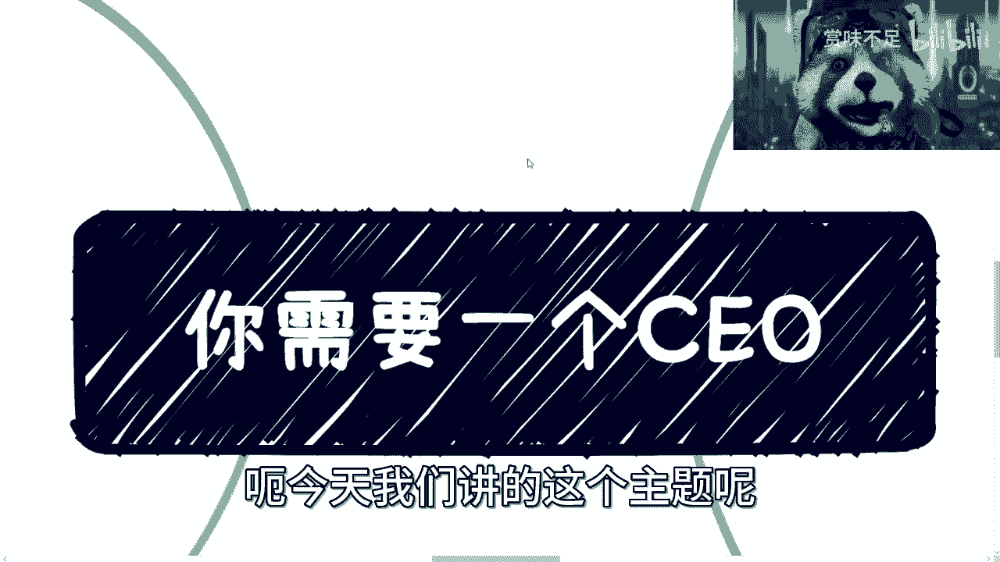

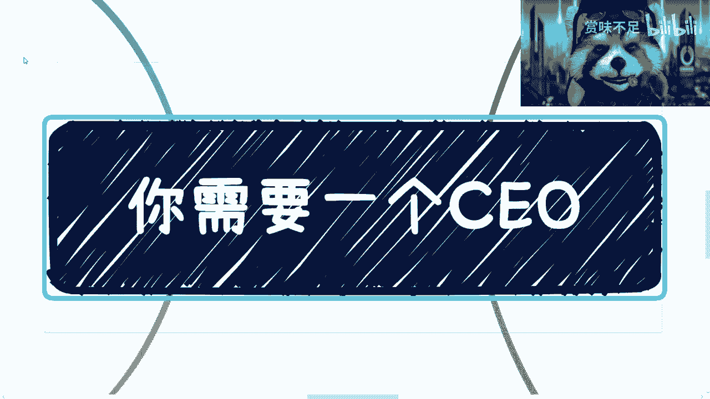

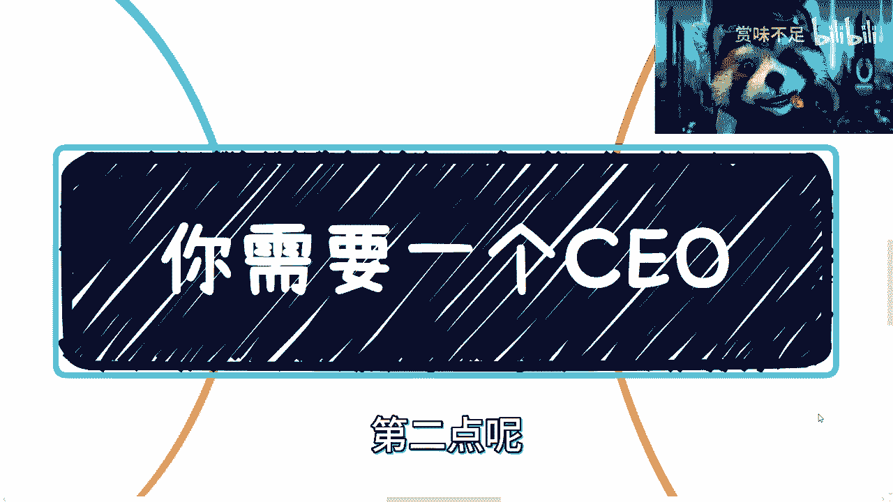

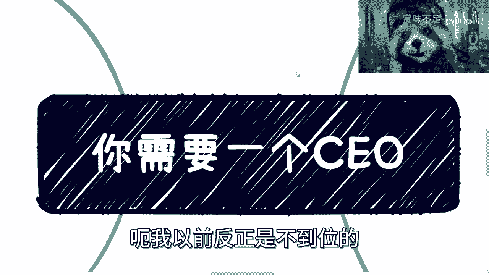

在本节课中，我们将探讨一个核心观点：无论是个人项目、副业还是初创企业，你都需要一个“CEO”角色。我们将分析传统认知的误区，并阐述CEO的真正定位与价值。

---

在深入探讨CEO的角色之前，我们先通过几个故事来理解一些常见的思维误区。这些误区往往阻碍我们做出正确的商业决策。

以下是三个关键的故事与启示：

**故事一：价值判断与选择权**
有人私信询问服务价值，并要求提供简历以作判断。回复的核心是：价值是主观的，选择权在对方。对于提供方而言，在合理范围内有权保护隐私和设定门槛。关键在于，双方应在对等的条件下进行价值交换。

**故事二：“做事漂亮又听话”的陷阱**
领导确实喜欢“做事漂亮又听话”的员工。但问题在于，具备这种特质的人很多，可替代性强。真正的关键在于你能否进入核心圈层，与领导建立深度关系或拥有不可替代的独特价值。仅用“打工思维”思考职业发展，路径会非常有限。

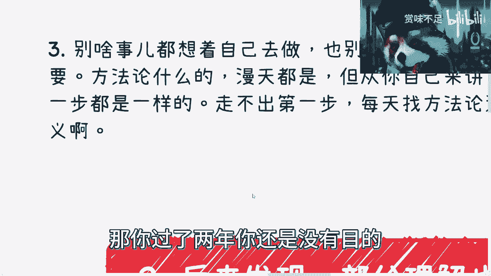

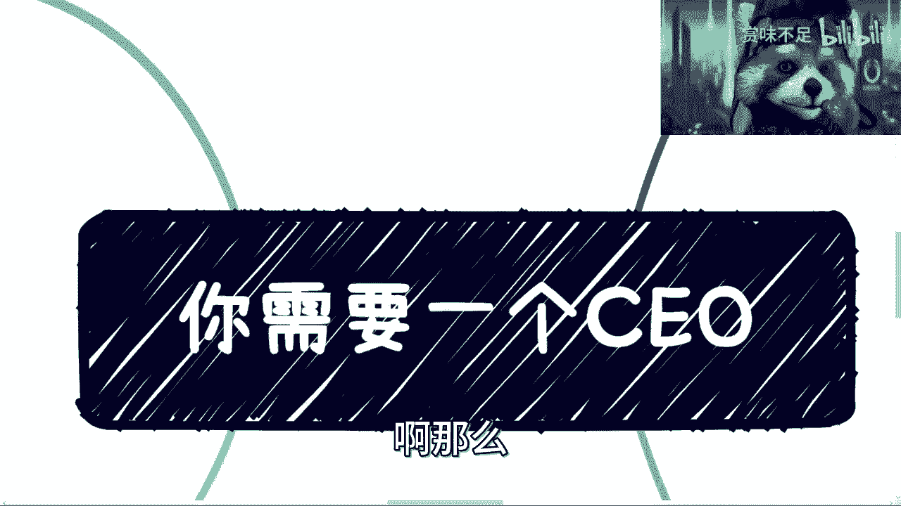

**故事三：行动优于空想方法论**
很多人热衷于寻找完美的社交或创业方法论，却因“没有明确目的”或“关系不对等”而迟迟不行动。然而，所有人的第一步都是在摸索中开始的。等待一个“完美开局”或指望通过高价课程跳过积累阶段，是不现实的。**行动本身比空想方法论更有价值**。

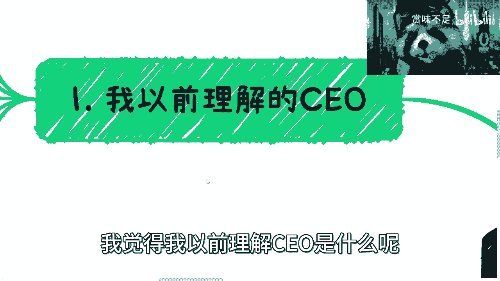

---

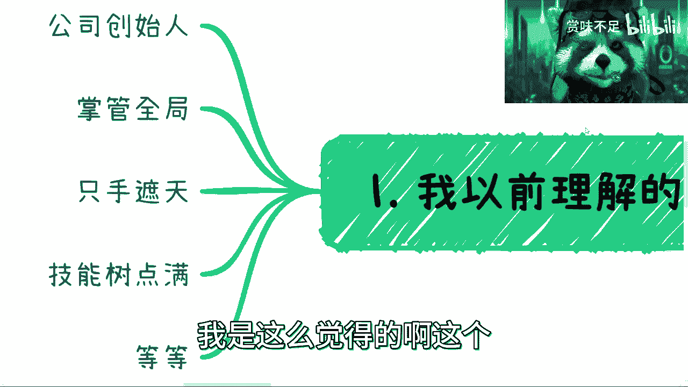

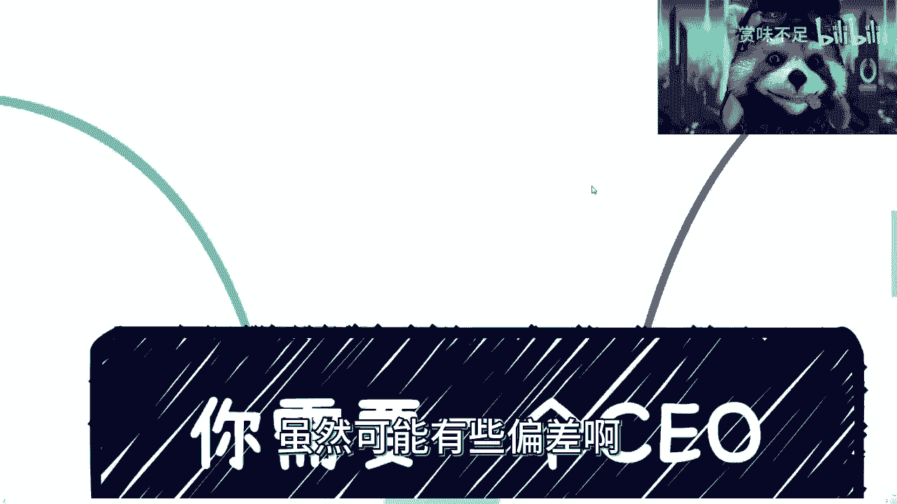

上一节我们分析了几个常见的思维误区，本节中我们来看看对CEO角色的传统理解存在哪些偏差。

我对CEO的传统理解是：**创始人、全局掌控者、最终决策者**。他创建团队、挖掘业务、建立核心竞争力与护城河。其他高管（CXO）都是在为CEO工作。

这种理解部分正确，但并未触及CEO的本质。实际上，许多成功的公司都会“空降”CEO，因为一个优秀的CEO非常稀缺，并非花钱就一定能请到。

---

理解了传统认知的局限后，本节我们将详细拆解一个真正CEO的核心职能与特质。

一个真正的CEO，尤其是空降CEO，需要具备以下多重角色和特质：

**1. 公司的对外门面**
CEO是公司的形象代表。其外貌、言行举止、阅历都需要展现出公司的专业与高度。这正是许多技术型或策略型创始人团队需要空降CEO的原因——他们可能精于幕后，却不擅长台前的形象经营。

**2. 高级战略商务**
CEO是一个“高级商务”，核心工作是维护战略级合作关系和高端人脉网络。他参与的是酒会、游艇会、闭门会议等场合，目的在于维护关系，而非直接洽谈具体业务细节。具体业务应由专门的商务负责人处理。

**3. 高情商与察言观色**
CEO未必需要精通所有业务，但**情商必须高**。他必须懂得在什么场合、见什么人、说什么话、穿什么衣服。这是一种关键的软实力。

**4. 光鲜的履历与背书**
CEO需要各种头衔和行业背书，无论其获取途径如何（需合法合规）。这些“标签”是建立信任、敲开大门的敲门砖。

**5. 清晰的商业思维**
CEO需要有超越团队成员的商业视野和思维，能为团队指明战略方向。他不能只是一个纯粹的“工具人”，即使没有股份，也应在战略层面拥有重要话语权。

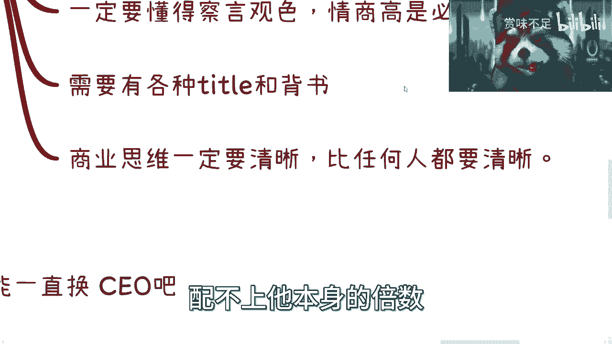

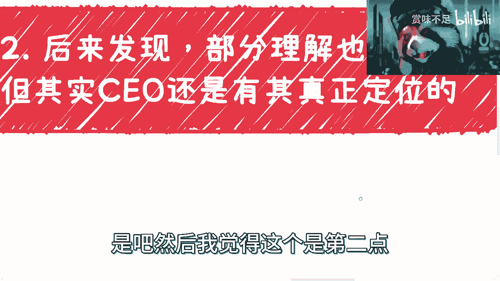

**CEO与公司是双向背书的关系**：`公司价值 = CEO的背书 × 公司的平台`。一个优秀的CEO会选择能提升自身价值的平台，反之亦然。这不仅仅是钱的问题。

---

认识到CEO的职能后，我们需要了解在实际中如何应用这一角色，尤其是在资源有限的情况下。

对于项目和副业而言，你同样需要一个承担CEO职能的角色。以下是关键考量点：

**1. 角色适配与谨慎选择**
对于公司，选择CEO需百里挑一。双方在公司战略、三观、赚钱方式上必须高度一致，并建立深厚的信任。对于个人项目，你需要的是一个**高情商、擅长对外社交的合作伙伴**。

**2. 承认自身局限，寻求互补**
不要试图自己擅长所有事。如果你不擅长社交，那就需要找到一个擅长社交的合作伙伴。就像业务增长后，创始人可能需要专人来处理客户关系或日常运营一样。**团队的意义在于能力互补**。

**3. 区分“画饼”的对象**
优秀的CEO和团队，对外“画饼”（描绘愿景）以获取资源，对内务实以创造利润。糟糕的团队则内外不分，对自己人也空谈幻想，最终无法创造实际价值。

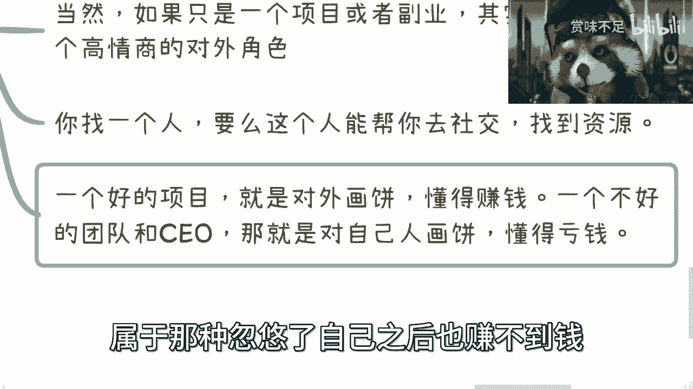

---

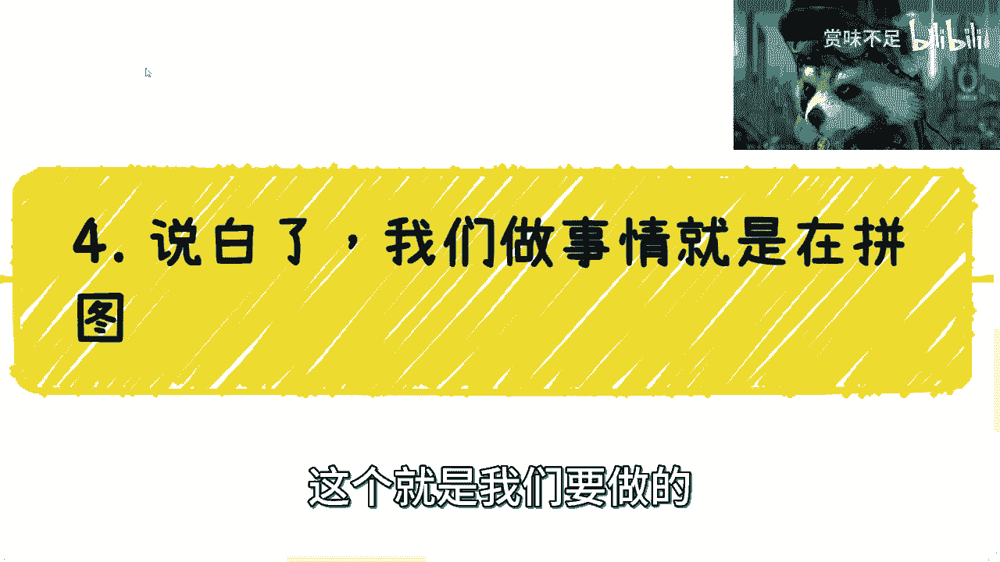

那么，作为普通人，我们具体应该怎么做呢？本节将给出行动框架。

我们的核心行动应该是：**持续探索未知领域（战争迷雾），并像拼图一样整合资源与人脉**。

以下是具体的行动指南：

**1. 接受现实，放弃成为“全能精英”**
承认自己是普通人，不要幻想成为面面俱到的“精英怪”。个人能做的事情有限，天花板明显。

**2. 关注“单位时间价值”**
做一件事“行不行”，答案不是二元的。关键在于**投入产出比**。积累人脉和探索模式，是为了让你在付出相同时间的情况下，赚得更多。这是“赚10万”和“赚100万”的区别。

**3. 主动积累，反向思考**
不要在需要时才审视自己“一无所有”。正确的顺序是：
*   **早期（如学生时代）**：主动积累人脉与关系，而非抱怨。
*   **后期（开始事业）**：根据已有的人脉“拼图”，思考谁能填补哪个位置，从而规划赚钱路径。

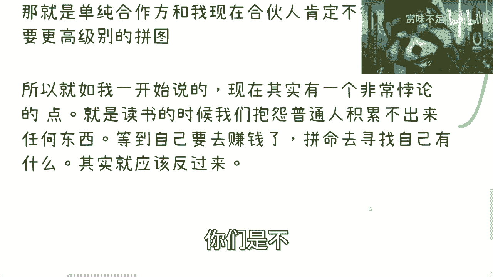

**4. 通过社交获取不对称信息**
人脉不仅带来关系，更带来**你原本不知道的信息**。你无法赚到认知以外的钱。通过不断结识新朋友、筛选和验证信息，才能发现机会。找到合适的人，让他去执行他擅长的事。

**5. 成为关键“连接器”**
如同课程作者举例，他利用自己的抬头与人脉，为研究院和市场需求方牵线搭桥，从中赚取佣金。成功的核心在于：**精准理解双方的互补需求**，进行有效匹配，而不是“乱点鸳鸯谱”。

---

本节课中，我们一起学习了“为什么需要一个CEO”这一主题。我们首先纠正了三个常见的思维误区，然后打破了CEO必须是创始人的传统观念，详细阐述了一个真正CEO的五大核心职能。最后，我们落脚到实际行动，指出个人发展的核心是**探索与拼图**，即主动积累人脉、获取信息、整合资源，并通过互补合作突破个人极限。

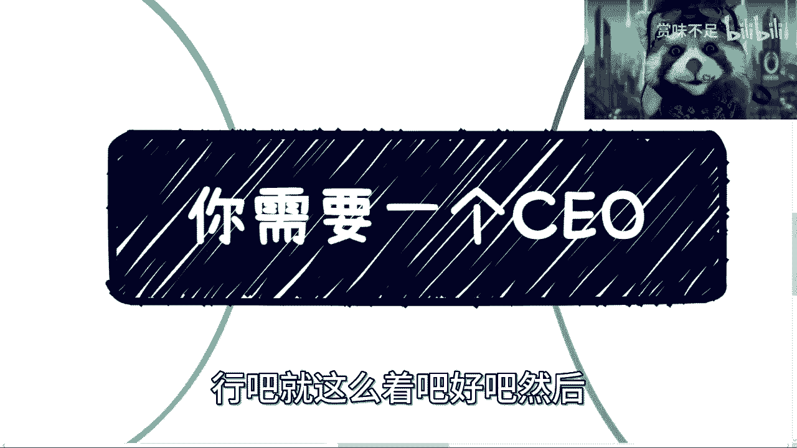

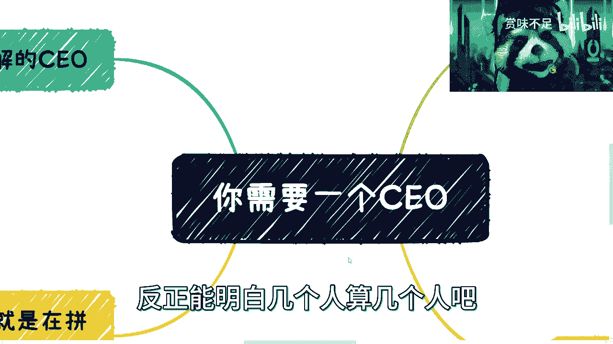

记住，**CEO是一种功能，而非一个固定的职位**。无论规模大小，让你的项目或团队具备这种“对外连接、战略规划、形象管理”的功能，是走向成功的关键一步。