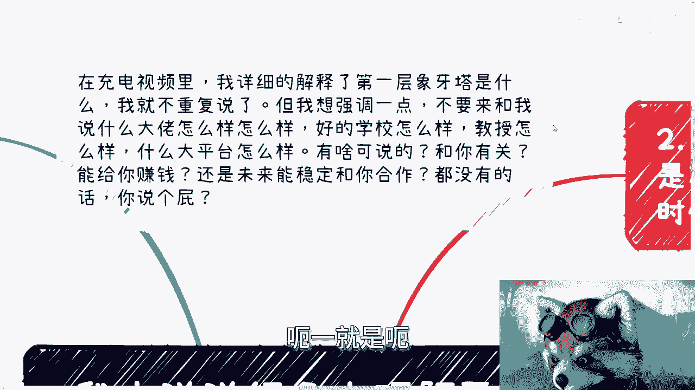
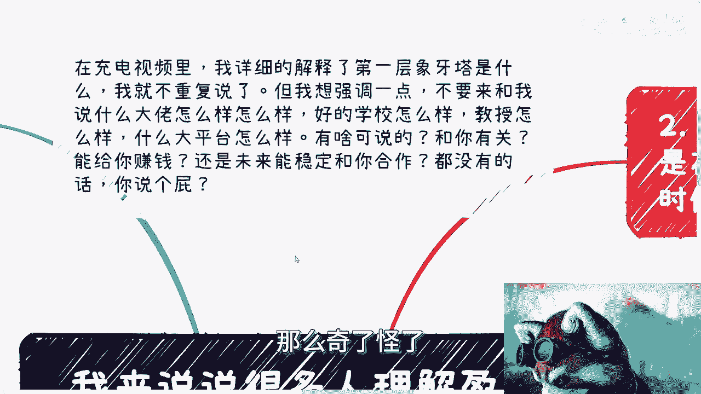
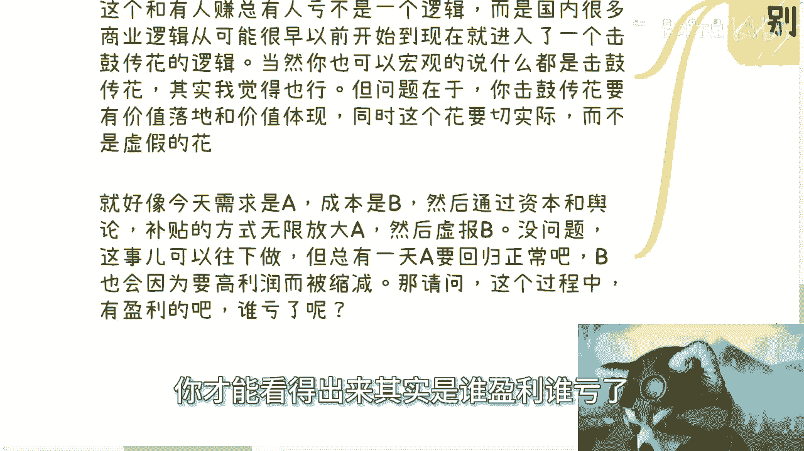

# 你真的理解盈利这个事儿么 - P1 - 赏味不足 - BV1FJ4m1s74P

好现在是凌晨12：20分呃，今天是真的晚了，但是该做的还是要做的啊。

首先第一件事情就是杭州活动继续报名好吧，本周日25号在杭州上城区呃，下午差不多01：30到05：30左右吧，啊呃诶我把这个这个弄一下啊，对好吧，然后呃反正是白报名的，反正私信我啊。

然后第二点呢就是在这个充电视频里啊，我详细的解释了第一层象牙塔是什么，我在这里我就不重复解释了，但是我想强调一点，不要来和我说什么大佬，也就是呃好像是北京好的。

比背景不好的，怎么样怎么样对吧，好的学校一定怎么样，教授怎么样，什么大平台怎么样，没什么可说的啊，你要我讲，就是你跟我讲这些，我就问你跟你有什么关系，能给你赚钱吗啊，能不能稳定的跟你合作。

能不能跟你有绑定关系，如果没有，你说个屁对吧，你在你如果在公开的，在你可以自己去选择这些，你不要去影响别人去选择这些，大家都有自己的选择权对吧，你你永远跟我说什么，哎呀好的学校比差的学校。

好的学校资源比差的学校资源好，然后呢这些都是屁话，有什么好说的呢，好不好跟我们有什么关系啊，再说你怎么体型好不好，你跟我说哪里好了，那么奇了怪了好。

那么今天这个主题啊。

今天这个主题啊，说很多人理解的这个盈利这件事情。

首先第一点就是第一层像塔里的人。

对这个盈利呢他非常模糊呃，为什么模糊很简单，因为第一层象牙塔里的人，他根本就没有在赚钱啊，因为在第一层下阳台里面，不管你是打工也好还是创业也好，你打工是在为了温饱，创业也是相当于是无头苍蝇。

没有就是呃没有规划的去做一些事情，那就如我一开始说的，请问这些事情跟自己有什么关系呢，几乎没有，那我可以这么说，大部分人脱离了公司，有什么，你什么都没有，而且你能够指望你不脱离公司吗，不好意思。

这不是你能控制的啊，那么我之前就说过，打工是不能赚钱的，打工就是打工，为什么，因为无论你什么工种，你都不会关注关心全局，你不会了解上下游，你也不会了解需求是什么，你也不会了解局势是什么，为什么。

因为你了解跟不了解，你每个月都能拿到工资，你为什么会去了解呢，那很多人要说，那陈老师这个话不是这么讲的啊，我还是每天关注八卦对吧，看什么新闻，看什么东西的，我跟你讲，不要逼逼，没有用的。

人性就是这样子的，你不要来跟我讲，你会不会关心你跟他没有利益关系，你就不会关心，就这句话，我在视频里面讲的很清楚，第一层象牙塔里面的人，不会有直接的利益关系啊，你就算有。

也是别人给你的诗的利益关系有什么用啊，你关心个屁，所以很多人呢，一开始很多人就开始幻想所谓的盈利，你想想看什么叫盈利啊，盈利就是你要赚钱好，那什么叫赚钱，那就是去掉你的成本，好问起来什么是成本。

哪些是你的成本都是模糊的，你你你所有的概念都是模糊的，你谈什么盈利呢，啊谈什么赚钱呢，你这就好像大家说哎呀，陈老师除了工作我还能干什么，那本质问题是在于，你不知道社会和这个国家的盈利模式还有哪些，对吧。

你就如我之前视频里说的，怎么了呢，工作难道在工作以外没有人赚钱了哦，难道在工作以外，外面人都赚钱种田去了，还是都饿死了，没有啊，那怎么说呢，还是说外面赚到钱的都不是普通人，都是关系户。

没这个说法的呀，啊然后第二点。

很多人以为自己在赚钱，但其实在赌博，而且这种赌博也只能发生在发生在年轻时候，就是当然啊，你打工赚钱看看hr的脸色，你出去找工作，也去看这个平台和你面试的这个概率，好就好不好就不好，这就是赌博。

我还是那句话，你别把别把自己太当个人，你也别太把自己当不当一个人啊，就是自己到底在社会当中，在整个全球当中什么角色，你你定位清楚啊，不要搞得好像就蛮沾沾自喜对吧，洋洋得意没有用的，有什么好洋洋得意的。

我跟你讲，古话说，30年河东，30年河西就当下这个社会不需要30年，3年就河东河西了啊，你你现在无论过得怎么样，你3年后你再看看，你别来跟我讲，你说2×20，我没有别的选择，我跟你讲，那是你的事。

不是每个人都有选择的，第一不是每个人都有选择的，第二就是说每个人管好自己，选择自己啊，认清事实就可以了，然后我也是刚刚一开始也说了，我说你在第一层象牙塔里面，你创业也叫赌博，为什么。

因为你在第一层象牙塔里的创业，其实根本就不叫创业，叫莽啊，它叫莽，它叫赌，因为你对整个外面的世界的了解，几乎是0%，你的窥视就像我昨天视频里面写的，你窥视这个世界用的是什么，用的是一个短视频。

用的是网络，那么你窥视到的那个内容和数据甚至都是假的，那毫无逻辑性，有什么意义呢，你所有的东西依据，全部建立在一套虚假的东西上面，有什么用，你这不是赌是什么啊，然后我们比如说啊。

你说做一些小的业务能赚到一点外快，我就跟你这么讲，我不管你赚不赚得到钱，只要你关系链不积累，这种都是短期的啊，你在公司里面做工具人也好，你和你在商业上做工具人也好，他是一样的。

不是说你今天啊我你跟陈你说阿陈老师，我今天没有伤，没有劳务合同啊，我在外面赚到一点钱，这叫不叫商业，不叫为什么，因为你但凡自己没有积累下来关系，连你但凡对全局来龙去脉，这个项目为什么要做这个项目。

做的是图什么对吧，目的是什么，钱哪里来的，你一律来龙去脉，不知道你跟打工，你跟一个工具人有什么区别，你只是换一个地方打工，而且你要明白，这些赌博也只会发生在你年轻的时候，因为等到你30~35左右。

你连这种赌博机会都没有，为什么，还是那句话，人太多了，就是人太多了，如果人没有这么多，可能大家还有机会啊。

好第三利润，这个东西啊你要需要做出综合的考量。

包括时间周期，包括你的付出，你看啊，虽然我们可以说你可以简单的去通过收入，减掉你的成本来算出你的利润，但是正常的商业思维，你是一开始就要去思考你的投入时间，你的精力，再加上其他硬成本，他才是真正的成本。

包括税收对吧，什么意思啊，我们来往下看啊，嗯所以说其实你在你会发现，真正做业务的很多的公司也好，人也好，很少会出现那种从零开始做的业务，比如说啊我手上有一套软件，比如说我有一套课程，比如说我有一套方案。

我会去接的业务，一定是我简单改一下，改吧改吧，就能去接的业务，剩下业务我就不做，为什么，因为我不会从零去做，从零去做，对我来讲成本太高，不是说我赚不到这个钱，我不想赚这个钱哦，所以说你会发现。

除非是什么，除非就是说万不得已，一般不会有人这么做的，正常的商业逻辑不会这么做的啊，那么再比如你，你说啊，你硬成本，那我打错了，你硬成本团队啊，外包啊，假设你的硬硬成本是30万，你的收入是100万。

但你会发现，如果你要去盯着团队，你又要review就审核对吧，你要来回跑客户，又要出差对吧，还要ABCDEFG啊，那么你可能整个时间周期还很差，嗯对吧，那么你看啊，虽然你是赚钱的。

但从你投入的精力和时间来讲，那我们就说啊，你得把你的精力跟你的时间，跟你的周期全部算进去，我打错了，这不是很差，我刚就在想嘛，很差是什么东西，嗯不是很长啊，我就纠正一下。

纠正一下很长啊啊就是说你可能服务，比如说啊来回跑客户啊，比如说审核盯着团队，你可能一做就得怎么盯，四五个月吧，五六个月这种啊，那么你会发现你你的成本其实很高，你等于不赚，甚至还是亏的。

那么你你整个周期就更别说了对吧，你比如说经济周期，那个付款周期就更别说了，合同拖欠款项那叫日常，你但凡去做你就知道了，你不做也可以，你去问点人就知道了，无论企业还是政府，这都是日常呃。

那这就更不能用简单的数学来定义利润了对吧，你就像这份，比如说这份合同200万，我告诉你一年后给你好，然后发现两年后给你，那我就问吧，这200万利润怎么算啊，能简单这么算吗，所以你要明白所谓浮盈。

浮盈就是你写在东西上面，但是你没有拿到口袋里，你浮盈，这不叫影啊啊好，那么第四点是什么，就是在同一个层面上面，你盈利了，不代表别人盈利了啊，或者你看到现象上表现上盈利了。

他不代表盈利，什么意思啊，一个企业盈利了一个模式盈利了，怎么了，是不是里面所有的人都盈利了，这就好像我们很多时候沟通的时候，很多人会问我，他说为什么一个业务不盈利，或者看似不盈利，他非要做，我给你讲。

那简单啊，你盈利不盈利是从什么角度来看的，就是我们随便打个比方，你这个业务里面有创始团队，有它的供应链，有政府对吧，有投资人，有下面的打工人，有高管，有股东，那么我就问你任何一个业务。

上上下下这么多关系，怎么了哦，你说的盈利是指所有人都盈利吗，你说的不盈利是指所有人都亏吗，不是吧啊你最上面的布局的人肯定是赚钱的，那当然啊，我不能说百分之百分之99。9，但凡是个聪明人，他都赚钱。

但是我就跟你讲这个一个产品，它落地之后卖的怎么样，运营的怎么样，投资的怎么样，接盘的怎么样，谁赚的多，谁赚的少，谁亏钱啊，你想想看有这么简单吗，或者说有这么一刀切吗，对吧，你说这个和有人赚。

总和总有人亏，我跟你讲，他不是一个逻辑啊，他不是一个逻辑，你仔细想想看啊，你比如说你说国内很多商业逻辑，我就告诉你啊，从很早之前开始，他就进入了一个击鼓传花的状态，当然你也可以宏观的跟我说。

他你说陈老师其实很多东西什么都记不传话，对我觉得这句话是对的，但是问题就在于什么，问题在于你几乎传话本身没有问题，问题是在于你击鼓传花要有价值落地，你今天哪怕我哪怕大家都亏钱。

大家到最后就是就是就是发现哎呀，这个东西都没赚到钱，但是他只要有价值体现，有价值落地，我觉得也是可以的啊，同时就是说这个花要切实际，而不是一朵虚假的花，OK我们来举个例子，就好像今天我我我给你打个比方。

比如说今天需求是A啊，需求是A啊，好成本是B啊，然后通过资本跟舆论以及国家补贴的方式，来无限放大这个需求，也就是说这个需求有没有有的，但是没那么大啊，然后成本再去施暴，我跟你讲，你去套真的做过的人。

你们马上就能明白我讲的是什么，你去套对吧，没问题啊，我跟你讲这个事可以往下做，而且现在很多东西都是这么做的，但是你有没有想过一个问题，很快一两年两三年后，总有一天需求要回归正常吧。

因为你当时就是无限再通过钱，通过砸钱，通过一些舆论来放大A，那但是这个效果总有一天回归正常吧，同样的你虚报B你成本越高，利润越低，那么你终有一天会因为要高利润而去缩减比，那我就请问啊。

我就请问在这个过程当中有没有盈利的，有吧，有没有亏的也有吧，有没有小盈利的也有吧，哪些人营业呢，哪些人亏了呢，你们想这个问题的时候，如果从一个节点去想，永远想不清楚的看这种问题。

你一定要把它按照整个时间周期去看，你懂吗，就比如说比如说啊，今天这个需求放大是2000年被放大的，成本虚报，也是2000年被虚报的，那么你去看待这个问题的时候，你就要从整个周期去看，就是从2000年。

比如说这个项目做了3年，做了5年啊，然后说哦哦开开始削减成本了啊，开始说需求降低了，好比如说到2005年是这样子的，那么你就要从2000年到2005年去看，这5年的情况，你才能看得出来其实是谁盈利。

谁亏了，所以说一样的道理你知道吗。

就是嗯就是我不知道啊，我不知道你们从刚刚的所有的这些内容里面，能理解多少啊，这就像很多人问我就说呃，看视频跟看书有没有用，就是就是我觉得在我的能力范围内，就是在我的就是当下的这种网络的能力范围内。

我已经能讲得够透彻了，但是你们能理解多少，这就你们理解了好吧，所以说我综合想表达的是什么呢，就是不要去想，不要去意淫，不要去YY那些东西，很多东西就是不了解他不了解就是不了解，不要用空话去套自己啊。

然后盈利这个东西也没有这么简单去计算的，好吧好行，就这么着，那个杭州报名的好吧，礼拜六礼拜天，礼拜天报名的，你们继续报名呃，然后就是商业啊，职业啊，然后什么嗯商业计划书啊。

然后其他东西反正要这个有问题的，或者总体要聊的。

反正你们在在私信。