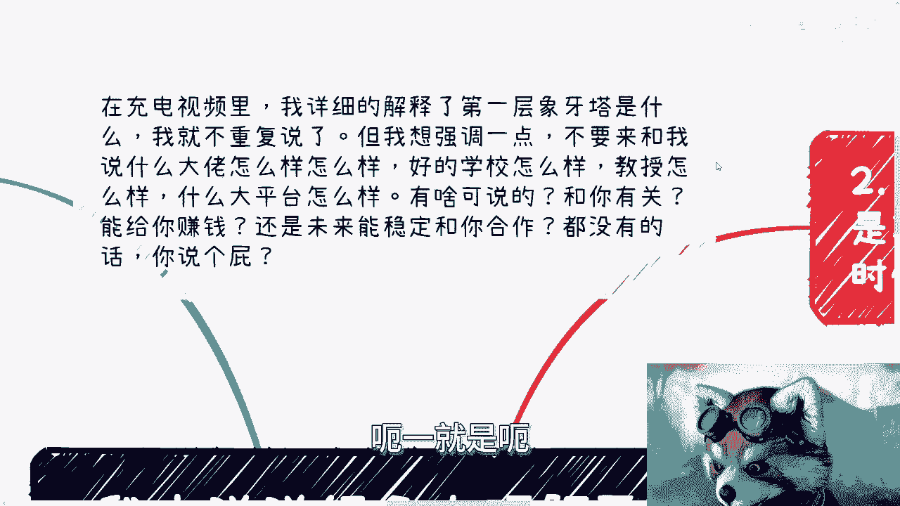
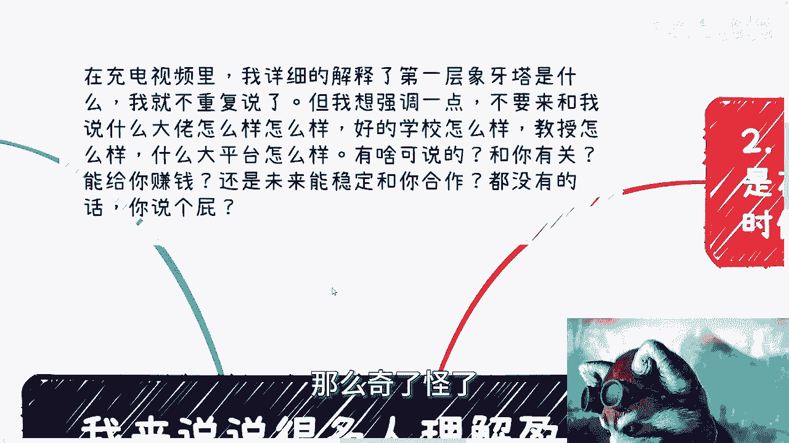
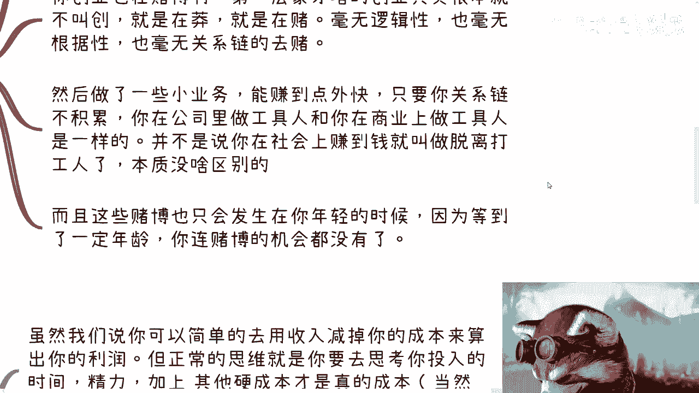

# 你真的理解盈利吗？ - 课程 P1 📊

在本节课中，我们将深入探讨“盈利”这一核心商业概念。许多人对此存在模糊甚至错误的理解。我们将通过剖析几种常见误区，帮助你建立更清晰、更实际的盈利认知框架。



---

## 1. 第一层象牙塔：模糊的盈利概念 🏛️




上一节我们介绍了课程背景，本节中我们来看看第一类人对盈利的模糊理解。


第一层象牙塔里的人对“盈利”概念非常模糊。原因很简单：他们并未真正在赚钱。无论打工还是盲目创业，都只是为了温饱或像无头苍蝇一样行动。这些活动与个人长期发展关联甚微。

大部分人若脱离公司平台，将一无所有。而脱离与否，往往并非个人能完全控制。打工本身不直接等同于赚钱，因为打工者通常不关心业务全局、上下游、真实需求或市场局势。原因在于，无论是否了解这些，每月工资照常发放，因此缺乏深入了解的动力。

人性使然，没有直接利益关联，就不会真正关心。在第一层象牙塔中，人与核心利益通常是隔离的。因此，当谈论“盈利”时，他们对成本、收入等基本概念都是模糊的。

**核心公式**：
```
模糊的盈利概念 = 不清晰的收入 - 不明确的成本
```

这种模糊认知导致无法有效谈论赚钱。本质问题在于，不了解社会和国家运行中除工作外还有哪些盈利模式。工作之外，依然有很多普通人通过不同方式获得收益。

---


## 2. 第二层误解：将赌博误认为盈利 🎲

在理解了概念的模糊性后，我们来看看另一种常见误区：将高风险行为误认为是可持续的盈利。

许多人以为自己正在赚钱，实则是在进行一场“赌博”，且这种机会通常只存在于年轻时。

*   **打工中的赌博**：求职时看HR脸色、依赖平台好坏、面试成败，这些都具有不确定性，形同赌博。
*   **盲目创业的赌博**：处于第一层象牙塔中的“创业”，实质是缺乏认知的“莽撞”或“赌博”。其对真实世界的了解近乎于零，依据的信息（如短视频、网络内容）可能虚假或片面。基于虚假信息做出的决策，风险极高。
*   **无积累的“外快”**：即使通过一些小业务赚到钱，只要没有积累下可持续的**关系链**，且对项目的全局（目的、资金来源、来龙去脉）一无所知，那与“换一个地方打工”无异。这并非真正的商业。

需要认清的现实是，随着年纪增长（如30-35岁后），社会竞争加剧（“人太多了”），连这种“赌博”式的机会也会大幅减少。

---

## 3. 第三层分析：利润需要综合考量 ⚖️



认识到误区后，我们来学习如何正确地评估利润。利润并非简单的数字相减。


虽然基础公式是 **`利润 = 收入 - 成本`**，但成熟的商业思维在项目开始前就会进行综合考量。真正的成本远不止账面支出。

以下是需要纳入考量的关键因素：

*   **时间成本**：投入该项目所花费的时间。
*   **精力成本**：为该项目耗费的心力和管理投入。
*   **硬性成本**：如团队薪资、外包费用、物料采购等。
*   **周期成本**：项目执行和回款周期长短带来的资金占用和机会成本。
*   **风险成本**：如客户拖欠款项（在企业或政府合作中很常见）。

**举例说明**：
假设一个项目收入100万，硬成本30万，表面利润70万。但若你需要花费大量时间审核、出差、维护客户，整个周期长达半年，那么折算你的时间与精力价值后，实际利润可能很低甚至为负。

**核心概念**：
*   **浮盈**：仅存在于合同或账面上，尚未实际到手的利润。**浮盈不等于真正的盈利**。
*   **付款周期**：合同款项延迟支付是常态，这直接影响利润的实际价值和现金流。

因此，利润的计算必须是一个动态、综合的评估过程。

---


## 4. 第四层透视：盈利具有层次性和时间性 🔍

最后，我们要理解盈利的复杂性和相对性。在一个系统中，并非所有人的盈利状态都是一致的。

一个企业或模式在总体上“盈利”，不代表其中的每个个体（创始人、投资人、员工、供应商等）都盈利。反之，一个看似“不盈利”的业务，也可能让某些环节的参与者获利。

理解这个问题需要两个维度：

1.  **层次性**：分析盈利要从不同参与者的视角出发。击鼓传花的游戏中，总有人接盘，也总有人提前退出获利。
2.  **时间性**：必须拉长时间周期来看。短期内补贴扩张、虚报成本可能制造繁荣假象，但长期需求终会回归理性，成本也会被压缩。只有纵观整个周期（例如3-5年），才能看清谁是真正的赢家。

**举例模型**：
*   需求 A 被资本和舆论短期放大。
*   成本 B 在初期被虚报。
*   随着时间的推移，需求A回归常态，成本B被压缩以追求利润。
*   在这个过程中，不同时间点进入和退出的参与者，其盈利状况截然不同。

---

## 总结 📝

本节课中我们一起学习了“盈利”概念的四个关键层面：
1.  处于认知底层时，盈利概念是**模糊**的，源于与核心利益的隔离。
2.  许多所谓的“赚钱”实则是依赖运气和年轻资本的**赌博**，缺乏可持续性。
3.  真实的利润需要**综合考量**时间、精力、周期等隐性成本，而非简单计算。
4.  盈利具有**层次性和时间性**，需从不同参与者和完整周期视角进行辨析。


核心在于：避免空想和意淫，承认自己对不了解领域的无知。盈利是一个复杂系统下的结果，需要深入的认知、持续的积累和综合的评估。


---

**杭州活动报名继续开放**，本周日（25号）下午在上城区举行。活动免费，有意者请私信。


如有关于**商业、职业发展、商业计划书**或其他相关问题，欢迎通过私信进一步交流。