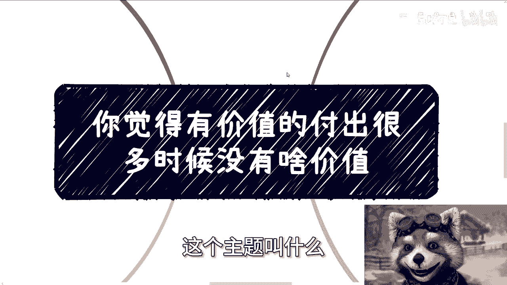
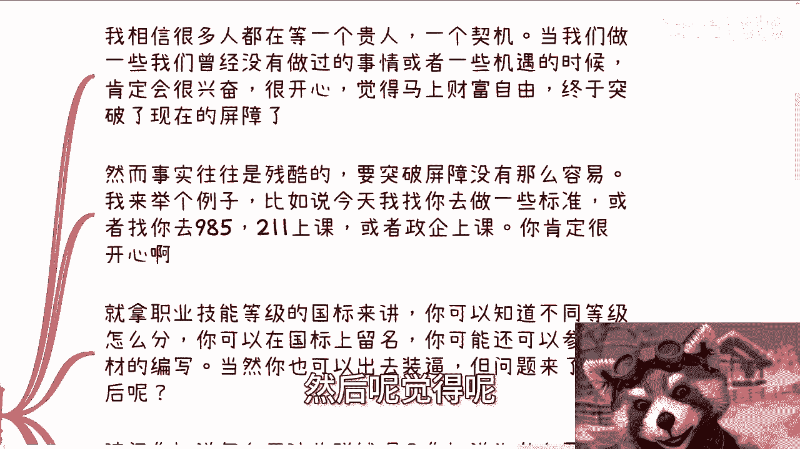
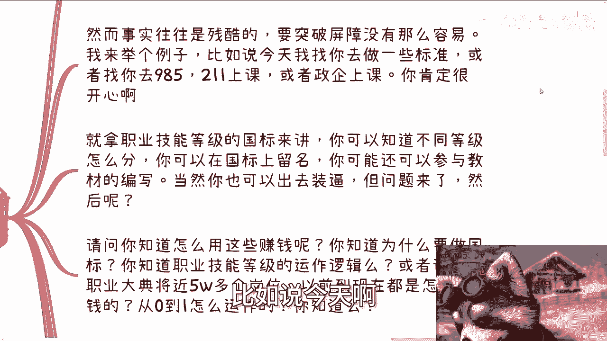
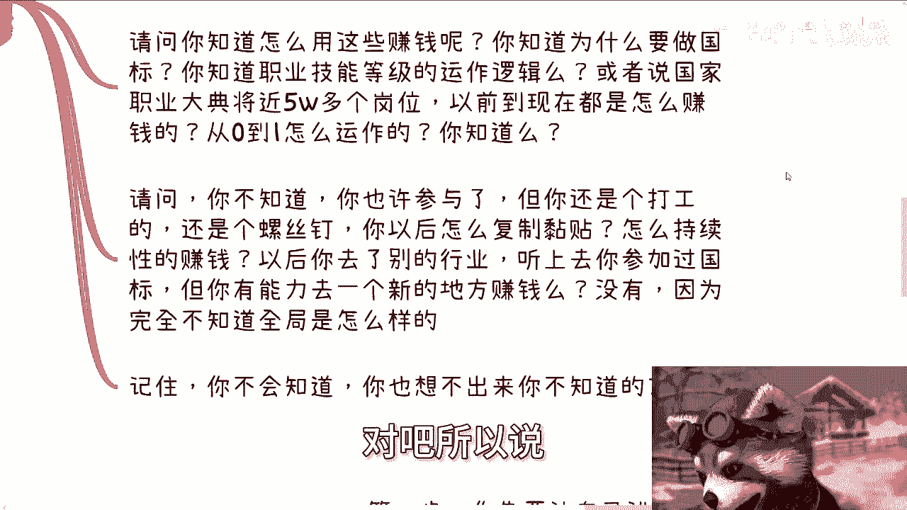
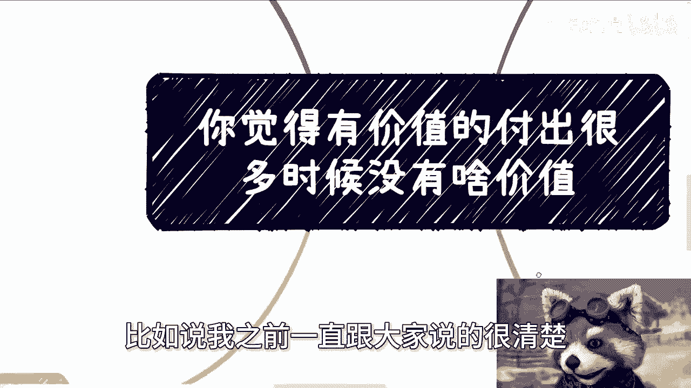
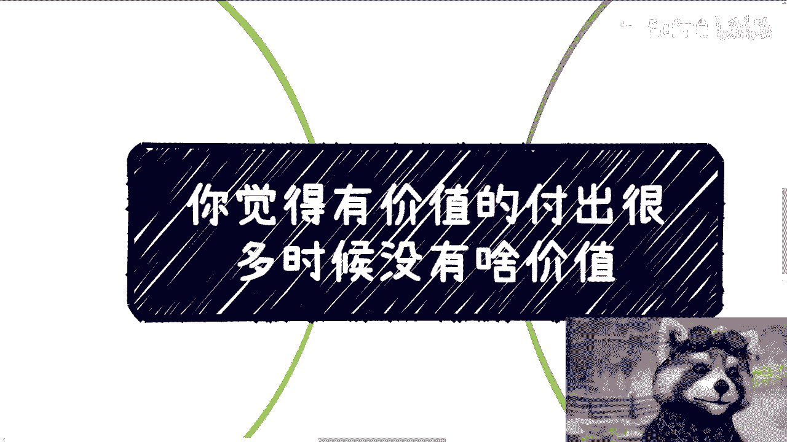

# 你觉得有价值的付出很多时候没啥价值 - P1 - 赏味不足 - BV1KT42117SK

大家好啊，今天这个话题很有趣啊。

真的很有趣啊，这个我建议大家认真听，认真听好，还能认真想想，我跟你们讲啊，这个主题叫什么。

叫做你觉得有价值的付出，很多时候没有啥软价值啊，为什么啊，你仔细看啊。

先说一个前提啊，呃我们的父母跟老师一直告诉我们的价值，也就是大部分人一直觉得有价值，很多时候并没有太多的价值，当然这句话听了可能你们听的也是废话是吧，咱就这么说啊，如果你要在打工的层面。

工具人的层面去卷对吧，你要在干电池的层层面去卷，你说所有的定位，我就是个工具人，我就是个执行层，我就是一个垃圾对吧，那么你认为的价值，你继续去坚持，包括你父母，你老是跟你说的那些价值，你就去坚持。

你不用管我说什么对吧，这不是在我的讨论范围内，你比如说你跟我说，你说我我学很多的技术对吧，我技术要学深了，学术研究我要做深了对吧，技术做深了，或者说去深耕什么经验对吧好，那我告诉你，这随便你。

这就是大部分人认为的传统价值，考公考研就更他妈别说了对吧，就是考公考研价值，甚至没有，你之前说什么深耕什么技术价值来得多对吧好，那这个时候又要来说了，那陈老师按照你说说吧，大家都不要生根。

大家都不要做对吧，大家就没有人没有人研究技术人，那行啊，你要这么说，关我吊事啊，对不对，你要非要从大众的角度，你非要去普普度众生，那是你的事情，我不关心，而且我认为真正所谓的大众。

根本就不可能能学到多多的多么多的技术，也不可能学到多么深的学术，也不可能去深耕什么行业，得到什么就技术上多么大的经验，我不认为他对吧，我们唯一能做的是什么，唯一我们唯一能做的就是融入到这个社会当中。

去寻求真正赚钱的价值对吧，你说价值这个东西在不同层面，不同人群，其定义就会不一样啊，我告诉你们，我说你们不要去，你们不用困扰你们，也不用现在明白，但是你们要明白一点是什么，就是只要是个人。

他不可能去知道或者思考出来，自己不知道的东西，所以别用你们现在已有的认知，或者你父母跟老师灌输给你们的这个判断价值，去判断一些东西，你们判断不出来的，你明白吗，你就像很多人问我对吧，考研考公有没有价值。

我去学一个开发，学一个什么东西，有没有价值，什么价值啊对吧，你我给你，我问你啊，价值怎么判断价值是你得告诉我，你最终能做出来一件什么事情，你才来判断价值，你否则你你跟我说什么叫价值啊对吧。

你今年清华毕业就有价值了，清华北大就有价值了，MIT就有价值了，你不是这样判断事情的啊，如果来说这么判断，那我说不好意思，那你你你跟这种古代的重男轻女思想，有什么想法哦，我生出个女的没有价值。

我生出男的就有价值，那这不吗，对吧啊。

好，那么第二个我们来举个例子，我相信很多人都在等一个贵人，等一个契机，但我告诉你，不好意思，等不到的，没有的，你还不如买福利彩票对吧，那么但是呢我相信每一个人一生当中，总会去做一些呃。

或者说碰到一些事情，然后你碰到这个事情的时候，你肯定会很兴奋啊，很开心啊，然后呢觉得呢我的。

我终于要财富自由了，终于要突破现在的屏障了，终于让我等到了这个机会对吧，然而我告诉你，事实往往是残酷的，为什么呢，我举个例子啊，比如说今天啊我给你们一个机会。

你们可以参加国家的标准，你们可以去98521去上课，你们可以去正起上课或者去咨询，你肯定很开心啊对吧，必然很开心，因为在你们看来，在大众看来，这些事情跟他们现在所做的事情，跟所处的level是不一样的。

那他当然开心嘛，对不对，等一下啊对吧，这是第一个啊，那么问题来了啊，包括你可以出去装逼对吧，那问题来了，我就问，然后呢，然后呢你包括很多人，你知道吗，你咨询有很多人咨询的时候也跟我说，他说陈老师啊。

我们今天找了一个什么教授，找了个什么院士啊，然后找了一个跟某某某这个搭搭上关系了对吧，签了个合同，我说然后呢不是我说你说这些东西没有用啊，然后呢你包括这些就跟我说，这老师我考上清华了。

然后呢唉我就奇了怪了，然后呢对吧，我就请问你知道怎么用这些赚钱吗，你不知道你知道为什么要做国家标准吗，你也不知道，你知道职业技能等级的运作逻辑吗，你更不知道，或者说国家职业大典将近5万多个职业。

以前到现在将近20多年时间，或者说将近20年时间都是怎么赚钱的，从0~1怎么运作的，你知道吗，你不知道你知道个啥对吧，请问你不知道，你也许参与了这个国标的编写，但是你从一个全局角度来讲，你还是个打工的。

你还是个螺丝钉对吧，你以后怎么复制粘贴啊，你以后到别的行业，你怎么执行，赚钱以后你去别的行业，听上去你好像参加过国家标准，但是你有能力去一个新的地方赚钱吗，你没有，因为你完全不知道全局怎么样。

你也完全不知道国家为什么要去做，你也完全不知道这个企业，这个协会为什么要去做，你不知道对吧，所以说记住你不会知道。

你也想不出来你不知道的东西，但是你当时一定会沉浸在对吧。

你一定会沉浸在你的自我沾沾自喜，跟你认为的价值里面，你认为卧槽我写国标有价值，什么价值，我就问什么价值对吧。

那当然我相信从你们的角度，你们参与了国标，你们也通过了，比如说通过我能够给高校，能够给郑启上课，你们一定很开心对吧，我相信的啊，而且有成就感，有钱钱我肯定会给你们，也不可能白嫖你们，对不对，有成就感。

有钱价值感满满，但真的有价值吗，你就如果今天标标题所说的，你认为的价值是一个大局里面的一个点，一个全局里面的一个点，那么这个点我不可否认它有价值，就是你作为一个工人，你作为一个电池，你有价值吗。

有啊但不多有吗，有啊不多对吧，你可以认为很有价值，你也可以一直这么做下去，但从全局来讲，你还是个工具，有什么用呢，而且还是个完全可替换的工具，你告诉我有什么价值啊，有什么价值，你从商业来讲。

你也不知道怎么从0~1，从赚钱来讲，你没有全局的思想跟关系，也没有人脉，也不知道怎么运作，你基本上就是毫无价值，然后从合作伙伴来讲，你也没有合作的价值，因为你啥都不知道啊，都要除了打工，除了干活。

那他们干活，我满地都能干活，为什么找你干活对吧，谁价格低，谁干活就这么简单啊，你们想想啊，你我相信你们现在在做很多，而且在未来如果你们没有这个想法，没有这个思想的话，没有这个意识的话。

我相信你们在现在在未来都会做很多，我刚刚说的这种你们认为会有价值的事情，然后对成长很有帮助的事情，但是对成长真的有帮助吗，这就好像你们一直在做点的事情，永远不会对全局有了解，有什么帮助呢。

对啊，我在这地方再提一点啊，之前还有人问我，他说那陈老师你觉得真正价值是什么，我就这么跟你们讲人类社会对吧。

人类社会价值是什么，最终价值就是金融价值，经济价值，那金融价值，经济价值是什么，是钱财的这个金就是这个金融和经济的流通，就是这个钱本身他的头他得留起来，他得动起来对吧，那我就问就像我们刚刚说的。

那我们就问你今天写国标了，你出去装逼了对吧，你今天能够去98521或者企业去做咨询了，请问钱留下来了吗。

没有啊对吧，我就问你的这个行为，钱留起来了没有钱留起来的，是我帮你接了这个单子，这个单子是让钱流起来的，动起来的，你做这个咨询和培训，你只是个工具人，你没有将钱留起来，所以你没有价值，明白吗啊好了。

那么最后还是这个问题，所有人都要问了。

他说陈老师怎么了解全局对吧，我跟你讲很简单，第一步你得先让自己进入项目，成为工具人，这也是为什么我一直跟你们讲，你们要去社交的一个主要原因对吧，第二步你要有意识，而且要融入自己的默认思维当中。

就是你要不停的去明白你做的是点，而不是面对吧，你不要认为你看到的就是个面对吧，因为你要这么想，你今天去写国标，只要我不说，你可能就会认为这件事情就是个面，就是我写完国标，国家审批。

然后国家就发布人社部公呃，人人社局，但往往这个事情你说就像我们刚刚说的，这他妈就是个点对吧，但是我不说你们会知道吗，你们不知道，因为没有人能知道自己不知道的事情，对不对对吧，所以说你说怎么了解，你了解。

就是说你得有这个全局的思想，你要做任何事情的时候，你都得去告诉自己，我做的就是个点，我得去了解这个面对吧，我跟你们这么说啊，你们在现在未来，你们回想一下，或者过去，我相信很多人做事情。

你们会发现自己有种想法是什么，就是你们可能会觉得啊，比如说对方是政府或者是企业或者是资本家，你们看到某些事情，我随便打个比方，比如说慈善对吧，或者其他的，你们可能会觉得诶。

这个人怎么好像做了个无用的事情，或者这个资本家或者这个企业，好像做了个什么很公益的事情，我告诉你们啊，如果你觉得这件事情不赚钱或者没有什么用，仅仅是因为你了解的不够多，仅仅是因为你格局小。

你看到的不够多，你懂吗，不是因为对方是，你要记住一点，如果来说对方是一个有商业经验，有成功案例啊，已经赚到过钱的人或者机构，他不会去做无用功的，你明白吗，绝对不可能啊，绝对不可能，如果你觉得对方是。

我跟你讲，你先反思一下，有可能那个是你，为什么，因为你了解的不够多，你看到的不够多，你明白吗，对啊，所以就是说你比如说我之前一直跟大家说的。

很清楚对吧，我不算一个彻彻底底的一个资本家对吧，也不算彻底的商人，但是我做事情肯定有我的目的性，如果哪一天啊，如果哪一天我跟你们说，哎我们今天做事情，你们问我陈老师是吧，要不要付费，要不要怎么样。

我跟你说，全他妈免费，我告诉你们只有两种可能性，就两种可能性，第一种就是，我一定有办法把这个免费的东西赚到钱，只不过这钱不一定从你们身上赚，第二种就是我就是个，结束没有中间状态的。

我跟你们讲没有中间状态的对吧，所以我一而再再而三的跟你们讲啊，就是说你们做事情在这个当中，所有的事情只要想赚钱，所有的事情全部用理性来判断，不要有感性的夹杂哦，不要有感性的夹杂，什么什么跟我说什么啊。

我跟这人关系比较好啊，什么那个人嘛有成功案例的，我跟他们合作，这些都是屁话啊，你如果真的要赚钱，所有的链路就非常清楚的，怎么赚啊，现在他有什么怎么赚钱，谁出钱对吧，这个逻辑走不走得通对吧。

你有没有去了解过，有没有去谈过，没有谈过都是屁话，结束。

所以说我们再反过来说啊，你你们现在所认为的那些价值有吗，你促进经济流通了吗，你促进整个钱财的流通了吗，没有啊，你有什么价值，好吧，然后那个那个活动的话，5月5月份的第二周我再来办了好吧。

等劳动节左右我再让大家报名，因为基本上下周到五一都是劳动节，大家肯定都在外面，所以我就不在月底或者年那个月初再去办了，就没必要办了，我在暂时放在5月份第二周好吧，但具体在哪吗，反正我再想想吧。

好那就这么着吧啊我希望你们能真的多想，想明白吧，不要老是跟我谈价值，也不要老是PUA自己说价值没有意义的，好吧行，那就这么着啊，然后职业规划商业规划啊，然后那个股权融资对吧，合同啊。

然后一些商业的呃落地啊，包括你们要是觉得你们手上有什么牌，希望通过我的这个呃视野，或者通过我的一些认知能给给你们呃，这个做一下规划的好吧，你们可以整理好，然后再私信我啊。

