# 课程一：重新审视“价值”的定义 💎

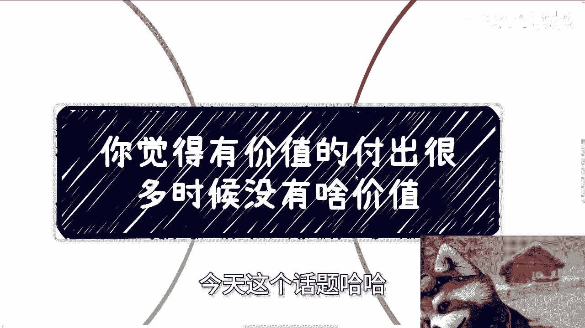

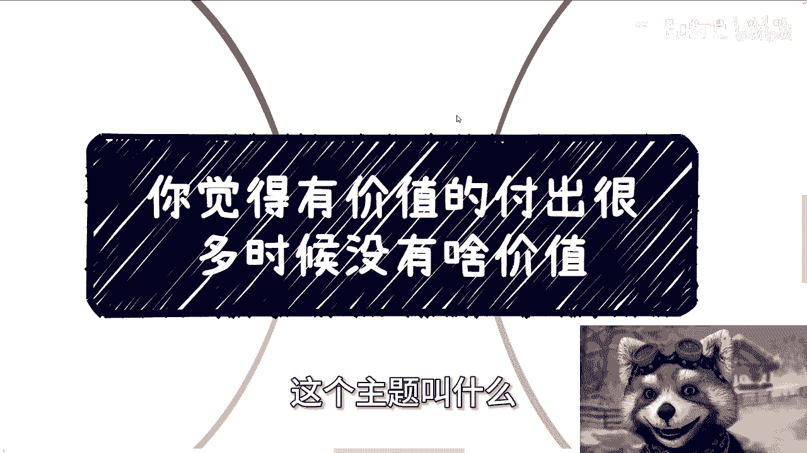

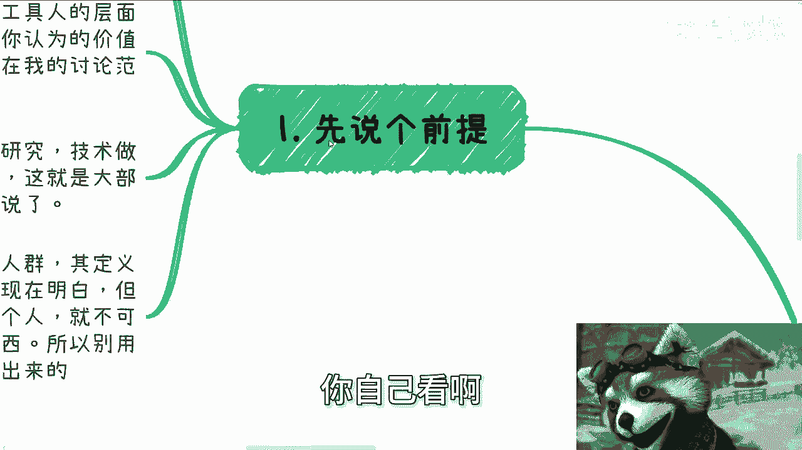

在本节课中，我们将探讨一个核心观点：许多我们自认为有价值的付出，在更宏观的视角下，其实际价值可能非常有限。我们将分析传统价值观念的局限性，并学习如何从商业和经济的角度重新定义“价值”。

## 传统价值观念的局限性

上一节我们介绍了课程主题，本节中我们来看看传统价值观念的问题所在。

父母和老师灌输给我们的价值观念，即大部分人所认同的价值，很多时候并没有太多实际价值。如果你将自己定位为“工具人”或“执行层”，并满足于在此层面内竞争，那么你可以继续坚持这些传统价值观念，例如深耕技术、追求学术深度或积累行业经验。

考研、考公等行为，在传统观念中被赋予极高价值，但其实际价值可能甚至不如深耕某项技术。

需要明确的是，本课程的讨论不面向满足于成为“工具人”的群体。从社会整体角度看，真正能深入研究技术、学术或积累深厚行业经验的人极少。我们更应关注的是如何融入社会，寻求能真正创造经济价值的路径。

“价值”的定义因人群和层面而异。关键在于，一个人无法认知或思考自己完全不了解的事物。因此，不要用现有认知或被灌输的价值判断去评估未知领域，这通常是无效的。

许多人询问考研、考公或学习某项技能是否有价值。判断价值的标准，应是最终能做成一件具体的事。单纯以学历（如清华、MIT毕业）来判断价值，是片面且不合理的。

## “机会”背后的认知陷阱

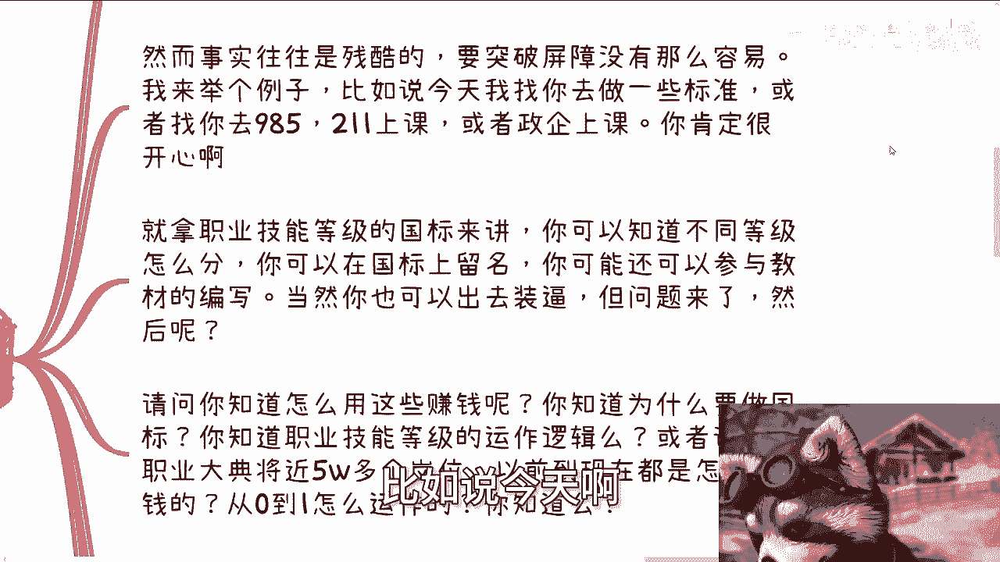

上一节我们讨论了价值判断的误区，本节中我们来看看对“机会”的常见误解。

许多人一生中会等待“贵人”或“契机”，但往往等不到。更常见的情况是，遇到某些事情时会异常兴奋，认为找到了财富自由或突破屏障的机会。

然而，事实往往很残酷。例如，获得参与国家标准制定、为985/211高校或政府机构提供咨询的机会，会让人非常开心，因为这超越了其日常层面。

但核心问题在于：然后呢？许多人会炫耀与教授、院士建立了联系或签订了合同，考上名校，但接下来该如何利用这些资源赚钱？他们并不清楚。

以下是关键问题列表，揭示了认知的局限性：
*   你知道如何利用这些机会赚钱吗？不知道。
*   你知道制定国家标准的深层目的吗？不知道。
*   你了解职业技能等级的运作逻辑吗？不知道。
*   你清楚众多职业在过去几十年里如何从0到1赚钱吗？不知道。

即使参与了国家标准编写，从全局看，你仍然只是一个“螺丝钉”。你不了解全局运作逻辑，不知道国家、协会或企业为何要做这件事，因此无法将经验复制到其他领域去赚钱。

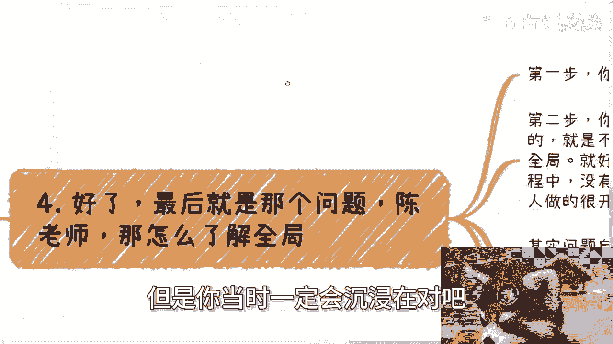

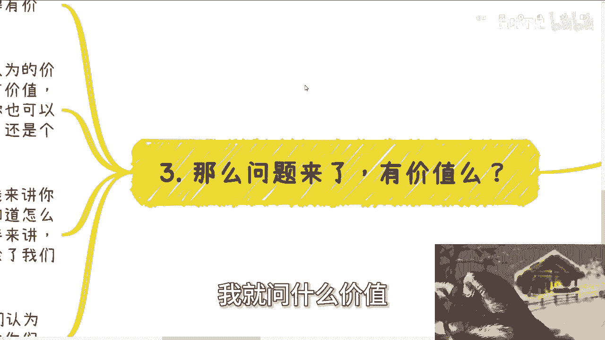

你无法想象自己不知道的事情。当时你只会沉浸在自我满足和自以为的价值中，例如认为“编写国标很有价值”。但从全局商业角度看，如果你不知道如何从0到1运作、没有全局思维和人脉，你的价值就非常有限。

你只是一个可被替换的工具。从合作伙伴角度看，你除了执行具体任务外，没有其他合作价值，因为替代者众多。

许多人现在和未来都会做许多自认为有价值、对成长有帮助的事。但如果只做“点”上的事，而不了解“面”，对真正的成长帮助甚微。

## 价值的本质：经济与金融流通

上一节我们指出了局部工作的局限性，本节中我们来探讨价值的本质。

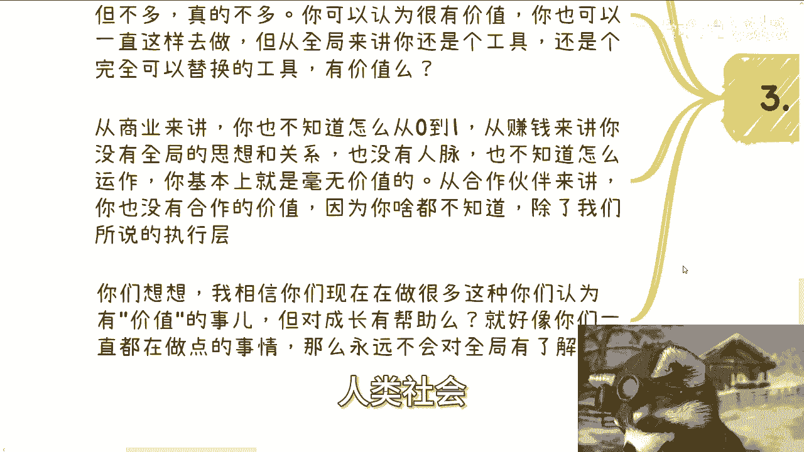

有人问，真正的价值是什么？人类社会的终极价值是金融价值和经济价值，即资金的流动与循环。

那么，之前提到的编写国标、为高校提供咨询等行为，促使资金流动起来了吗？没有。促使资金流动的，是承接这些项目订单的行为。作为咨询或培训的执行者（工具人），你并没有促使资金流动，因此你创造的价值有限。

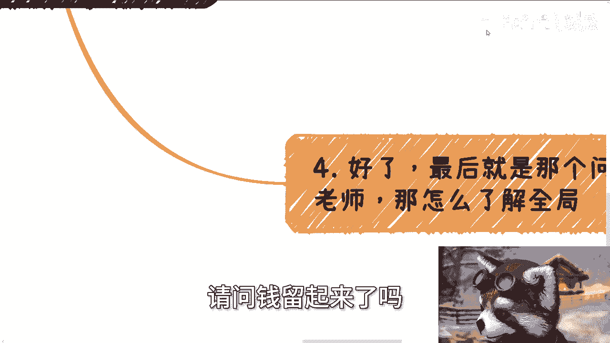

## 如何建立全局观

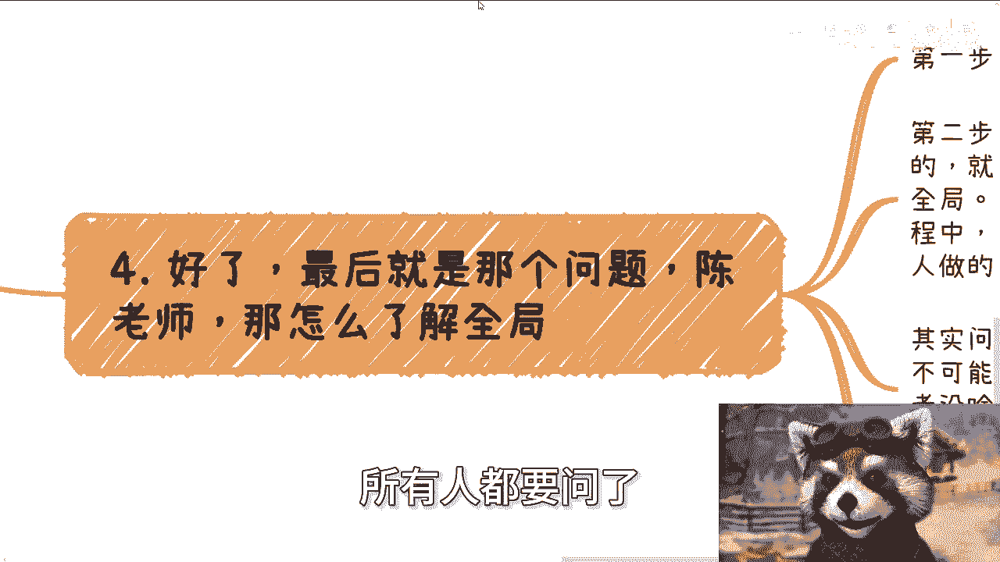

最后，我们来探讨最关键的问题：如何了解全局？

建立全局观需要两步：
1.  **进入项目，成为工具人**：这是起点，也是为什么需要积极社交、参与项目的原因。
2.  **培养全局意识**：必须将一种思维融入本能：你当前做的只是“点”，而非“面”。要时刻提醒自己，并主动去了解背后的“面”。

例如，编写国标这件事，如果不经提醒，你可能认为这就是全部（一个“面”）。但实际上，它只是一个庞大体系中的“点”。你无法知道自己不知道的事情，因此必须有意识地去探寻全局。

在工作和生活中，如果你看到政府、企业或成功人士做某件看似不赚钱或无用的事（例如慈善），认为他们做了无用功，那通常是因为你了解得不够多、格局不够大。

一个拥有商业经验和成功案例的个人或机构，不会做无用功。如果你觉得他们在做无用功，首先应该反思自己是否认知不足。

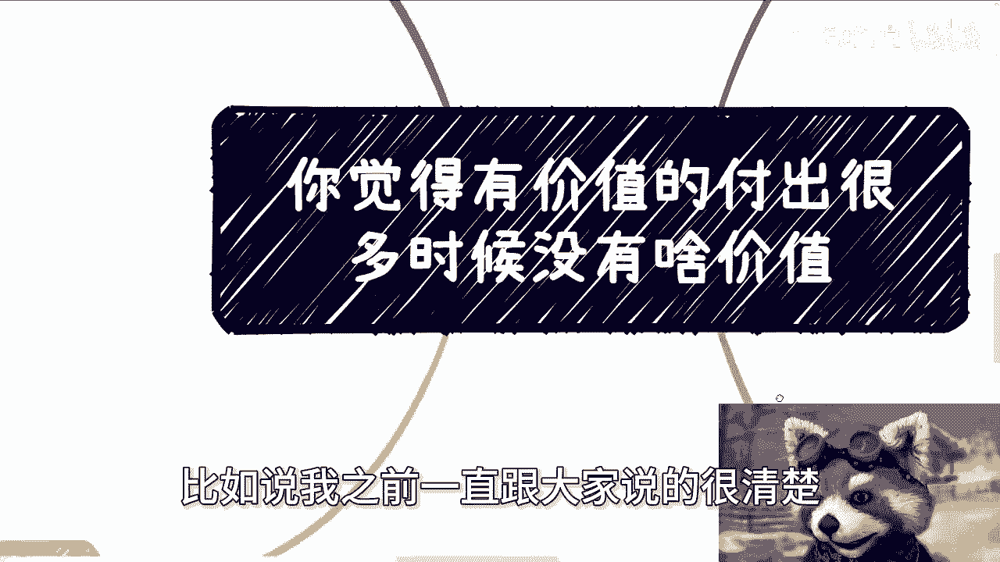

以我自身为例，我做事情有明确的目的性。如果我提供免费服务，只有两种可能：
*   **公式1**：`免费服务 -> 通过其他途径盈利`
*   **公式2**：`我就是个傻子（不存在中间状态）`

在追求盈利的过程中，必须完全理性，杜绝感性干扰。所谓的“关系好”、“对方有成功案例”都不是关键。清晰的盈利链路才是核心：
*   **代码逻辑**：`如何赚钱？ -> 谁出钱？ -> 这个逻辑是否可行？ -> 是否已验证？`
没有验证过的都是空谈。

## 总结与行动建议

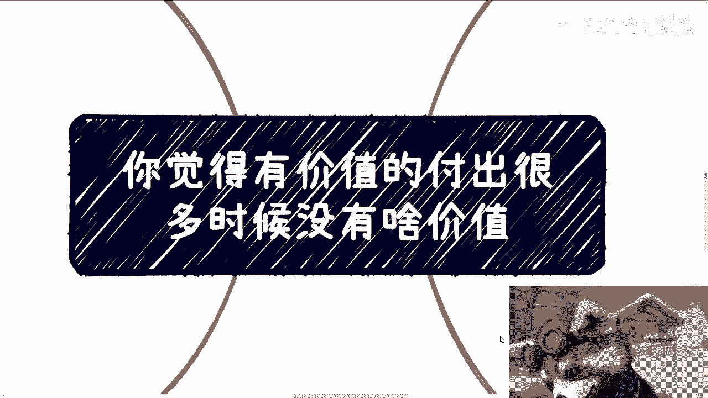

本节课中我们一起学习了如何重新审视“价值”。

回顾一下，你现在认为的那些有价值的事，促进了经济流通吗？促进了资金流动吗？如果没有，它的实际价值就需要打上问号。

希望你能认真思考，不要空谈价值，也不要陷入无意义的自我怀疑。

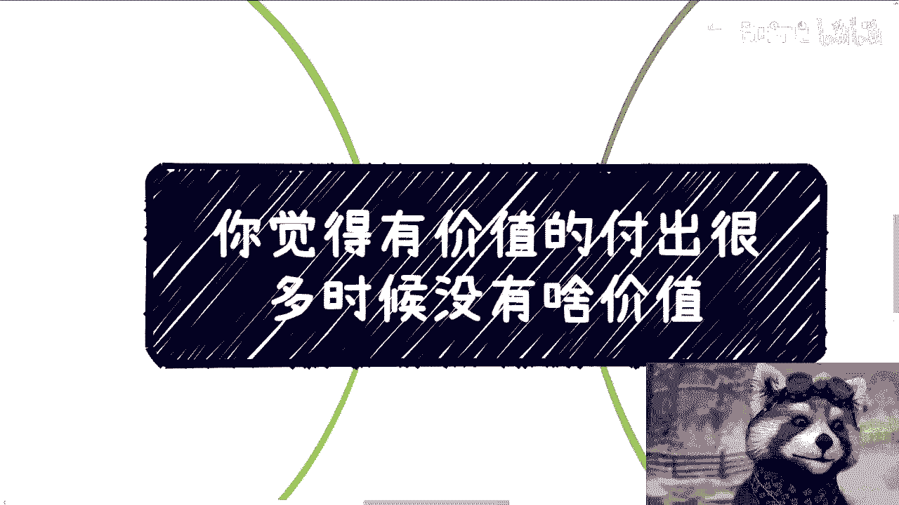

**行动建议**：如果你需要对职业规划、商业规划、股权融资、合同或商业落地进行梳理，或者你手中有一些资源（“牌”），希望借助更宏观的视野进行规划，可以整理好资料后私信我。