# 课程 P1：风险认知的常见误区 🧠

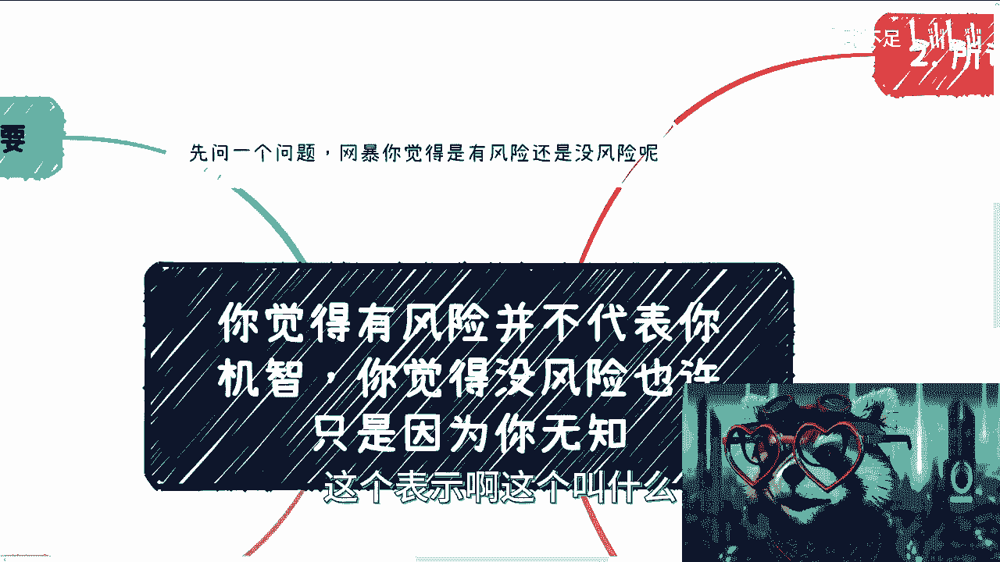

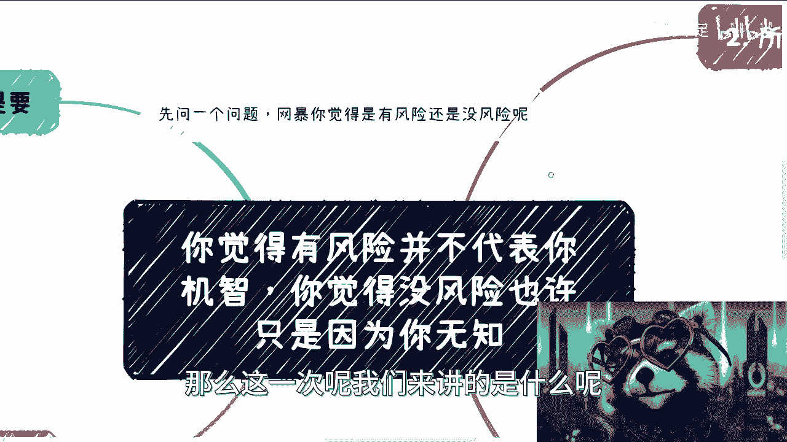

在本节课中，我们将探讨一个普遍存在的认知偏差：我们如何感知和判断风险。很多人会本能地认为某事“风险很大”或“没有风险”，但这种感觉往往与实际情况不符。我们将通过具体案例，分析这种错觉背后的原因，并帮助你建立更客观的风险评估视角。

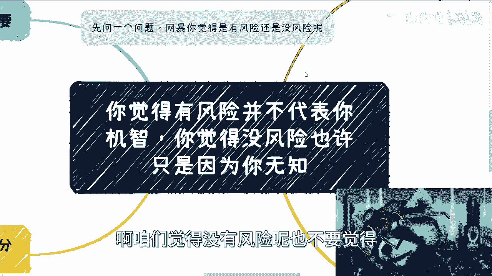

---

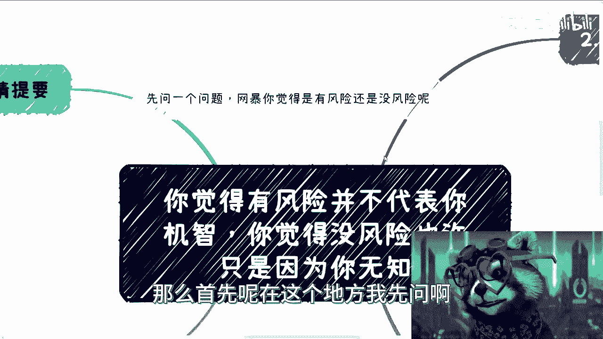

## 概述：感觉不等于事实

我们常常依赖直觉来判断风险。你觉得一件事风险高，可能只是出于本能反应或道听途说；你觉得一件事没风险，或许是因为对其潜在的法律或商业规则一无所知。这两种情况都可能导致决策失误。

上一节我们概述了风险感知的主观性，本节中我们来看看第一个具体表现：对“有风险”事物的过度担忧。

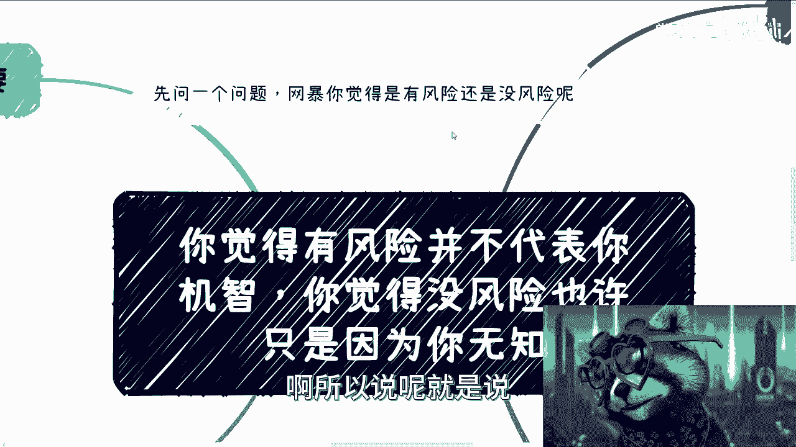

## 一、对“有风险”的误判：以网暴为例

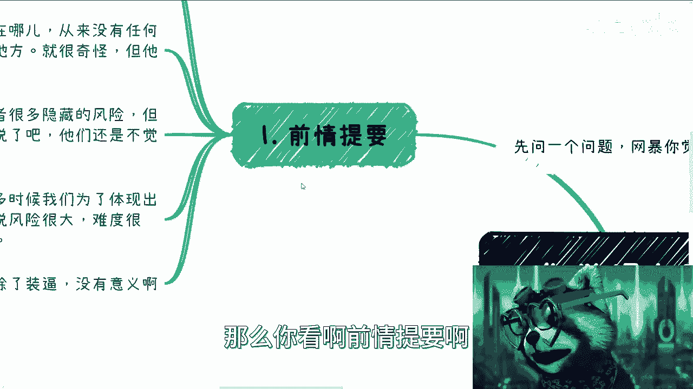

很多人对某些行为风险的认识是模糊的。以网络暴力为例，从法律意义上讲，网暴行为确实存在风险，行为人可能承担法律责任。

然而，大部分实施网暴的人并未受到惩罚。这并非因为风险不存在，而是因为法律追责流程长、成本高，对于情节不严重的情况，执法机构可能不会优先处理。但这绝不意味着该行为没有风险。

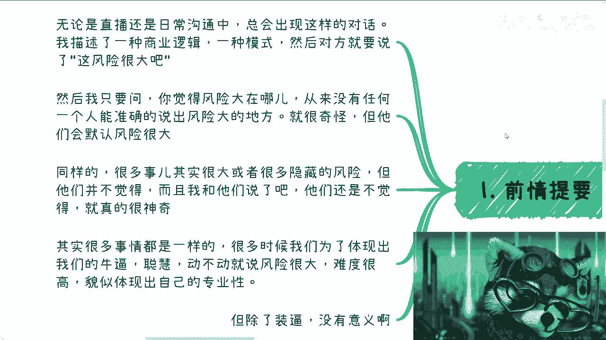

**核心逻辑可以概括为：**
```
未受惩罚 ≠ 没有风险
```

这个例子说明，我们不应将“暂时没有不良后果”等同于“此事安全无虞”。

---

## 二、商业中的风险误读

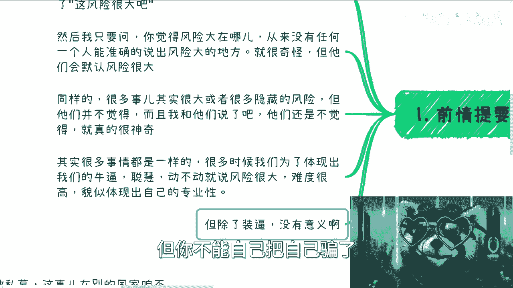

在商业讨论中，这种误判更为常见。以下是几种典型情况：

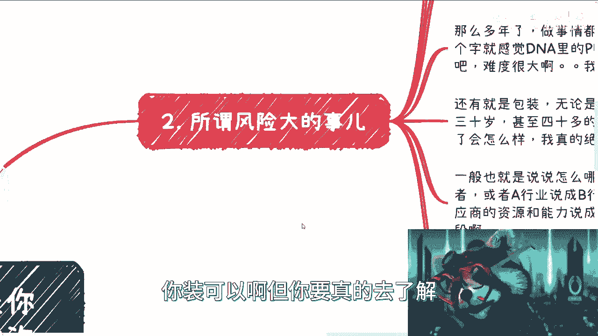

上一节我们以网暴为例说明了风险感知的滞后性，在商业领域，这种误判则直接关系到决策与成败。

### 1. 对“销售模式”的刻板恐惧

在中国做面向消费者（C端）的生意，电话销售、直销、会议营销、分销，甚至传销，都是常见的模式。做流量生意，也大多依赖分销渠道而非从零自建。

例如，一个热点产品的销售窗口期可能只有一两个月。此时若坚持从零开始做流量，几乎注定失败。明智的做法是寻找现成的分销渠道合作。

然而，很多人一听到“销”字，就本能地认为“风险高、难度大”。这种未经思考的恐惧，会让人错失机会。一边想赚钱，一边又用“风险大”来自我设限，是矛盾的。

### 2. 对“包装”的过度担忧

商业中适当的个人或公司包装很常见，例如：
*   夸大教育或职业背景。
*   将合作方的资源说成是自己的资源进行背书。

不少人为此焦虑，担心“被揭穿怎么办”。实际上，这类夸大其词的行为，在无人追究的情况下，很少会引发严重的法律后果。执法机构精力有限，通常不会处理这类“鸡毛蒜皮”的纠纷。

**这里的认知误区在于：**
过度担心后果轻微的行为，却忽视了真正的高风险行为。

### 3. 对“法人身份”的风险无知

与过度担忧“包装”相反，许多年轻人对担任公司法人代表的风险一无所知。他们轻易为别人的公司担任法人，殊不知一旦公司出事，法人首当其冲，可能需要承担法律责任，至少也会被频繁询问、笔录。

该担心的不担心，不该担心的瞎担心，这是风险认知错位的典型表现。

---

## 三、对“无风险”的误判：以培训与金融为例

有些事看似“没有风险”，仅仅是因为问题尚未爆发。以下是几个高危领域：

上一节我们讨论了人们如何高估了某些行为的风险，本节我们来看看硬币的另一面：人们如何低估了那些真正存在隐患的事情。

### 1. 教育培训的资质风险

很多人认为做培训没有风险。但事实上，正规培训需要特定的经营资质。许多机构之所以能运营，是因为他们用“咨询”、“技术服务”等名义开具发票，或者目前监管没有深究。

但你必须明白：**不出问题不代表没有问题**。一旦被查处，就可能面临处罚。

### 2. 金融活动的法律红线

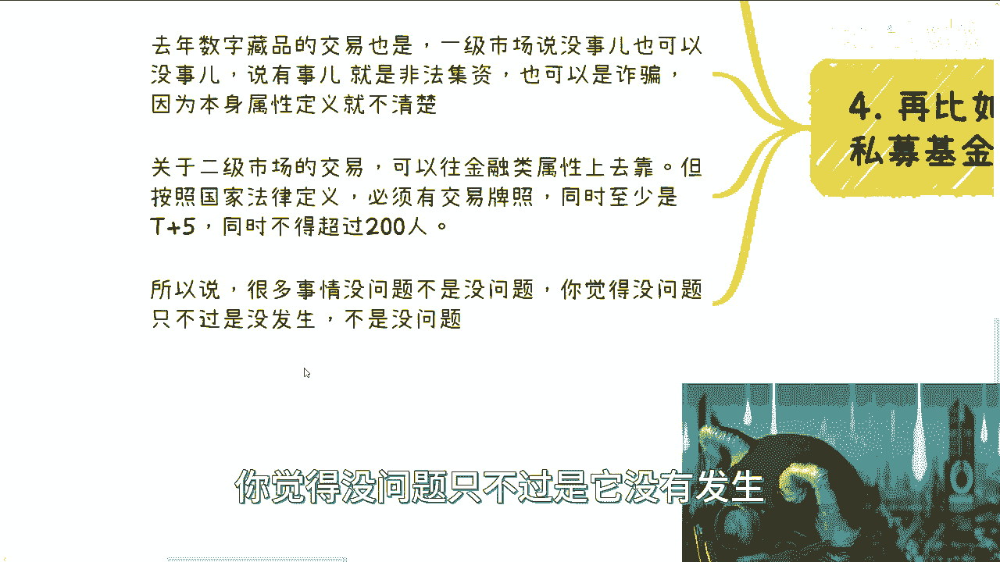

在金融领域，这种误判更为危险：
*   **私募基金**：在个人层面操作私募，无事则已，一旦有事就可能被定性为“非法集资”。
*   **数字藏品/二级市场交易**：去年火爆的数字藏品交易，其法律属性模糊。一级市场销售可能涉非法集资或诈骗；二级市场交易则明确需要交易牌照，并遵守`T+5`、不超过`200人`等规定。

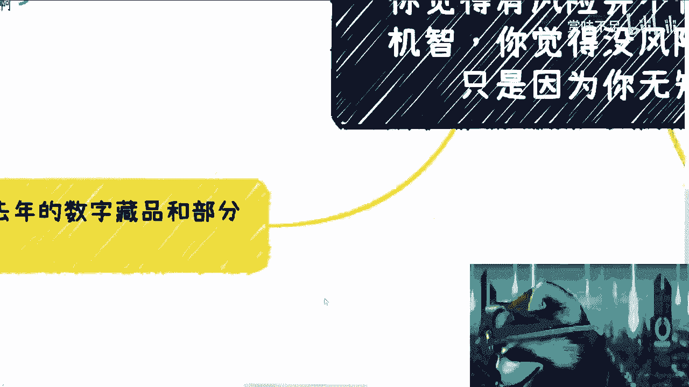

**核心风险在于：**
```
目前合法 ≠ 永远安全
监管空白 ≠ 允许从事
```

你觉得没问题，可能只是“达摩克利斯之剑”尚未落下。

---

## 总结与核心要点

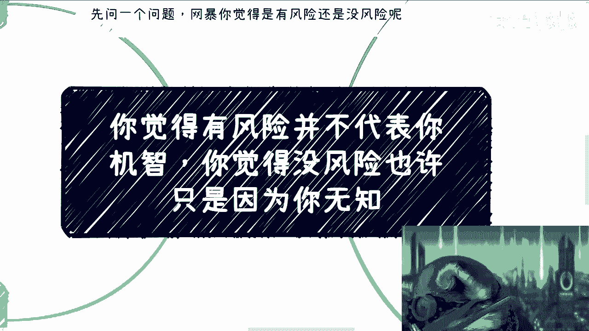

本节课我们一起学习了风险认知中的两大误区：高估轻微风险，以及低估重大风险。商业社会中，许多人缺乏基本的财、法、税知识，仅凭感觉判断风险，导致该谨慎时冒进，该进取时退缩。

**记住两个关键公式：**
1.  **感觉有风险** -> **问一句**：`风险具体是什么？`（如果答不上，感觉可能不准）
2.  **感觉没风险** -> **查一查**：`法律/资质要求是什么？`（如果不符合，风险可能很大）

尊重客观规则，而非主观感觉，是做出明智决策的第一步。如果你对自己的商业想法或职业发展有疑虑，建议系统性地梳理手中的资源与潜在风险，而非凭直觉贸然行动。

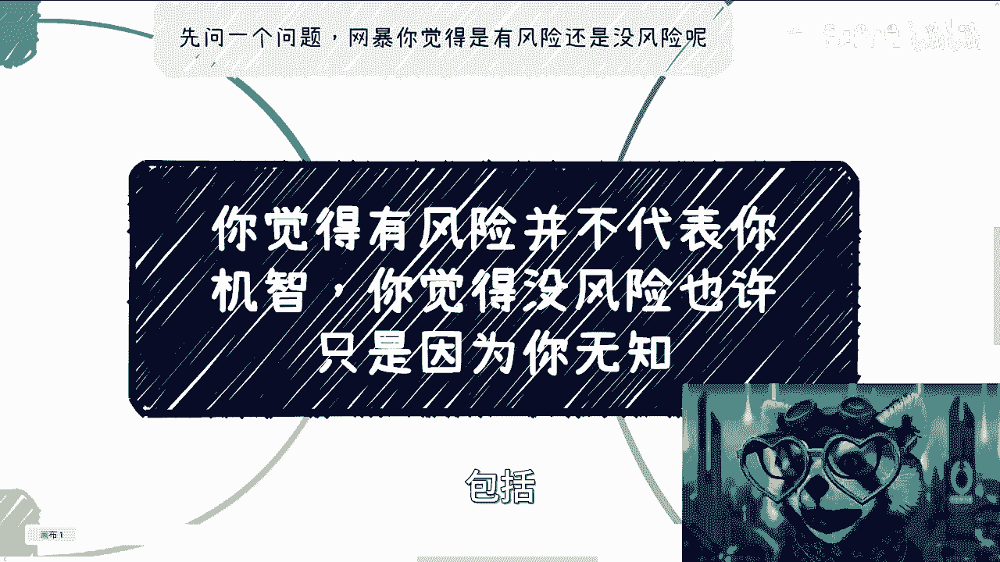

---