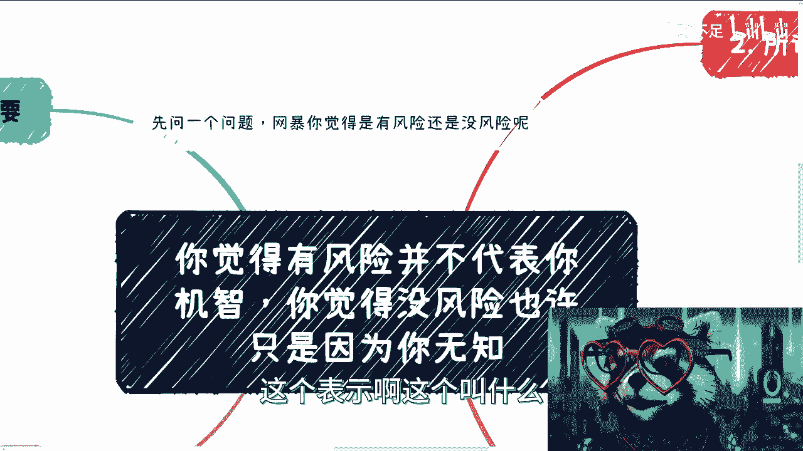
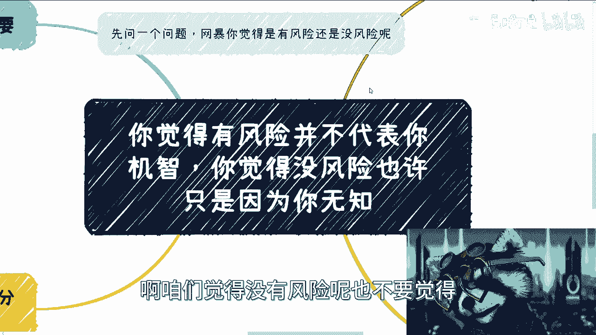
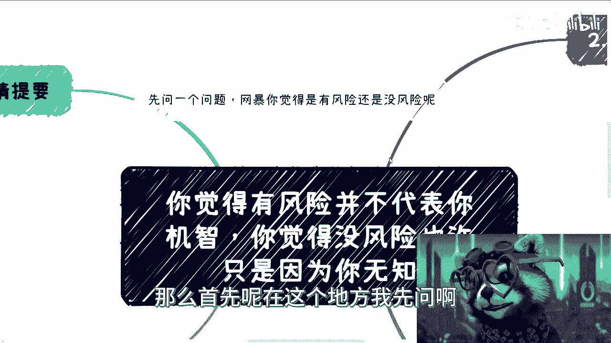
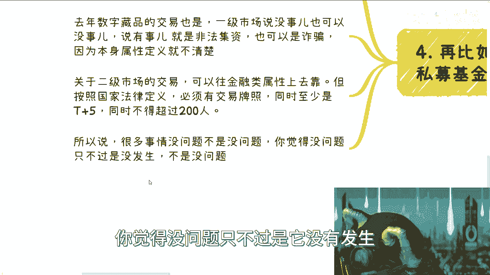

# 你觉得有风险并不代表你机智，你觉得没风险可能因为你无知 - P1 - 赏味不足 - BV1gM411R77d

大家好啊，今天礼拜六啊，我感觉好像一年没更新了是吧，呃前两次啊，前那一次呢这个表示啊这个叫什么。

太激进了是吧，我稍微温和一点，温和一点，那么这一次呢我们来讲的是什么呢。

就是关于这个风险啊，呃很多时候呢咱们觉得有风险呢，呃并不代表就自己不要觉得自己很机智哦，咱们觉得没有风险的。

也不要觉得这个这个好像就真的没风险啊，那么首先呢在这个地方我先问啊。

你比如说网暴对吧，就这个事情就是说可能会发生在每个人身上啊，那你说网暴算有风险没风险呢，那这个东西说实话啊，就是你如果能明白，那你就会就是如果你真的能够清楚的话，那你就会知道。

就是说从法律意义上来讲对吧，如果走流程，你就是有风险的哦，就是你如果去网暴别人，但是大部分的人觉得诶我网暴了，反正也没有结果，为什么呢，是因为就是说就很多时候你没有结果，很正常吧对吧。

因为你整个全国来讲，你各种各样的问题对吧，你从网报角度来讲，人家走法律，走法院，走各个方面，他的流程就周期就很长对吧，而且也不是说因为网暴也分程度嘛对吧，你也不是说就阿猫阿阿猫阿狗。

就张三李四的这种鸡毛蒜皮的，他也跟你给你怎么样怎么样，很少的啊，就是我跟你说，你真的去报警你，你警察会跟你讲的，就是就这个级别到底怎么样子，你知道吧，哦所以说呢就是说呃你说有没有风险。

就肯定是有，但是并就说如果你没有得到应有的惩罚，但是并不代表他没有风险，对吧好，那么你看啊前情提要啊。

就是说无论在直播还是日常过程当中，总会出现这样的对话，就是我描述了一种商业逻辑对吧，然后一种模式，然后对方就要说就很多时候就是默认的，他就会说非常呃，怎么说呢，就是本能性的会说一句一句话。

他就觉得唉这个东西是不是风险很大，对吧或者怎么样子啊。

嗯然后这个是一方面啊，然后第二个呢，就是说你我一般听到他们会问的时候，我就会我就会反问他们，我说那你说风险很大，那你觉得大在什么地方对吧，但是你会发现哦，我可以说百分之百到目前为止没有。

就是说出这种话的人，我反问之后，他没有任何一个人，他能够准确地说出风险大在什么地方，哎我跟你讲，这就很奇怪，但是他就他们都会默认风险很大对吧，那同样的很多事情呢，其实就是说啊其实啊风险很大。

或者来说隐藏着这个风险，但是呢他们并不觉得啊，而且呢就是说你会发现，他们不觉得有风险的东西，我跟他们讲了，他们还是不觉得有风险，唉，这种东西就叫什么，叫做你叫不醒一个装睡的人对吧，就一个道理，这个事。

好那么这个是一块啊，那么其实很多事情其实都一样对吧，很多时候我们为了体现出自己的牛逼，就是聪慧啊，动不动就会说啊，这玩意没风险，或者说这玩意风险很大，难度很高啊，貌似体现出自己的专业性。

当然而你问他懂不懂，他不懂啊，所以说你你要明白，就是我觉得我们大部分的人做事情呢，就是你该装逼的时候装逼对吧，你不该装的时候就别去装，而且就是说你该对外装没问题，但你不能自己把自己骗了啊。

所以说呢你你装可以啊，但你要真的去了解。

那么我接下来给你们举个例子，比如说所谓风险大的事情对吧，我跟很多人说过啊，中国人做C端的生意呢，很多时候都是电销，直销，会销分销对吧，甚至我们说传销对吧啊，那么而且呢我们做流量生意啊。

一般我就这么跟你们讲，大部分都不是自己去做的，就自己做根本就赚不到钱，你比如说啊我说我们今天要卖个东西，这个东西比如说呃热点窗口，它就一个月两个月，你跟我说你流量从零开始做，你怎么做啊。

有有人会给你做啊，或者说我就告诉你，我说这个窗口就两个月对吧，比如说流流水可能是多少多少多少哦，你跟我说好，那个吕老师我不管了，我要开始从零开始做流量，你会吗，不会的呀，这不搞笑吗，对不对啊。

那么多年过去了，我跟你讲，做事情都是找分销的啊，而且很多人听到肖这个字呢，我跟你讲，他DNA里面的这个PA就动了，对他张嘴就来，就说哎呀，缝隙很高，难度很高对吧，然后我跟你讲，我就得他妈的骂粗口了对吧。

就是你动不动就风就风险很大，你又你又说要赚钱对吧，你你你你你还莫名其妙的自己PUA，自己说风险很大，那你还搞什么东西是吧，还有就是包装啊，就是我们说包装这个事情也说了很长时间了，对吧。

无论是to c to b to g，很多人啊，就是比如说一个三十三十多岁，40多岁的人，你比如说一个30多岁，40多岁的人，他会问我，他说包装了啊，别人揭穿了会怎么样，我跟你讲，我真的绝了。

我先跟你们讲啊，包装内容，比如说一般也就说说，比如说你吹吹牛逼，比如说你哪里毕业的对吧，然后学生说呢，你就不要说自己学生说是创业的啊，或者说呢你你比如说现在不是在A行业对吧，你把A行业说成B行业。

就吹吹牛逼嘛，啊，最多也就是说把你的供应商的资源和能力，说成自己的能力，你比如说你说啊，你跟我对吧，这个你说跟陈老师合作啊，然后呢比如说你跟我打过招呼，就说咱们是达成共识的对吧，我说哎呀，可以的。

你可以拿我这边的研究院，拿我这边的公司做背书啊，那么你你也许跟我之间没有合同，或者说也没有合作过，但是呢你可以拿出去说，哎，你看我这个呃，可能在什么什么研究院或者怎么样怎么样对吧。

你最多就是吹这种B嘛啊，那么就很离谱，然后还有很多不少的人问我就说哎呀，揭穿了怎么办，穿帮了怎么办，能怎么办，我每次真的我跟你讲，我就怼回去能怎么办，抓紧进去啊啊我说你们要不要去问问警察。

或者说或者说公安啊，他们每天忙成什么样子，是不是吃的吃的太饱，撑得慌啊，哦你你说因为这个东西啊啊啊啊，我我就不知道你们怕些什么东西，或者我就不知道他们怕些什么东西，有什么好怕的呢，对吧。

我就真奇了怪了啊，是不是说这个国家人力已经多余到这种地步了，不吃饱了撑的，我跟你讲，这种就是什么这种就是你们连一零都没打过，你报案都没报过，你去报一个看看，哎呀搞笑了，真的是啊，然后第三个啊。

所谓那些没有风险的事，哎我跟你讲句搞笑啊，就比如说不少年轻年纪轻轻就做法人了，哎我跟你讲，我真的满脸问号啊，就蛮多的，你知道吗，就是那种就是说呃这个还在读书啊，但是已经成年了，然后呢他他就跟我介绍嘛。

他现在已经做了一些合作，或者已经有了一些资源，对吧，然后呢我我每次都听到他们说，哎我已经不跟别人注册公司对吧，我做了法人对吧，我表示什么，我表示就是刚刚我还在跟你们说，就是你们担心的东西呢，不用太担心。

没有什么风险，下一秒就来跟我说，他做了法人，我就我就再次再跟他们说，我说我再严肃点跟你们讲啊，就是你这件事情啊，大哥大姐出了事儿，我跟你讲，法人倒是真的要进去的，你明白吗，你该担心的东西不担心。

不该担心的东西乱担心啊，而且你就算不进去，笔录询问你一个都不会少的啊，我不明白为什么愿意担心上面那些有的没的，什么鸡毛蒜皮的事情，而二话不说就去做法人啊，再比如很多人觉得培训没风险对吧好。

我来给你们讲啊，你爷爷执照有没有培训这一项没有，你凭啥做培训对吧，你培训发票都开不出来，你做什么培训，很多企业之所以做，只不过是没有人去深究，或者说大家就是拿咨询，或者拿技术服务发票去抵对吧。

就大众或者说整个国家，它现在不是那么较真罢了，但是你一定要明白什么叫培训，培训真正去做应该怎么做，他应该有什么资质，你你要明白，但很多人不明白呀对吧，包括你做你做业务交税了吗，怎么交交了多少啊对吧。

包括你比如说我跟你们讲做活动对不对，一般通用来讲200人活动，200人以上活动都是要报备的，你报备了吗啊，当然按照各个地方不同的规则，有的地方可能100人，150就要报备了，有多少机构报备了。

我就问对吧，就是你要明白，不出问题不代表没有问题啊，不要自己老是PUA自己就是某些东西啊，风险很高，有些东西没有风险啊，那么你再比如说我们再举个例子，去年的数字藏品跟部分的那个私募基金啊。

很多人其实也跟我提到过，他私下想做私募基金这个事儿，我跟你讲啊，在别的国家咱不去说它，在我们国家，你个人你做私募没有事就没有事，有事就是非法集资，你明白吧，就这么简单，你心里得有数，你懂吗。

好那么包括去年的数字藏品交易，也是一级市场，说没事也可以没事，说有事就是非法集资啊，也可以说是诈骗啊，因为它本身本就是数字藏品，这个东西本身属性的定义他不清楚对吧，关于二级市场交易也是一样的。

你可以往金融类属性上去靠，但是你去查对吧，你按照我国法律的规定，它是有几大前提的，第一是必须要有交易牌照，第二是你在有拥有交易牌照的情况下面，至少也是T加五啊，而且同时不得超过200人，你自己去看对吧。

就是这个东西是在我国的这个交易相关的，法律条款上明文规定的对吧，就是你那就像我刚刚说的，你要去做二级市场对吧，你比如说你说你做了几千万几个亿啊，你现在没有事，但并不代表它合法对吧啊。

那么所以说啊很多事情没问题，不是没有问题，你觉得没问题，只不过是它没有发生。

你没有这个铁这个靴子没有落到你头上，但不代表真的没问题啊。

所以我就说我我就发现啊，就是说啊商业这个东西都是一样的，就是大众对吧，我们9年制义务教育过后，高等教育过后，包括就是说你说动不动就创业，动不动做什么东西，就是就是财务法务对吧，包括就是说业务的风险。

也包括公司的整个风险，一一概不知道，就一无所知，然后就动不动的就是说哦发现哦这个东西哦，可能以前被PUA过啊，然后就说这个东西我觉得风险很大，然而没什么风险，我也不知道他为什么得出来风险很大。

然后真的到了一些有风险的吧，你跟他讲了，他不听了，就这个样子，就就我可以告诉你，中国的普罗大众就这个样子哦，然后按照我们说的百分之百分之95，才掌握了5%的财富的这么一个规则，那95%其实都这样。

你们自己看好了对吧，所以就说就说很多时候啊，你说无知者无畏对吧，这句话D是对的，你放到就说呃，有些时候冲该冲的，你看哎我跟你讲这种事情是这样子，你会发现有些时候你该冲的时候呢，他不冲啊。

就是真正的有机会来你，你你跟他说你得充，他不充，他跟你说哎呀我这个这个风险哦，这样哎这个风险那样对吧，然后呢你会发现不该冲的时候，对一些存量市场，一些已经卷成卷出血的，卷的连血都卷不出来的地方。

唉他妈乱冲。

所以我跟你讲，就是呃那句话说的对啊，尊重他人命运啊，哎哎哎该咋地咋地，我反正已经是叫什么，就是尽我所能了是吧，行好吧，就这样啊，然后大众大家反正有什么东西呢，啊你们整理好副业啊，赚钱啊对吧，不商业啊。

你们有任何问题的，你们跟我说啊，因为最近我发现大家就说嗯自己有一些idea的，包括自己有些积累的或者怎么样呢，就找我的蛮多的啊，我觉得这种呢就是说相对来讲比较有帮助啊，当然你们要是说手上有些什么牌。

不知道怎么打，包括接下来发展路线。

不知道怎么发展啊，这个结合希望我通过各方面的这个，更宏观或者更高的一个高度去给你们做些建议。