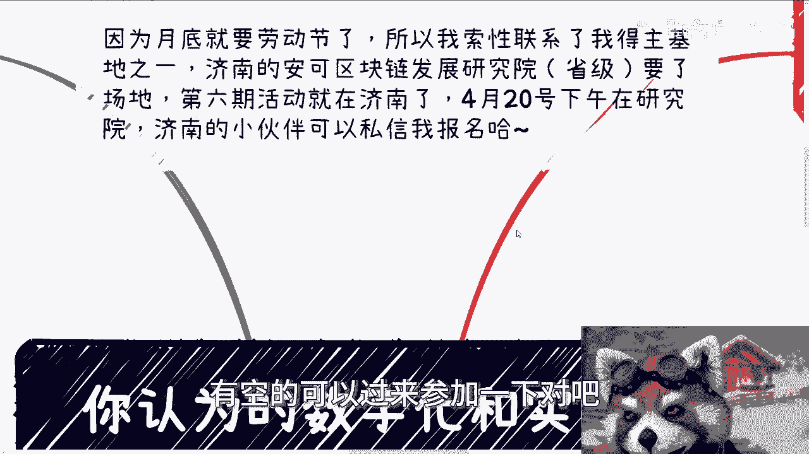

# 你认为的数字化和实际的数字化 - P1 - 赏味不足 - BV1Vm421j7HE

好大家好，这个很久没来讲数字经济相关的东西了对吧。

我还是要来讲一下的，首先呢就是说本周六本周六这个活动，下一期这个活动呢放在那个济南对吧，放在这个陕西的研究院，然后大家要是在现场，在当地的，有空的可以过来参加一下吧。

我带大家正好参加参观一下研究院哈，嗯我们今天这个主题叫做你认为的数字化。

跟实际上的数字化，当然这个主题并不重要，我先来说一下关于这个数字化改造，宏观来讲，其实就是跟以前的互联网加是一样的，无非是做互联网的融合，比如说以前是有网页，后面有app对吧，小程序对吧，或者其他的。

那么再到后面呢，就是可能会有各种各样的一些定制化的系统，监控啊，控制面板等等等，那其实好多人的疑问就在于说，为什么他们自己不做啊，为什么他们不自己找外包，或者说他们为什么要去做这个东西。

我跟你们这么说啊，其实你们接触过足够多的企业跟人，你就知道就是人相对公司，公司相对政府，其实每一年都是要想办法做创新的啊，然后也要想办法做创收，那么你说为什么自己不做，因为很多公司只有所谓的it部门。

比如说网管啊对吧，就是嗯比如说一些什么邮件系统啊这种东西啊，他没有研发部门，他自己做不了，你怎么弄啊，你说啊，难道我为了什么做一个产品，或者做个所谓的赋能，我就成立一个部门吗。

你去看看哪家公司怎么做的对吧，那他们为什么不自己找外包呢，其实也是一样的，你们自己想看啊，很多时候我之前也说过，就你们也要知道找外包真的要找，你们也不知道去哪找，对不对，就为了找到靠谱的外包。

不还是要去找中介吗，或者说找一些第三方服务方不是一个道理吗，你说至于为什么要做啊，我跟你讲，其实原因有很多种，宏观的话呢，我觉得大家可以理解为跟风，所谓跟风就是说政府要做政策要做，大家都在做。

身边的朋友也在做，身边老板也在做，那自己也得做一样的呀，因为各行各业都是个围城，然后每个围城里面都有自己的这个叫什么人，来疯都一样的，而且我跟你讲，数字化得改，数字化的这个改造它不是必须的。

因为无论你什么业务，你现在不和电脑和手机结合，你未来怎么发展呢，对吧，你也就是说你所谓的结合总有第一步吧，那么当然啊很多人他会思考这么一个问题，他说呃在活动现场呢，有不少小伙伴呢也是做数字化的啊。

他们呢就在问，就说就是企业做了吧，呃做了可视化也做了吗，也做了小程序也做了也做了，但是不知道做了有什么用啊，然后接下来呢，也不知道这个做了之后应该干什么对吧，我跟你讲这事儿主要是两个问题。

一方面是我们刚刚刚刚说了，就很多数字化的目的仅仅是数字化，并不是说达到什么样的实际的一个效果对吧，另外一方面就是说，他们觉得可视化并没有太多的实际的利益价值，其实你要这么想啊，你要觉得有用吧，也对。

你要觉得没用吧也对，为什么，因为如果仅仅从可视化角度来讲，你或者说后台的监控上面去看你，你你或者说你说我们今天就是啊，原本的流程都通了啊，就增加个小程序，增加个什么东西，很多人你从一个打工的角色。

你从一个螺丝钉的角色，你从一个很细微的个体的角色来讲是没啥用，这件事情是对的，但是你从长远角度来讲，当然啊长远角度怎么样，我们不知道啊，就是我指的是长远的这个行业好坏我不知道啊。

但是你如果从长远角度来讲，那么这些可视化和监控，他去做的目的并不是为了可视化和监控对吧，等一下我调一下，太弱了，他的目的并不是做可视化和监控，它主要的目的是做数据，数据的采集，数据的整理，数据的过滤。

或者说是通过这个那个叫什么，就是检测器和物联网传感器把把数据整理了，采集了，筛选了才是主要的对吧，就是说这个过程是他制造改造的一个根本，而不是说为了把这个数据展现出来对吧，那当然这些东西都是第一步。

你后面比如说啊你说结合所谓的人工智能啊，结合所谓的元宇宙啊，或者未来有一些新的技术，我们不知道的对吧，你没有这这一步，你怎么做，后面的对不对，那对于很多企业家来讲，你早晚要做做0~1这一步。

那那那那还不如跟风，原来风早做早早了事对吧，那么最近呢就是近一年左右啊，整个中央到地方政府都在做数据入库，数据库表合规的问题啊，那么这些小伙伴呢也让我想说说最近情况，最近情况就是说都在做。

那么昨天呢现场也有小伙伴就问他说，是不是所有的数据都要入库，是不是所有数据都要做筛选，我跟你讲这事儿就在当下来讲，他就不用去思考，或者说这就不是塑胶所这个平台去思考的，因为现在很多入库入表是政府行为。

是政治行为，合规也是，也就是说我们的受众往往是500强国企央企啊，那么书交所作为一个平台，他们最关心的是数据登记啊，确权啊，你你你的数据只要合规，你的数据只要不是黄赌毒，其实都可以登记。

那么你说你说现在这个做了有啥用，这事就不好说，因为你要说现在当下做有用吗，有用的，有一些灰色地带还可以直接做一级市场，二级市场，但是你要在明面上肯定只有一级交易，而且这个明面上一级交易只有国央企层面。

那那你你你你你怎么说呢，对吧，那就看你自己做什么呗，然后你要说C端能不能做呢，中小微企业能不能做，其实放到后面几年其实也可能也可以做啊，但是你现在你要看这个，你现在做这个准备有没有好处。

就看每个人的自己的想法，因为未来也有可能几年后不做了，也没人知道对吧，或者说几年后社交所的这个数据登记涨价了，也没人知道对吧，包括就是说未来如果某一天我们打个比方，比如说某一天开放了呃。

中小微企业的一级市场，或者中中小微企业和C端的二级市场，那么到那个时候你说OK，我现在的这些数据登记都不做，我现在的一些数据整理对吧，包括一些合作也不做，那你没有前期的铺垫铺垫。

你怎么后面直接做一级市场，二级市场的，你难道觉得说今天有一个政策出来，你就想要去对接，想要怎么样，到时候轮得到你对接吗，轮不到，其实所有东西都是一样的，就是你当下做的人少。

然后你就会觉得啊好像赚赚不到钱，或者说这个东西做了没有用，但是真的赚到钱了，又轮不到你做了，那你自己想怎么样呢，对吧，你你说我现在去做，我赚不到钱，所以我不做，我不想做这个准备。

到时候做了呢又抱怨说轮不到你那去，那你怪谁呢啊。

那么同样的我们说数字化的这个问题呢，其实蛮多的，因为做过的都知道，比如说数据有冗余啊，或者大量无效的数据啊，数据本身的真实性啊，或者说一些操作流程，可能比如说转账啊对吧。

或者数据的一些呃啊这个这个交易对吧，或者说一些一些服务，它本身就存在非常多的这个不合规的地方啊，现在呢可能又要开始走所谓的数据资产化，那么很多人就会觉得相当于基础没有打好，就要开始走下一步啊。

我跟你们这么讲，这事要我说啊，其实每个怎么说呢，每次这个这个这个这个改造啊，每次这个改造其实都一样，只不过就可能就是你们现在，你就就可能就是说你们以前没经历过，你们现在正好在经历啊。

所以你们觉得好像不靠谱，但其实每次阶段怎么哪哪这么多靠谱的事情，对不对，所以呢那个广州活动这次也有个问题不错，他说呢他就问他说，数据资产化跟书和资产数据化有什么区别，我跟你讲这事很容易。

资产数据化本身就是可视化，本身就是数据管理本身就是属性，还在互联网层面，但是数据资产化就不一样了，它直接就从数据变成了金融属性和玩法，那这就是两码事情啊，就跟我们以前说的叫叫产业，数字化和数字产业化。

那也是两码事啊，那我总结一下，就是说现在可以做的其实不多，但是你想探究更多的数字经济的技术，我说实话没啥好探究的，为什么，因为在整个数字经济框架下面，东西很多，你比如说人工智能也能套元。

宇宙也能套现在的数据，合规数据，数据的入库路表也能套，区块链也能套对吧，包括我们说的那个最近那个无人机叫什么叫嗯，哎我忘了叫叫叫什么，叫心智科创科技还是叫什么的，反正就是这一类。

就是就是相当于是互联网跟这种，比如说嵌入式或者说这种这种机器相关的，你都可以算到数字经济里面，但问题是现在当下这种经济情况下面，经技术本身，你你说哎我们多讨论一下数据。

数字经济的这个技术层面细节它不重要，因为说实话没人关心关心的还是说怎么赚钱，怎么把整个的一个一个政府跟企业，这个关心的问题解决掉对吧，因为你像前两天那个常州那边就跟我说。

他们啊大数据大数据中心有这个需求，需求是什么呢，就是说更多的要有一些入库录表的经验啊，或者怎么样啊，这个是有的啊，但是你说啊这个具体啊，你说这个技术用什么对吧，或者说这个技术接下来怎么发展或者怎么样。

反正就是说从企业跟政府角度来讲，我觉得现在还没有到到这个阶段，而且而且就算到了呢。

他也不见得说你就能赚到钱啊，所以另外一方面我也说一下啊，就是为什么数字经济到现在4月份，我没怎么太多的去讲，就是因为我们不是没干事儿，你知道吗，我们已经撞了很多次墙了，我们在无数的高校跟无数的政府。

无数的企业至那个那个那个沟通下面，得到的结论就是没有预算，那没有预算，我们我们能做什么呢，对不对，你没有进展，我我不讲，我要我，我觉得你们要明白一点，我不讲也代表着一种进展，这种进展就是没有进展。

没有进展就是没有预算对吧，但就是没有呀，你们不要觉得好像经济这么快恢复，或者说这个东西能有怎样的发展，你们但凡这么去想，就代表你们对我国做事情一点都不了解，哪这么快呀，没有啊，好马啊行。

那这个就这么着吧，然后本期的那个呃叫什么。

就是活动本周六的这个活动，你们在济南的或者在周围的，有兴趣可以来啊，来参观一下研究院对吧，顺便啊，然后其他的话就是职业商业对吧，合同资本融资啊，然后股份股权啊，然后你们觉得自己手上有什么牌的啊。

希望我能够给你们更好的梳理一下，或者更好的一些，就从我的角度有哪些更好的方向呢，那么你们可以整理好。

