# 你认为重要的并不代表全部-也不代表剩下的不重要---P1---赏味不足---BV1QH4y1c7Kg

在本节课中，我们将探讨一个核心思维误区：我们常常会高估某些特定事物（如学历、技能）的普遍重要性，而忽略了其适用范围的局限性。我们将从多个维度分析，帮助你理解如何跳出固有框架，找到真正适合自己的发展路径。

---

## 1. 核心观点：重要性的相对性

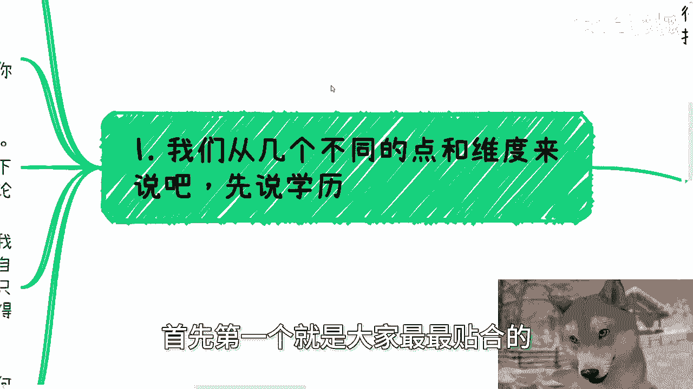

上一节我们介绍了课程主题，本节中我们来看看核心观点。你认为重要的东西，并不代表它是全部，也不代表剩下的就不重要。

任何事物的重要性，都只存在于**特定的人群、范围和规则**之内。公式可以表示为：

**重要性 = f(特定人群, 特定范围, 特定规则)**

一旦跳出这些限定条件，该事物的重要性就会下降。在不同的规则和人群中，会有其他事物变得更重要。关键在于，你需要找到**适合自己天赋和类型**的领域，而不是将自己局限在单一选项上。

---

## 2. 维度一：学历的光环与局限

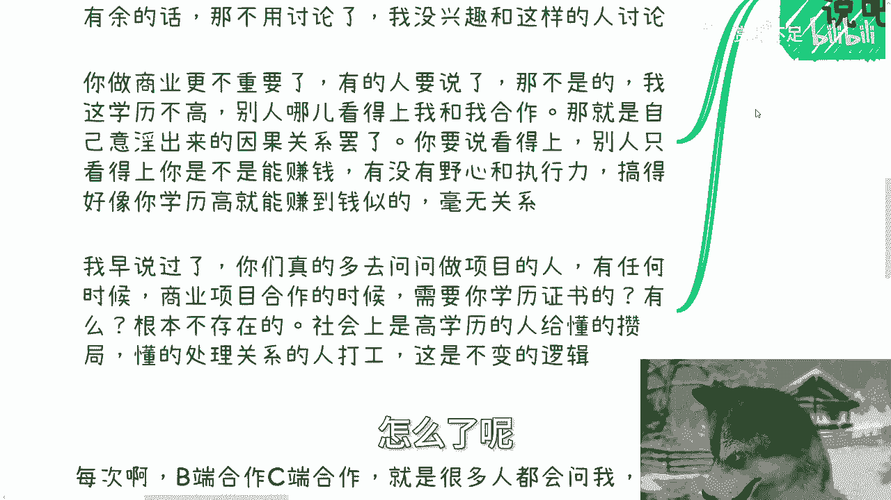

接下来，我们从大家最关心的“学历”开始分析。学历重要吗？在找工作的特定范围内，它确实重要。

然而，其重要性会随着时间推移和工作经验的积累而**衰减**。一个简单的逻辑是：

```python
# 学历影响力的衰减模型
def 学历影响力(工作年限):
    if 工作年限 <= 5:
        return “较高”
    else:
        return “逐渐降低，能力成为主导”
```

工作超过5年甚至10年后，雇主更看重的是你的实际能力和产出，而非一纸文凭。学历在求职初期是“敲门砖”，但后期已非决定性因素。

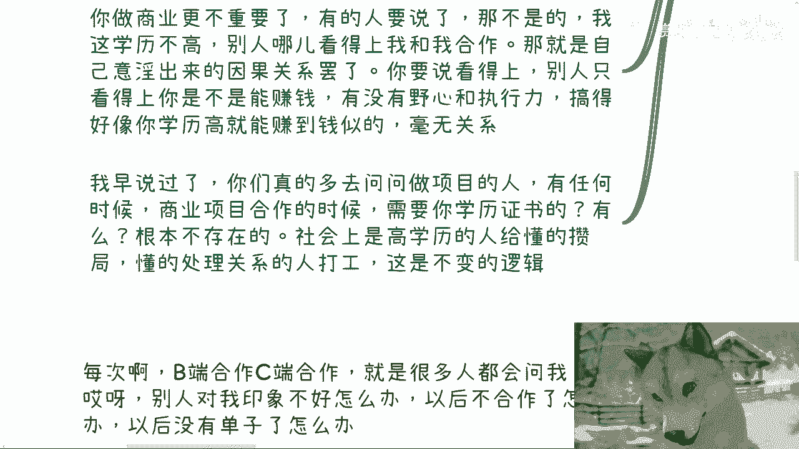

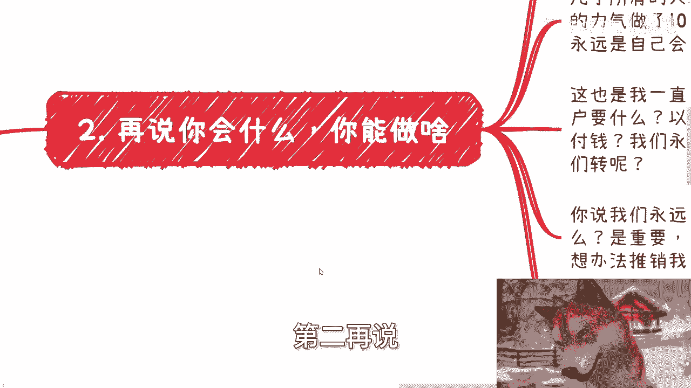

更重要的是，在**商业和创业**的赛道上，学历的重要性微乎其微。商业合作的核心是**盈利能力和资源整合**，而非学历背景。看重你学历的合作方，很可能只是将你视为“高级工具人”。

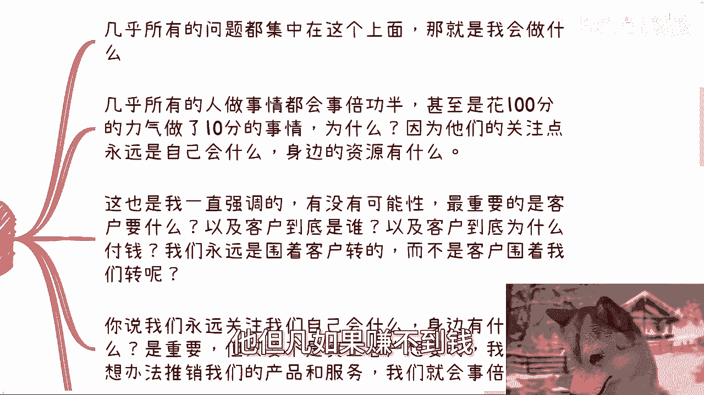

---

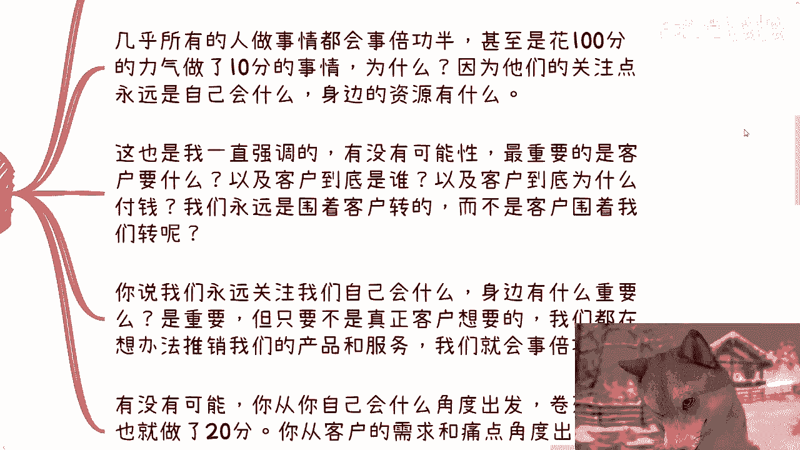

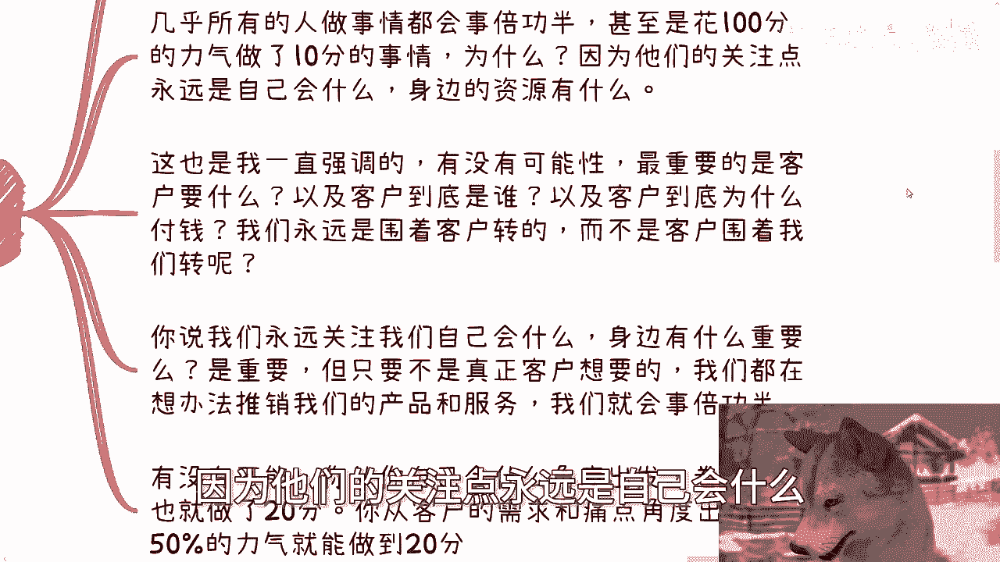

## 3. 维度二：从“我会什么”到“客户要什么”

上一节我们讨论了学历的局限性，本节中我们来看看另一个常见误区：过度关注“我会什么”。

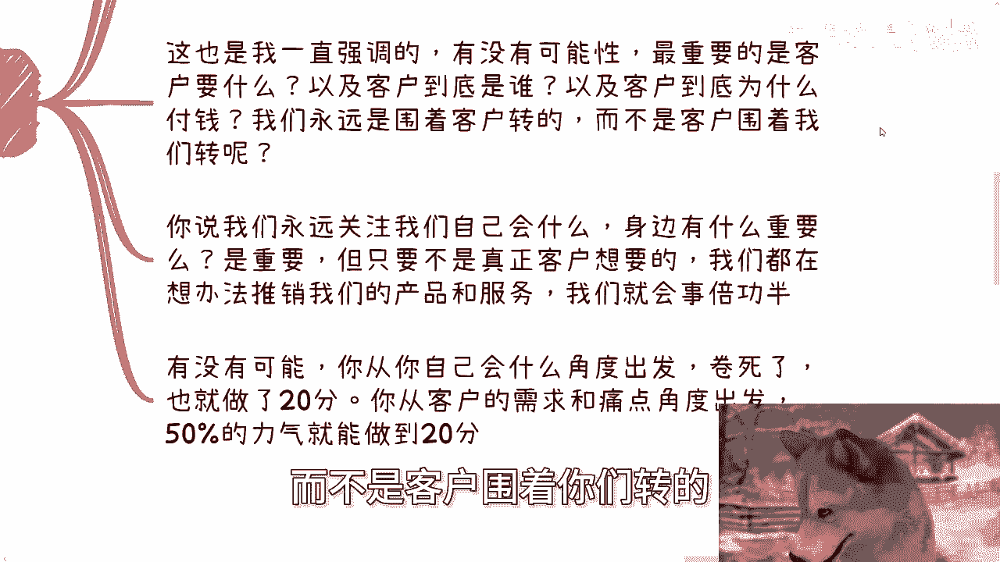

绝大多数人做事“事倍功半”的根本原因在于，他们的关注点始终是**自身技能和现有资源**。以下是典型的错误思维路径：

1.  我会画画/编程/打篮球。
2.  所以我应该去卖画/接项目/做培训。
3.  为什么没人买单？

这种思维的症结在于，它颠倒了商业的逻辑。正确的路径应该始于**市场需求和客户痛点**。

以下是两种思维模式的对比：

*   **自我中心模式**：我会什么 -> 我能提供什么 -> 强行推销给（可能不需要的）客户。
*   **客户中心模式**：市场需要什么 -> 谁需要（客户是谁） -> 我如何组织资源（自己学或找人合作）来满足需求。

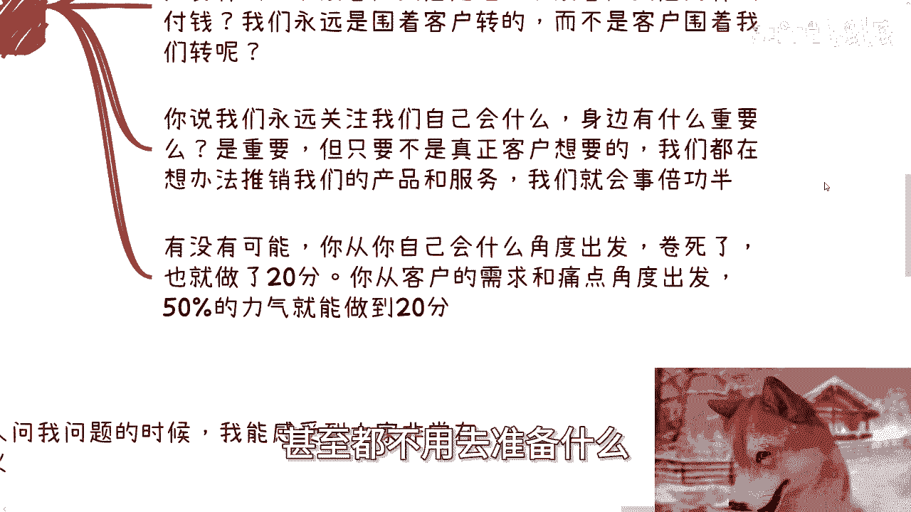


如果你的技能恰好是市场所需，那很幸运。如果不是，你有两个选择：
1.  **合作**：寻找具备该技能的人一起完成。
2.  **转向**：寻找其他你能解决的市场需求。世界很大，痛点很多，不必钻牛角尖。

---


## 4. 维度三：满足核心需求，形式无关紧要


当我们明确了“从客户需求出发”的原则后，一个自然的推论是：只要你能满足对方的核心需求，许多形式上的东西都不再重要。

客户（尤其是商业客户）的核心需求通常可以归结为以下几点：**赚钱、省钱、省时间、提升效率/体验**。


只要你能满足其中一点，你个人的**学历、穿着、谈吐**等外在形式都会变得次要。逻辑很简单：

**如果你能帮他赚钱，你穿拖鞋去见面也没关系。如果你不能，你穿得再正式也无济于事。**


对方对你提出各种形式上的要求，往往源于两种情况：
1.  你未能触及他的核心需求，所以他只能用次要标准来卡你。
2.  你自身太弱小，没有核心竞争力，内心发虚，所以格外在意这些“有的没的”。

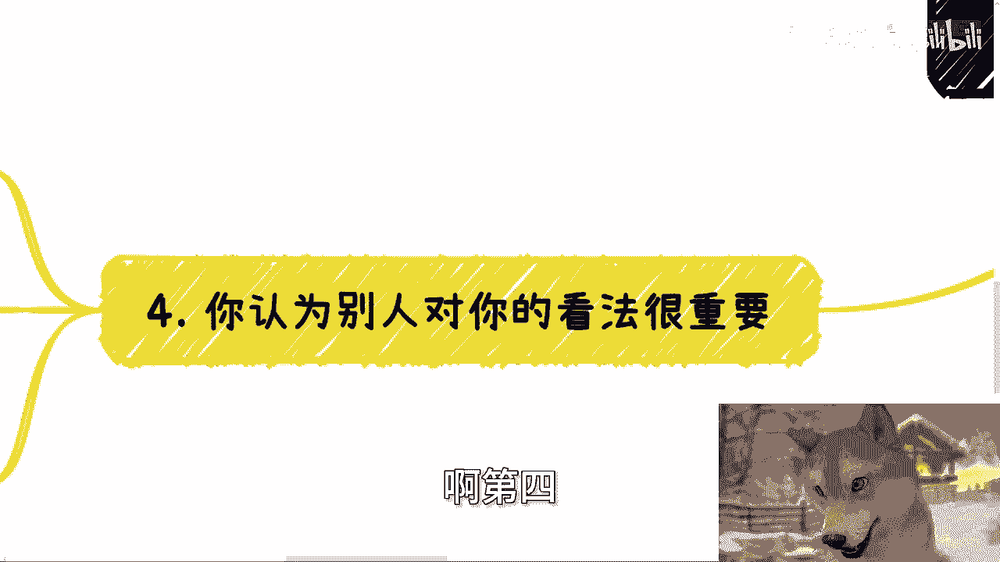

---

## 5. 维度四：别太在意他人的看法

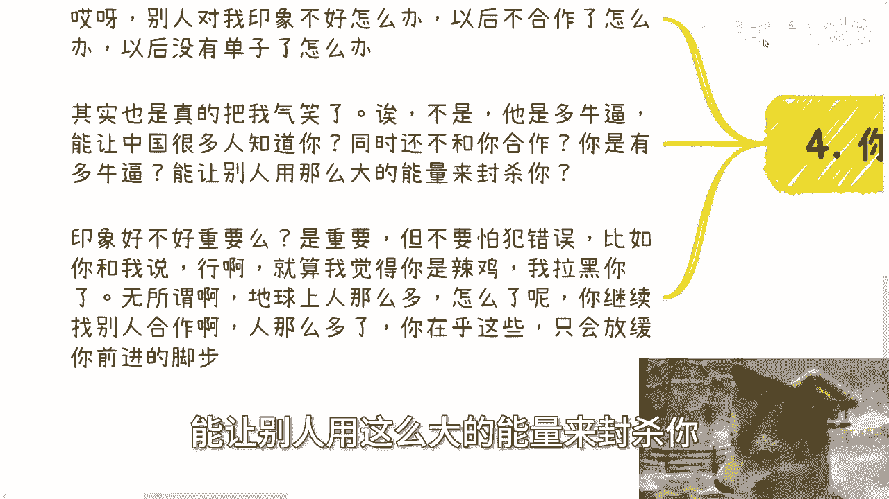

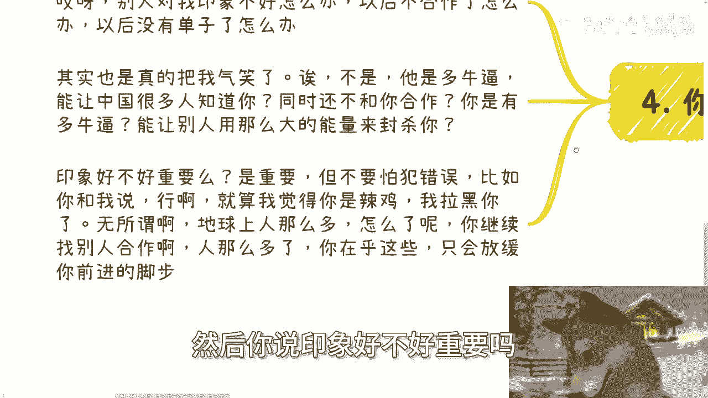

在个人发展或商业合作中，许多人害怕犯错，担心“给别人留下坏印象，影响未来合作”。

这种担忧常常是多余的。你需要问自己两个问题：
1.  对方有那么大能量，能让全行业封杀你吗？
2.  你犯的错，真的会有那么多人知道并持续关注吗？

答案是，在绝大多数情况下，**世界很大，潜在合作对象很多**。一两次合作失败或印象不佳，并不会断绝你所有的路。

正确的态度是：
*   **复盘而非恐惧**：如果合作失败，重点应是复盘问题所在，避免再犯。
*   **持续前进**：你的基本盘（潜在客户）足够大，不必为少数人的看法放缓脚步。有人不认可你，总会有人认可。

做事的核心目的应该是：**赚钱、沉淀关系链、理解行业逻辑**。除此之外，别人的看法没那么重要。

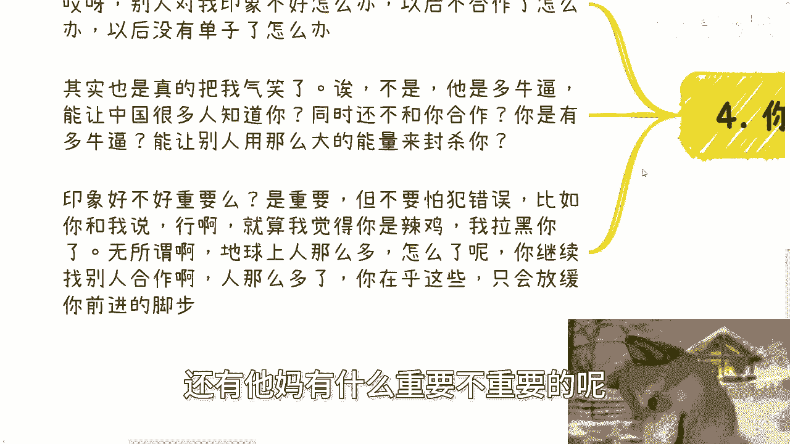

---

## 6. 总结与行动指南

本节课中我们一起学习了“重要性相对论”的思维模型。我们探讨了学历、技能、客户需求和他人看法这四个维度的局限性。

最后，为你梳理出以下行动指南：

*   **破除绝对化思维**：认识到所有事物的价值都有其适用范围。不要将自己吊死在一棵树上。
*   **切换视角**：从“我会什么”转向“市场要什么”。你的起点应是客户痛点，而非自身技能。
*   **关注本质**：在商业和合作中，聚焦于如何满足对方的核心需求（赚钱、省时等），而非纠结于形式（学历、穿着）。
*   **轻装上阵**：不要过度担忧他人的看法和可能的错误。在行动中复盘，在试错中成长，市场的容量远超你的想象。
*   **主动探索**：如果你在当前路径上感到绝望，那往往不是没有其他路，而是你拒绝探索其他可能性。自我设限是最大的障碍。

记住，你的目标是**找到并走通那条能实现你目的的路径**，而不是在一条走不通的路上死磕。所有的学习和准备，都应当围绕这个目标展开。