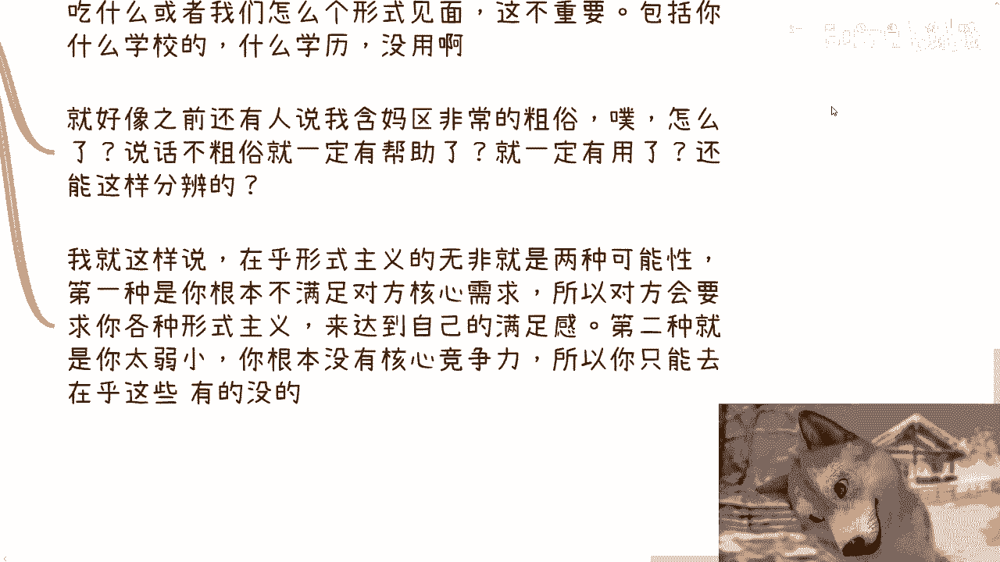

# 你认为重要的并不代表全部，也不代表剩下的不重要 - P1 - 赏味不足 - BV1QH4y1c7Kg

好大家好，这个今天我们讲的主题呢蛮重要的啊，就是比较抽象啊，但是我里面会给你们拆开来说的啊，就是你认为重要的东西呢并不代表全部，但也不代表剩下的就不重要啊，呃什么意思呢。

意思就是说很多时候啊任何一个东西啊，你们不要一下子想到学历啊，学历的确是其中一个，但是很多东西都这样子啊，任何一个东西重要吗，重要的，但他所谓的重要只不过是对于特定人群，特定范围，特定规则内它重要的。

但是问题是世界并不是只有这些人群，这些范围和规则的，一旦跳出去，这个东西就反而变得不那么重要了，而在别的规则范围，特定的人群里面会有别的东西更重要对吧，那么这个时候，就看你这个人到底适合于哪种东西啊。

哪种类型，那么简单来讲，就是说我们不要自己去吊死，在比如说现在很多人十几岁，20几岁对吧，他自己去吊死在某一个所谓的重要的东西上面，但是不是每个人都适合这个东西的，对不对，但但你不适合这个东西。

并不代表你不适合别的东西，你可能天赋点变在别的东西上面对吧，但是你自己不去追求，不去探索，然后你说好，我拒绝所有的可能性，我就要吊死在这棵树上面，然后到最后你可能还做不出个所以然来，那他妈怪谁呢。

对不对，好，那么第一个啊哦我先说一下啊，那个本周本周那个北京活动已经定了好吧，本周日28号下午啊，28号下午在东直门地铁站附近，那么本次活动内容呢，一个是我会的给大家说一下，就是说私企呃，国央企。

外企出国等，这个目前一些offer的选择跟未来的一些发展，那第二个就是说个人从个人角度来讲呃，还有很多人想做跨境电商跟自媒体对吧，那么现在是否值得去做，以及其风险风险点啊。

还有就是说低空经济的这个知识普及好吧，然后了解详情的跟报名的可以继续私信我啊，呃那么我们来说啊，第一，我们今天就是从不同的几个点和维度来讲啊，首先第一个就是大家最最贴合的。

也是最最关心的一个东西，就是学历，对不对啊，你说重不重要，当然重要，没毛病啊，国内国外都很重要，嗯但是他的所谓的范围，所谓的规则，所谓的人群是什么，就是你找工作对吧，那同样的我们分开来讲，客观的说啊。

就算在你找工作的找啊，找工作的这么一个范围里面，你工作年限超过5年以及之后或者更多之后，学历本身，其实给你带来的光环已经越来越少了啊，那么当然你也可以认为啊，不是的啊，为什么呢，因为你说我就算啊。

工作10年，工作20年，我去找工作对吧，我还是需要面试筛选的对吧，这个时候我的学历还是要有用的，就至少得要过这个筛选对吧，我跟你讲对的，但是这件事情本身就是自欺欺人，因为什么，因为你面试的筛选当然有用。

但是你的学历到那个时间的时候，本质上已经不影响对方会不会录用你了，他已经不是一个决定性因素了，因为同样的学历和同样的能力，年轻的人多了去了，他为什么要你呢，逻辑走不通的，你明白吗，逻辑走不通的。

而且另外一方面你也不要来跟我说啊，我做的这个行业，我做这个工种对吧，是呃越老越吃香的那一样的道理啊，搞得好像他妈只有你老一样的，别人不老一样的一样的呀，没有区别的呀，因为人太多啦，对不对。

你你说OK面试筛选有用，我不能反驳你，但这件事情他妈的本身就是一个空的东西啊，对吧，那当然你也可以说啊，那也不能说不重要啊，有总比没有好，这句话也是对的啊，但是如果你的所有的论点都是比上不足。

比下有余的话，那不用讨论了呀，有什么好讨论的呢，对不对，那我就这么说嘛，你高中毕业，都能比中国很多小学初中毕业来的强，你有什么大学有什么好读的啦，你比下有余怎么比啊，啊对不对，那么这拖话就没啥好说了啊。

嗯然后我们再说别的规则和别的赛道对吧，比如说你做商业，那就更不重要了啊，那么有的人有有的人要说了，我跟你讲啊，他他们以前反驳我这么反驳，他说那不是的啊，他说我这学历不高。

别人根本就看不上跟不不会跟我合作啊，我跟你讲，那只不过是你自己意淫出来的关因果关系罢了，明白吗，你要说看得上别人，要真的看得上他只能看得上你能不能赚钱，你有没有赚钱能力，你有没有这个野心跟执行力。

别的没啥好看重的，为什么啊，因为很简单啊，你今天跟我说，你MIT毕业的怎么了呢。

怎么了呢，你MIT毕业的钱能掉下来啊，你MIT这证书能给我印钱啊，能给我出新条爆金币，没有因果关系的呀，对不啦，就你要这么认为，无非都是你自欺欺人，你觉得这个东西很有很重要，对不对。

但核心点不在这个上面啊，我就跟你们这么讲，但凡一个跟你商业合作的，看重你学历的，只有两种可能性，第一种可能性就是他只是把你当工具人，你无非就是换了个地方打工，第二种可能性就是他是个，没了呀，对不对哦。

为什么很简单啊，因为要看重钱啊，看重钱跟你学历有什么关系啊，如果他只看重学历，不看重钱，那他是个啊，谈什么商业啊，谈什么资本家，对不对啊，我早就说过了，你们真的多去问问，那些做项目的人。

我不管是to b to g还too高效，还是to产业园to资本，你去问问看，有任何时候商业项目合作的时候，需要你学历证书的，你去问问看有没有真的，你们自己去问问看有吗，根本不存在的对吧。

我早就跟你们讲过了，只要问你们要学历证书的，或者说项目上到要学历证书，或者说要复印件的那个程度的时候是什么程度，是你们就是过来来给乙方，或者说来给中间方来打工的时候是要的，你明白吗，你永远不是拿大头。

那个你要想要去赚钱，拿大头嗯，这些高学历人是给你打工的，你明白吗哦，社会上面高学历的是给懂得如何攒局人，如何利用资源整合，如何懂得处理关系人来打工的，这是一个不变的逻辑。

行，那么这是第一个啊，第二再说。

比如说你会什么啊，你能做什么呃，这样说啊，几乎我认为所有的问题都集中在这个上面啊，就是我敢打赌，95以上甚至98以上的所有的人，他但凡如果赚不到钱。

或者他但凡就是说做一件事情碰壁，大概率问题就出在这个事情上面，就是为什么，因为几乎所有的人做事情都会事倍功半，为什么。

甚至他会花100分的力气做十分的事情，为什么，因为他们的关注点永远是自己会什么。

以及身边的资源有什么，好啦啊，那么说到这里，有人要说了，那陈老师，那他妈的搞笑了，他说我们不关注自己会什么，不关注我们身边有有资源，我们关注什么，我跟你讲很简单，这也是我一直强调的，哎有没有种可能性啊。

我只是说有没有种可能性啊，最重要的是客户要什么，以及客户到底是谁，以及客户到底为什么为你买单，对不对哦，你不关心钱从哪里来，你不关心甲方要什么，我们永远是围着客户转的，而不是客户围着你们转的。

对不对哦，好那么你说我们永远关注自己会什么，会造成什么一个结果啊，很简单，你说关注自己会什么，和身边有什么资源重不重要重要，但只要你们自己会什么，以及身边的资源，不是这个世界上真正客户想要的对吧。

比如说就像有人跟我说，哎我很会画画，我画画天赋很高，然后呢so对不对，你告诉我哪个客户讲啊，你跟我说啊，那些高净值人群有富二代，那我请问你怎么接触到他们，你他们又为什么选择你，对不对。

那你为什么认识他们，以及他们为什么选择你，如果你能解决的话，你的核心竞争力和核心的门槛，核心的护城河就不在你画画上面了，就在于你怎么接触到他们了，这他妈才是重点啊，对不对啊，如果我们都自己会什么。

不是客户真正想要的，我们大概率如果让别人付钱，一定是我们在推销我们的产品跟服务，那么你想想看，在这种经济情况下面，在这种环境下面，你想推销自己的产品跟服务，你一定是事倍功半的呀，因为对方没需求啊。

你强行喂给他，他凭什么付钱，那么搞笑嘞，对吧哦，还我跟你讲啊，我跟你们讲，还有很多人很搞笑，跟我说，哎陈老师，我是个程序员哦，我会写代码，我说然后呢，然后呢你会写代码，那么中国会写代码人多了啊。

然后呢对不对啊，他说他说哎我想做个做个自媒体对吧，但他还有人说啊，比如说我会打篮球对吧，我会什么那个做做糕点哇，我说大哥没问题都没问题，你们会什么都没问题，我只问一件事情，他妈的客户在哪儿。

以及客户为什么为你们这个东西买单，你告诉我理由是什么，对不对，你你根本就不关心客户要什么，然后你非要硬塞给他，觉得客户要这个东西，不好意思，客户不要哦，那么有没有这种可能性，你从你自己会什么的角度出发。

把你自己卷死了，你可能只能做到20分，但是如果你从客户的需求跟，真正的痛点角度出发，你可能花30%的力气，或者50%的利息，甚至都不用去准备什么。

你就能做到20分，对不对，你你就是我还是那句话啊。

就是说你如果觉得哎，那我会什么，我的确就是就是客户的需求更痛点，但我不会呀，对吧好，那我就跟你讲两件事情，第一你不会，你可以去找会的人来合作，对不对，好，这是第一点，第二点是你不会。

那就代表你做不了对吧，不没不是你活在世界上，我活在世界上，任何一件事都有解的，那你可能找到这个需求跟痛点，你可能就做不了，那你不要硬做，你明白吗，你要如果觉得你做不了，或者你评估下来，你觉得我就不行。

那你就再去找别的需求跟痛点，那他妈的世界这么大，只有一个持久更痛点吗，难道对不对。

你你不要就是说钻牛角尖吊死在一棵树上，然后还最后说卧槽，超老师我不行，不是你不行，是你没有找到正确的路，对吧啊。

很多人问我问题的时候，咱就这么说啊，在真正满足需求的情况下面，比如说钱全市民这些东西，但凡你能满足四者其一哦，或者来说呃有有可能对方还有别的政治需求，我咱不算在这四个四个里面啊。

如果只要你能满足对方真正需求，都是屎，为什么你就好像啊，比如说我们就说什么叫资本家，资本家只关注赚钱的投入产出比，对吧好，那么这个时候如果你要跟他见面，你肯定会在想，卧槽，我是不是要带带个领带。

我是不是要穿个西装，我是不是要什么的人模狗样一点对吧好，我就跟你讲，你但凡能给他赚到钱，你但凡能给自己赚到钱，剩下这些东西你穿什么，脱个拖鞋去也行，你明白吗。

这不重要，这都是辅助东西哦，你包括什么学历啊，学校更他妈没他妈用了，对吧哦但是反过来，如果你不能给他赚到钱，你还非要舔着脸过去见，面对吧，好嘞，那我说不好听点，为什么，因为你满足不了他，他只能卡你。

要么就别见面对吧，那就好像之前还有人，去年的时候有人说我这个视频啊，韩妈特别多，非常粗俗，哎我妈搞笑嘞，哦那照你这么个逻辑，说话不粗俗的，就一定是对你有帮助的哦，说话不粗俗的就一定有用了哦。

还他妈是这样分辨的啊，对不对，我跟你们这么讲啊，我就这么说，第一种是你根本不满足对方的核心需求，你根本没有摸到对方的核心需求，所以对方会要求你，你们可以把这一条把它放到任何一个地方。

你们套用你们自己想想看，对不对，第二种是什么，第二种就是你太弱小，你根本没有自己的核心竞争力，心里虚的一逼哦，所以你只能去在乎这些，有的没的，你再去想想看，对不对，一样的。

对吧好第四。

那么你认为别人对你的看法很重要啊，这个是什么呢，就每次啊就谈到企业端这个个人端的合作啊，就是很多人会问我，他说哎呀陈老师啊，我们这个很担心啊，就是因为我们以前没做过啊，这个做了万一当中有些错误对吧。

别人对我们的印象不好了，怎么办啊，他说会不会影响我们以后接单对吧，会不会影响我们以后的合作啊，以后万一没有单子怎么办，我跟你讲，他妈每次这种问题，而且我我跟你们说这问题还特别多，我都不知道为什么啊。

就是哈我不知道是应试教育把把大家读傻了，还是大家自己读书读傻了啊，就是这个问题真把我气笑了，哎我就问你啊，我说我说是对方多牛逼，能让中国很多人知道你吗，啊免费给你打流量吗，啊同时还不跟你合作哦。

还能操纵别人，不跟你合作啊，哦还是说反过来你有多牛逼，能让别人用这么大的能量来封杀你。

哎我就不明白了，对不对啊，然后你说印象好不好，重要吗。

重要，但是你不能因为这个东西重要而怕犯错误，因为本身你说重要吧，他只是就像我们说的，他只是在你认为的范围里面重要，你但凡把格局稍微放放大，你就会觉得他妈的无所谓，哎拉他妈倒，你爱咋地咋地对吧。

比如说你跟我说行啊对吧，比如说啊你你跟我两个人合作对吧，就算我觉得你是个垃圾，我拉黑你了，但是对你来讲无所谓啊，为什么，因为地球上人这么多了，怎么了呢，你继续找别人合作啊对吧，人这么多了，你在乎什么呢。

只要放还呃，如果你在乎这些，只会放缓你前进的脚步，而且我我跟你们这么讲啊，我在这个地方说句说句怎么说，说句哼可能露骨一点，透彻一点，更更接地气的话是什么，就是如果我举个例子啊，比如说你我今天把你拉黑了。

我觉得你是个垃圾，那么你一定会有你的短板，或者你一定是有错误点的对吧，那么你是需要去反思和复盘，你到底这个问题出在什么地方，以防止你下次再出这个问题，对不对哦，那么但是反过来说，你也可以一意孤行。

为什么，因为他因为基本盘足够多，就是我认为你是错误的，我认为你是一个，好像一眼就能看出来你有问题的这些东西，别人不一定看得出来啊，对不对，那你就跟那些不一定看得出来的人合作好了，这又怎么了呢，又如何呢。

对吧，就是你放就是放到底说穿了，你说印象好不好，重要吗，无所谓啊，为什么，因为就像我们刚刚说的，无论你做任何东西，任何一个行业，任何一个东西，它不是围着我转，也不是围着你转的，我们都是尘埃。

有啥重不重要的对吧，重要的只有一个，那就是你钱有没有赚到，你关系链有没有沉淀下来，你有没有了解到里面运作的一些逻辑，别的没有了，还有他妈有什么重要不重要的。

对不对，对吧，所以说我一直跟你们讲啊，我每次都是说那句话叫什么，就说我们要去学的，其实就是各行各业里面的已经存在的，赚钱的逻辑，别的都不重要，因为所有的我我就这么跟你们讲，你们想要做的事情。

跟你们所走的路一定不是前无古人，古人也不是后无来者的对吧，就大家其实都是一个重复造轮子的过程，而我们重复造轮子的时候，又得要把这个重复的力量跟造的这个轮子，得要在关键点上面。

你不要去造那些无用的轮子对吧，就很多人在那边造的轮子是跟钱没有关系的，那么在那边造半天有啥用呢，对不对啊，所以我才一直说，就是说我以前不是也一直讲嘛，就说不要把自己太当回事啊，不要把不要太把自己当个人。

也不要太把别人当个人，其实也是这个道理，就是我们做所有的事情，都是只为了目的去服务的，而且这个这个这个这个做的这个事情，是一定要达得到这个目的的，至少逻辑上是走得通的，对吧，哦那么你说你去做。

那否则你说你说啊，我我我就就很多人啊，其实其实就是怎么说呢，就是死磕对吧，他就你就像很多人就会跟我说，那那陈老师，你按你这个说法，那那我们要是学历读不上去，我我我没有别的路啊，我就死路了。

不是你不是没有别的路，是你自己不愿意去探索，你不愿意去了解你自己，很多人他是自我内心就拒绝很多的可能性，然后给自己一个说法，叫我们没有路，那那这就是我说的，就是你在不自救之前，你指望别人救你。

不现实对吧，你最终除了抱怨社会，抱怨家庭，抱怨父母，抱怨别人，没有别的路啊，因为你从源头就是自我否定和自我的这个，可能性的拒绝，那你怪谁呢，对吧，好行吧啊，那就这么着吧，今天好像时间有点长哦。

额那个活动的话好吧，活动的话就继续报名啊，继续报名呃，这个详情也可以私信我，然后另外一方面就是说你们自己做什么业务，或者跟别人合作什么业务啊，包括这个合作当中呢涉及到一些合同啊，股权啊，期权啊。

商业计划书啊，白皮书啊，分红分润啊啊，包括你们希望通过跟我的一些沟通啊，以我的一些这个对经济形势的了解，包括对整个呃这个这个这个商业的了解啊，能够结合你们个人的情况，给你们一些更接地气的建议和规划的话。

那么你们可以整理好对应的问题跟个人背景，我们再来组咨询，好吧行啊。