# 你跳槽或者行业，本质上是一个坑到另外一个坑 - P1 - 赏味不足 - BV1cN41157bu

大家好，我现在已经在北京了。

然后下午的话就搞那个在微软那个活动。

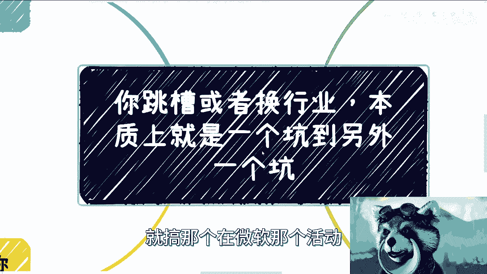

因为这次的话由于场地的原因啊，就是呃限制了60个人。

等下次来北京找看看有没有那种不限制的，因为这次还是有蛮多小伙伴没有报上嗯。

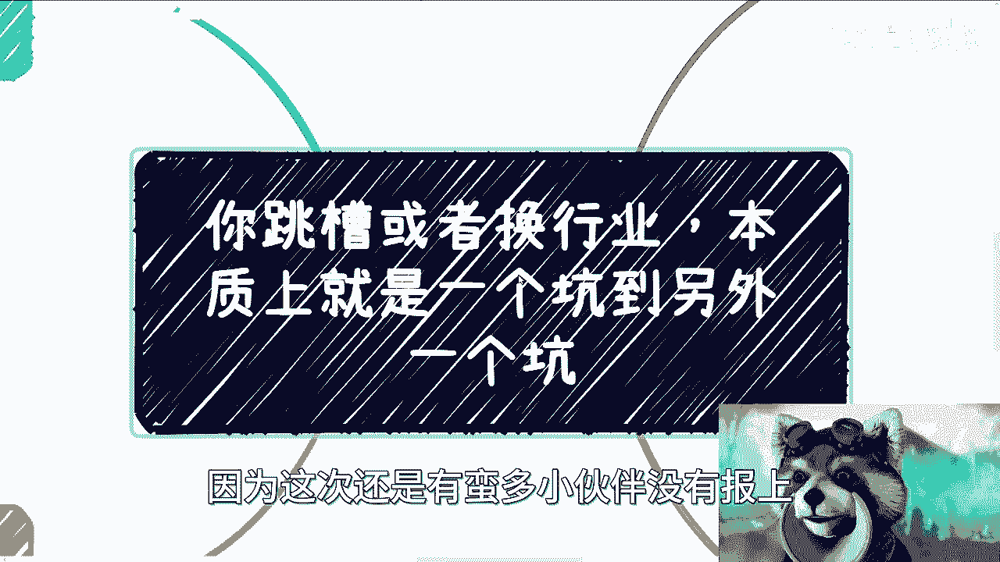

然后我们今天讲的这个主题呢叫做呃，跳槽或者换行业呢，本质上都是一个坑到另外一个坑呃。

首先啊这个前提写在这边啊。

就是还是去头去尾对吧，就我们去掉那些头部的精英对吧，去掉这个最底部的中间来讲。

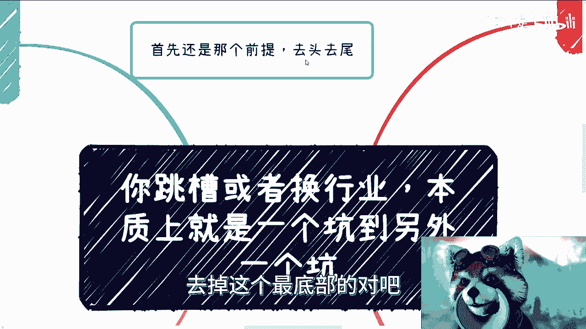

我觉得从比例和基数上来讲。

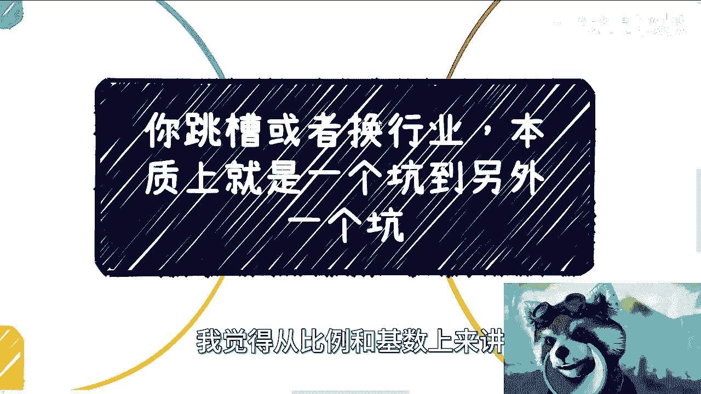

本质上是大差不差的，36，那么首先第一个我们来看啊。

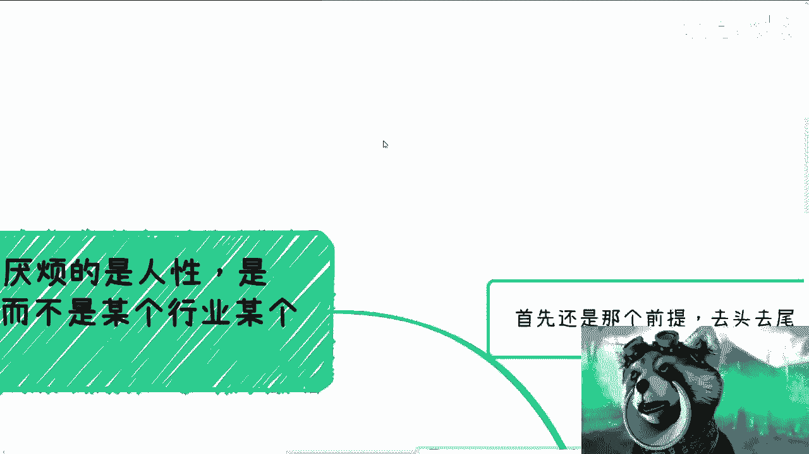

就是你说大部分人跳槽或者换行业呢。

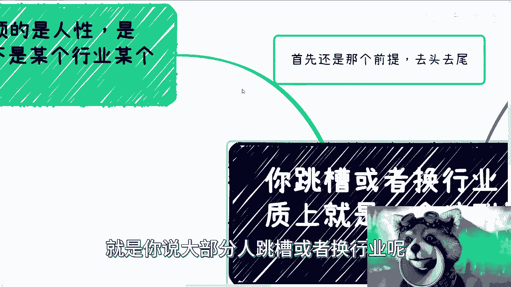

它是为什么对吧，他基本上厌烦的是比如说一个领导啊，还是一个公司，还是说是一个一个怎么样的一个一个现象对吧。

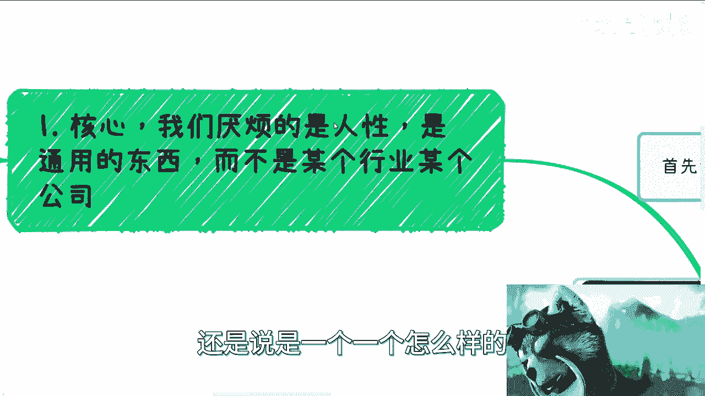

这个我觉得核心我们得要去明白，我们厌烦的可能是一个人性，或者是一个通用的一个东西，那么我这边也给你们展开啊，首先第一个就是说你们有没有想过。

比如说你说你要跳槽，你要换行业对吧，你原因是什么，无非是做的不开心啊，钱不够啊，加班太多，性价比低，天花板低等等对吧，没有发展啊。

那么就如同你找了个对象对吧，你说你有上头期对吧，但是上头期过了之后，你发现这个人到处都是毛病，然后你就不喜欢了，那么问题来了是吧，你说你厌恶一个公司或者一个行业本身，或者说你厌恶了一个领导。

你是对这个公司还是对这个行业，还是对这个领导，或者是你的这个同事，比如说产生了这个厌恶，然后导致你离职呢，本质上是不是的对吧，其实就是说你厌恶的，或者你讨厌的，可能是这种现象的一种本一种本质。

或者说这种本质是跟人性有关的。

所以说你幻想着通过某种比如说你说啊。

我要跳槽或者我要换行业，甚至我要出国这种手段去改变了，本质上是没有太大意义的，那么我们来第二个，我们来换举个例子，比如说你今天在一家小公司对吧，领导也是啊，要流程没流程，要成长没成长，要钱没有钱对吧。

还24小时控，那自然想着就是说你说啊，我想着跳槽去大公司去外企，那当然了，这个从中国角度来讲，大这个部分的外企吧其实还是不错的，但是这些部分的不错的外企，基本上也都已经这个离开国内了啊。

那么呃想着大公司这里好，那里好，流程好，文档好啊，领导好，薪资多，那么问题来了，就如我们刚刚第一点所说的对吧，就你们大部分厌烦的跟不喜欢的，它是一种现象，它是一种状态，而不是一个特定的公司或者人。

这就像我们不能说因为一个人穷，他就不开心对吧，或者因为一个人很有钱，他就很开心，但其实本质上穷也好，他有钱也好，他都会开心或者不开心，但是只不过呢他们面对的事情不一样，但表现形式是一样的。

意思就是说你现在啊，比如说你说我厌恶什么东西，或者我要去跳槽，我要去换行业，但是你换了之后，人是会变的，就是你的追求啊，你的满足啊，也都是会变的，你去了大公司，这就像我们刚刚说的。

你谈了一个感觉不错的对象，或者处了一个不错的朋友，你觉得这里好那里好，是因为你本质上有滤镜啊，你真的去了几个月之后，你应该会不开心啊，所以说你就会这个时间长了之后呢，基本上你就会发现啊，这本质上都一样。

没什么太大区别，因为无论哪边本身都是有缺陷的，因为你业务的可能是一种管理模式，或者说本身就是啊被这个KPI压着不开心，或者说呃可能你会觉得，但凡只要是就当然时间长了，你可能就会觉得。

但凡可能只是一种这个上班的模式。

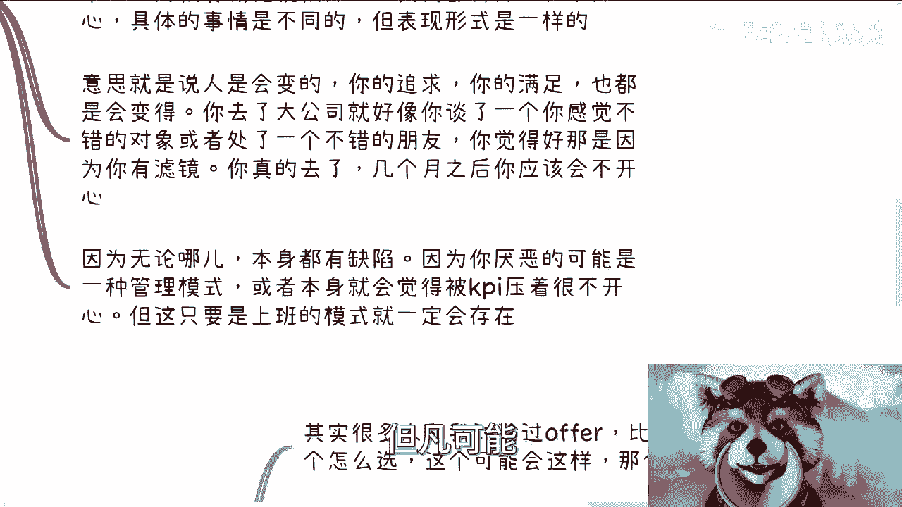

你可能都不开心对吧，你最终会发现我可能是不喜欢上班。

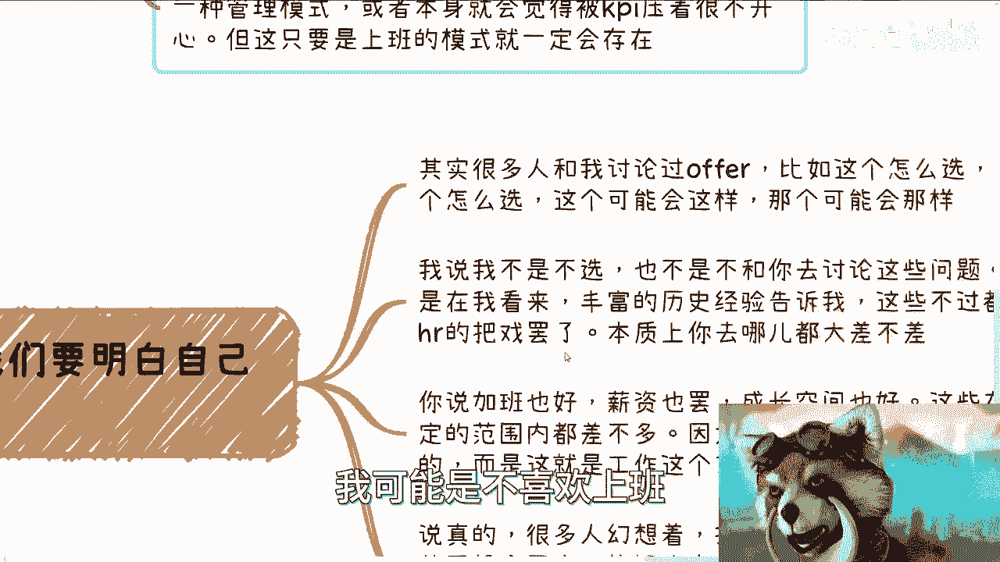

那么第三个啊，核心还是在于我们明白自己到底要什么啊，其实很多人跟我讨论过offer啊，比如这个怎么选，那个怎么选啊，这个可能会这样，那个可能会那样，我说我不是不选啊，也不是不跟你们去讨论这些问题。

而是在我看来呢，这个丰富的踩坑经验告诉我们是吧，就是啊，这些不过都不过都是企业或者hr的，这个呃PUA啊，本质上你去哪都大差不差，你说加班也好，薪资也罢对吧，成长空间也好，这些在一定范围内呢。

其实都差不多，因为这个不是说公司或者来说hr去影响的，而是说这个工作本身它去影响的，或者说这个工作本身在这个社会的大框架下面，去影响的，那么所以说就像我们刚刚说的，你本身幻想着说你换个工作啊。

甚至换个行业，甚至换个国家能改变什么对吧，这个是大概率啊，我们说在去头去尾的这些人群当中，大概率是不可能的，因为最大的问题是人对吧，你走到哪，反正人都是一样的，无论是自己还是别人的。

你可能最终能改变的就是自己是吧，你别人都一个大大概率，你碰到的人如果基数足够大，其实大概率都一个吊样子，那么最后一个呢就是说有小伙伴就要问了，他说那如果来说我们不上班对吧，我们不是架在这么一个公司里面。

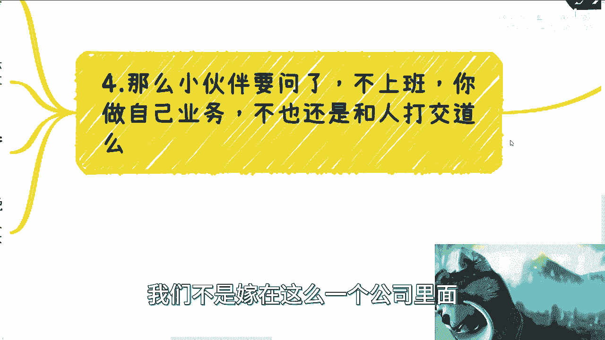

他说我们做自己业务，那不也是跟人打交道是吧，那本质上呢是这么回事，所以说呢你看啊我们做任何事情，都是在一层一层给自己套这个DEBUFF，比如说我们上班对吧，你就是在社会下套了一个公司啊。

公司下套了一个劳务合同，劳务合同下面还套了各种领导跟老板啊，那么既然正如我们之前说的都是草台班子对吧，那我才一直和大家说啊，可以尽早的去积累自己的合作伙伴，和自己的这个业务啊，因为至少这些事情做了呢。

自己是有积累的，而不是说是给公司或者给你们的，就或者说给别人做嫁衣是吧，你也不至于说啊，这个在整个已经有了很多层象牙塔的情况下面，还套上公司，套上领导，套上老板这么多的DEBUFF来压迫自己。

因为大部分时候啊，其实呃你会发现就时间长了，你就会发现其实打工也好，不打工也罢，这个事儿呢没有什么一个很绝对性，你说啊我打工一定不开心，不打工就一定很开心是吧，但是最大的问题是在于打工。

大部分的时候你是被压迫的，以及你会在一种嗯你会在一种非常强烈的，或者来说非常紧张的，这种这个精神状态压迫下面，处于一种极度的焦虑和忙碌的一个状态，同时呢还困在这个象牙塔当中，但却不自知啊。

所以说呢在这个情况下面，我们回到这个地方啊，你说你跳槽或者换行业对吧，你说你现在可能在设计院做设计啊，或者在在在游戏对吧，或者在土木啊，你说我换个行业或者怎么样，或者来说现在有一些小伙伴觉得啊。

我薪资不满意或者怎么样，其实嗯一样的道理，就是在你年轻的时候呢，你换你说有没有区别有啊，但是同样的你换着换着换着对吧，就是比如说几年之后啊，等你年纪稍微大了，或者说整个的这个竞争力不是那么强了。

那么你到最后发现，其实你从一个坑到了另外一个坑，可能你不开心还是不开心，你在去之前可能你就想着啊，我去这家公司对吧，我就很开心，我马上就要跳槽了，我要脱离苦海了，但是你去了这家公司之后。

可能过了两三个月对吧，你立马就会发现哦，其实我还是很想跳槽，对，就是我我发现这地方可能也没有想的那么好，那么也是个很的地方，只不过是从一个地方，挑了另外一个的地方，所以说这个就像我们之前说的。

就是说你本质上很多时候啊，你你面临的这个问题，你说很多人说rain对吧，或者说怎么样，你本质上的问题不是在于你换个环境，你因为本你你从国内也好，海外也好，或者其他地方也好，你碰到的人啊，公司啊。

就我们说的，你碰到好的概率很少对吧，你碰到那种特别特别什么什么，把你把你卖到卖卖，卖到这个嘎腰子去的也比较少是吧，但是你这种去头去尾在当中就比较中庸的，基本上就是去了之后也就压榨你，然后你也不开心的。

这种公司就特别多，或者这种人就特别多，所以说本质上你换哪都没什么太大区别。

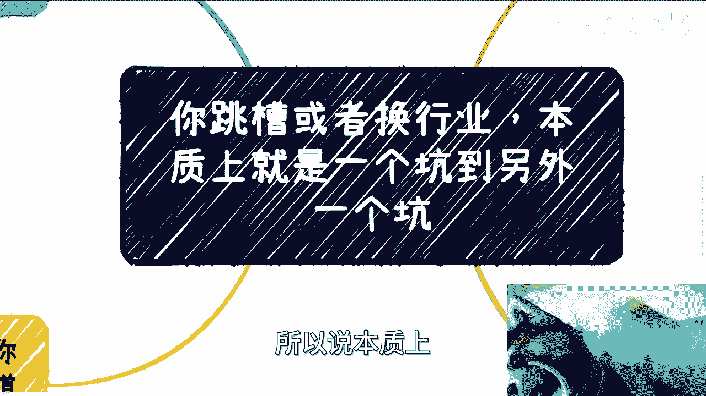

所以在这点上面呢，我是觉得嗯就一样的。

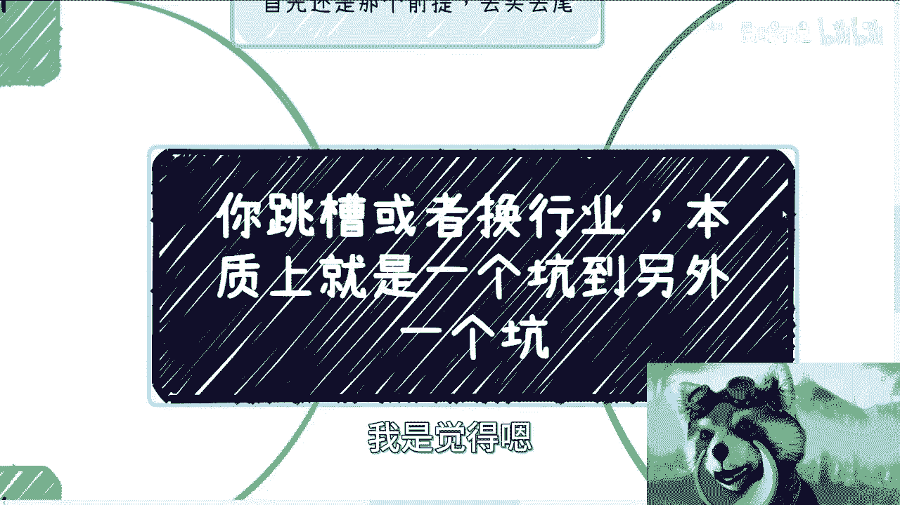

就大家与其去关心说啊，我跳槽或者换行业，或者去呃寻求外部的一些环境的改变，你还不如说你现在开始对吧，多积累自己的一些资源啊，多积累自己的一些呃关系啊，或者说多积累自己的一些业务啊对吧。

那那所以说你回过头来想啊，其实你在什么行业，或者你在什么岗位，或者你在呃这个国内还是坐在海外的某个国家，本质上没有区别，区别是在于说你自己能否有很强的这么一个啊，商业的sense。

同时你能够积累到属于自己的这种关系啊，或者说啊这种业务，那这个我觉得在意识上，在这种积累上面是比较合理的啊，否则的话其实就像我们以前说的，你在国内就我们以前这么说，就你在国内但凡赚不到钱。

或者你在国内积累不到一些东西啊，或者你说在你已经熟悉了这个土地跟文化上面，你要是呃赚不到钱，那你指望说你换个环境对吧，你说我去了一家外企对吧，或者甚至去润了我跨了个国家，你就能赚到钱，这个概率不大啊。

基本上就没有这个概率，所以说，前两天啊，那个视频下面，评论区也有很多小伙伴提到了什么，提到了，就说啊我这个叫什么，就是他们基本上我觉得现在这个看视频啊，他们基本上就是说看了个标题，然后视频本身是不看的。

然后在评论区这个就直接开始评论了，我现在就看到这种评论就直接拉黑了，我跟你们讲啊，嗯好。

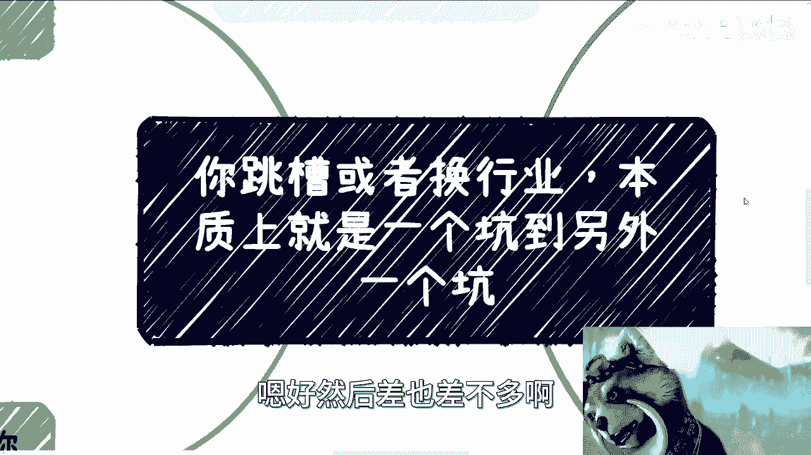

然后差也差不多啊，然后现在就中午了，我们就准备去这个啧啧会场啊。

参加活动好吧，然后大家反正要是有任何的这个呃问题，反正整理好自己的这个question list，然后也可以整理好这个需求，包括职业规划，包括其他的，反正你们就可以在走私信再咨询好吧行。

然后那我们这一期就先这样。

