# 你跳槽或者行业-本质上是一个坑到另外一个坑---P1---赏味不足---BV1cN41157bu_n

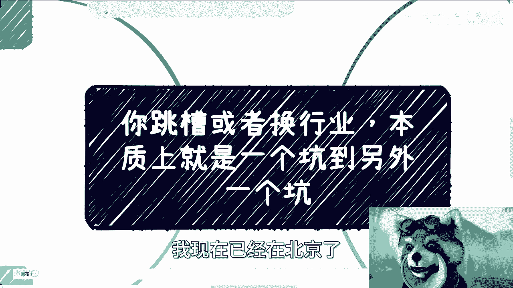

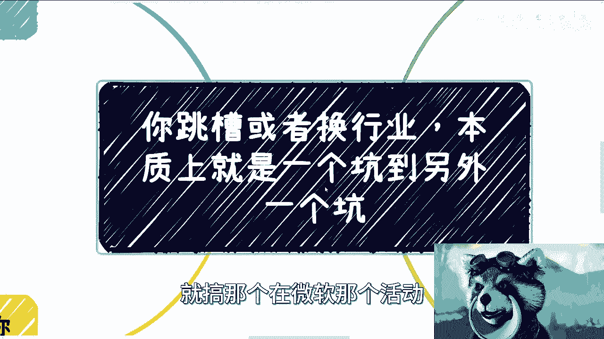

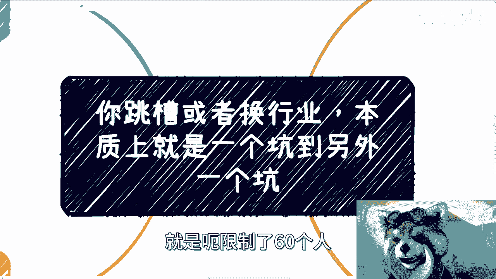

在本节课中，我们将要学习一个关于职业发展的核心观点：无论是跳槽还是转行，本质上可能只是从一个困境进入另一个困境。我们将深入探讨这一现象背后的原因，并思考更有效的应对策略。

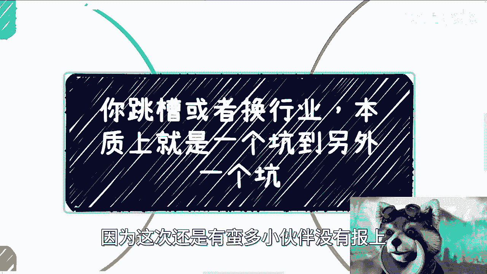

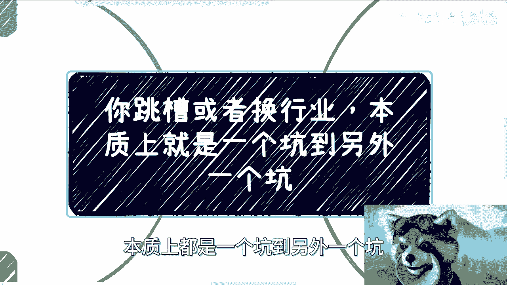

---

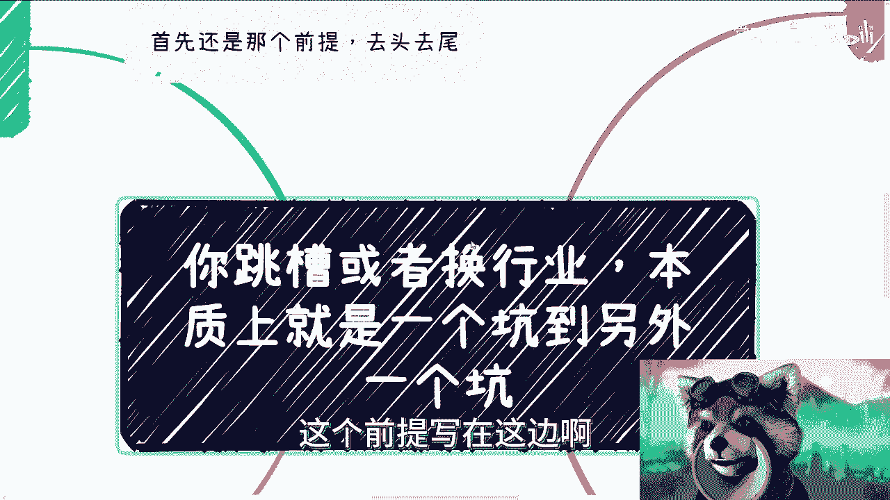

## 课程背景与前提

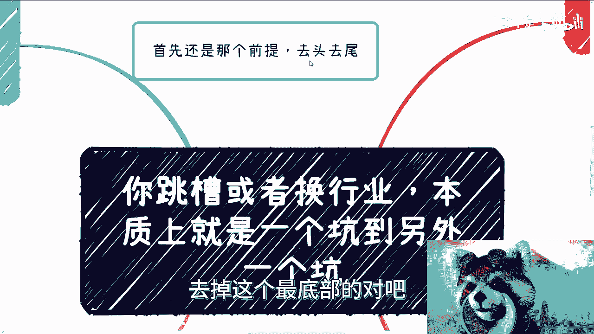

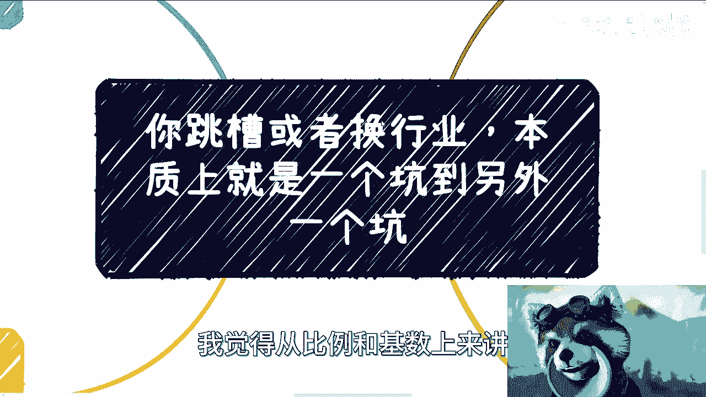

我已经抵达北京，准备参加下午在微软举办的活动。由于场地限制，本次活动仅限60人参加。期待下次能找到不受人数限制的场地，以满足更多伙伴的参与需求。

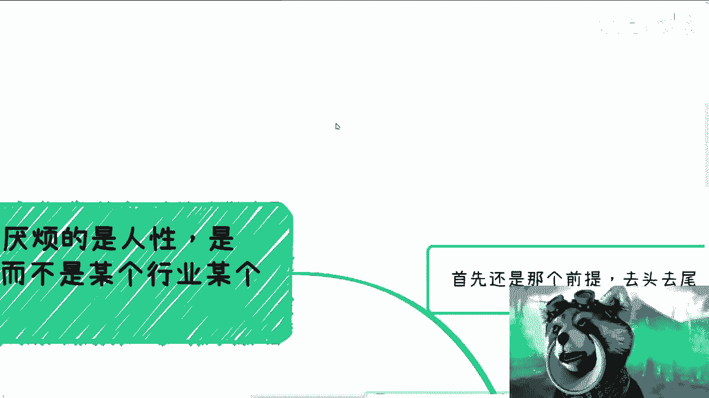

本次课程的主题是：**跳槽或换行业，本质上是从一个坑到另一个坑**。

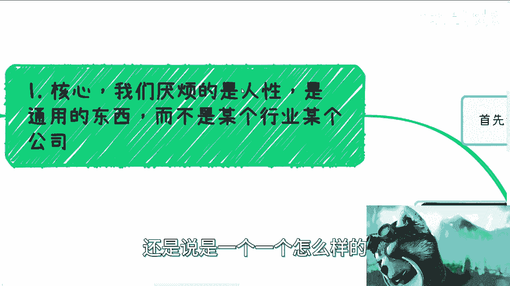

在展开讨论前，我们需要明确一个前提：本课程的分析对象是去除头部精英和最底部人群后的中间大多数。从比例和基数上看，这部分人群面临的职业困境本质上是相似的。

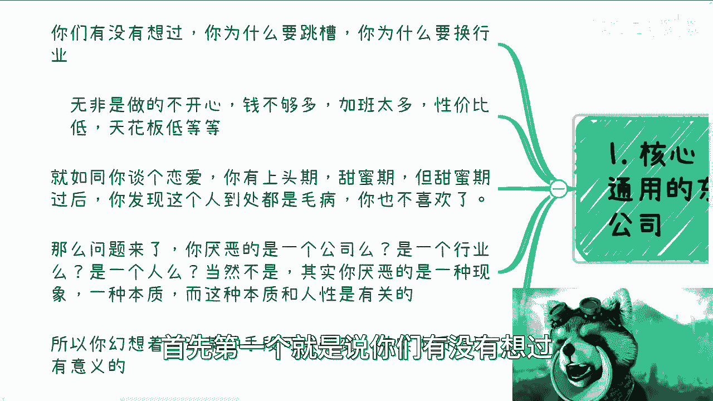

---

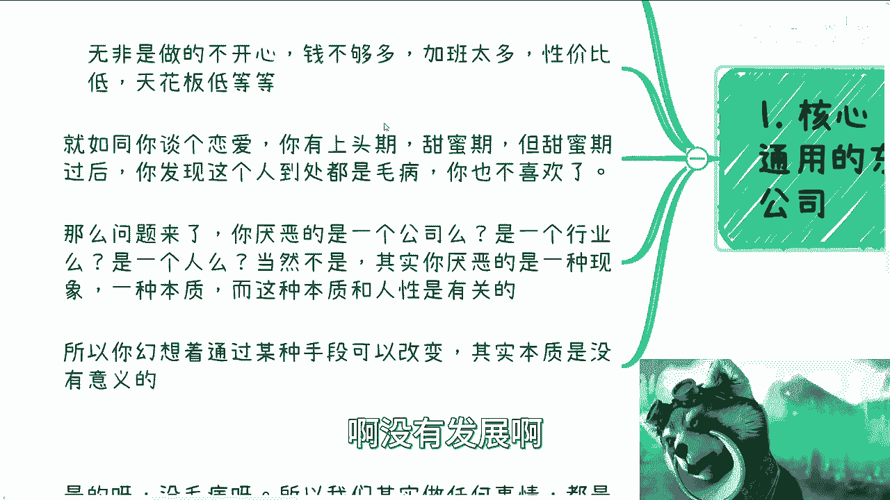

## 核心观点解析

上一节我们介绍了课程的主题和前提，本节中我们来看看支撑这一观点的几个核心逻辑。

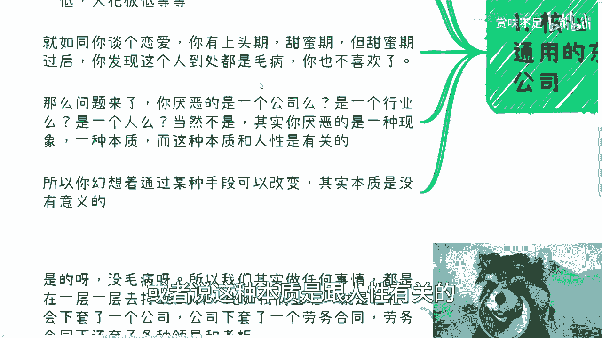

### 1. 厌烦的根源：现象而非特定对象

大部分人跳槽或转行的原因，通常是对领导、公司或某种职场现象感到不满。

以下是常见的离职原因列表：
*   做得不开心
*   薪资不足
*   加班太多，性价比低
*   职业天花板低，没有发展空间

这类似于恋爱关系：热恋期过后，你会发现对方身上有许多缺点，从而产生厌恶。问题在于，你所厌恶的究竟是**这个公司、这个行业、这个领导**，还是**由他们体现出的某种普遍现象或人性本质**？

**核心公式**：
`你厌恶的对象 ≈ 特定的人/公司 + 普遍存在的职场现象/人性弱点`

因此，幻想通过跳槽、转行甚至出国来彻底改变现状，意义可能不大，因为你试图逃避的是一种普遍存在的“本质”。

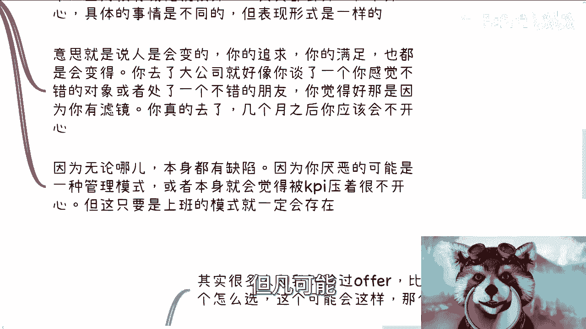

### 2. 滤镜效应：新环境的美好幻觉

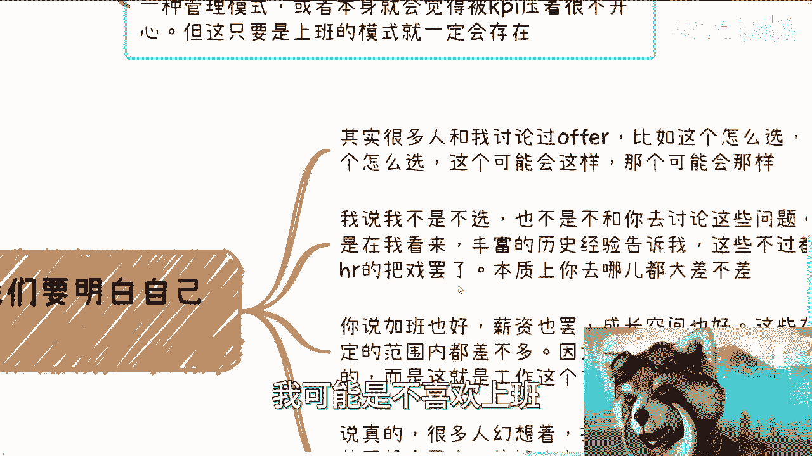

承接上一观点，我们常常对未知的新环境抱有美好幻想。

例如，你在一家小公司，可能面临流程混乱、成长有限、薪资不高、领导监控严密等问题。于是，你向往流程规范、文档齐全、领导专业、薪资丰厚的大公司或外企。

然而，正如第一点所述，大部分不满源于普遍状态，而非特定环境。这就像我们不能断言穷人一定不快乐，富人一定快乐。不同处境的人，面对的烦恼不同，但不快乐的表现形式是相似的。

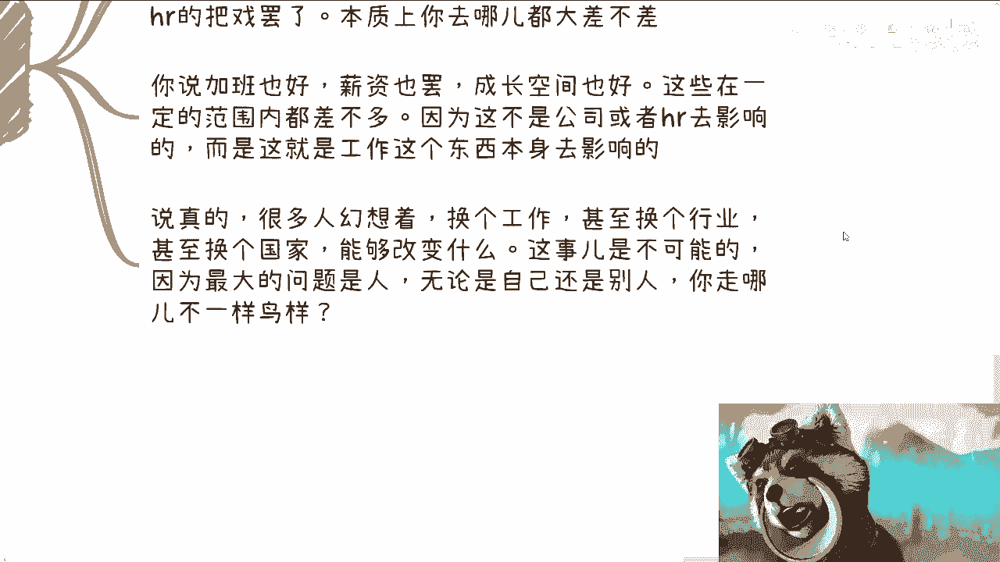

**核心逻辑**：人是会变的，你的追求和满足感也会变化。进入新公司初期，你带着“滤镜”，觉得处处都好。但几个月后，新鲜感褪去，你可能会再次感到不开心。最终你会发现，**任何环境都有其缺陷**，无论是管理模式、KPI压力，还是单纯的“上班”这种形式本身。你最终可能意识到，自己厌恶的或许是“上班”这件事。

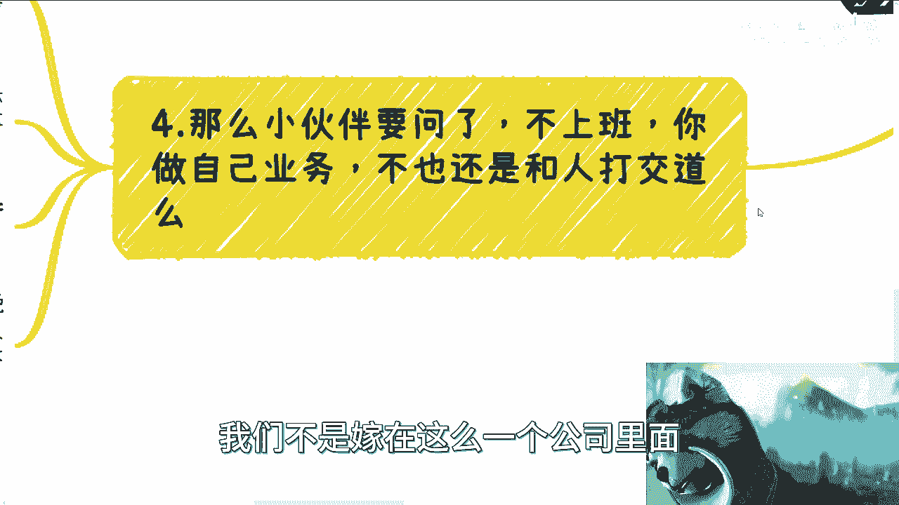

### 3. 选择的真相：框架下的有限性

经常有人与我讨论如何选择Offer，分析各家公司的利弊。我并非不愿讨论，而是丰富的“踩坑”经验表明，许多所谓的差异不过是企业或HR的营销话术。

**核心观点**：在一定范围内，无论是加班强度、薪资水平还是成长空间，不同公司之间其实**相差无几**。这并非由某家公司或某个HR决定，而是由**工作本身的性质**以及**社会大框架**所决定的。

因此，对于大多数“去头去尾”的普通人而言，幻想通过更换工作、行业甚至国家来根本性改变处境，概率很低。因为最大的不变量是**人**——你遇到的人（包括你自己）在足够大的基数下，行为模式大体相似。

### 4. 破局关键：积累自身而非依赖环境

既然外部环境改变有限，那么出路何在？有伙伴会问，如果不依附于公司，自己做业务，不也要与人打交道吗？本质确实如此。

我们做的每件事，其实都在一层层为自己叠加“负面状态”（DEBUFF）。例如上班：社会框架下套着公司，公司下套着劳务合同，合同下又套着领导和老板。

既然职场多是“草台班子”，我一直建议大家应尽早开始**积累自己的合作伙伴和业务**。这样做至少有属于自己的积累，而不是永远在为公司或他人做嫁衣。你也不至于在已有的多层“象牙塔”中，再叠加上公司、领导、老板等多重DEBUFF来压迫自己。

**核心区别**：打工与否，本身不绝对决定快乐与否。但打工的大部分时间，你处于一种**被压迫、高度紧张、极度焦虑和忙碌**的状态，并且困于“象牙塔”而不自知。

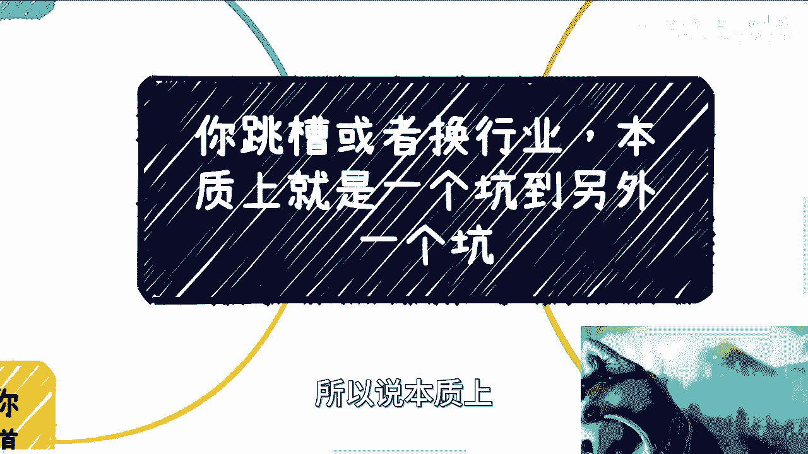

---

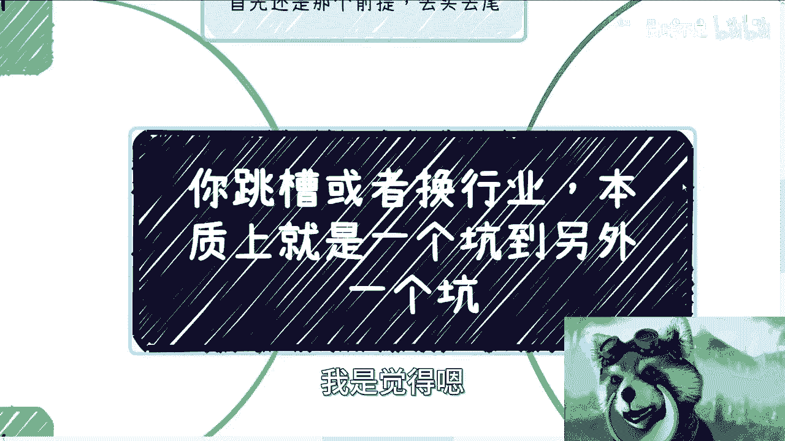

## 总结与行动建议

本节课中我们一起学习了关于跳槽与转行的本质思考。我们分析了不满的根源往往在于普遍现象而非特定对象，指出了对新环境的“滤镜效应”，揭示了职场选择在框架下的有限性。

最终我们发现，从一个地方跳到另一个地方，很可能只是**从一个坑进入另一个坑**。年轻时频繁更换或许感觉有区别，但随着年龄增长、竞争力变化，最终会发现核心问题并未解决。

**核心行动建议**：
与其耗费大量精力寻求外部环境的改变，不如从现在开始，将重心转向内部积累：
*   **积累资源**：人脉、信息、技能。
*   **积累关系**：发展稳固的合作伙伴网络。
*   **积累业务**：探索和建立属于自己的事业基础。

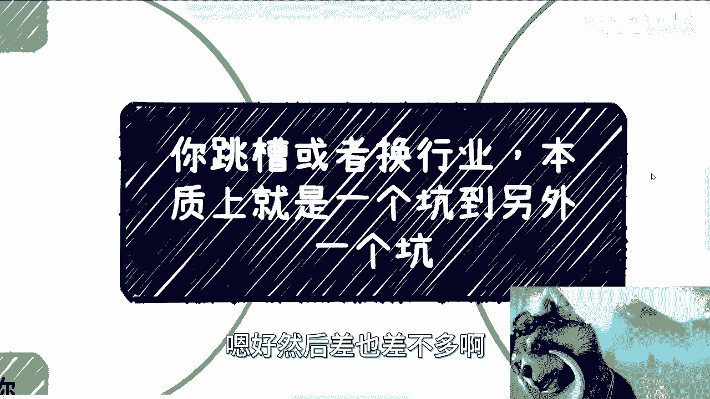

**最终结论**：你在什么行业、什么岗位、什么国家，本质区别不大。真正的区别在于，**你是否具备敏锐的商业意识，以及能否积累起属于自己的核心资产（关系与业务）**。如果在你熟悉的文化和土地上都无法实现积累，那么指望通过更换环境来逆天改命，概率微乎其微。

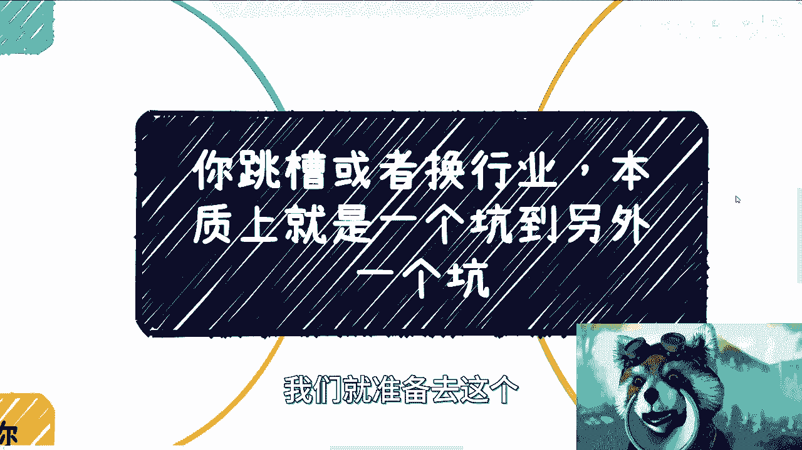

---

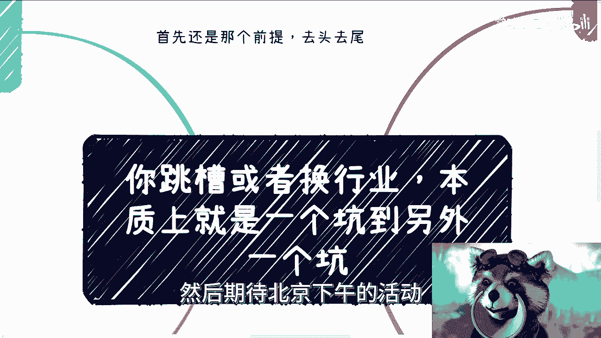

（课程结束，后续为活动预告）
现在是中午，我准备前往活动会场。如果大家有任何关于职业规划或其他方面的问题，可以整理好问题清单和具体需求，通过私信进行咨询。本期课程到此结束。