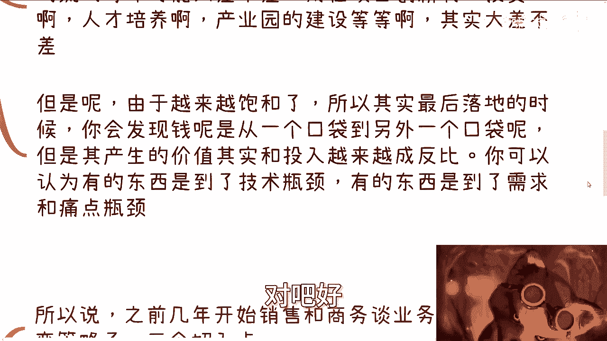

# 你还用以前的销售思路，你现在赚钱很难或者根本赚不到钱 - P1 - 赏味不足 - BV1yg4y1S7Gb

好大家好，我已经到深圳了，这个能听懂吗，啊然后呢我就抽个时间给大家这个更新一下啊，我想了一下，可能这个内容呢我还是放在这个充电里啊，呃本期这个内容呢，叫你如果还用以前的这个销售思路啊，你是赚不到钱的。

或者说大概率赚不到钱，或者说你赚钱会很困难，我得帮他飞一下啊，呃农路过，刚用老赵啊。

妈妈是死路啊，妈妈这个是房产，能赚不到钞票了啊，呃前情提要，因为上一次我们那个充电视频，我们也看到过了嘛对吧，就是说我们说2024年的这个，前后的一些现状对吧，那么你们仔细想想看啊。

我们以前卖东西怎么卖的，就是说你正常企业啊，你有销售有营销对吧，就比如说线上营销啊，线下营销啊对吧，开展会啊对吧啊，然后商务是谈判啊，呃但是核心逻辑是什么，核心逻辑就是要秀肌肉。

就是跟别人说我们多么牛逼啊，我们的产品多么多么好是吧，然后我们怎么来就怎么解决你的问题，怎么样怎么样啊，包括以前你说起那个软件这边，比如像什么很多CIM嘛对吧，或者其他东西其实都一个道理对吧。

就是说你解决痛点，解决问题，但是啊你说你们有没有想过另外一个问题，就是说以上这些东西，它有一个还有一个前提是什么，就这个前提他得有需求对吧，有痛点，也就是说你对上老板，对他们的这个领导。

对老板他得有汇报的这个切入点对吧，你总不能说你说啊我们这个东西就就用啊，这个到底有什么需求，不晓得啊，有什么痛点不晓得啊。

对吧好让我们来说第二讲啊，那么需求跟痛点呢本质上一直都在的，但是比例上来讲啊，呃就我跟你们讲的，就是24年往前和20年往后。

它会趋于一个饱和，就是也不知区域饱和，就其实已经很早就饱和了，就说互联网发展这么多年啊，各行各业，你说就算是不做新功能行不行也行啊，对吧，你你你你不买软件，不去升级行不行也行啊，你就维持现状吧。

但是你说新功能要不要做也要做啊，因为市场也是需要一些这个新的东西，来做刺激的是吧，这个也没毛病啊，但是呢你们想想看啊，就是说以前跟现在最大的区别在哪里，就在我们2014年那一节视频里面也说到过，对吧。

以前是高速发展啊，以前是个人企业跟着市场一起走的。

现在是什么，现在是市场已经找不到很大的这个增量，就那点对不对，那么跟以前百废待兴这个状态肯定是不一样的，那你想啊我们从整个社会角度来讲，其核心本质是金融对吧，那么金融它是什么。

它就说我们就说啊钱它是需要流通的，它是有价值的对吧，你今天有个多少多少钱，你藏在那边，本身这个钱是没有价值的，那么从某个时间点开始，我估摸着差不多是在1718年左右哦，那么你那个时候往后你就会发现。

其实很多项目它是呃是在空转的，什么叫空转啊，也就是说我们从上到下，从左到右，从里到外所有的啊，比如说财政类企业相关的对吧，这个政府相关的高校相关的对吧，所有的钱你每年流动可能大差不差的。

就比如说我们随便打个比方，比如说这个人才培养对吧，全国可能打个比方，每一年也是几百亿对吧，那么你用在创新啊，用在投资啊，用在培养啊，用在产业园建设啊等等等等，就是说本质上你说他有没有会呃，会不会有差别。

有差别，但是也不可能说啊，今年我给你500亿，明年收到100亿对吧，后年涨到600亿，不会的啊，它本质上大差不差的，但是呢你会发现由于啊各个地方越来越饱和，所以其实最后的落地的时候。

你就会发现一个什么问题呢，就是钱啊永远是从一个口袋到另外一个口袋，对吧这没问题啊，他前一定是一个口袋到另外一口袋，但是呢其产生的价值啊，跟投入它越来越成反比，也就是说以前因为有东西嘛，有有需求嘛。

你落地嘛，后来你就会发现诶，可能比如说本来是100万对吧，这个价值是80万的，那到最后呢你你你比如说到现在啊，他可能100万的单子啊，这个落地呢也落的，但这个落地这个东西价值。

可能最终就20万的价值对吧，10万的价值甚至5万的价值，就是你可以认为他有的东西呢是到了技术瓶颈，就是技术是很难突破的呀，你还是那句话嘛，你总不能指望着说啊，每一点都有突破啊。

谁来保证他妈的技术这个东西每一年都有突破，对吧好。

另外一方面是有的东西呢，它是需求和痛点到瓶颈了。

我们随便来打个比方，你比如说你说互联网加对不对，好，那么你互联网加前两三年，大家拼了挖空心思对吧，拼了命，咱俩别说啊，你看啊怎么结合怎么结合对吧，好，数字化改造也是的对吧，你拼了命好，数字化怎么结合。

怎么结合好，那问题来了，你互联网加你不能每一年都有很大结合吧，你说他妈的第一年啊，结合呢大家叫什么啊，翻天覆地覆地的变化对吧好，你到第2年好，依然翻天覆地啊，他他妈第3年还翻天覆地。

你哪他妈每一年都翻天覆地啊，对不对，你自己都说不过去，你别说忽悠领导了对吧，所以说啊咳咳咳，前几年开始销售跟商务谈业务，他就开始转变策略了，嗯无非就是这三个点，第一个就是植入思想。

也就是说销售商务他也知道，可能这个东西不是痛点，但是呢没有办法，为什么你要卖呀对吧，那怎么办呢，没关系，你会发现整个中国大那个土地上面，大批量的人啊，他是在伪造，就按我说法就就啥上海话怎么说。

叫做叫做chiba ch啊，这波罗孟子棋子对吧，就是说都是属于挖空心思在那边，他妈的没事情做，没事情干了，他妈伪造需求，你懂吗，就是明明啊我们就随便说明录音一个需求，他比如说两个人就能解决。

20万就能解决，不行的啊，必须他妈的给我加到50个人，必须他妈的预算加到500万，哎就这种感觉你知道吧，但是为什么没有办法，因为他不这么做，咳咳我说不好听点，团队养不活，公司养不活，你怎么弄对吧。

你也赚不到钱，你怎么弄，这就跟你别说现在了，这就跟互联网早年是一样的，互联网早年有多少项目都是属于那种，你们自己看嘛，就是那种比如说哎可能20个人，50个人就能搞定的，但是对上那个报项目的时候，不是的。

他报什么200个人，300个人对吧，然后怎么样怎么样，为什么不还是为了钱吗对吧，所以说你会发现第一个点是在于，一顿操作猛如虎，然后要做这个需求和痛点的这个植入，也就是说甲方或者说这个客户方案。

他可能还稀里糊涂哦，然后呢，就是他你你你，你说他自己能不能想明白这个痛点和需求吧，大部分人肯定也想不明白，但是一顿操作猛如虎之后呢，他可能就觉得嗯也有点道理的对吧。

这句话就是我需求这种事情我也碰到很多呀，就是那种什么上来就跟我说，超市场，我跟你讨论个点好，开始聊，聊着聊着呢，就是说他会觉得这是个痛点，或者这是一个能赚钱的点，但是你真的从市场上去看。

这他妈哪是痛点对吧，就是当下这种市场是什么，所有人都没钱，你跟他说这个东西谁来谁会来做啊，然后第二个是什么呢，就是从甲方身上找预算切入，也就是说有哪些预算是固定预算，先赚了固定预算再说再说啊。

至于后面其他的钱，很多K白K的项目我们就在谈，你知道吧，然后第三个是什么呢，就是从政啊，不从政，从政策去切，那么这时候就说甲方也就是说政府啊和政策啊，呃所有的企业，无论你原本是甲方还是乙方，都是乙方。

为什么，因为大家其实为的是看怎么去满足这个政策，怎么去满足政府的要求哦，那么无非就是说大家是不是说哎你加我业务，大家能不能满足啊，那不能满足你加我加他对吧。

1+1加一嘛对吧好，那么就是说已经不再是什么时代了呢，不再是那种说哦，你投了一笔钱做了个产品或一个服务。

然后你说好，我就满满地再去铺销售，不好意思，这种业务以前是怎么做的，没有错，但是你现在满地巨扑，卧槽他妈钱从哪来，我就问钱从哪儿来，不是你瀑布销售的问题，是钱从哪里来对吧，是你们的销售跑到甲方这边。

甲方都跟你说，不好意思，我们没有钱对吧，或者说甲方可能根本就不会这么说。

但是他们的无论他们怎么讲，他的潜台词就是不好意思，我们没有钱，那你怎么搞，对吧，那么第四点你想啊，我们之前说过的五方，这五方什么情况，我们之前就说过，现在什么情况都没有钱，个人的关注点在对于未来的焦虑。

所有的我可以说，大批量中国老百姓现在的焦虑就只有一个，就是对未来焦虑，而从未来焦虑开始展开的就是什么，就是演那个那个读研啊，留学啊对吧，然后什么什么相亲啊对吧，或者其他东西，它其实都是衍生出来的啊。

所以这也是我为什么之前说你会发现，无论什么时代啊，只要整个经济下行，老百姓会从玄学投资学习上面去靠，我跟你们说啊，这两天还有个评论被我拉黑了，他妈很搞笑的说什么，说学生就骗人了啊，对不对。

你要赚钱真的要去要去赚钱，学量化和妈也是搞笑的，唉骗不骗人，重要的呢，我跟大家讲，为什么玄学说玄学就是为学生赚钱啊，骗人骗人，跟我吊关系啊，对不对哦，我他妈还能控制大家去骗人啊。

哦看过我视频的人都不骗人，还是看过我视频的人都骗人，要命了啊，我要有这本事，我他妈还在这边做做视频，我还他妈给政府做服务，那么搞笑嘞，对不对啊，然后资本现在呢是这样子的嗯，除了一些特别的项目以外。

基本上基本上优先级最高的是什么，就是现金流，就说团队背景啊，项目逻辑啊，我跟你讲多都是放屁啊，现在就说现金流优先，现金流健康优先级是最高的啊，然后比如说企业，政府，高校就更别说了。

你只要去问大概率都没预算，但是大概率都没预算呢，他事情都要做，你知道吧，所以说大概率啊，你说啥都没用，因为现在啊我们说看本质是什么，其实每一个人心里都是想着，怎么能够最小成本的完成白嫖。

或者来说最小成本的付点钱去完成自己的目标，为什么，因为没有钱啊，因为大环境没有草啊，让马儿，但是马马儿要跑啊，那你想马儿为什么要跑啊，就是因为马儿跑的时候资金要流通对吧，然后马儿跑了这个KPI才要完成。

你马儿不跑，你怎么办啊，对不对，所以说你不从这三个点去切入，你还怎么去切呢。

没有钱嘛对吧，然后有的人就要说直播，我跟你讲，我为什么没有提过直播，就是因为直播还是一个红啊，不是红利啊，直播是时代造就的一个东西，我就这么跟你们说啊，你往20年前有直播吗，没有吧。

你往20年后还有没有啊，也不一定有啊对吧，但是你要知道啊，无论什么时候，经济下行，玄学投机学习这三个是不会变的，你知道吗，所以直播我为什么不提啊，因为他有时代性，它有时代的这个特殊的属性，在这个地方。

对吧，那当然你说10年后，20年后，30年后是不是每次下线都有直播，那现在这谁说得准啊，卧槽这他妈谁说的准啊，对不对，那只能说未来如果再下行的时候，我们去看，如果每一次都有直播。

那我觉得我们可以把直播加进去，那你现在把直播加进去，那怎么天方夜谭吗，这不是对吧，没有依据啊，所以啊所以啊就说我为什么说这个东西啊，就是因为现在几乎大部分的人啊，我不管他创业还是做副业。

他的思路还是属于那种很老套的，说我要做一个东西，然后我要去卖，你知道吗，我还是那句话，你你单纯去思考这个问题，你觉得没问题的对吧，你肯定会想说，哎那那陈老师，你说他妈的天下哪个生意不是做个东西去卖。

没有错，但是你得想好怎么卖呀，卖的切入点是什么对吧，你卖的方式，卖的思想是要结合当下整个大环境的啊，你不结合我跟你讲，就是叫什么叫叫叫那那句话怎么说来着的，就是啊事事半啊，事倍功半啊，对不对哦。

你花出100分的努力，到最后只收获十分的结果，那么你图啥呢，对不对，我觉得大家只要脑子是正常的，没有人会这么去干活的，对吧啊，所以我觉得我主要是表达这么一个点好吧。

那就这么着吧啊明天这个深圳就活动了好吧，明天能不能给你们更新，我就不知道了，反正今天这个先先跟100吧，啊先跟100好吧。

