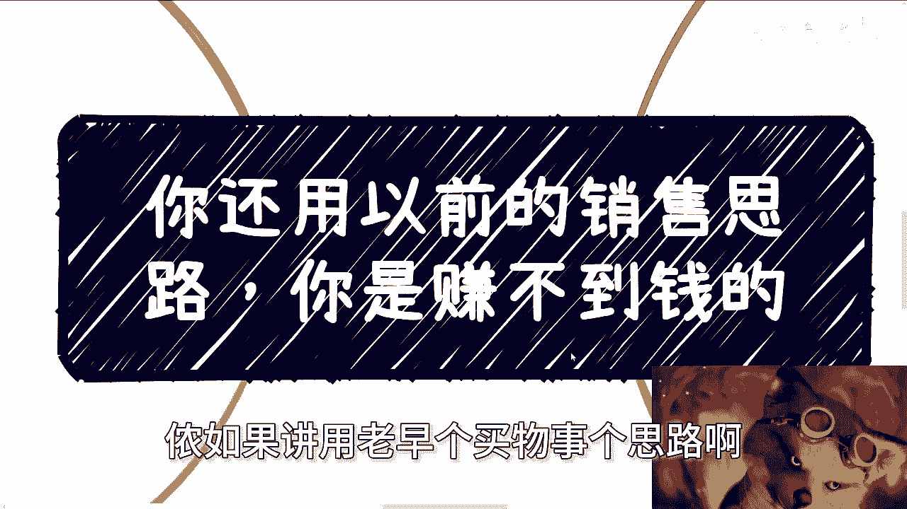
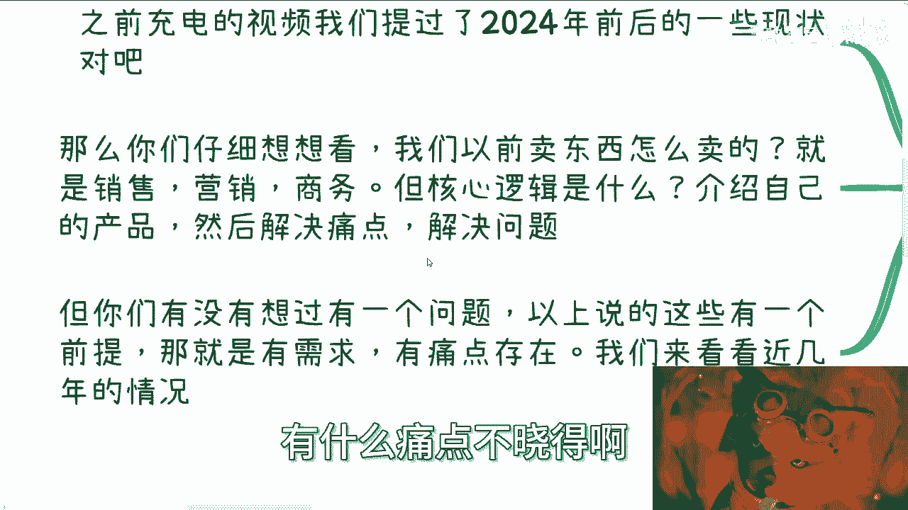
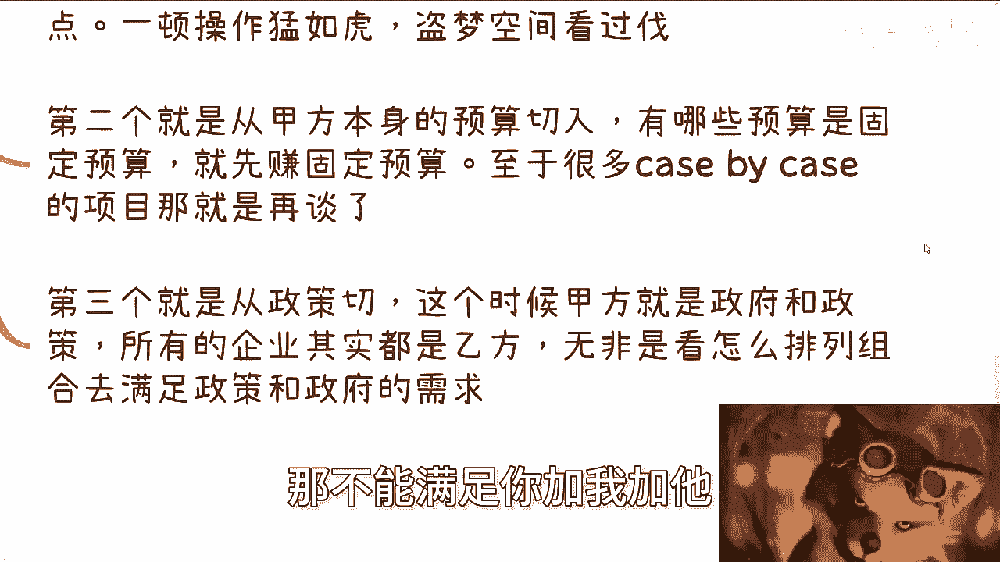
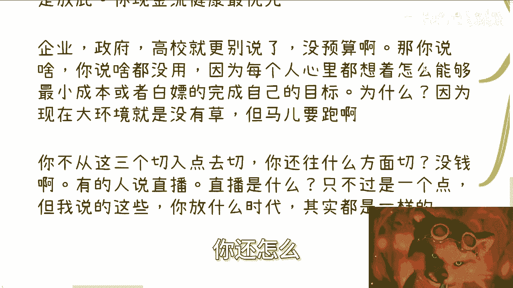
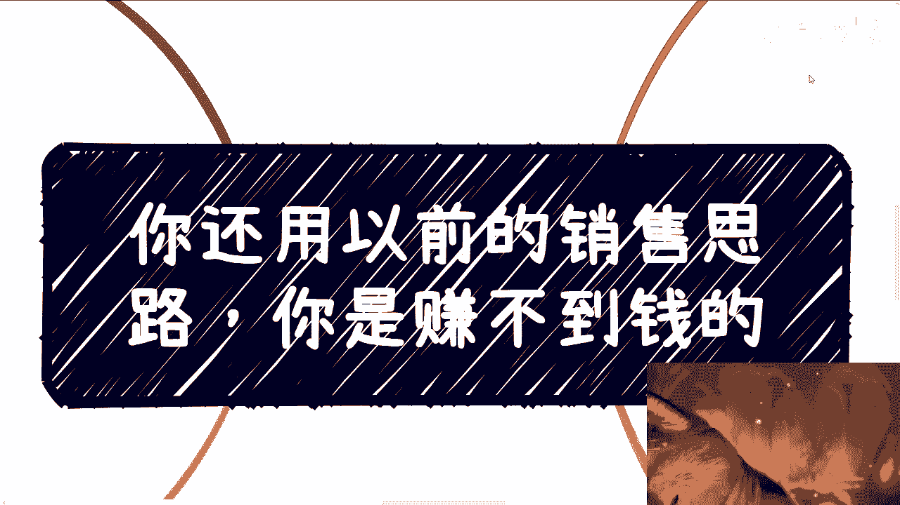

# 课程名称：告别传统销售思维，适应新时代赚钱逻辑 🚀

## 概述

在本节课中，我们将要学习为什么传统的销售思路在今天难以奏效，并分析当前市场环境下的核心变化。我们将探讨需求饱和、资金流动模式转变等关键问题，并为你指出在新的经济环境下，销售与赚钱策略必须做出的根本性调整。

## 市场环境的根本性转变

上一节我们概述了课程主旨，本节中我们来看看市场环境发生了哪些根本性变化。

过去，企业销售的核心逻辑是“秀肌肉”，即向客户展示自身实力、产品优势以及解决问题的能力。其成功的前提是市场存在明确的需求和痛点。然而，这个前提在今天已经发生了动摇。

## 需求与痛点的饱和

理解了环境变化后，我们需要深入分析第一个关键点：需求饱和。

互联网经过多年发展，各行业的基础功能已趋于饱和。许多软件或服务，即使不升级新功能，企业也能维持现状。虽然市场仍需要新功能作为刺激，但与过去“百废待兴”的高速增长期相比，增量空间已大幅收窄。

过去是 **个人与企业跟随市场高速发展**。
现在是 **市场增量有限，竞争转向存量**。

## 资金流动与价值创造的反差

当市场增量见顶，资金流动的模式和价值创造的关系就成为了新的焦点。

从社会金融本质看，资金需要流通才能产生价值。大约从2017-2018年开始，许多项目进入“空转”状态。这意味着，虽然财政、企业、政府等领域的资金每年仍在流动，总额可能变化不大，但资金产生的实际价值与投入越来越成反比。

一个简单的模型可以描述这种变化：
**早期：投入100万 → 产出价值80万**
**现在：投入100万 → 产出价值可能仅为20万、10万甚至5万**

造成这种现象的原因有两方面：
1.  **技术遇到瓶颈**，难以持续突破。
2.  **需求和痛点到达瓶颈**，例如“互联网+”或“数字化改造”等概念，初期结合能带来巨大变化，但不可能每年都产生颠覆性创新。

## 新时代的销售策略三大转变

面对“钱难赚”的现状，销售和商务的策略早已悄然转变。以下是当前主流的三个切入点：

1.  **植入思想，伪造需求**：由于真实痛点不足，销售需要为客户“创造”出需求。例如，将一个只需20万、2人就能完成的项目，包装成需要500万、50人才能解决的“大项目”。目的是为了养活团队和公司，让资金流动起来。
2.  **从甲方身上找固定预算**：优先瞄准客户那些必须花掉的、相对固定的预算。先确保这部分收入，其他项目再慢慢洽谈。
3.  **从政策切入**：所有企业，无论原本是甲方还是乙方，在当前环境下都变成了服务于“政策”的乙方。大家的核心目标是满足政府政策要求，在此基础上寻找业务结合点，形成 **1（政策）+1（甲方）+1（乙方）** 的合作模式。

## 为何“做出产品再铺销售”的模式失效

传统的“先投资做产品/服务，再全力铺开销售”的模式为何行不通了？核心问题不在于销售本身，而在于资金的源头。

当前，市场中的五方主体普遍缺钱：
*   **个人**：核心焦虑是对未来的不确定性，消费趋于谨慎。
*   **资本**：投资优先级最高的是**现金流健康**，而非团队背景或项目故事。
*   **企业、政府、高校**：大概率没有充裕预算，但事情仍需完成。

因此，市场的本质变成了：**每个人都想以最小成本完成目标，甚至实现“白嫖”**。在这种环境下，如果你的销售切入点不是上述三种策略，而是直接推销产品，很可能会听到各种婉拒，其潜台词都是：“不好意思，我们没有钱。”

## 关于直播与永恒需求的思考

有人可能会提到直播带货。需要明确的是，直播是特定时代技术下的产物，具有时代局限性。它并非像“玄学、投机、学习”那样，是每次经济下行周期中都会必然涌现的永恒需求。

因此，在构建长期、普适的商业思维时，我们更应关注那些穿越周期的底层逻辑，而非过度依赖某个阶段性风口。

## 总结

本节课中我们一起学习了传统销售思维失效的深层原因。关键在于认识到市场已从**增量竞争**转向**存量博弈**，资金流动产生的价值效率在降低。因此，新时代的赚钱逻辑必须转变：

*   从 **“解决已有痛点”** 转向 **“植入需求与思想”**。
*   从 **“追逐无限预算”** 转向 **“锁定固定预算与政策导向”**。
*   核心行动原则是：**在所有人都想最小成本办事的环境中，找到让自己业务存活并流转下去的切入点**。

单纯想着“做个好产品然后去卖”的旧思路，在今天会事倍功半。你的策略必须与当下“缺钱”的大环境紧密结合，才能找到真正的生存与发展之道。

