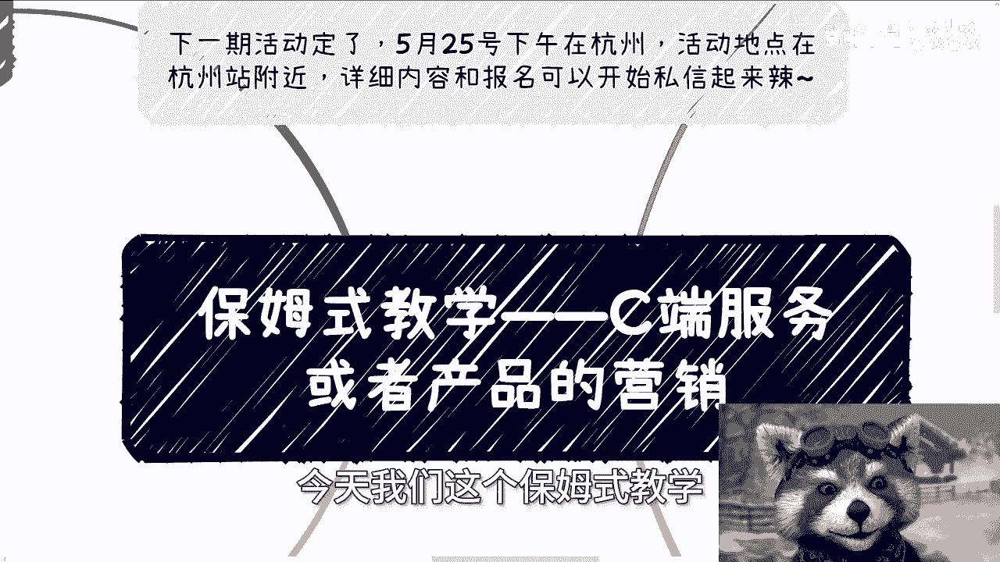
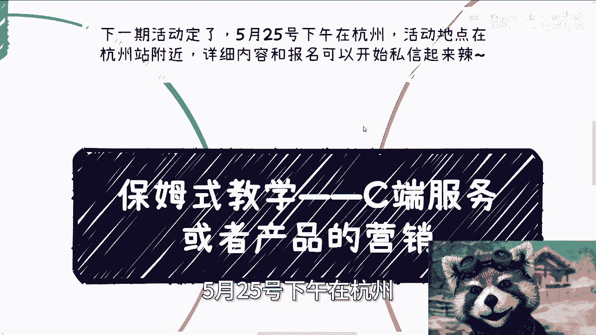
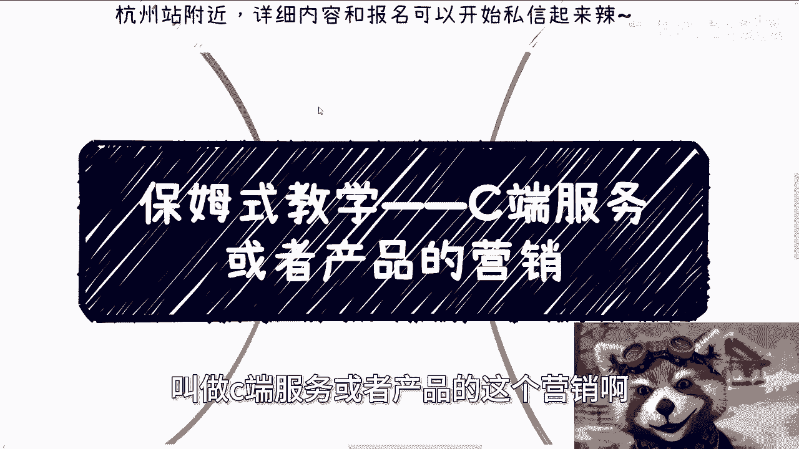
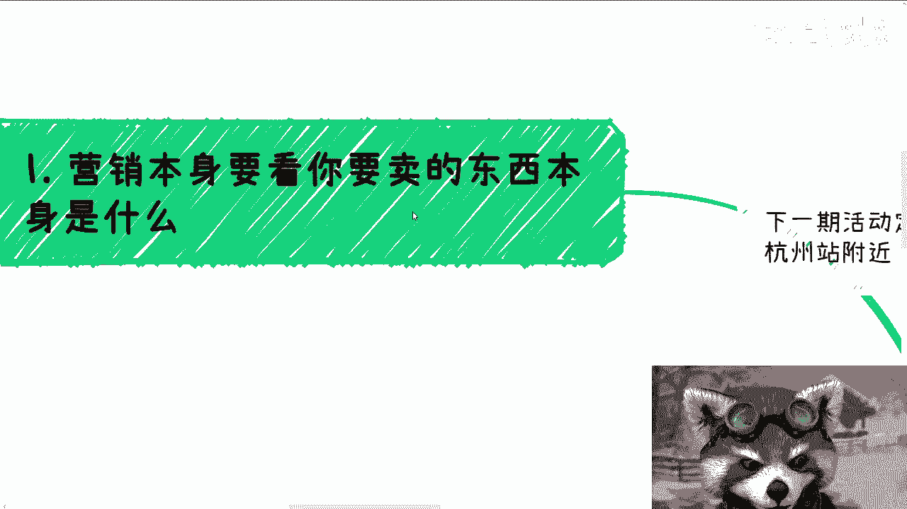
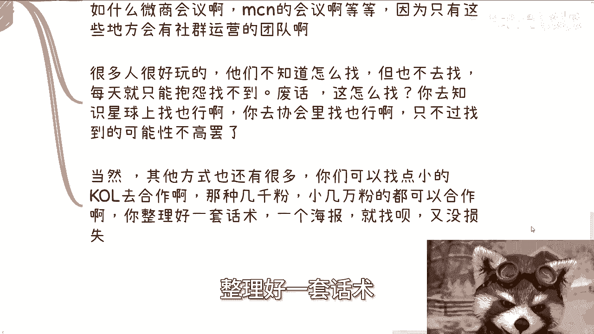
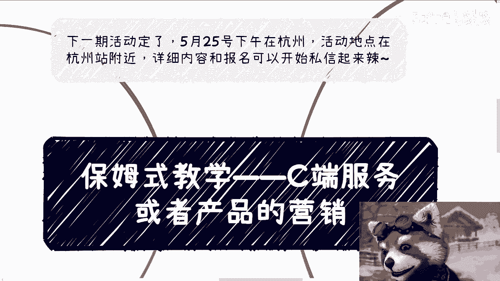

# 保姆式教学——C端服务或者产品的营销 - P1 - 赏味不足 - BV1Cz421Y749

好大家好啊，今天我们这个保姆式教学放在充电视频里面啊。

这个还是有道理的，因为这个东西我觉得还是有一定价值的啊，那么下一期活动定了啊，5月25号下午在杭州好吧。

活动地点在杭州站啊，杭州站附近，详细内容和报名，你可以私信啊，可以私信，那么今天我们来讲的呢是保姆式教学是什么呢，叫做C端服务或者产品的这个营销啊。

那么首先第一点啊，这第一点啊营销本身呢要看你卖的东西是什么。

你比如说啊大家做事呢，我还是那句话，大家做事不要太死板啊，那就好像你今天卖一个东西赚十块钱，跟你卖一个东西赚一块一百一千块钱对吧，你模式肯定不一样的啊，你不可能跟我说，你说啊，陈老师，我做一件事情对吧。

我今天赚十块，我也这个模式赚1000块也是这个模式，你自己也不会对吧，只不过就是说很多人他还没有实践过，然后在那边就让瞎他妈想啊，然后就就他妈想来想去想了不动啊，所以呢我要先跟你说啊。

就是说你先想好你卖的是什么，那么很多小伙伴很好玩啊，就非要去解一个死局啊，什么叫死局啊，这就比如说他们说陈老师，我没有流量，招不到人啊，所以我就卡在这里不做了啊，所以呢对吧，所以呢我就不明白了。

你比如说没流量，你没流量，你要么就是自己一个个去做，要么就是借别人的没力呀，对不对，你你你你你你在那边抱怨说我没流量，然后你不做了，这不就是个死局吗，你你觉得解得出来吗对吧。

所以自己做出来做起来的时候啊，其实你要这么想啊，自己做起来呢是自己先滚雪球滚起来啊，不要管别人说什么，你也别管流量多不多，你就管你做，这叫这叫积累对吧，那我就这么问你们对吧。

你按照你们现在这种很多人做法啊，就是也很好好玩的，就是那按照你们这种就很多人的想法啊，那你以前考试意思就是说你必须考100分，那你考不到什么意思啊，考不到数学了，你奇了怪了，你不你不能二极管思维的呀。

你说对不对，然后我其实一直说过，做事情呢你就要彻底点啊，你要么就别做，要么就做的彻底一点，你去纠结，优柔寡断，我跟你讲，你还不如好好上班啊，这辈子就当个炮灰蛮好的，有什么呢，对不对啊。

第二就是通用的营销模式，通用模式营销模式呢就是说所有的短视频平台，所有的活动平台。

文案海报视频，你都要做一个做的烂没关系，但你必须要做对吧。

你比如说文案跟海报啊，文案跟海报就是一定要告诉别人，别人来了有什么收获，别人为什么要来切入点，一定要宏观，越宏观越好。

为什么，因为你做一开始的时候，漏斗一定要大对吧，否则你怎么漏下来人呢对吧。

你有很多人，小伙伴他妈一开始就他妈做什么，什么跨境电商啊，做什么人工智能啊，然后还做什么啊，人工智能里面很细节的这种实操或者什么东西，你能落得出来个屁呀啊，然后你邀请来的嘉宾啊，给嘉宾做邀请函。

让他们发朋友圈或者自己所在群对吧，那你让他发，他既然做女嘉宾，你就得利用他对吧，让他发这所有的，我们以前那个做大活动都是这么做的对吧，那关于是不是说收费这个事呢，我态度就两种，一你要么一开始就收99。

199啊，也别说这种四十九六十九这种上不上下不下的，没啥意思。

要么呢一开始多场是免费的，就是为了引流，比如说你前面三场是免费的，然后从第四场开始，你收收费也行，你就二取一啊，不要去搞那种有的没的啊啊记住啊，线上跟线下不一样的啊，不要去跟那个那就抖音啊。

这种东西一般见识啊，什么意思啊，就是你想啊，人家抖音能九块九引流，为什么，因为人家是线上对吧，你比如说你，你比如说你B站也可以开个九块九的对吧，你引流，因为人家是线上，你你线下你可能了，你想想看对吧。

你线下是为了见面交流的，而且大家就是哪怕就是你不收门票费啊，不是不是门票费吧，哪怕就是说你不不收别的费用对吧，那那人家就算花时间走过来，那人家时间成本也算吧对吧。

那你说个九块九算什么意思呢，对不对，就很搞笑嘛，啊那么第三就关于找分销啊。

我觉得呢大家是不是误会了什么，就是我们在社会上做事情啊，不是靠一次两次，也不是靠十几次，可能也不是靠几十次，很多时候是成百上千次的尝试，你懂吗，就是我就这么问你们。

谁告诉你们老百姓做事情做几次就会成功的，另外你们是哪得出来这种结论的对吧，你要明白什么叫老百姓啊，那就是什么都没有，那叫老百姓啊，你要从完全没有到有，然后到从完全没有合作到有合作。

从完全不被别人接受到被别人接受，没有这么多次的尝试，你怎么可能成功呢，啊你要是这么容易成功，那今天这个中国老百姓早就财务自由了，对不对，那我们再来说分销啊，所谓分销就是要找流量，我们一般叫做社群运营。

就是你要找啊，我跟你们讲啊，真的现在的人可能真的是网络玩多了，就不要任何事情依依赖于网络，我就这么问你们，如果你们真的到线上去找社学语言，你们怎么找啊，你别跟我说找那个KOL一个个私信啊。

这他妈的什么工作效率啊对吧，我跟你们讲啊，你要找你就线下去找，比如说什么微商大会啊，MCN大会啊对吧，什么什么直播电商大会啊，因为这种大会的里面他都有那个社群运营团队，为什么，因为人家能赚钱啊，对不对。

你线下就广撒网去找啊，线上找找到什么时候去啊，而且你线上找了就算找到了，你还是要到线下去的呀，对不啦，那我就这么跟你们讲好了，你比如说找我对吧，我跟你说哎我这边1000个人，2000个人社群。

然后呢你跟我说哎陈老师，你帮我发一下，然后呢有用的啦，没有用的呀对吧，我就这么问你，我今天帮你发了，有转化率吗，你又不知道有转化率，你也不能你你就没有转化率，你也不能把我怎么样，对不对。

有用的没有用的呀，就大家做事情要做到实处对吧，你你你投机取巧也要投机小时额，投机取巧到实处理呀，那我跟你讲啊，哎很多人很搞笑的，他们不知道怎么找对吧，但也不去找啊，然后每天呢就抱怨说找不到，那废话。

你怎么找你，你你怎么这样子怎么找得到啊对吧，你去知识星球上找也行啊，你去协会里找也行啊对吧，只不过可能可能性不高嘛，但是你各个渠道只要是只要是能找的，你都去找呗，对吧，你你你你你你把你自己放到社会上。

你告诉我社会上有什么东西限制你的对吧，你就像今天咨询的时候，我就跟他说了，你只要不杀人放火，你只要不是刑法上写着的什么东西限制你了呢，对吧，你不要来问我说这个公司能不能找，那个公司能不能找。

有什么不能找的，你有什么损失呢，啊当然啊其他方式也有很多啊，我们可以找点小的KOL去合作，比如说那种几千粉的，小几万粉的都可以合作，你整理好呃，整理好一套话术。

一个海报就找呗，又没损失，让他们给你发呗，对不对啊，呃四记住啊，真的就不要去做那种呃有用的呃。

不是做了就有用的啊，要看你怎么做，就是说很多小伙伴问我啊，是不是不适合二线做，是不是不适合做这个主题啊，或者啥的啊，就我们就这么讲啊，举个例子，比如说你今天卖AI课程，你做AI的活动，你怎么做呢，对吧。

你不要跟我说，你做了个朴实无华的海报，然后你也不要跟我说，你跟大家说你能够教别人做AI，你也不要跟我说，你你你跟大家讲这个AI有什么好处，有用了没有用的呀，你明白吗，就是也许你这样做有人来，但肯定不多。

为什么，因为你所有的说辞，所有的海报没有吸引力啊对吧，你比如说之前别人做课程怎么做的啊，原价998对吧，现在限时两周，只要199，只要只要298对吧，怎么样子，然后就跟大家说啊对吧，大家要来学呀对吧。

他妈他妈的不学，好像明天明年搞得要失业了，不是明年吗，明天就他妈失业了对吧，然后明年好像人类就要被这个地球开除户籍呃，开出地球级别呃，这个籍贯来，你知道吧，就这种感觉对吧好，那么我们就这么说啊。

所以你们看到没有，我一直说你要么别做做就好好做，就是这个意思，然后呢我们有一说要客观的说啊，就以上这些方式，你不要来跟我谈什么感性或者说道德问题，因为以上这些东西它就是营销手段，他也没有去抄别人。

他也没有什么什么版，也没有说什么侵犯别人版权对吧，也没有怎么样子，你就这些事情你跟我谈道德，貌似你道德感有点高吧，对不对对吧，就是我一直跟你们讲的是什么。

就是你要去营销，你可以有你的底线，你可以有你的三观对吧，但是你的底线是什么，就是不要完全抄别人，要有版权意识，要有产权意识，那就够了呀，那你还想怎么样啊，哦你难道说我我我我这个稍微夸大一点。

夸大一点怎么了呢，哎我奇了怪了，我说不好听点，你咋怎么了，活在社会上不允许我夸大，对不对，就夸大不是造假，是你明白吗，而且你说比如说这些人说啊，明年就要失业或者怎么样子了，那他可能就这么真的这么认为啊。

你说他造假了吗，这怎么定义他造假呢啊那我我照你这么个说法，那我说明年地球毁灭了，这算造假吗，对不对，不是你你哎就反正就这么个意思，好吧啊。

OK那个活动好吧，25号下午杭州啊，然后就是职业规划，商业规划啊，股权分润啊，分红对吧，这个什么商业计划书BP啊，就是那个合同对吧，等等等啊，你们自己有什么业务对吧，搞不清楚的或者说吃不准的啊。

你们也可以来找我啊，然后包括就是说你们手上有什么牌啊对吧，没有什么牌的啊，你们希望就是通过跟我的沟通啊，能够让自己能够走一个，更加贴合于整个市场的一个道路，那么你们可以整理好问题。

