# 保姆式教学--C端服务或者产品的营销---P1---赏味不足---BV1Cz421Y749

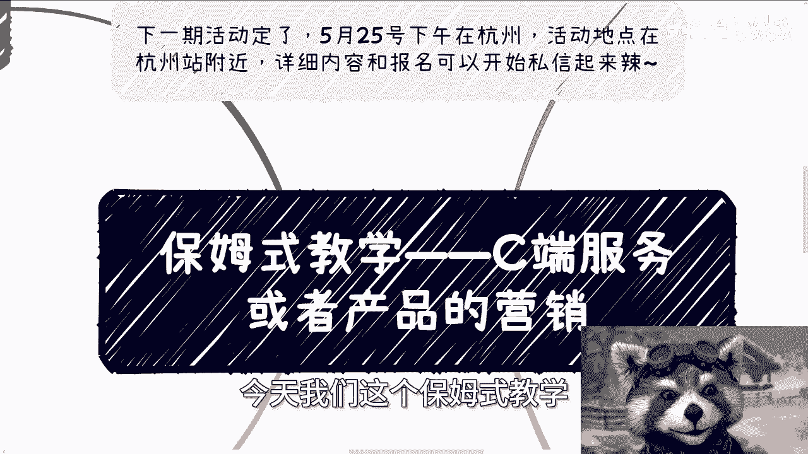

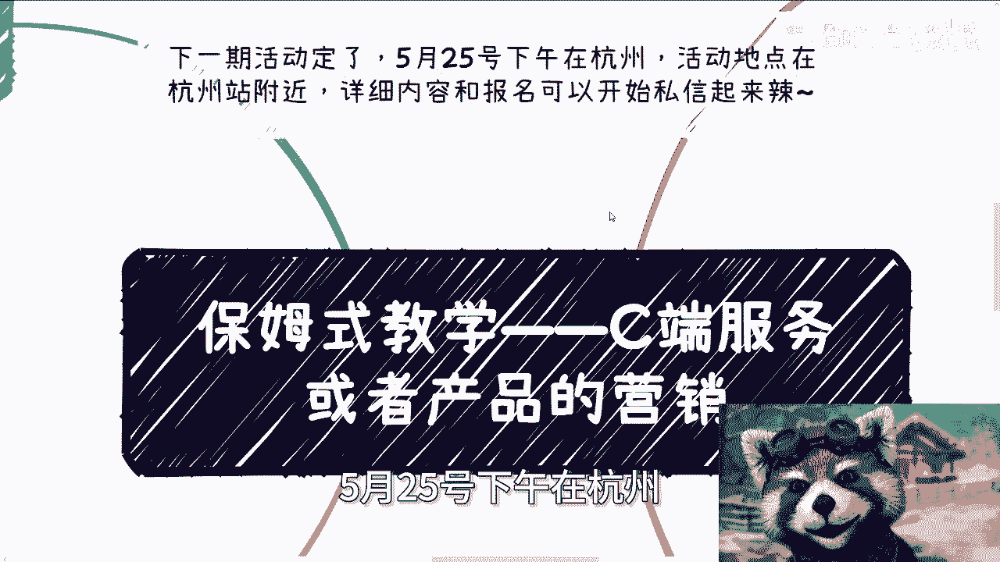

在本节课中，我们将学习面向消费者（C端）的服务或产品如何进行有效的营销。课程将涵盖营销的核心前提、通用模式、分销渠道的建立以及营销策略的制定，旨在为初学者提供一套清晰、可执行的行动框架。

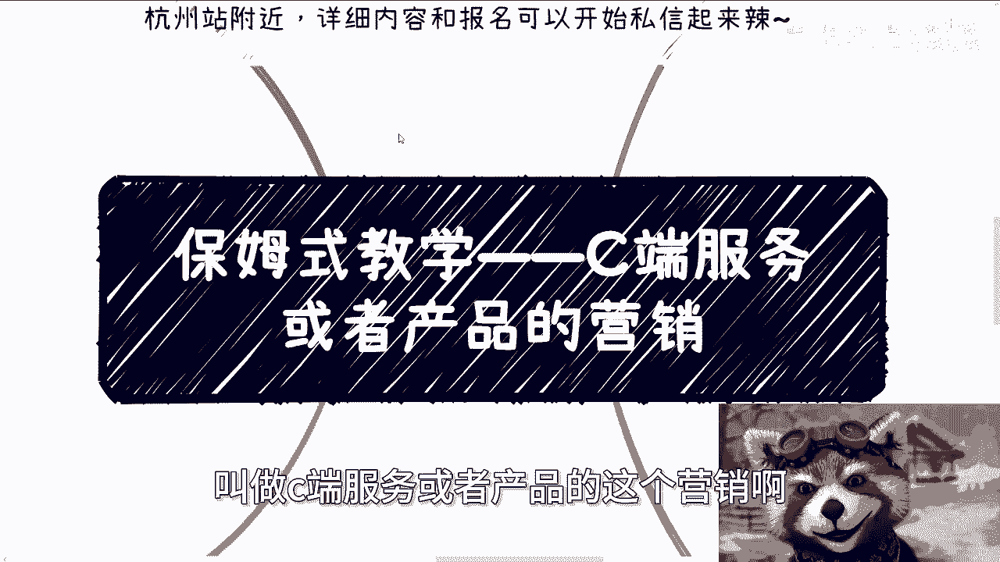

---

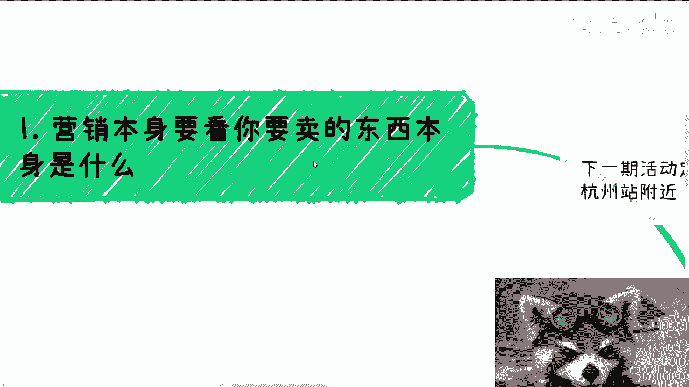

## 1. 营销的核心前提：明确你所售卖之物 📦

营销的第一步取决于你卖的是什么。做事不能过于死板。例如，卖一件赚10元的产品和卖一件赚1000元的产品，其营销模式必然不同。你不能指望用同一种模式去应对所有情况。

许多人在实践中会遇到困境，例如声称“没有流量，所以无法开展”。这形成了一个死局。解决之道在于行动：要么自己一步步积累流量，要么借助他人的力量。抱怨而不行动，问题永远无法解决。

启动项目就像滚雪球，关键在于开始积累，无需过度在意初期的流量多少或他人的评价。这类似于学习，不能因为无法立刻考到100分就放弃整个学科。做事需要彻底：要么不做，要么就坚持做到底。犹豫不决不如安心工作。

---

## 2. 通用营销模式：全方位内容覆盖 📢

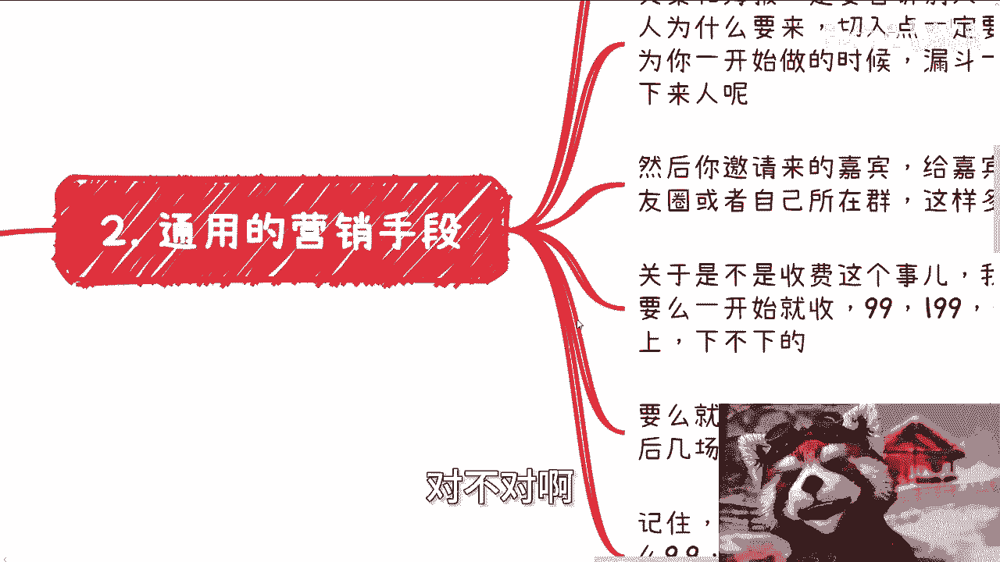

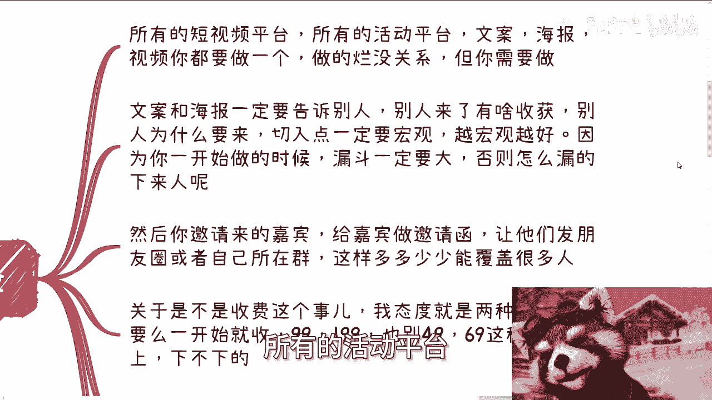

通用的营销模式要求在所有可能的渠道进行曝光。这包括所有短视频平台、活动平台，以及文案、海报和视频等内容形式。

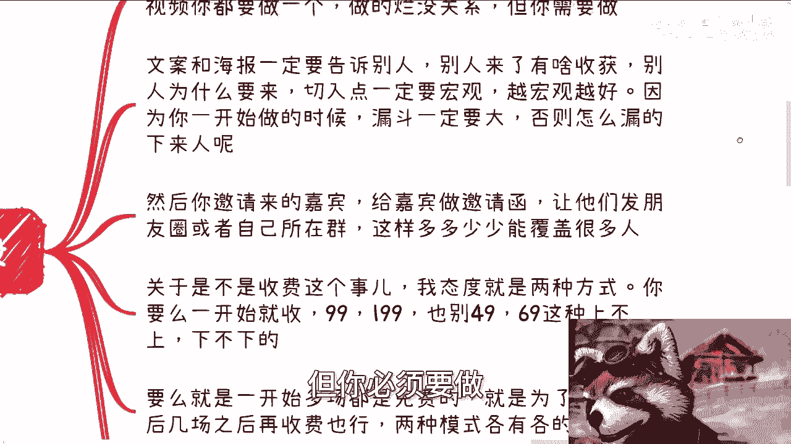

内容质量在初期可以不高，但必须要有。关键在于开始制作并发布。

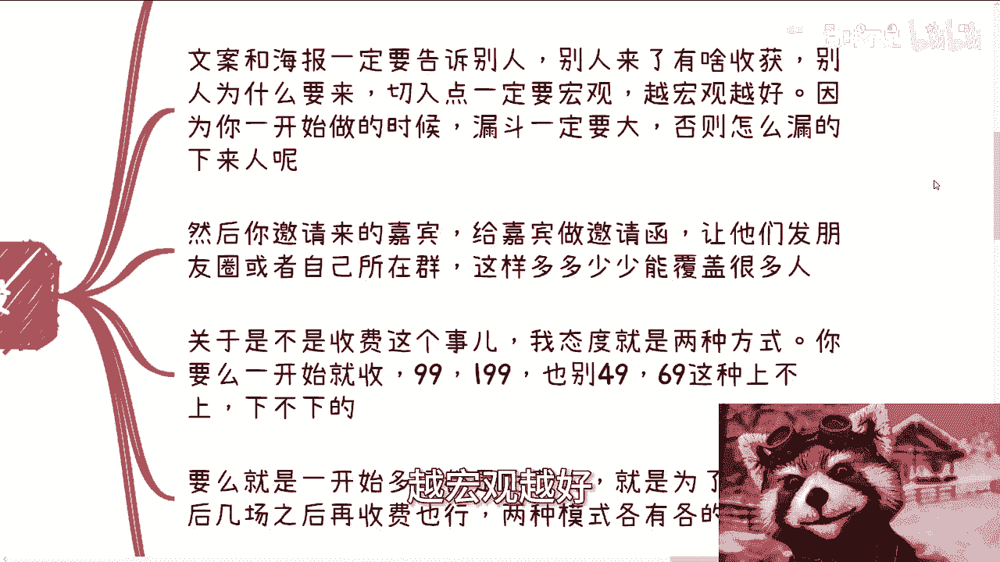

以下是关于文案和海报的核心要点：

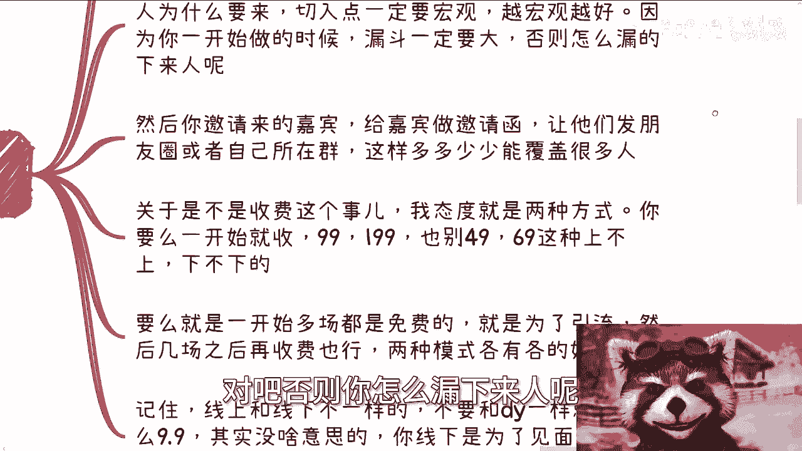

*   **核心信息**：必须清晰告知潜在客户，他们参与或购买能获得什么具体收获，以及他们为什么要来。
*   **切入点**：一定要宏观。越宏观，吸引的潜在人群范围（流量漏斗的入口）就越大，后续才有筛选和转化的空间。

许多初学者错误地从过于狭窄的领域（如“跨境电商的某个细分实操”）开始，这会导致漏斗入口太小，难以获得足够关注。

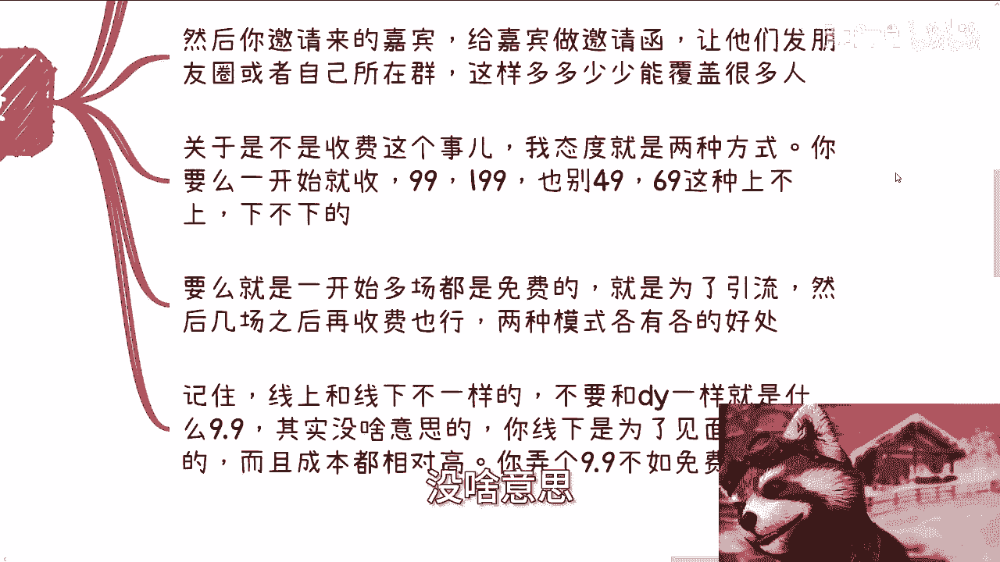

对于活动嘉宾，应充分利用其影响力。制作专业的邀请函，请他们在自己的朋友圈或社群中发布，这是扩大活动影响力的有效方式。

关于活动收费，有两种清晰策略，应二选一：

1.  **直接收费**：起步就设定明确价格，如99元或199元。避免设置49元、69元等不上不下的价格。
2.  **免费引流**：前期举办多场免费活动用于积累用户和口碑，从第四场或之后开始收费。

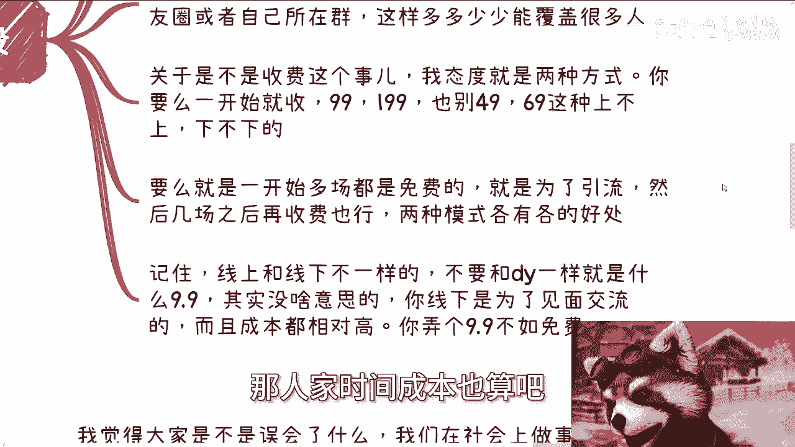

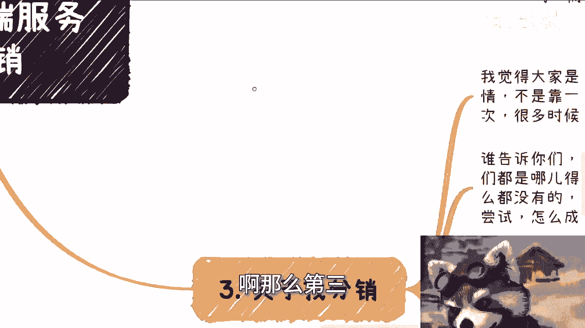

**注意**：线上与线下活动逻辑不同。抖音等平台可以用9.9元低价引流，因为其边际成本低。但线下活动涉及场地、时间等成本，参与者也有时间成本。设置9.9元的线下门票意义不大，反而可能显得不专业。

---

## 3. 寻找分销渠道：广撒网，重执行 🤝

上一节我们介绍了基础的内容覆盖，本节我们来看看如何借助外部力量放大声量，即寻找分销渠道。

社会上的成功往往源于成百上千次的尝试，而非几次努力。作为从零开始的普通人，从无人知晓到建立合作，必然需要大量主动出击。

所谓分销，就是寻找流量合作方，通常涉及社群运营。不要过度依赖网络私信这种低效方式。

**高效的寻找方式在于线下**：主动参加各类行业大会（如微商大会、MCN大会、直播电商大会），这些场合聚集了大量拥有社群资源的团队。线上寻找最终也需线下对接，且线上沟通信任度建立较慢。

不要空想而不行动。抱怨“找不到”却不主动去各种渠道尝试，问题永远不会解决。只要不违法，任何公司、协会、知识星球等渠道都可以尝试接触。你没有什么可损失的。

此外，也可以与小型KOL（几千到几万粉丝）合作。准备好一套完整的话术和精美的海报，主动联系他们进行推广。这同样是一种成本低、潜在回报高的尝试。

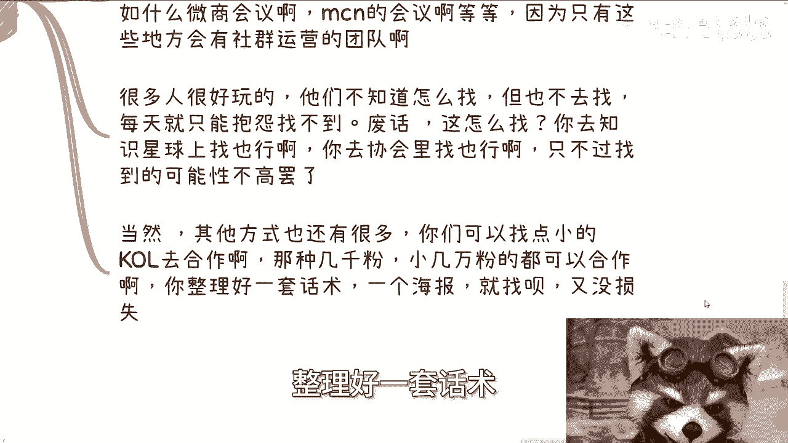

---

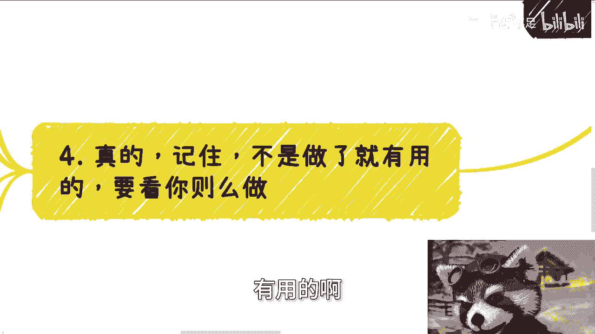

## 4. 营销策略：吸引力与执行力度 💡

仅仅“做了”营销动作是不够的，关键要看“怎么做”。许多小伙伴会纠结城市、主题是否合适，但更核心的问题是营销内容是否具备足够的吸引力。

以售卖AI课程或举办AI活动为例：一张朴实的海报，配上“教你学AI”或“AI很有用”的平淡说辞，效果通常有限。

有效的营销需要创造吸引力和紧迫感。参考一些成功案例：它们会采用“原价998，限时两周仅需199”的价格锚点，并营造“不学习即将落后甚至被淘汰”的紧迫情绪。这是一种经过验证的营销手段。

需要客观看待这些方法：它们是常见的营销手段，只要不涉及抄袭、侵犯版权或捏造事实，就在合理的商业推广范畴内。营销可以有底线，底线是尊重知识产权和基本事实。

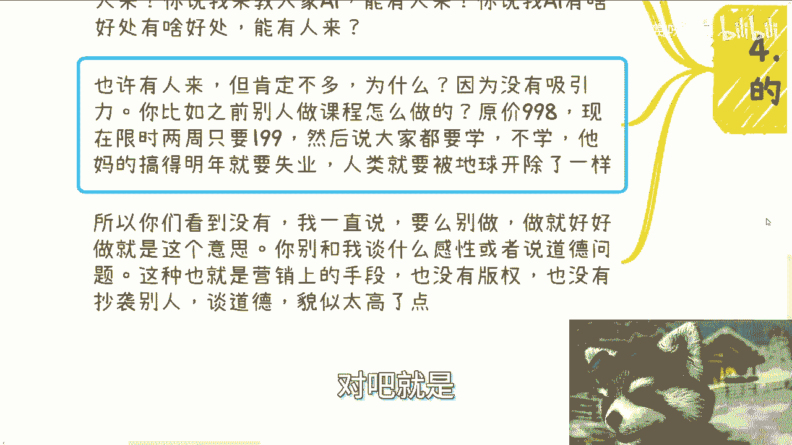

“夸大”与“造假”不同。表达对未来的紧迫感（如“技术变革很快，需要尽快学习”），只要是基于自身认知的真诚表达，就属于观点范畴，而非事实造假。营销需要在遵守底线的同时，大胆有效地传递价值。

---

## 5. 活动预告与总结 📅

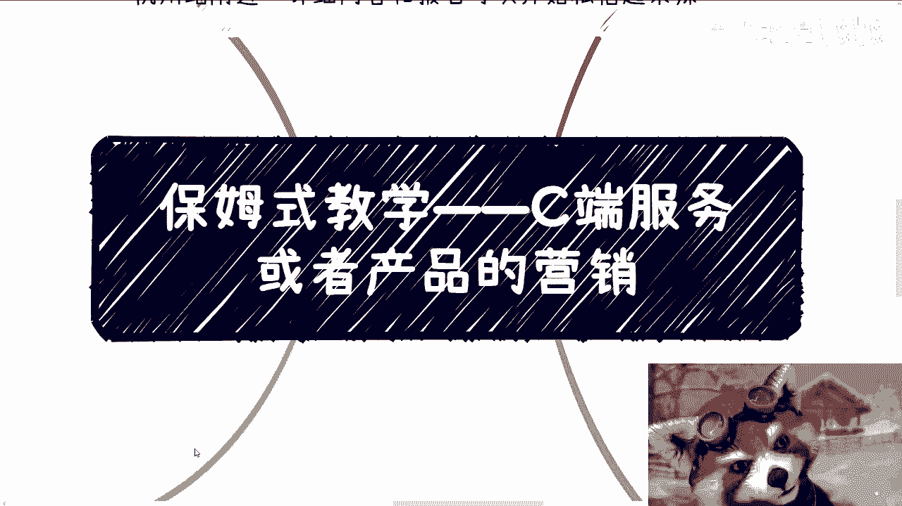

**活动预告**：5月25日下午在杭州（杭州站附近）有一场线下活动。主题涵盖职业规划、商业规划、股权设计与分红、商业计划书（BP）及合同等。如果你对自身业务发展有疑问，或希望梳理自身资源以找到更贴合市场的发展道路，可以整理好问题参与。

**课程总结**：本节课我们一起学习了C端营销的四个关键环节。
1.  **明确售卖物**是制定策略的基础。
2.  **采用通用模式**进行全方位内容覆盖，并合理设计收费策略。
3.  **主动寻找分销渠道**，线下出击，多次尝试。
4.  **注重营销策略的吸引力**，在遵守底线的前提下有力执行。

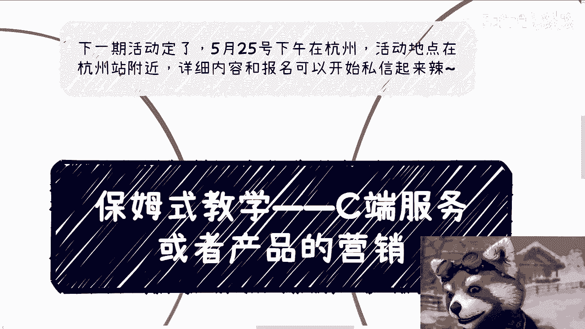

记住核心原则：要么不做，要做就彻底执行，在行动中不断优化。