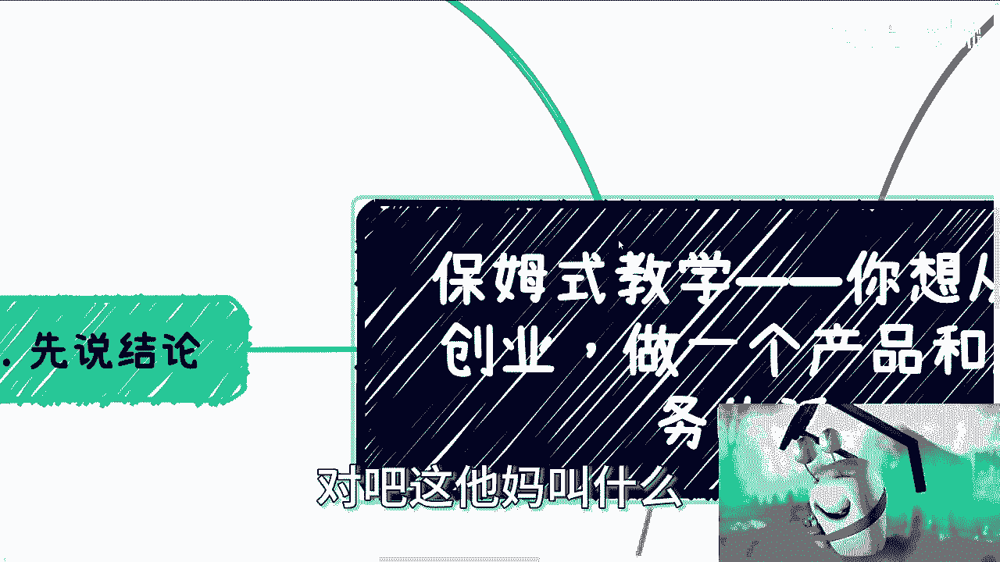
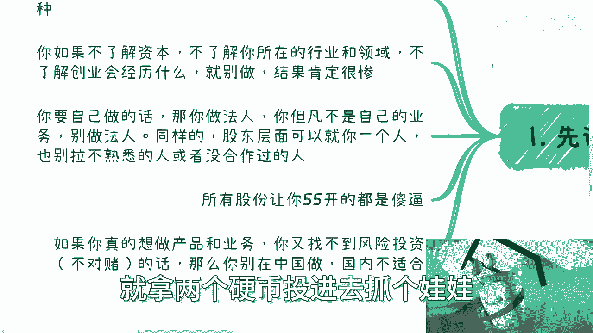
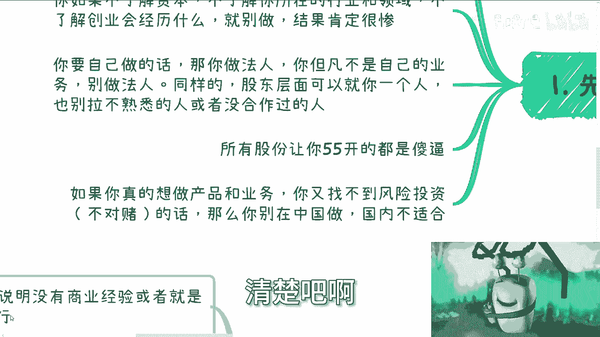
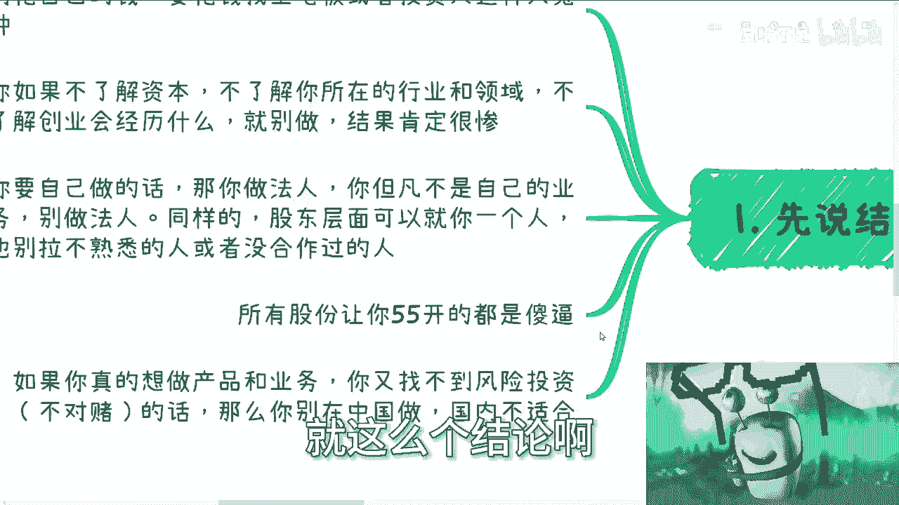
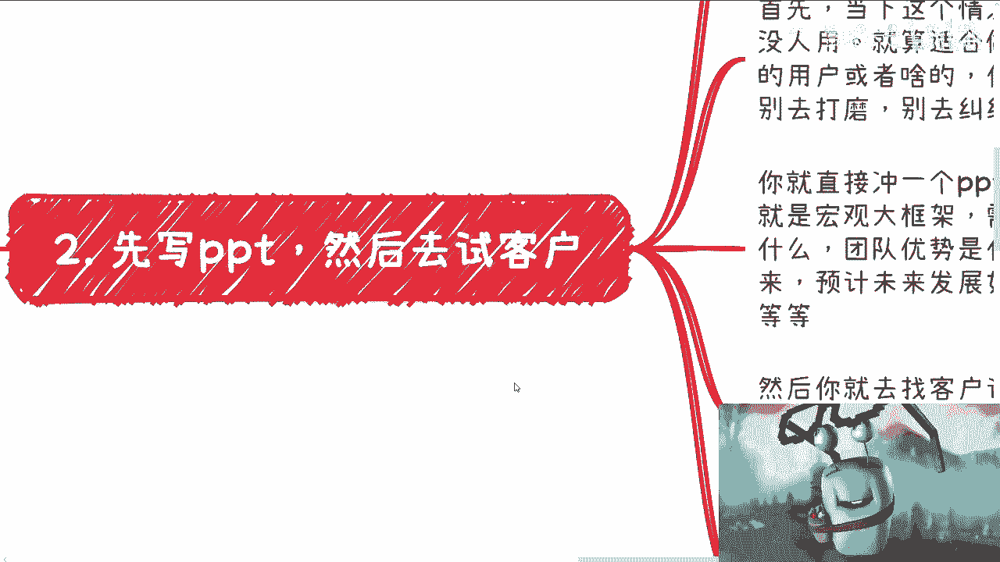
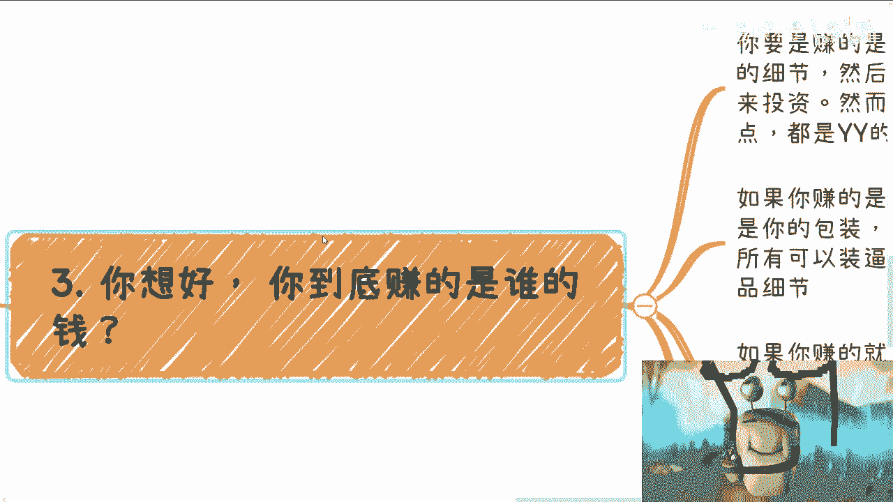
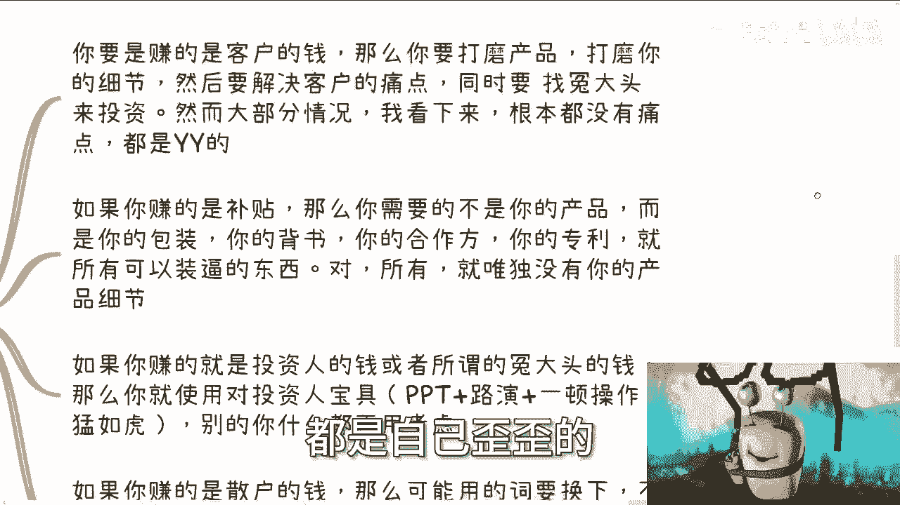
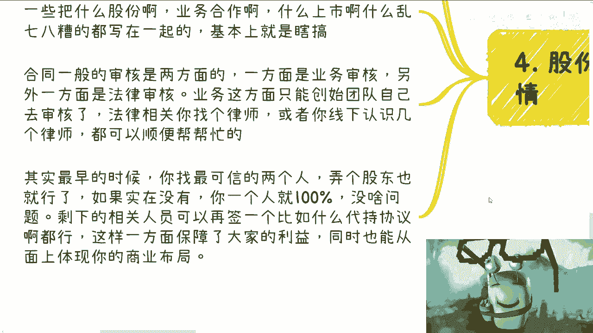
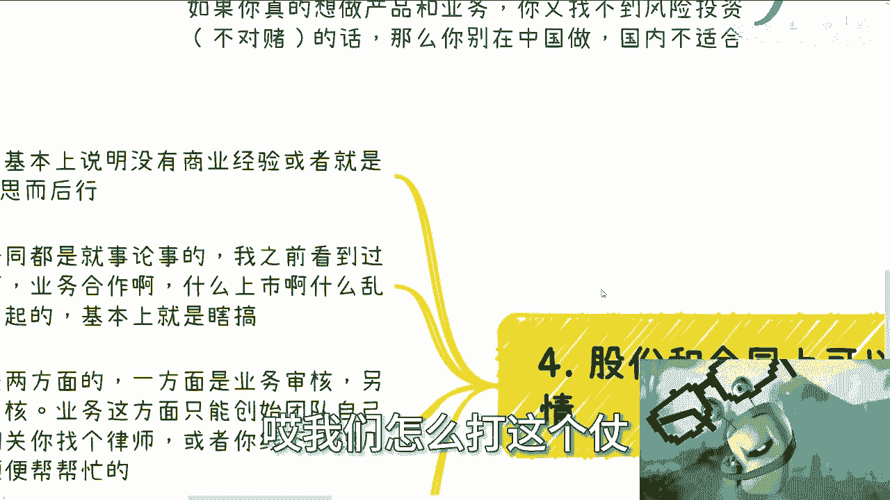
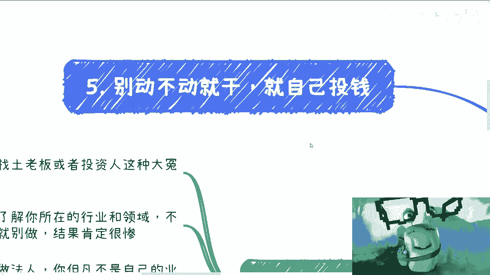

# 保姆式教学--从一个产品和服务-最开始你要关注的点---P1---赏味不足---BV1sV411Q7

在本节课中，我们将学习从零开始创业、打造一个产品或服务时，最初阶段必须关注的核心要点。课程内容基于对当前市场环境的分析，旨在帮助初学者避开常见陷阱，建立正确的创业起步思维。

## 概述：创业起步的四大核心原则

在深入细节之前，首先需要明确几个核心原则。这些原则是后续所有行动的基础。

1.  **不要花自己的钱**。启动项目需要资金时，应寻找“土老板”或投资人。
2.  **必须了解资本与行业**。创业前，必须深入了解目标领域的资本运作和真实行业状况，而非依赖网络信息或朋友间的空谈。
3.  **明确法人责任**。如果业务是自己的，就自己担任法人；如果不是自己的业务，就不要去当法人。商业合作需要权责清晰。
4.  **警惕均分股权**。任何提议**五五开**或类似比例（如49/51）分配股权的方案，都需要高度警惕。

上一节我们概述了创业起步的四大原则，本节中我们来看看具体应该如何迈出第一步。

## 第一步：撰写商业计划书（BP）与验证市场

在有了初步想法后，首要任务不是打磨产品细节，而是制作商业计划书并寻找潜在客户进行验证。

以下是撰写BP和验证市场的标准流程框架：

*   **宏观框架与需求**：阐述项目的宏观背景和所要解决的核心需求。
*   **产品与服务**：简要描述提供的产品或服务是什么。
*   **团队优势**：说明团队为何能胜任此事。
*   **产品逻辑与流量**：解释产品的运作逻辑以及如何获取用户或流量。
*   **市场前景与定价**：分析市场规模、发展潜力以及初步的定价策略。
*   **融资规划与合作资源**：说明融资需求以及已有的合作品牌等背书资源。

完成BP框架后，立即寻找**1-3个**你认为的潜在客户或资方进行沟通。通过真实的反馈，你可以迅速判断项目的可行性与市场需求的真伪，避免陷入自我臆想。

## 第二步：明确你的盈利模式与核心任务

在验证想法的同时，必须想清楚你的钱究竟从哪里赚来。不同的盈利模式，决定了你的工作重心完全不同。

以下是四种常见的盈利模式及其对应的核心任务：

1.  **赚客户的钱**：
    *   **核心任务**：打磨产品细节，真正解决客户痛点，然后寻找投资人支持。
    *   **现状提示**：许多创业者臆想的“痛点”并未被产品真正解决。

2.  **赚补贴/政府的钱**：
    *   **核心任务**：重点不是产品细节，而是**包装、背书、合作方、资方背景、专利**等所有能“装点门面”的资源。

3.  **赚投资人/土老板的钱**：
    *   **核心任务**：熟练使用“对投资人宝具”，即**出色的PPT、精彩的路演、动人的故事、强大的自信**。细节并非首要考虑因素。

4.  **赚散户（C端用户）的钱**：
    *   **核心任务**：往往只需要一个产品原型或演示版。成败关键不在于产品本身，而在于**营销能力和故事讲述能力**。

## 第三步：规范股权结构与合同

商业合作必须权责清晰，这在股权和合同上体现得最为明显。

关于股权与合同，需要注意以下几点：

*   **警惕均分股权**：如之前所述，**五五开**或接近的比例通常意味着对方缺乏商业经验或别有用心。
*   **合同审核的两个维度**：
    1.  **业务审核**：由创始团队自行负责，确保合同条款符合业务实际。
    2.  **法律审核**：务必咨询专业律师，确保法律条款的严谨性。
*   **股东结构宜简不宜繁**：初期创始人**1-2人**持股即可，无需为了“场面”强行拉人入股。其他贡献者可通过代持协议等方式保障利益，保持公司主体股权清晰。

## 第四步：行动前的关键提醒

在真正投入大量资源前，请牢记以下两点。

1.  **切勿盲目投入**：不要在没有验证市场的情况下，就投入大量资金或人力去开发产品。正确的“干”是先制作BP、描绘蓝图（画饼），去测试市场和资方的反应。
2.  **选择适合自己的模式**：有些生意可以“空手套白狼”，有些则必须前期投入。这两种模式没有绝对的对错，关键在于**选择适合自己资源和风险偏好的路径**。投入与否和项目是否靠谱没有必然因果关系。

## 总结

本节课中我们一起学习了从零开始创业的核心要点。我们首先明确了四大基本原则：不花自己的钱、深入了解行业、权责清晰、警惕均分股权。接着，我们梳理了起步流程：从撰写BP、验证市场到明确盈利模式。然后，我们强调了规范股权与合同的重要性。最后，我们提醒在行动前要避免盲目投入，并选择适合自己的创业模式。记住，商业成功始于正确的思维和严谨的起步，而非一腔热血和盲目执行。