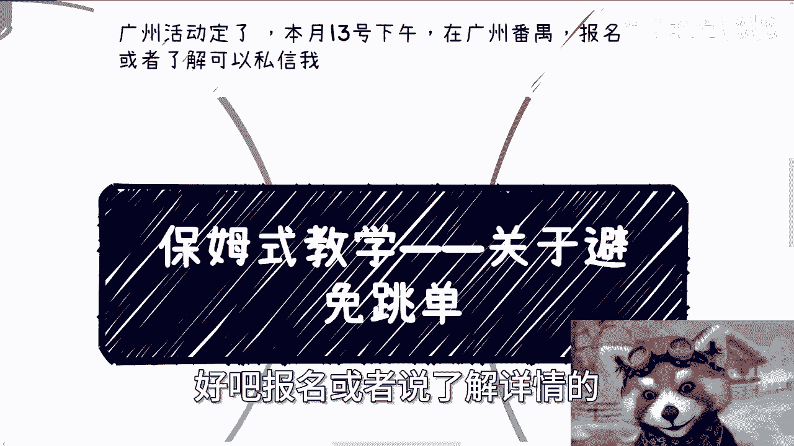
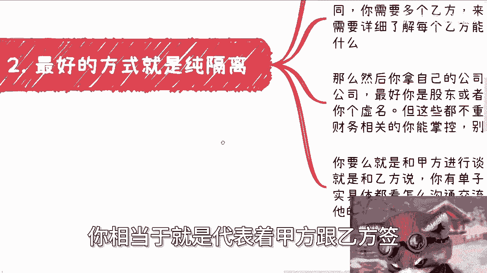

# 保姆式教学 P1：关于避免跳单 🛡️


在本节课中，我们将学习在商业撮合与资源对接中，如何理解并应对“跳单”现象。我们将探讨跳单的本质，并提供几种实用的策略来降低风险，帮助你更稳健地开展业务。

## 概述：理解跳单是常态

首先需要明确，跳单是商业活动中的常态。虽然本课主题是“避免跳单”，但这并非意味着可以百分之百杜绝。在商业社会中，有底线、不跳单的人是正常人，但这样的人相对较少。

你可以通过增加业务量来分散跳单带来的风险。例如，在撮合资源时，应采取广撒网的策略，而非点对点对接。如果你一年只撮合两单业务，那么风险自然会集中。

实际上，跳单有时也是一件好事，因为它能清晰地告诉你，对方并非合适的合作对象。在商业合作中，任何感性的情绪都可能导致你继续被坑害，因此需要学会理性判断和断舍离。你可以保留仁慈或心软的一面，但必须分清场合。

当然，我们也确实需要采取一些措施来尽量避免跳单。同时，这些措施本身也是试探对方合作诚意与价值认可度的过程。很多时候，在沟通阶段就能预判对方是否有跳单的可能，关键在于你是否具备足够的察言观色能力。

## 核心策略一：纯隔离模式 🚧

上一节我们介绍了跳单的普遍性，本节中我们来看看最有效的应对策略之一：纯隔离模式。

这种方式的核心在于，你作为中间人（丙方），完全隔离甲方（需求方）和乙方（供应方），由你分别与双方签署合同。具体操作如下：


1.  **与甲方沟通**：在与甲方洽谈业务后，告知甲方你可以为其寻找合适的乙方（供应商）。同时，应尽量与多个甲方沟通，以获取更多需求并明确细节。
2.  **与乙方沟通**：同样，你需要储备多个乙方资源，作为你的外包合作方，以确保业务的稳定性。你需要详细了解每个乙方的能力。
3.  **深入了解乙方**：你需要询问乙方团队构成、能提供的服务、过往案例以及他们之间的区别。
4.  **以公司主体运作**：最好使用你自己是股东或法人的公司来操作。如果不是，在签订合同或处理财务时你将无法掌控，最终可能为他人做嫁衣。
5.  **明确合同关系**：具体操作有两种方式：一是你作为乙方与甲方签约；二是你作为甲方与乙方签约，让乙方进行交付。具体方式取决于沟通结果。



需要注意的是，纯隔离模式在交付软件、互联网服务或其他标准化服务时效果较好。但对于如土木工程、建筑、大型展厅等需要深度现场协作和交付实体产品的项目，则难以实现完全隔离。

**核心模式公式**：
```
你（丙方）<-> 甲方（签署合同）
你（丙方）<-> 乙方（签署合同）
甲方与乙方不直接接触。
```

## 核心策略二：试探与三方合同 🤝

然而，并非所有情况都能实现纯隔离。当隔离不了时，关键在于从一开始就试探合作模式的可能性。

如果你已经确认甲方有需求，且乙方有能力满足，你可以在后续沟通中旁敲侧击地提出签署协议的想法。对甲方而言，协议是关于你为其寻找供应商（且不止一个）；对乙方而言，协议是关于你为其寻找客户（金主爸爸，也不止一个）。你可以借此聊一聊分润比例，试探对方的反应。

你也可以直接提出签订三方合同，即你作为丙方参与其中。这在中国商业环境中很常见，许多聚合平台都是类似模式。但在三方合同中，你必须体现出自己的额外价值。

以下是体现价值的方法：

1.  **画饼与绑定**：向其中一方（甲方或乙方）展示你的长期价值。例如，对乙方画饼，声称自己拥有大量甲方、高校或政府资源，希望长期合作。这样在三方合作中，你至少与其中一方绑定得更紧密。
2.  **提供额外服务**：你的公司可以切入业务链条，提供额外价值。例如：
    *   承担部分产品经理或项目经理的角色。
    *   提供额外的咨询服务。
    *   哪怕这些服务只占整个项目价值的10%或5%，也能让你从“单纯的介绍人”转变为“有价值的参与者”。

**核心逻辑**：人们跳单往往是因为甲方和乙方是对等的，而你（丙方）不对等。要变得对等，就必须提供**额外价值**。如果你既不画饼，也不提供额外价值，却抱怨被踢掉，这是不合理的。


## 核心策略三：不要纠结角色 🎭

在商业实践中，过度纠结自己的固定角色（中介、甲方或乙方）是没有意义的。重要的是促成合作并赚到钱。

你的角色应根据项目和上下文灵活变化，不可能在所有项目中都扮演同一种角色。例如：

*   当甲方需要你寻找大量供应商时，对于这些供应商而言，你就是**甲方**。
*   当甲方将整个项目打包给你，不关心具体执行方时，你就是**乙方**，需要自己去整合外包资源。
*   许多政府或行业的资源聚合平台，本质上就是赚取匹配服务费的“丙方”，就像交易所赚取手续费一样。

**核心原则**：商业合作的最终目标是**大家一起赚钱**。不要纠结于名义上的角色。你需要关心的是：无论扮演什么角色，合作能否落地，各方（包括你自己）能否获得收益。


即使被跳单，也要反思：钱赚到了吗？如果赚到钱了，对方通常不会踢掉你；如果没赚到钱，说明对方一开始就没打算让你赚钱，或者你未能提供价值。这与是否被跳单是两回事。


## 总结与行动建议 📝

本节课我们一起学习了如何理解和应对商业“跳单”。

1.  **接受常态**：首先认识到跳单是商业常态，可通过增加业务量分散风险。
2.  **首选隔离**：尽可能采用纯隔离模式，分别与甲乙双方签约，掌控合同与财务。
3.  **体现价值**：若无法隔离，需通过画饼、绑定或提供额外服务来体现自身价值，从而在三方合同中站稳脚跟。
4.  **灵活角色**：不要固化自己的角色，应根据具体项目灵活定位，核心目标是促成合作并实现盈利。


作为普通人，我们可能难以成为纯粹的甲方，作为乙方也可能面临激烈竞争。因此，利用信息差进行资源撮合是常见的路径。在这个过程中，理解上述策略并灵活运用，能帮助你更有效地开展业务，降低风险。


---
**附：活动信息**
广州活动已定于4月13日下午在广州番禺举行。如需了解详情，可通过私信咨询。
此外，关于商业、职业、融资、股权规划，或希望从第三方视角分析你的资源与策略，可以整理好问题背景后进行咨询。