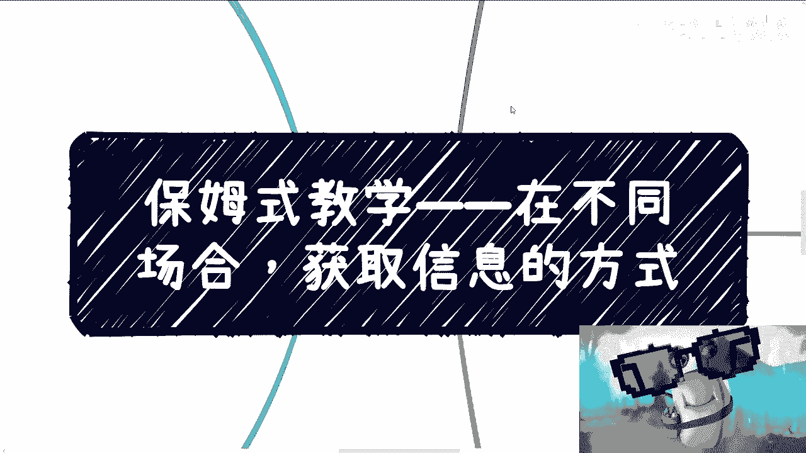
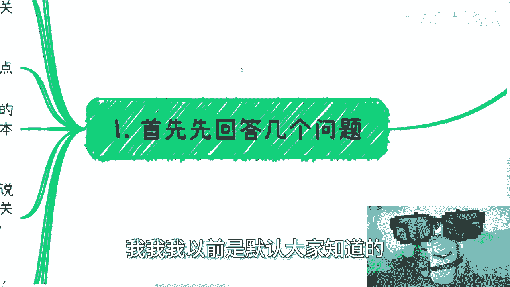
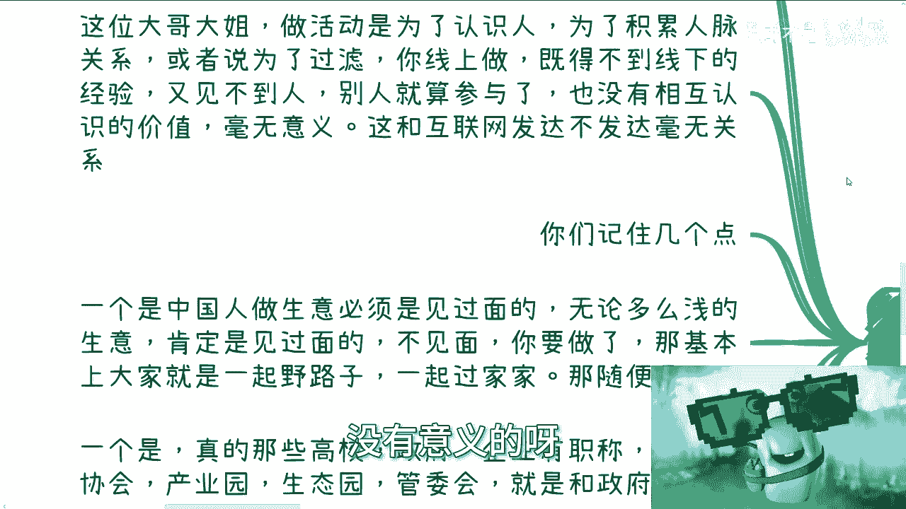
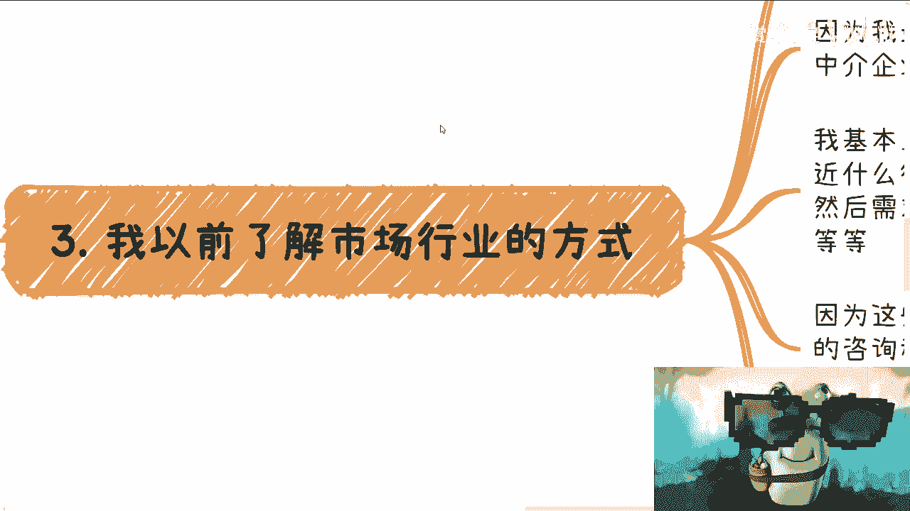
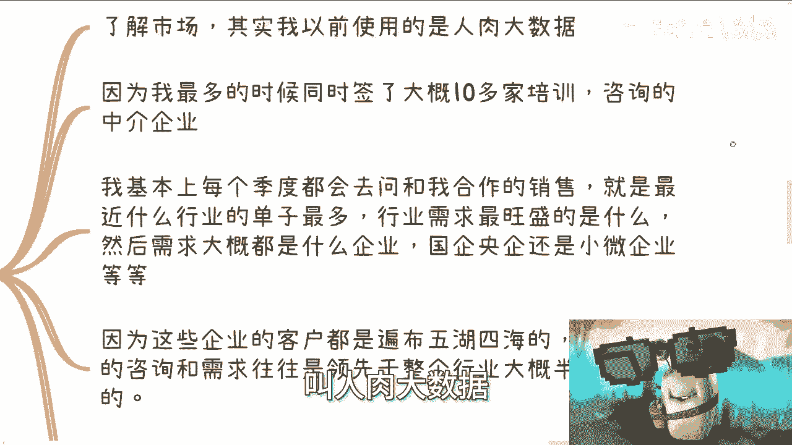
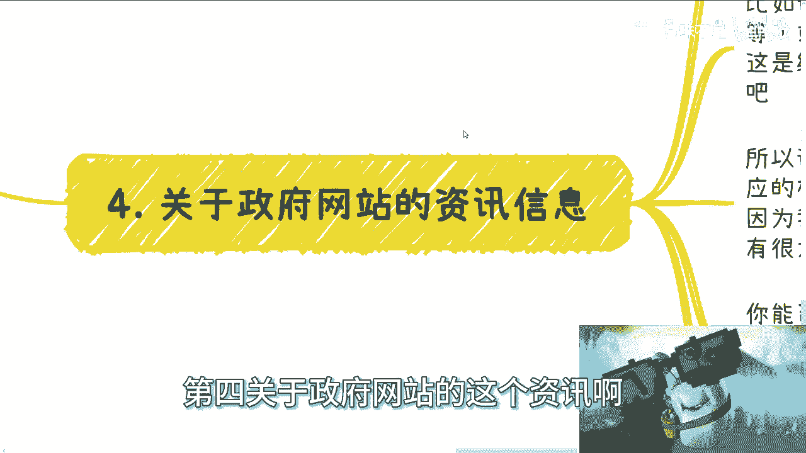
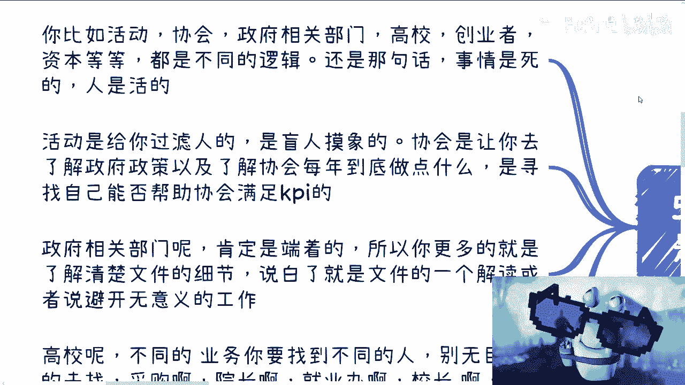
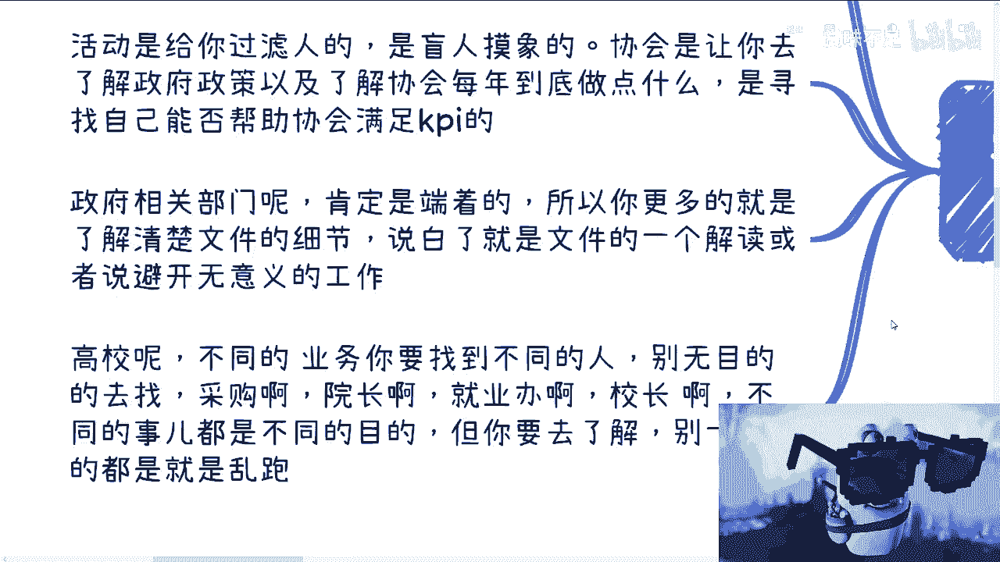
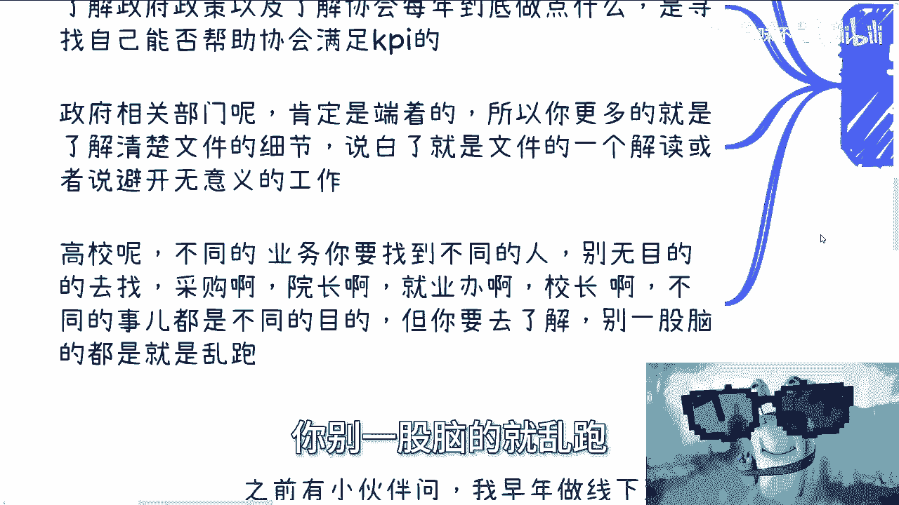
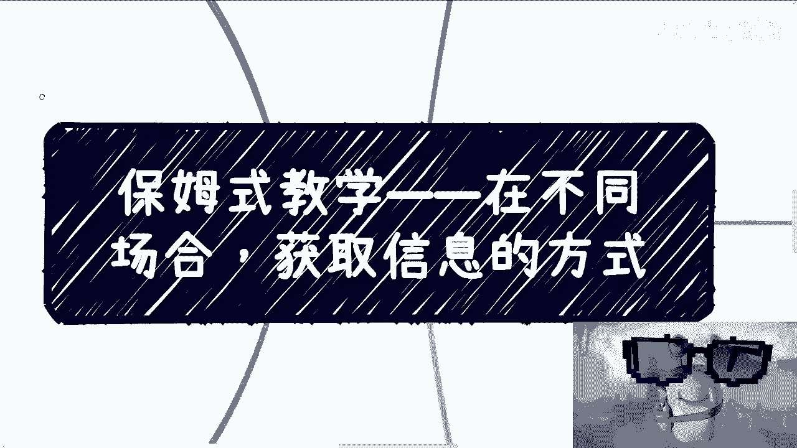

# 保姆式教学——在不同的场合，获取信息的方式 - P1 - 赏味不足 - BV1eK411e73k

啊大家好啊，这个是上海话啊哈嗯，那我们保姆式教学开始第二期啊。

本期呢叫什么呢，叫叫在不同的场合获取信息的方式。

嗯嗯对好吧，就这么断句啊，我来给你们翻译一下啊，来跟我一样的地方啊，跟这就要起来飞吧。

才得啊，好好不管他呃，首先第一个啊，首先先有几个问题，我觉得真的是不得不说我，我我以前是默认大家知道的。

我后来发现不行啊，还是要说一下呃，之前有小伙伴问啊，他说我呢早年是做线下活动啊，然后认识了很多人对吧啊好啊，他说啊，因为互联网当时没这么发达啊，然后也认识不了这么多人，也不像现在有这么多短视频什么的啊。

啊现在是不是说他说互联网发达了啊，直接从线上开始做，就可以跳过我做线下活动这一步啊。

我还是那句话，所有的大哥大姐们啊，做活动是为了认识人，是为了让你积累人脉关系，是为了过滤啊，是为了让你能够就是锻炼你线下的沟通，锻炼你线下做事情的一些经验哦，锻炼你线下所有的所有的所有的一些东西。

你懂吗，你线上做你既得不到线下的经验，你也得不到锻炼，又见不到人啊，你也不能锻炼你的察言观色对吧，而且剩下的人就算来参与者，他们也不能相互去认识，没有相互认识的价值毫无意义，你做什么东西呢，对吧。

难道你的目的只是为了做个活动，不做个活动吗，我跟你们这么说啊，我发现有一些小伙伴啊做事情很死板，就是有那种什么感觉，就是那种比如说啊这个这个小时候做数学题啊，然后你你爸妈说你哎这个你数学学的不好。

让你做题对吧，你就赌气，你就在那边说，我今天就做100道题对吧，就是你追求的不是数量啊，你追求的是要有质量啊，你得明白你做这件事情的目的是什么，你知道吗，你别一味的说啊，我就是做活动，爱爱爱创始。

我他妈今天做了100场活动，那怎么样呢，那又如何呢，没有意义的呀对吧。

另外你们记住几个点啊，一个是什么，中国人做生意必须是见过面的，我就跟你这么讲，无论是谁，无论多么浅的生意，肯定是要见过面的，不见面我跟你讲，不见面，你但凡对方跟你做对吧，或者或者说你合作了，那我跟你讲。

基本上基本上就是大家一起野路子，一起过家家，那我随便你啊，我随便你对吧，因为因为野路子不是不能野啊对吧，那你们大部分人是正规也正规，不来野也野不来，那最终只会被坑呀对了，另外一个是什么呢。

就是说你真的碰到那些比如说高校啊，政府啊啊企业有职称的对吧，或者说协会，产业园，生态园管委会啊，国资委呃，这个团委对吧等等等，你只要跟政府有点关系的，然后呃他们或者他们的上下游，我跟你们这么说。

他们根本就不会去看什么B站，也不会看什么微博，什么抖音，什么快手，你越往上的人，他越不会看，什么意思呢，意思就是说，你们别指望说网络上会有什么所谓的信息，你知道吗，就是因为你们很多年轻人啊。

你们可能接触网络比我早对吧，然后你们可能比如说什么什么B站啊，短视频啊，看的很多对吧，但是我还是那句话，你们因为中国是有中国的规则，你们要么就不要在中国做对吧，就中国的这种政治第一对吧。

这个规则是什么意思，就是你不要指望网络上你有什么信息啊，你也别指，而且反过来说，你也别指望你在网络上做出点什么成绩，对方会认可，我跟你讲不存在的，你明白吧对吧，你你别说我现在你别说。

我现在B站是这点粉丝量，你就算在我粉丝量前面加个二，加个五啊，加个九，我在政府这边我也说不上话，没有用的，你明白吧啊不会因为说你有这个东西啊，然后我我我我上报一个，我上报一个方案。

然后我上面介绍里面写着啊，这个这个陈老师啊，怎么样怎么样怎么样，没有用的，你们懂吗啊，所以说中国是个什么国家，就是你好我好，大家好，这是一个传统思想，什么意思呢，就是像我这种对吧，就是刚毕业。

就指着人家教授鼻子骂的人是少的啊，多数是人家觉得你是，人家也会微笑相待，你懂吗啊，所以说你不要去管别人对你是什么态度，你要的就是合同落地，你赚不赚得到钱。

你赚不到一切就是，对不对啊，基于以上的前提啊。

我们来往下讲，我们来说正题，首先是线下活动啊，首先你看活动啊，你得排开那些打工人的活动，你既然要去做商业，既然要去赚钱，你再去参加那些打工的活动，你不是脑子有毛病嘛，对不对啊，好什么叫打工人活动。

不要我再解释了吧，好吧好吧，你就算今天去了，就算你不知道你今天去了，这些人是不是打工人，你聊一聊就知道了嘛，对不对好，然后剩下是其他活动，那么你主要的是认识主办方，要跟他们打个照面啊，和参会的人对了啊。

然后之前很多人跟我说，什么展会什么东西啊，是这样子的，你首先你要明白你的目标人群，因为你不是所有人都要去认识的，你也没有这个经历对吧，你要明白你到底要认识的是企业。

比如说企业的这种COFOUNDER对吧，还是说要认识的是销售营销市场产品对吧，还是怎么样子对吧，那还是说你说我就要去认识甲方乙方啊，还是说我就要去认识政府官员，你的定位要清楚，然后你再去筛选活动啊。

然后有人也问我这个活动的那个付费啊，我跟你们讲活动付不付费不重要，重要的是你要看他的主办方啊，你要去看他的主办方的股东，看主办方的直属单位，不要去那些阿猫阿狗的活动，好吧。

你明白吧啊当然啊就是你要去也行啊，看你自己的这个本事，因为你去阿猫阿狗的活动，你就像我们刚刚说的，你去一些地方你得学会应变啊对吧，你不能说你是一个刚刚出新手村的人，然后你就你就进入了一个hard模式。

那你怎么玩对吧，我让你们不要去阿猫阿狗的活动，主要是怕你们被坑啊，不是说阿猫阿狗的活动没有价值，也不是说阿猫阿狗的活动不要去，等你以后熟悉了，LEO高了你再去啊，明白吧啊那么然后你去了之后，你不懂对吧。

没问题的，你先听先学，你先听听两个人别人是怎么自我介绍的，然后你再去看你缺什么，你再去补，其实不难啊对吧，你你大家第一次见面都是靠嘴啊，那公司你可以自己接呃，注册名片你也可以自己印啊对吧。

而且你不印也可以啊，你做个电子版对吧，我以前就是找公司啊，找朋友公司给我个抬头，我就出去混了呀，无所谓的呀，谁知道了，只要你的目标明确就好了，你不要自己不自信，你不要不要在那边唯唯唯诺诺对吧。

人家一看就是你，就我说白了他妈的骗子都比你有自信对吧啊，那么活动中你能获取的信息，就是不停的去了解别人是怎么赚钱的啊，当然不要去听一些表面的东西，什么哎呀你是做电商的，你是做教育的，你是做互联网的。

没有卵用的，你尽可能的去了解他们在产业链当中的角色啊，你就要去挖掘它背后的逻辑是什么，你们明白吧啊那么当然也有很多人要说了，他说哎呀我我我我跟别人聊都不知道怎么聊啊，聊了别人不理我怎么办，不拉不拉不拉。

我跟你讲啊，我跟你讲啊，就是诶诶诶诶我点错了，就是别人愿不愿意是别人的事，你控制不了对吧，或者你能了解多少，这些也不重要，因为你本来去参加活动，我跟你讲，你就是去量变产生质变的，你千万别指望说哦。

我今天是什么什么认识的几个人对吧，然后就什么得到了一些呃信息，然后认识了几十个人，好像就了解了什么有用信息，没有用的，你明白吧，哦如果你认识了几十个人对吧，或者100多人，200多人。

你就能得到有用的信息，如果那么容易的话，我就告诉你，今天他妈中国老百姓早就交付了啊，还会到今天这个地步了。

不会的呀，对吧好好。

第三个就是我跟你们讲，我以前了解市场行业的方式啊，我以前了解市场行业方式，我用的啊，我自我总结叫什么叫人肉大数据。

什么意思啊，因为我最多的时候签了大概十多家培训，咨询了中介公司。

而这些中介公司呢，他们的整个服务的客户，是遍布中国整个的大小城市的啊，那么我基本上我不管有没有case啊，我每个季度都会问，去跟我合作的销售或者说商务啊，那比如说最近什么行业单子最多啊对吧。

行业需求什么是最旺盛的啊，然后需求大概都是什么企业啊对吧。

国企央企还是小微企业啊等等等啊对吧，那你们又要说了啊，那为什么他要告诉你呢，我跟他们都是合作，为什么不告诉我呢，对不对，而且而且说不好听点，我我跟他们都是打工人，也没什么不能说的。

这种这种东西不是商业机密啊，那么同样的，因为这些企业的客户他遍布五湖四海，所以说呢不同的企业的咨询跟需求，它往往是领先于整个行业，大概半年到一年的，什么意思呢，就是说所有的信息当铺天盖地。

比如说网络上出来的时候，或者当铺天盖地，你身边很多人知道的时候，那么它往往已经不是什么秘密了对吧，但是往往在大家都知道的之前，比如说半年一年很多的企业，你可能是小微，也有可能是一些国企，央企。

也有可能是一些这个这个叫什么，就是呃就是BT对吧，字节这种公司，他们其实很早就会去寻找这些呃，那个那个第三方服务机构，然后要有些需求，而他们的需求其实肯定我告诉你们，这不叫前瞻性。

他们的需求一定是有一些明确的信息，或者小道消息让他们去做的对吧，所以说我一般通过的是他们的信息来定位，我到底接下来怎么去修改我的咨询大纲，跟我的咨询方向，我跟你们讲过，做事情从来不能靠赌博的。

靠赌博没有用的，你明白吧，好以及我也会很清楚整个市场大概半年后，一年后，什么方向的岗位最火啊，什么方向可能大家最关注啊，为什么，因为没一样的呀，市场怎么来的了，不就是人来疯嘛，对不对，人来疯怎么来的了。

不就是看哪些企业做的做的多吗，或者哪些企业关注吗，对不对，你像你你往前翻，比如说以前的敏捷scram对吧，然后往后移动互联网里面的里面的微服务，那不都是以前GOOGAWAS啊。

或者其他的各个地方用的多了啊，还开始人来疯了一样的呀对吧，那么我就可以提前去做一些比如说技能培训啊，或者说就业辅导啊，对吧，我可以提前做准备啊，这都是钱啊，对不对，这叫了解了解信息啊啊好。

第四关于政府网站的咨询啊。

我给你们讲真的，我好补充一下，我真的我发现很多人应该是我是我的错误，我不应该莫名很多人知道政府网站的咨询啊，他只不过是给我们的一个引导和指导啊。

不是说今天我们看到一个什么东西啊，好你说好，政府发了，我们就冲，不是这么做的啊，哥哥们姐姐们啊，就是比如说今天某某发现了一个某某某市，数字经济3年规划，2023~2025，对不对。

好或者什么城市的城城市规划对吧，2023，比如说到2033对吧，或者到2035对吧，好这些都是大方向，这些是给我们写方案用的，是给我们在战略上有指导意义用的。

你明白吗啊，所以说我们要做的是什么，我们要做的是找看到这个大方向之后，你觉得哎我我想在这里面做的，或者这个大方向跟我个人有一点关系的。

那么你要去寻找的是这个资资讯对应的，相关部门，或者找到跟这个资讯里面方向相关的行业协会，去聊一下，为什么，因为因为我国很多东西你们但凡做过，就知道面子上写什么，跟他真的要什么，他他妈差别有的大了啊。

也就是说你能否真的能做，你能否在这里面真的赚到钱，以及到底赚到的是什么钱，什么名义的钱能赚到多少钱，你都是需要线下去沟通需求的，你明白吧，你去找协会，你去找相关部门聊的是什么呢，聊的是真正的需求。

而不是网站上那些有的没的，那些那些那些叫什么套话，没有用的啊，网站上所有的尤其是我国政府做的，也不是我国吧，就我觉得各地方政府都一样，它它它其实都是很多宏观的话术，你单纯靠那些东西。

你是不知道你真正要用要要什么的，你明白吧，这也是为什么很多人说爱创始，我看这个东西看不懂你屁话，当然看不懂啊，对不对，好真的，我跟你讲这事啊，我一直默认大家是知道的。

我后来发现他妈的大家并不知道，所以我在这个地方就补充一下好，那么还有最后最后一点啊。

不同的地方你需要获取的东西是不一样的啊，你比如说活动协会，政府相关部门，高校创业者资本，他都是不一样的逻辑，还是那句话，就是你一定要有足够的情商，足够的判断力去判断你对面这个人是谁，以及你要干嘛。

你不要用同一套逻辑，你比如说陈老师说哎，我们要准备这个这个注册公司啊，我们要准备这个企业介绍，然后你不管对方是谁，你都是同一套话术，你不是在找死嘛，对不对。

没有这样做事情的，而且还是那句话呀，如果商业上做事情这么简单的话，那他妈的就不会到今天了，哥哥们姐姐们，你懂吗，你们不是应试教育啊啊啊好，然后我给你们简单说一下，比如说活动，活动是给你过滤人的。

是让你去盲人摸象的啊，就好像是让你以一个很粗糙的一个，信息获取方式在整个面上面去获取信息，然后协会是什么呢，协会是让你更细节的去了解政府政策以及了解，比如说协会每一年到底能做些什么。

以及你作为一个企业跟协会之间，到底能有什么合作对吧，这个是协会的作用，因为协会在中国本来就是承上启下的作用，然后是这个政府相关部门也很简单啊。

政府肯定是端着的，对不对啊，当然这个没问题啊，所以说你更多的是什么，你更多的不是去讨论，不是去battle啊，不是去说哎呀，我们要平起平坐，这不是你的目的啊，啊你不要跑过去，他妈的就好像搞得你很牛逼。

你说你是问人家，你问个屁啊，对不对，你更多的跑过去是这样子的，是说哎比如说我看到了我那个区政府对吧，或者相关的地方发了一个这个政策，我是来了解文件细节的，就是说潜台词就是我是来服务你们的，你明白吗。

我是来帮助你们的，你别跑过去，就是他妈的一副很的样子，说哎我要来了解你们，你了解个屁呀，真的我跟你们讲，这就对吧，然后比如说高校啊，不同的业务你得找不同的人啊，别漫无目的的，比如说你说啊，我找采购啊。

找院长啊，就业办啊，校长啊对吧，包括学生会啊，每个地方你去寻找它都有你的目标性的，也就是说要看你的产品是什么，看你的需求是什么，看你最终到底要达到什么样的目的，但是你现在跟我说，你不知道。

对你的确不知道，所以你要去了解啊对吧，我不管你怎么了解你，你比如说你去找一些高校联盟对吧，然后你比如说找找了这个高校人，找那个小人这边了解了解，那边了解了解你也要去做铺垫的，你别一股脑的就乱跑啊。

好吧我我我跟你们讲啊。

还是那句话啊，在商业市场，在社会上面，只要你们出了学校，在社会上面，绝对不存在什么一招或者五招或者十招，什么天吃遍天下，不可能的，不现实的，你知道吗，在外面靠的是什么，靠的是你的察言观色。

靠的是你的口才，靠的是你的包装，靠的是你的吗，零就是就是呃随机应变的能力，不是靠的，是你说我今天就是就是就是做一个数学题，知道怎么解，然后我把这个过程背下来，没有用的啊，没有用的。

所以说就是说你们以前可能看过，我的一些充电的视频，你也看到过我以前讲的东西，但是唉但是就是说你得去理解好吧，就千人千面，我讲的东西不可能适应适用于每一个人，我只能跟你讲大概的方向是在什么地方哦。

然后你要有任何细节对吧，我不是说你还是那句话啊，我不是说你们一定要去付钱找我咨询，你们找谁咨询都可以，但是你们一定是要通过我给的方向，有实践了之后，然后你要有自己的思考，然后再通过沟通。

比如说跟我或者跟其他人，你一定是有经过不同的沟通，然后再不停的思考，不停的复盘，你才有可能往前走的啊，你不是说今天比如说陈老师讲了一堆理论对吧，然后你说啊我通过这个东西啊，能够因为我学的这个东西。

所以我能干嘛干嘛，它不存在这个因果关系的，明白了吧好吧，我我已经讲的很清楚很清楚了，不能再清楚了啊，不要再去相信网上的任何信息，没有任何卵用的啊，要么就是二手信息，要么就是呃过时的，就这么简单好吧。

OK好吧，有啥你们反正整理好，不管职业规划还是商业规划啊，还是说什么合同啊，或者有人找你们合资公司啊，反正有什么商业上你们不明白的。

