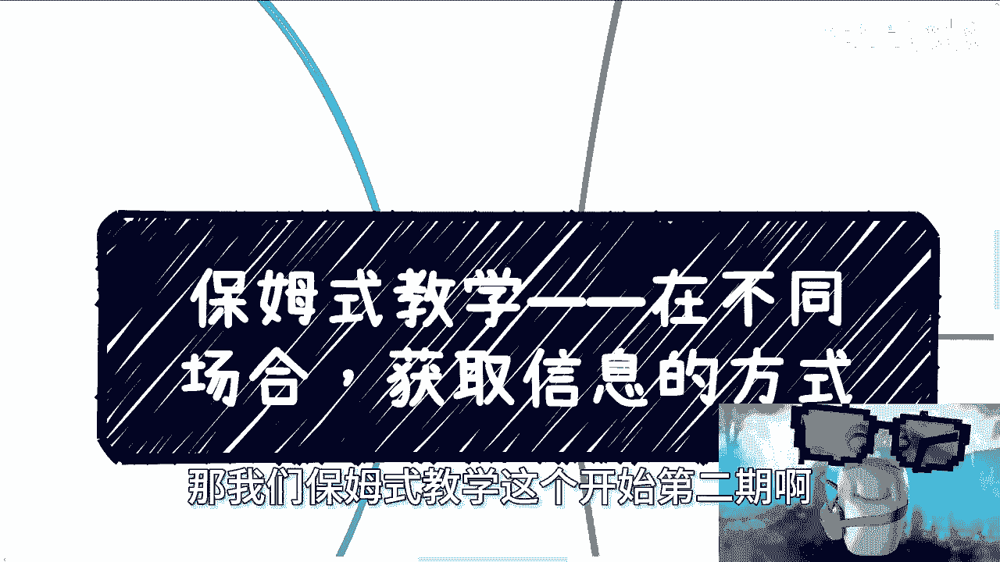

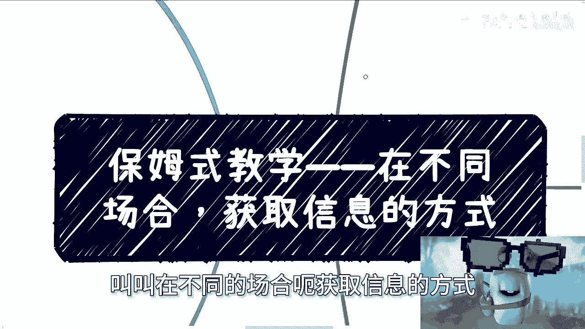

# 保姆式教学 P1：不同场合的信息获取方式 🧭

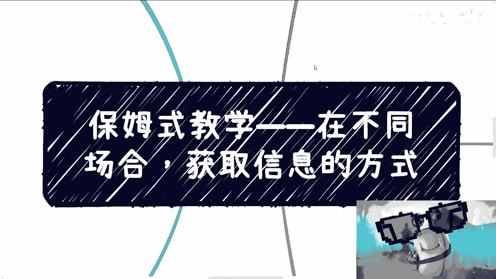

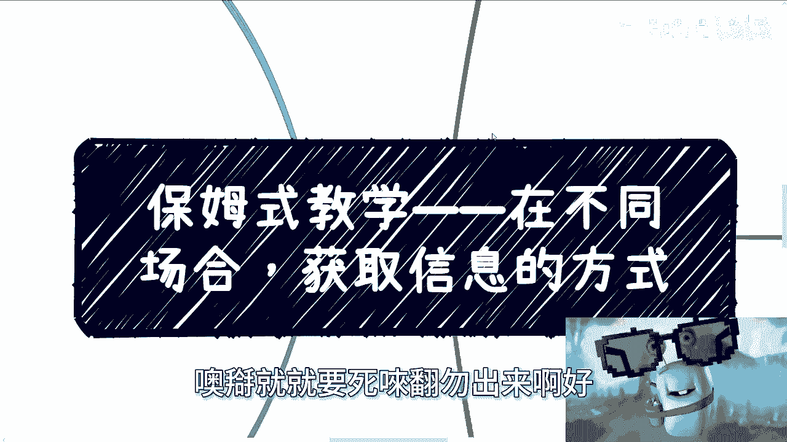

在本节课中，我们将学习如何在不同商业场合中有效地获取信息。课程将涵盖线下活动、行业情报、政府信息等多个方面，帮助你建立正确的信息获取思维，避免常见误区。

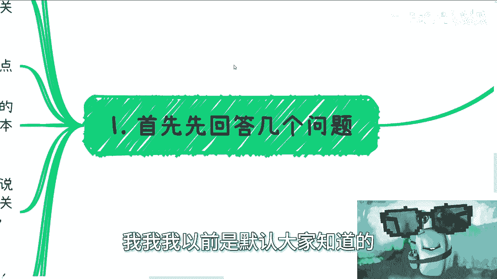

---

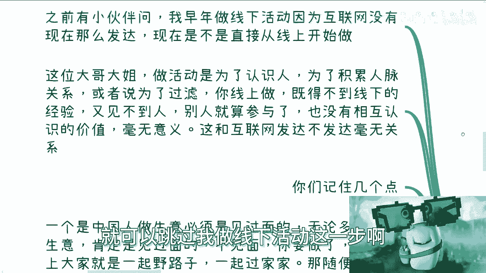

## 课程概述

商业成功离不开有效的信息。许多人误以为互联网是万能的，但真实商业世界的信息获取远不止于此。本节课将系统性地介绍在不同场合下，如何定位、筛选并获取真正有价值的信息，为你的商业决策打下坚实基础。

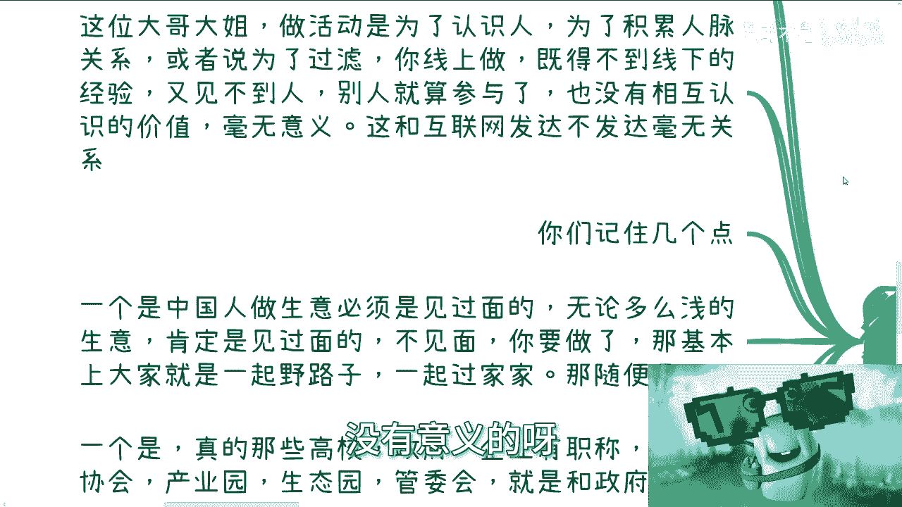

---

## 线下活动的核心目的 🎯

上一节我们概述了课程内容，本节中我们来看看线下活动的真正意义。许多人错误地认为，在互联网发达的今天，可以跳过线下活动。这种想法是错误的。

线下活动的核心目的并非“举办活动”本身，而是为了：
*   **积累人脉关系**：建立真实的人际网络。
*   **锻炼沟通能力**：提升线下沟通、察言观色的实战经验。
*   **实现人员过滤**：在真实互动中筛选出有价值的合作伙伴。
*   **创造连接价值**：让参与者之间也能相互认识，产生化学反应。

单纯追求线上活动或活动数量没有意义。关键在于明确目的：**你是为了认识人、锻炼能力、获取信息，而不仅仅是为了完成“举办活动”这个动作。**

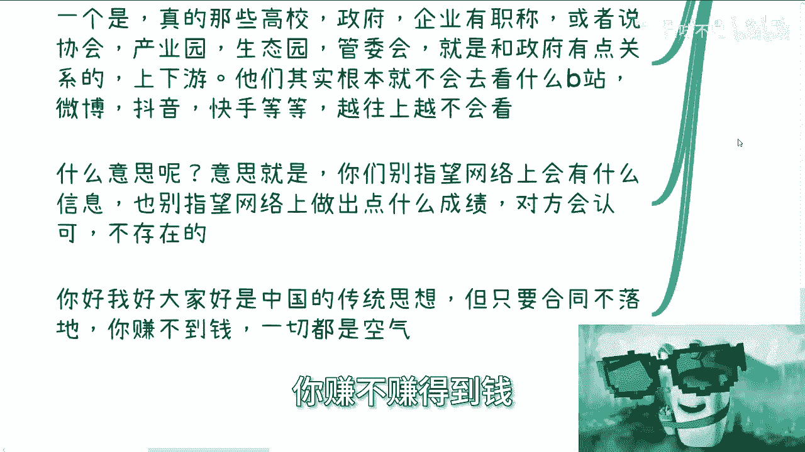

---

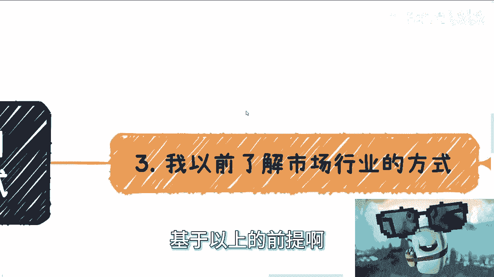

## 商业合作的基本规则：见面 🤝

在商业世界中，尤其是在中国，有一条基本规则：**重要的商业合作必须基于线下见面**。

公式可以概括为：**可信合作 ≈ 线下见面**。

无论生意大小，未见过面的合作往往缺乏根基，容易演变为不规范的“野路子”操作。对于缺乏经验的新手而言，这极易导致损失。

此外，对于政府、高校、大型国企等体系内的机构，其决策者通常**不依赖B站、微博、抖音等公开网络平台获取信息或进行决策**。你的网络影响力（如粉丝量）在这些场合的认可度极低。中国的商业文化注重“你好我好大家好”的和谐与信任，这通常需要通过面对面接触来建立。最终，一切要回归本质：**合同是否落地，能否赚到钱。**

---

## 如何筛选与参与线下活动 🏢

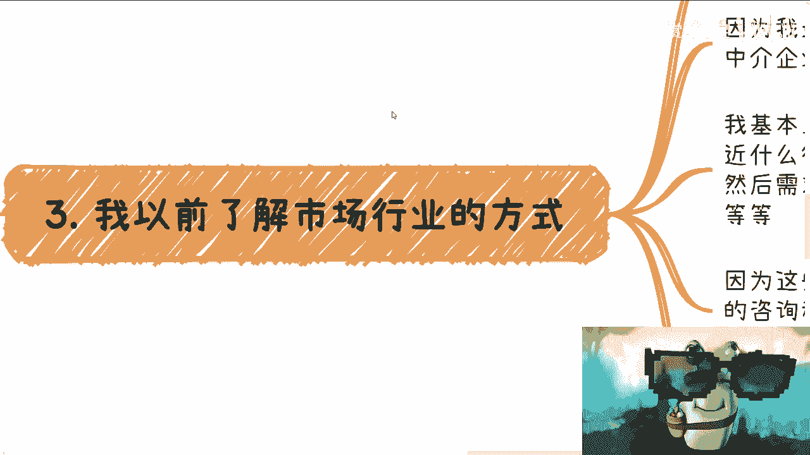

基于以上前提，我们来具体看看如何操作。首先，你需要筛选活动。

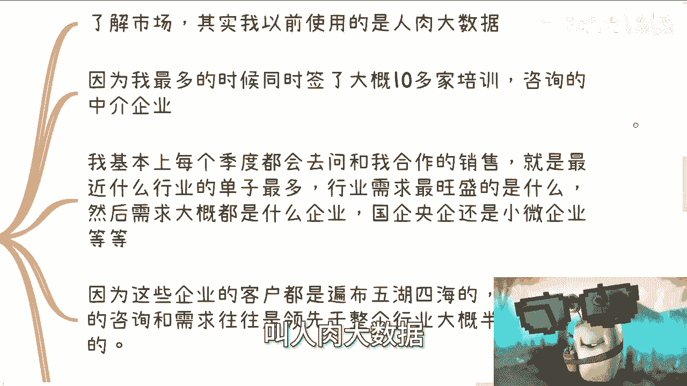

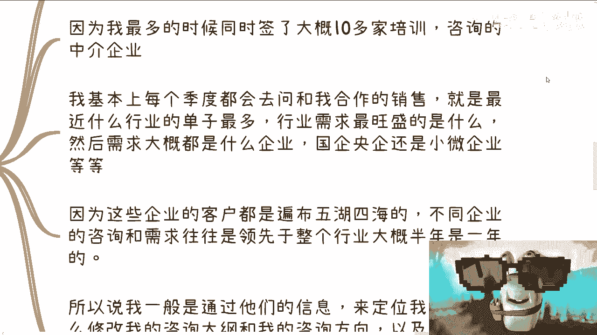

以下是筛选与参与活动的步骤：
1.  **排除“打工人”活动**：如果你的目标是商业与赚钱，应主动避开以普通职员为主要受众的活动。通过简单交流即可判断参与者属性。
2.  **明确目标人群**：想清楚你需要认识**企业创始人（Co-founder）、市场/销售负责人、政府官员还是甲方/乙方代表**。根据目标来筛选活动。
3.  **审视活动主办方**：活动是否付费并非关键，重要的是主办方的背景。要查看主办方的股东、直属单位，优先选择有权威背景的活动，避免参与背景不明的“阿猫阿狗”活动，以防被坑或信息质量低下。
4.  **活动中聚焦核心**：主要目标是结识**活动主办方**并与**参会者**建立联系。如果初入行，应以学习和观察为主，听听别人如何自我介绍，了解行业内的公司架构和职位设置。
5.  **灵活进行自我包装**：公司抬头可以借用朋友公司，名片可以自行印制或使用电子版。关键在于**目标明确且自信**，不要唯唯诺诺。获取信息的核心是**深入了解他人如何在产业链中赚钱**，而非表面行业标签。要挖掘其背后的商业逻辑和角色。
6.  **保持正确心态**：不要指望参加一两次活动就能获得关键信息。参与活动是一个 **“量变产生质变”** 的过程，旨在拓宽接触面，积累初步认知。别人是否愿意深聊、你能了解到多深，这些都不必强求。

---

## “人肉大数据”：获取行业前瞻情报 📈

除了线下活动，还有一种高效的行业信息获取方法，我称之为 **“人肉大数据”** 法。

我曾与十多家培训、咨询中介公司合作。这些公司的客户遍布全国各大城市。我每个季度都会主动联系合作的销售或商务，询问以下信息：
*   近期哪个行业的订单最多？
*   什么需求最旺盛？
*   需求方主要是什么类型的企业？（如：国企、央企、小微企业等）

这些信息并非商业机密，且由于服务机构接触的是企业最前端的需求，因此这些需求往往**领先于公开的市场趋势约半年到一年**。当某个信息在网络上或大众间普及开时，它往往已不再是秘密或先机。

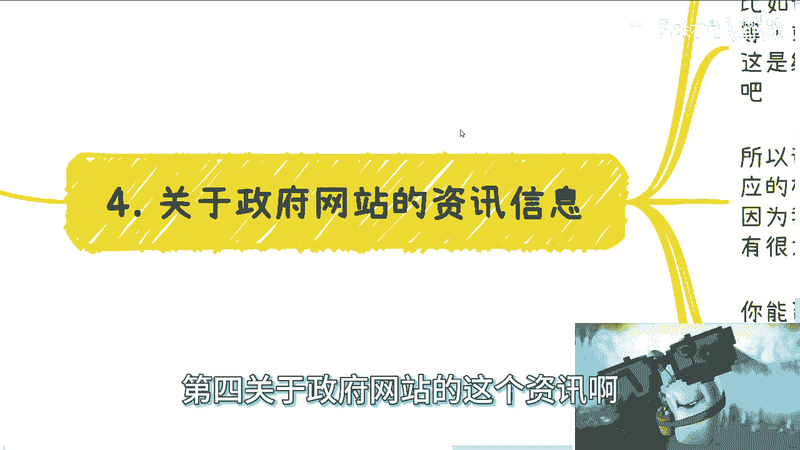

通过分析这些“人肉大数据”，我可以：
*   调整自己的咨询或业务方向。
*   预判未来半年到一年内，市场上哪些岗位或技能会火爆，从而提前布局培训或服务。

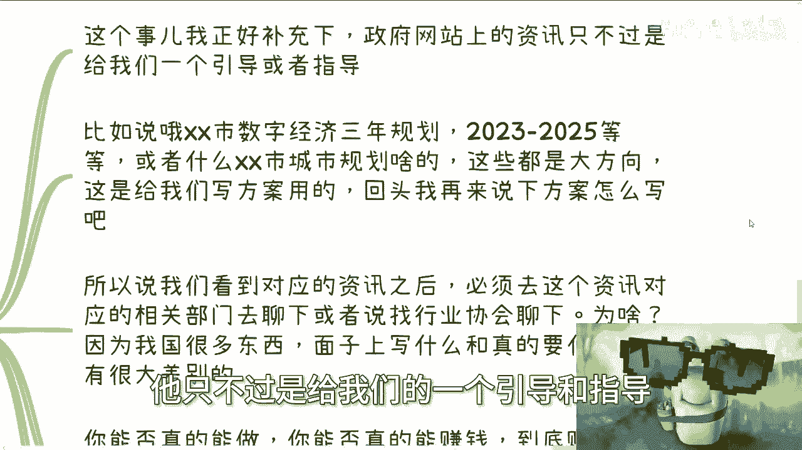

这本质上是通过产业链上游的服务商，获取下游市场的早期动向。

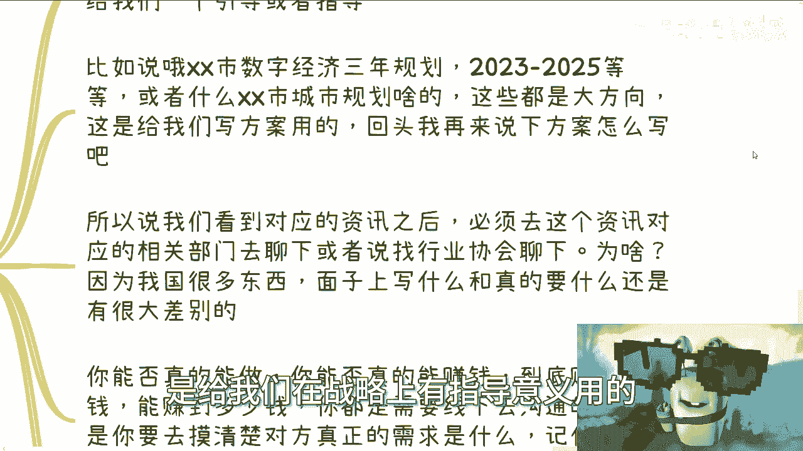

---

## 政府网站信息的正确使用方式 🏛️

许多人会查看政府网站发布的规划文件，但使用方法存在误区。政府文件（如《XX市数字经济三年规划》）的作用是**提供战略方向的引导和指导**，而非直接的操作手册。

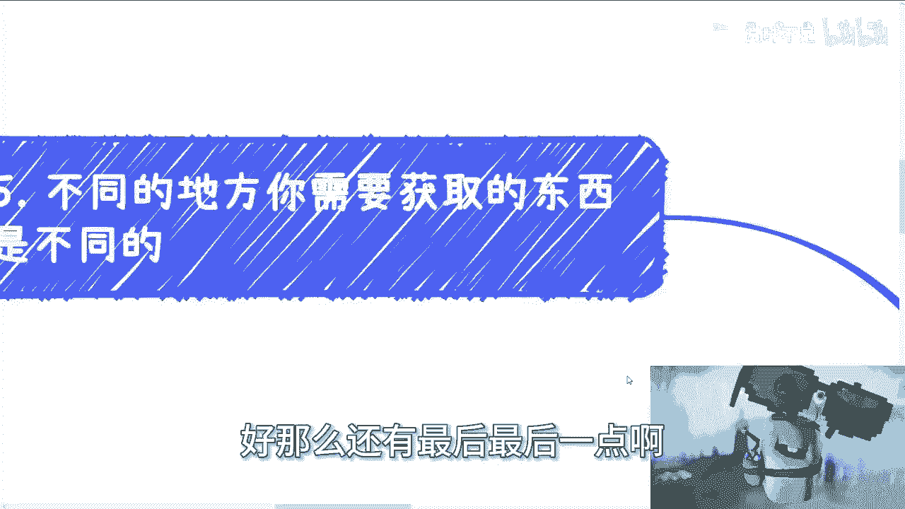

核心公式是：**政府规划 → 指明方向 → 线下验证真实需求**

正确的使用步骤是：
1.  **研读文件，找到关联**：阅读规划，找到与你自己业务或个人发展方向可能相关的部分。
2.  **寻找对应接口方**：根据规划内容，去找到对口的**相关部门**或相关的**行业协会**。
3.  **线下沟通，挖掘真实需求**：与这些部门或协会进行线下沟通，目的是了解**政策背后的真实、具体需求**，以及实际落地过程中可能存在的机会、名义和预算。网站上多为宏观话术，真实操作细节和需求必须通过线下沟通才能获得。

---

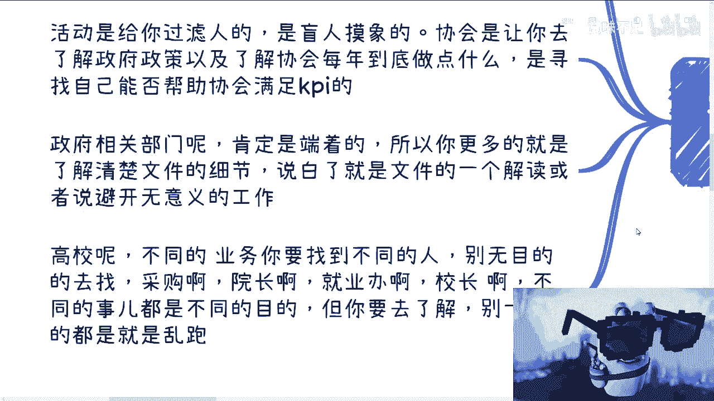

## 不同场合的沟通策略差异 🗣️

最后，我们必须认识到，在不同场合面对不同对象时，信息获取和沟通的策略必须有差异。绝不能使用同一套话术和逻辑。

以下是不同场合的策略要点：
*   **活动场合**：目标是“广撒网”和“盲人摸象”，以相对粗糙的方式在大的面上接触信息和人，进行初步过滤。
*   **行业协会**：目标是承上启下，更细致地了解政策细节、行业年度动态，以及探讨企业如何与协会开展具体合作。
*   **政府相关部门**：姿态应是“服务与请教”，表明自己是来了解文件细节、帮助落实政策的，而非平等讨论或挑战对方。目的是获取指导和支持。
*   **高校机构**：目标必须极其明确。根据你的产品或需求（如采购、课程合作、就业推荐），精准找到对应负责人（如采购处、院长、就业办、学生会），不同目标找不同的人，事先做好功课。

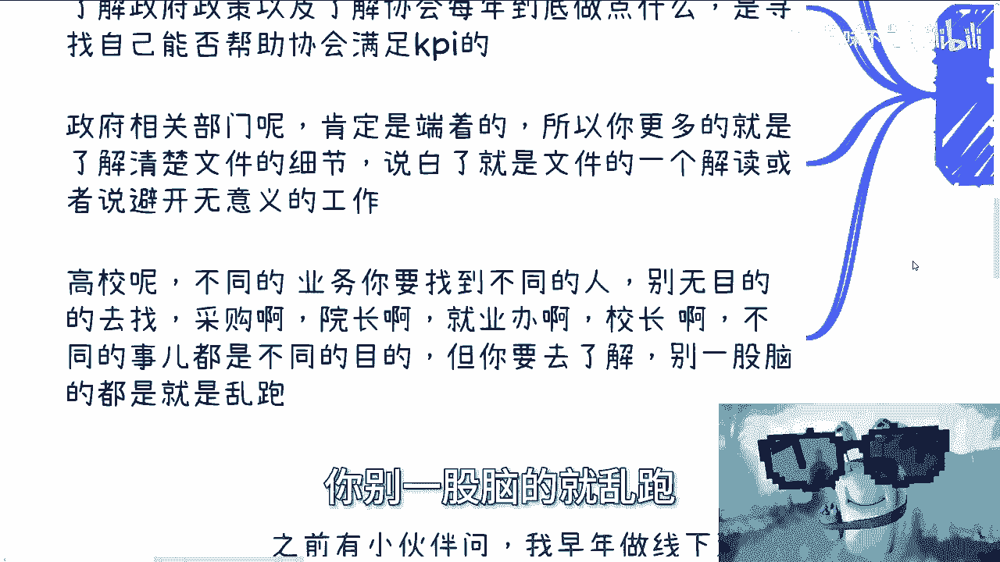

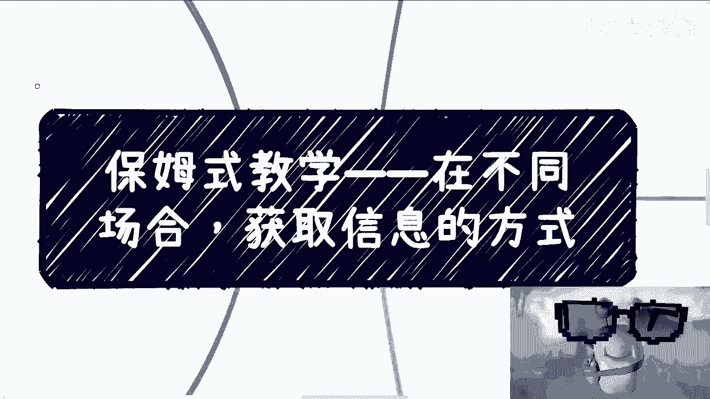

商业社会不存在“一招鲜吃遍天”的固定公式。成功依赖的是**察言观色、口才、个人包装和随机应变的能力**，而不是死记硬背解题步骤。本节课提供的只是方向和框架，你需要结合自身实践，不断思考、复盘，并通过多次沟通（无论是与我还是与他人）来深化理解，才能持续进步。

---

## 课程总结

本节课我们一起学习了在不同场合获取商业信息的系统方法。我们明确了线下活动不可替代的价值，理解了商业合作中“见面”的重要性，学会了筛选活动、通过“人肉大数据”获取前瞻情报、正确解读政府文件以及针对不同对象采取差异化沟通策略。

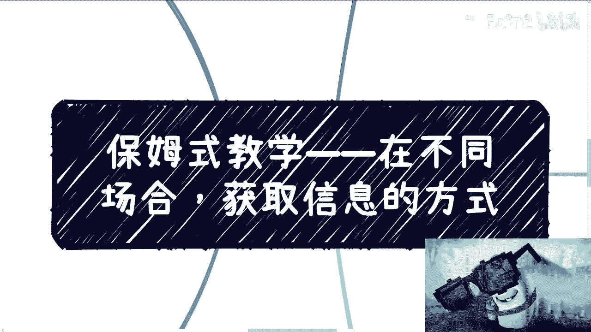

记住，**所有理论都需要结合实践**，在真实世界中不断磨练你的判断力和应变能力，才是获取有价值信息的根本。切勿迷信网络上的二手或过时信息，真实商业机会藏在系统性的线下探索与沟通之中。