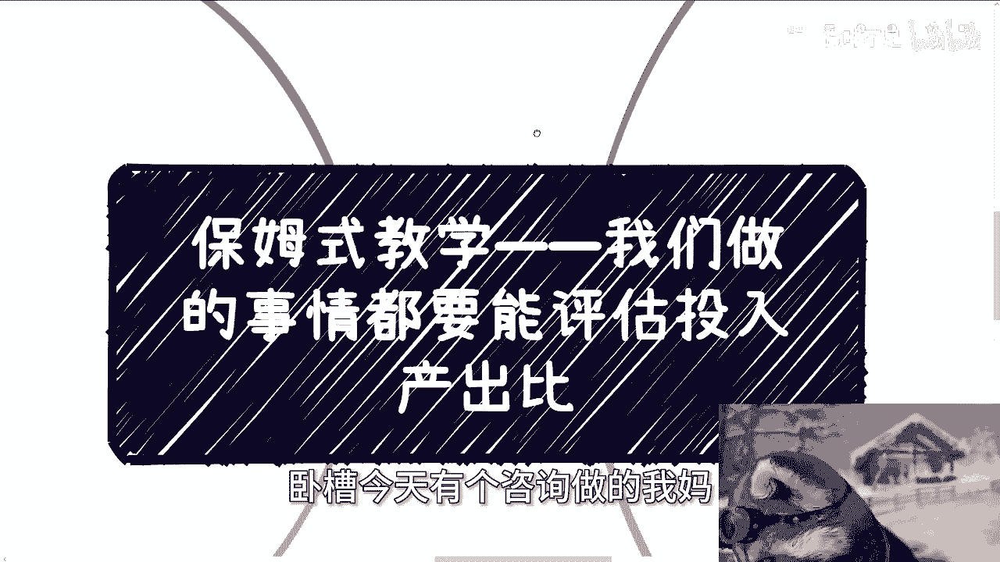
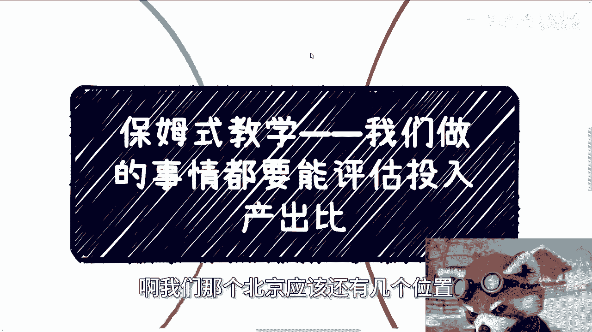
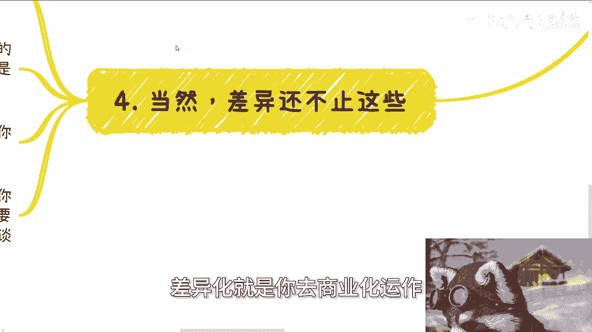
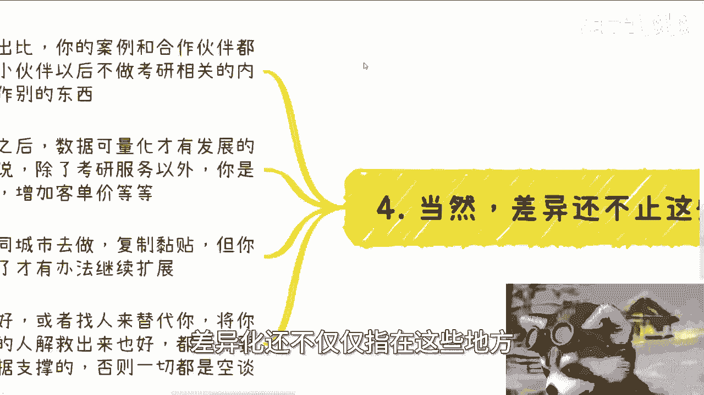
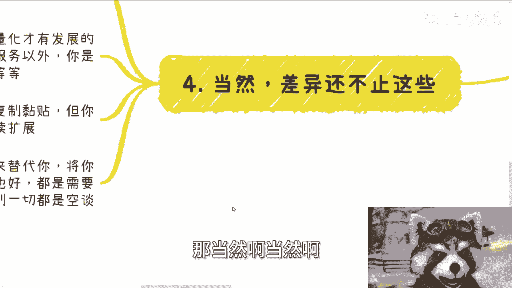

# 保姆式教学 P1：做投入产出比明确的事情 💡

在本节课中，我们将学习一个核心的商业思维：如何评估并确保你所做的事情具有明确的投入产出比。我们将通过一个具体的案例，拆解模糊概念，并学习如何将想法转化为可量化、可执行的商业计划。

---

## 概述：为什么需要明确的投入产出比？

许多人在规划未来或评估业务时，习惯使用模糊、笼统的词汇，例如“解决客户痛点”、“抓住未来趋势”或“看用户需求”。这些表述缺乏具体细节，无法评估投入（时间、精力、金钱）与产出（收益、成果）之间的关系。

**核心问题**：当投入和产出都无法明确量化时，你的决策就等同于**赌博**。商业决策应建立在可评估的数据基础上，而非空想。

---

## 案例分析：考研辅导业务的困境

上一节我们指出了模糊规划的危害，本节中我们来看看一个具体案例。一位从事考研辅导的伙伴，每月已有数万元收入，但业务刚起步，数据历史较短。他面临一个重大抉择：是否应接受合伙人邀请，辞职并前往北方城市全职投入此项业务？

当时给出的建议是：**评估不出明确投入产出比的业务，最多投入30%的精力尝试，绝不能All-in**。原因在于其业务存在不确定性：流量来源不明、转化率波动、缺乏稳定的商业闭环。

---

## 如何将“赌博”转化为“生意”：两步走策略

为了使这项业务从“凭运气”变为“可规划”，需要完成以下两个关键步骤，将模糊概念转化为具体、可量化的行动计划。

### 第一步：打造正规的商业产品包

你需要将现有的服务包装成正式、专业的商业产品，用于与企业或机构合作。

以下是产品包应包含的核心内容：
1.  **宏观政策介绍**：说明业务所处的政策环境。
2.  **团队介绍**：展示团队的专业背景与实力。
3.  **产品与服务介绍**：详细描述提供的具体服务内容。
4.  **成功案例展示**：列出已服务过的客户及成果。
5.  **合作伙伴名录**：展示已有的合作资源。
6.  **核心优势说明**：阐述你独有的、竞争对手没有的价值。

### 第二步：锁定渠道并量化数据

你需要找到稳定的客户来源（渠道），并基于此测算出可预期的收入。

以下是具体的执行步骤：
1.  **明确用户画像**：你的目标客户是学生。
2.  **对接精准渠道**：主动联系各类高校（公立、私立、职业院校等），寻求合作。
3.  **签订正式合同**：与学校签订战略合作协议，明确合作细节，例如：每学期输送多少学生、以何种形式（宣讲会、培训班）输送。
4.  **计算预期收入**：根据历史转化率（例如：咨询转化率=成交客户数/总咨询数）和合同约定的输送学生数，计算出可预期的客户数量和收入。

**计算公式示例**：
`年预期成交客户数 = 合作学校数量 × 每校年输送学生数 × 平均转化率`
假设与10所学校合作，每校每年输送1000名学生，转化率为10%，则：
`年预期成交客户数 = 10 × 1000 × 10% = 1000人`

至此，你便得到了一个可量化、可评估的投入产出模型。你知道为了服务这些客户需要投入多少人力与成本，也能清晰地预测收入，这便成了一门真正的“生意”。

---

## 明确投入产出比的深远价值

完成上述两步后，你的业务将获得扎实的基础，并为未来发展打开空间。清晰的投入产出比和数据支撑，会带来以下好处：

**1. 实现业务扩展**
*   **纵向扩展**：在现有考研服务基础上，增加其他培训服务或提升客单价。
*   **横向扩展**：将已验证成功的商业模式，复制到其他城市。

**扩展的前提是数据**：没有可量化的数据，就无法判断扩展是否成功。

**2. 支撑商业运作**
*   **融资需求**：清晰的数据是吸引投资的核心。
*   **团队建设**：你可以根据业务量，精确计算需要招募多少人、成本与利润如何。
*   **创始人解放**：当业务流程和数据可控后，你可以逐步将执行工作移交团队，自己专注于战略。

---

## 总结与核心要义

本节课中我们一起学习了“做投入产出比明确的事情”这一核心思维。

**核心要义**：**避免使用模糊词汇进行决策，必须将想法拆解为具体的行动和可量化的数据。** 评估不出投入产出比的事情，其性质接近于赌博，只适合用少量资源进行试探。而一旦通过锁定渠道、签订合同、计算转化率等方式将其量化，它就变成了可规划、可发展、可持续的真正生意。

最后需要明确：并非“过家家”式的做法完全赚不到钱，但它缺乏稳定性和可积累性。本节课提供的是追求**长期、稳定、可发展**的商业逻辑。你可以根据自身情况判断与选择。