# 保姆式教学：创业前必须做的三项准备 - P1 🛠️

在本节课中，我们将学习在正式开展商业活动前必须完成的几项核心准备工作。这些准备能帮助你避免“有勇无谋”的莽撞，提升商业沟通的成功率，让你从“草台班子”转变为值得信赖的合作伙伴。

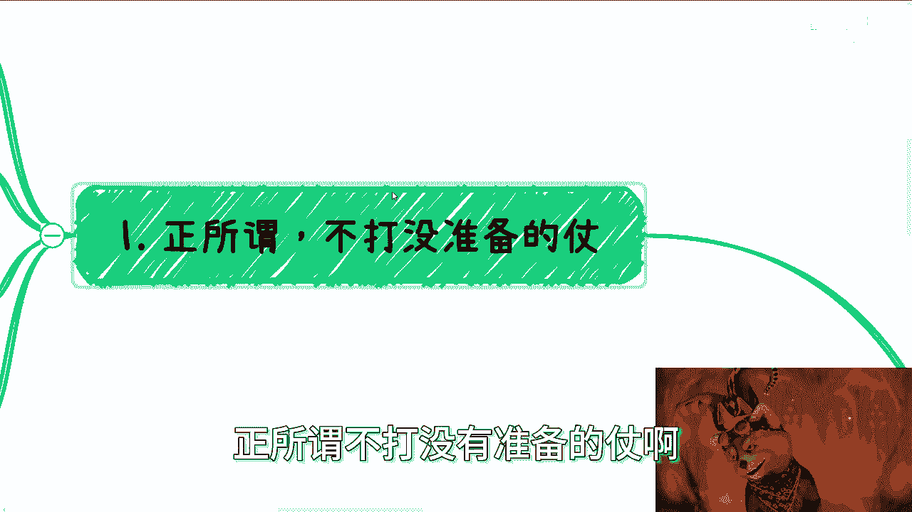

---

上一节我们提到了准备工作的重要性，本节我们将具体展开第一项：**不打无准备之仗**。

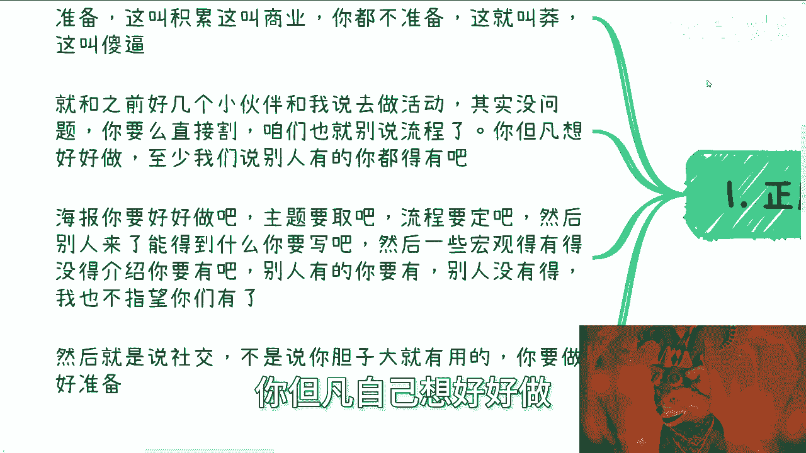

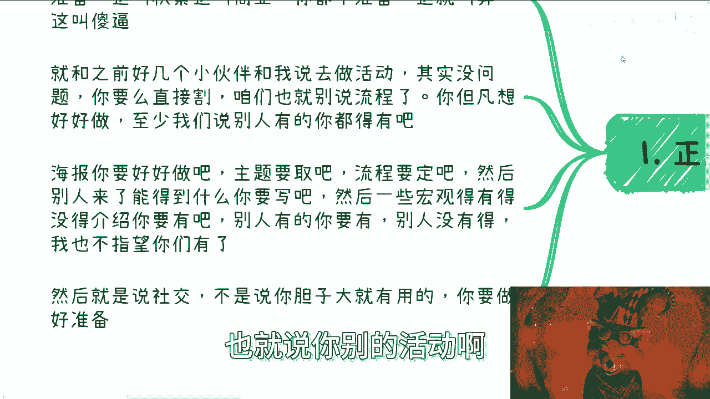

商业活动不是凭一时冲动就能成功的。充分的准备是“商业谈判”和“经验积累”，没有准备则是“鲁莽”。许多人发起活动时，连最基本的信息都未完善。

以下是筹备一个商业活动时，你至少需要准备的内容清单：

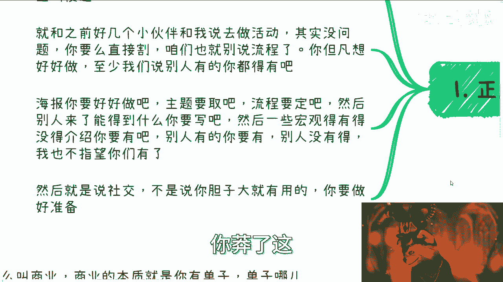

*   **主题与描述**：清晰的活动名称和说明。
*   **宣传海报**：专业、吸引人的视觉材料。
*   **活动流程**：明确的时间安排和环节设置。
*   **价值说明**：参与者能获得什么，必须明确写出。
*   **宏观背景**：可以结合相关政策（如二十大精神、地方政策）来提升活动的格局和可信度。

核心在于：**别人有的你都得有**。即使无法超越，至少不能低于行业的基本标准。有策略的“莽”叫开拓，无准备的“莽”则可能“伤敌零，自损一千”。

---

在做好了活动层面的准备后，我们来看看个人或团队身份的包装。这就是我们的第二项准备：**企业与个人介绍**。

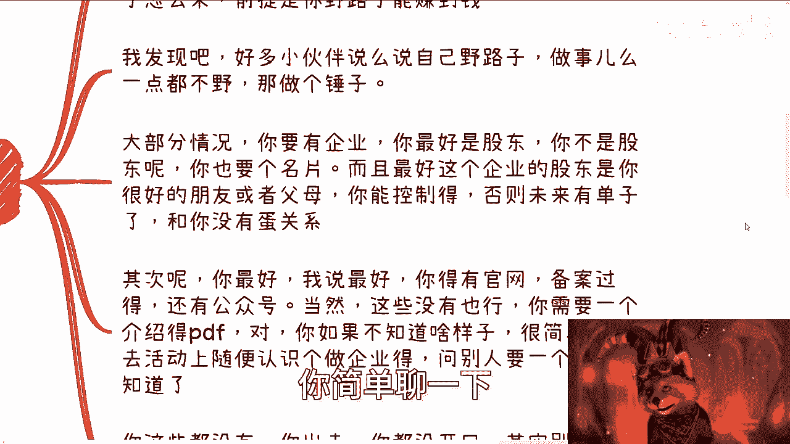

在中国商业环境中，纯粹以个人身份开展业务的情况较少。你需要一个正式的身份载体。路径大致有两种：

1.  **专家路线**：以垂直领域专家的身份提供咨询服务。这需要强大的个人背书（如资历、案例、影响力）。
2.  **企业路线**：拥有一个商业实体进行运作。这是更普遍的方式。

关键在于**走极端**：要么彻底正规化，要么路子非常“野”。最忌讳的是处于中间模糊地带，那会显得不伦不类，难以取信于人。

对于大多数选择企业路线的人，以下是需要准备的材料：

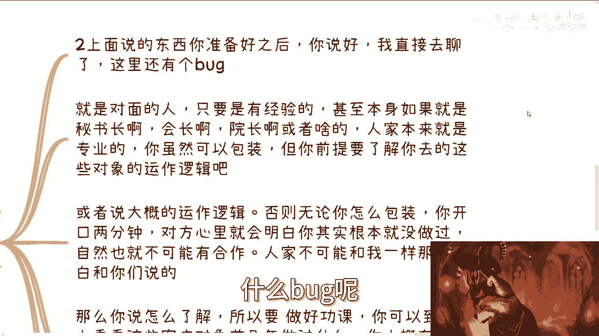

*   **企业实体**：最好是你能控制的公司（自己是股东或与股东关系紧密）。
*   **职位名片**：至少印有“销售总监”、“商务总监”等头衔。
*   **官方资料**：最好拥有备案的官网和公众号。
*   **必备文件**：一份专业的**企业介绍PDF**。如果不知道如何制作，可以去向其他创业者索要一份参考。

如果这些基本材料都没有，对方在接触你的瞬间，就可能将你判定为“过家家”或“草台班子”，合作便无从谈起。

---

当你带着完善的材料准备去接触客户时，还有一个致命的“Bug”需要修复，即第三项准备：**了解拜访对象的背景**。

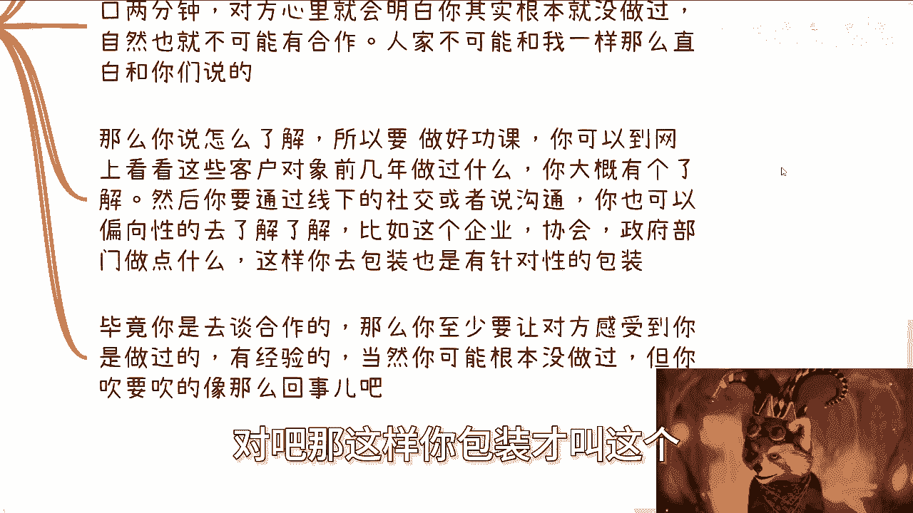

你需要拜访的对象（如企业高管、协会负责人、政府官员）本身就是相关领域的专业人士。如果你对他们最基本的运作逻辑一无所知，包装得再好的外壳也会在几分钟的交谈中被戳穿。

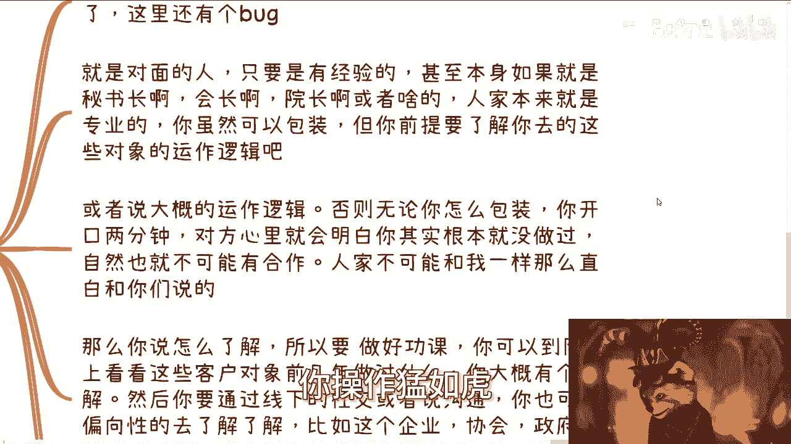

**核心公式是：有效包装 ≈ 对客户背景的了解程度。**

因此，在拜访前必须做功课：

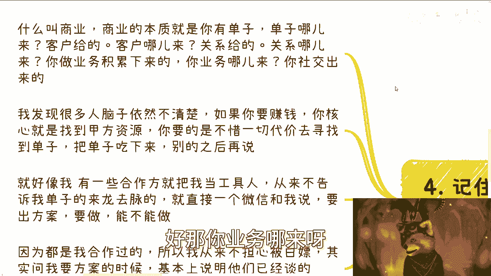

*   **线上调研**：了解对方近几年做过什么项目，关注什么议题。
*   **线下沟通**：通过社交有针对性地了解对方的需求和痛点。

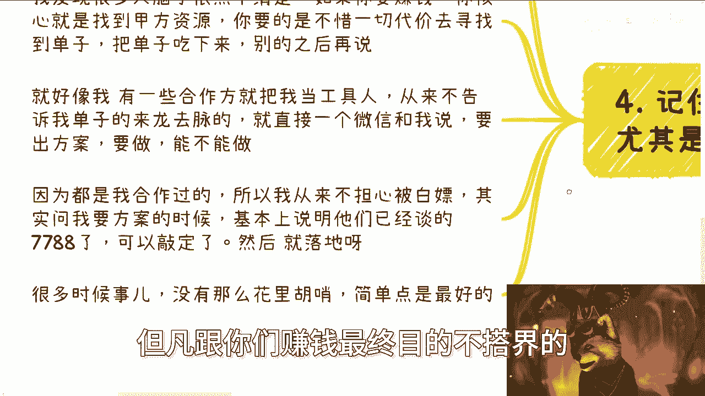

你的目标是让对方感觉你“有经验”、“懂行”。即使你实际经验不足，但通过充分的准备，你也能吹嘘得像那么回事，从而获得对话和合作的机会。否则，双方就像处于“平行宇宙”，你说的东西对方瞬间就能判断出虚实。

---

最后，我们需要树立一个贯穿所有准备的核心心法：**不惜一切代价寻找并锁定甲方**。

商业的本质是获取订单，订单来源于甲方客户。你的所有行动都应围绕这个最终目的展开。

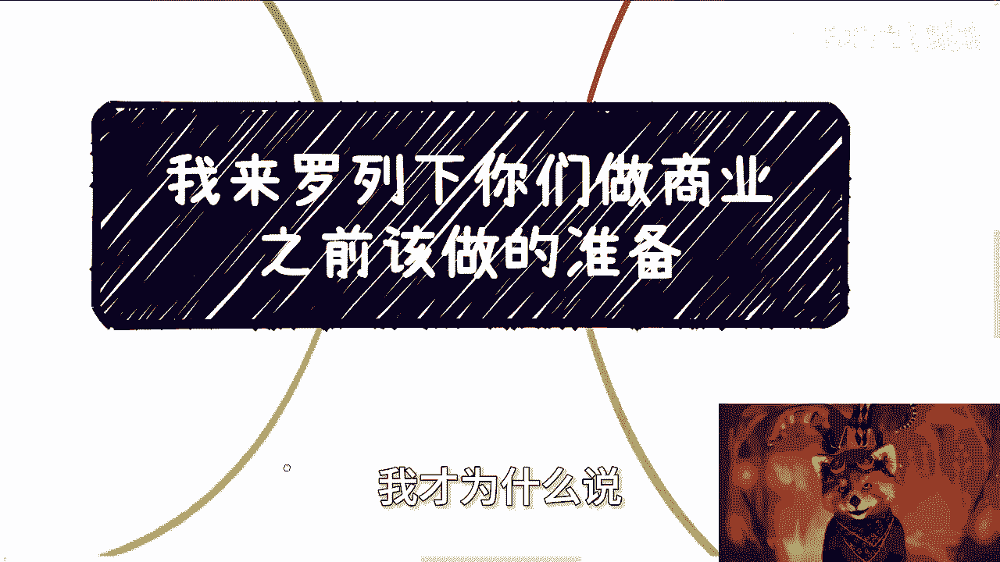

**请用这个标准过滤你的所有顾虑**：你正在担心的事情（如学历、怕被揭穿、面子），是否直接影响你“找到甲方”和“拿到订单”？如果**不影响**，那就不要浪费精力去考虑。

你的核心任务应该是：
1.  摸清客户的KPI和预算来源。
2.  思考如何帮助他们完成KPI或赚钱。
3.  所有包装和说辞都应从上述两点反推，而不是自我感动。

要记住，在商业起步阶段，我们的角色往往是“工具人”，帮助有资源的既得利益者解决问题、赚到钱。这是积累的第一步。能否晋升，取决于后续的天时地利人和。因此，**脸皮要厚，心不能玻璃，细节不必过度纠结**，全力冲向离钱最近的环节。

---

本节课中我们一起学习了创业前必须完成的三项核心准备：**1. 不打无准备之仗**，完善活动所有基础物料；**2. 准备好企业与个人介绍**，确立正式的商业身份；**3. 深入了解拜访对象的背景**，做到知己知彼。同时，我们确立了**以找到并锁定甲方为唯一导向**的行动心法。做好这些准备，能让你摆脱“草台班子”的印象，更稳健地迈出商业第一步。