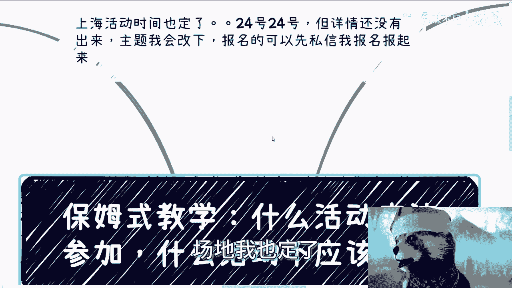
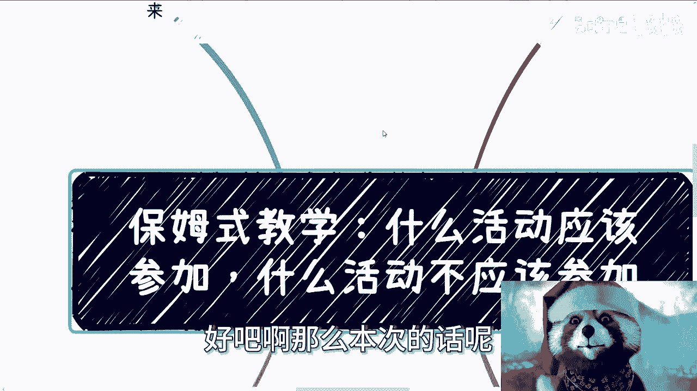
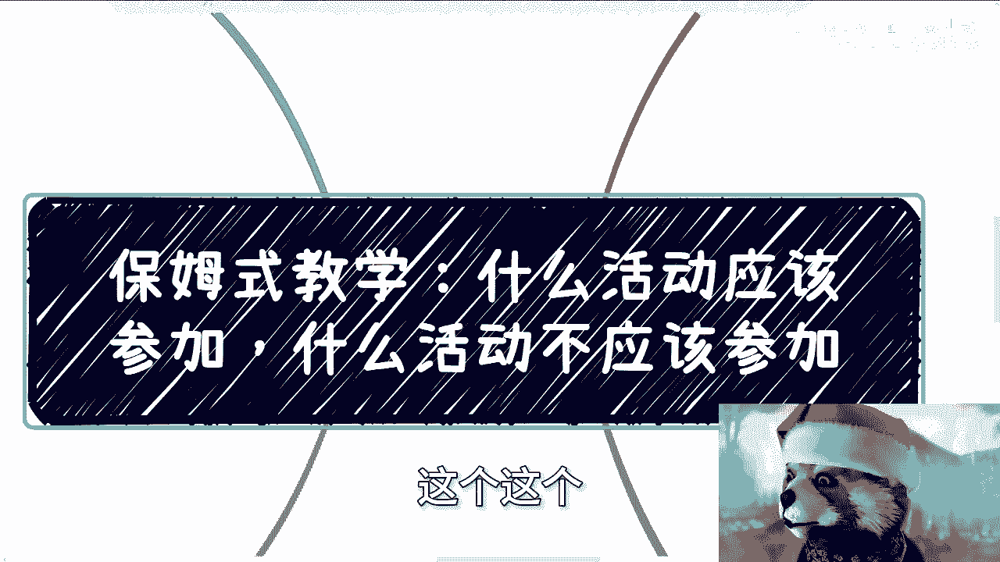
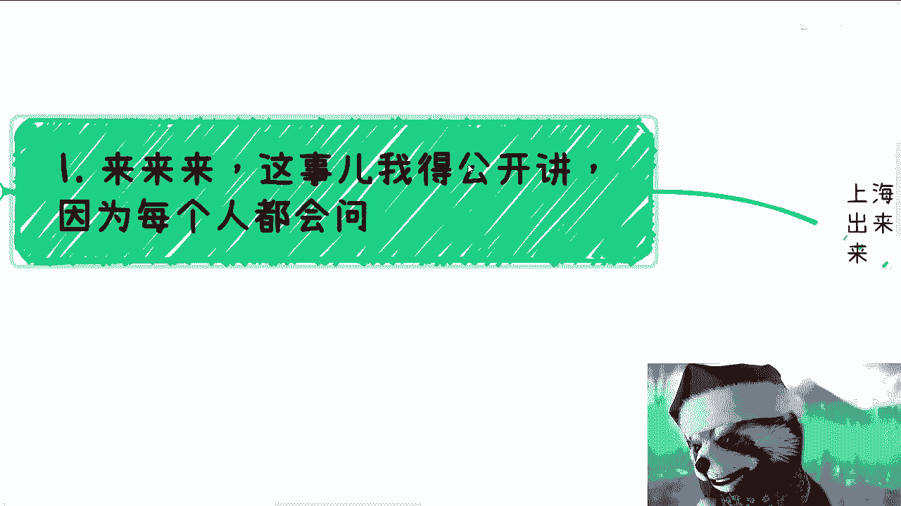
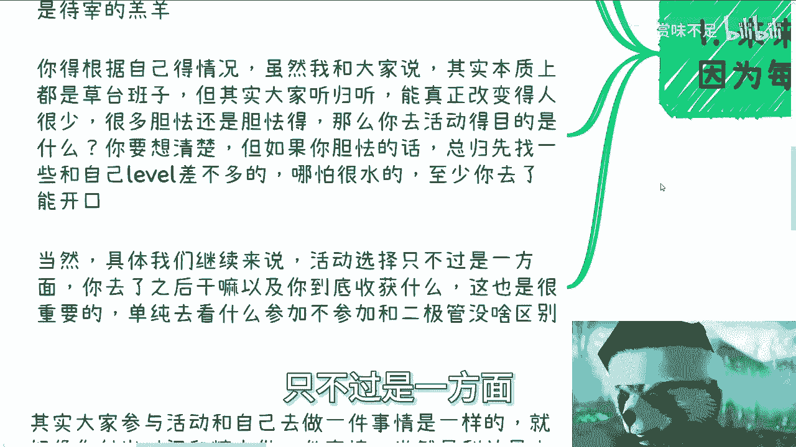
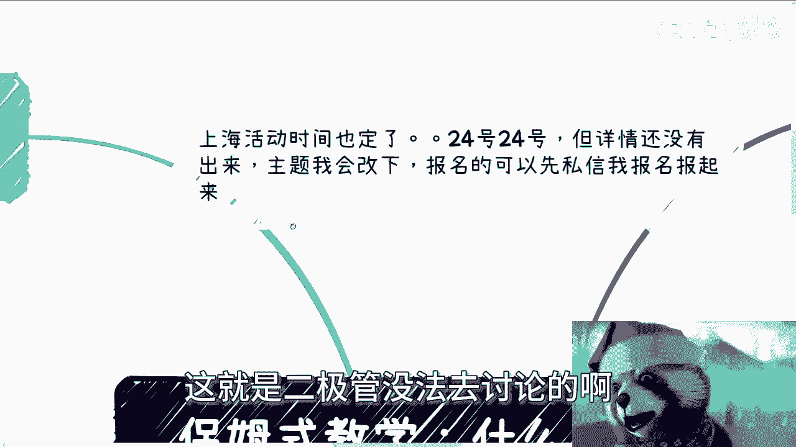
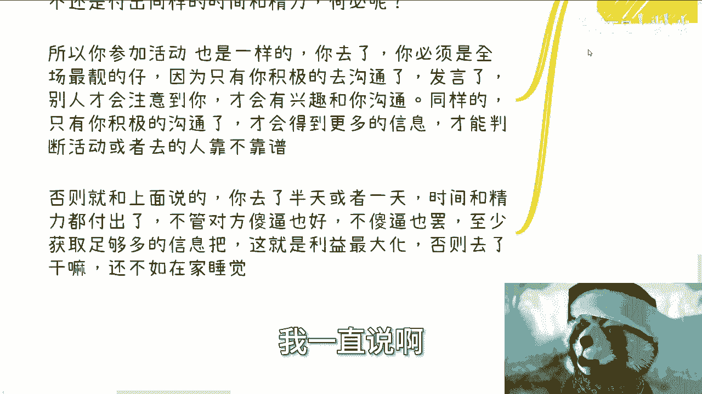
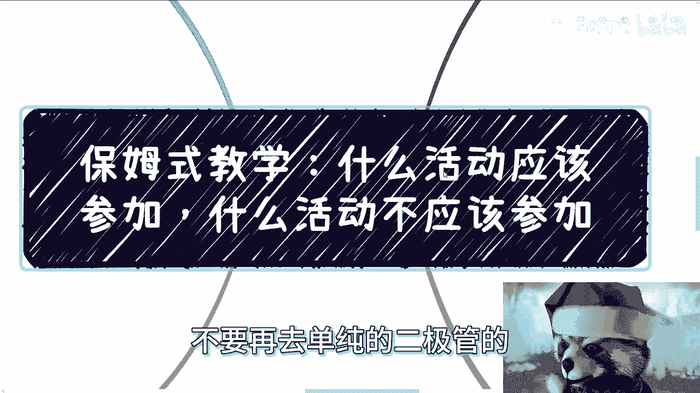

# 保姆式教学：如何选择与参与活动 - 课程P1 🎯

在本节课中，我们将学习如何判断哪些活动值得参加，哪些不值得。课程将围绕明确参与目的、选择合适活动类型、以及在活动中如何有效沟通与行动展开，帮助你最大化每次参与的收益。

---

## 活动信息更新 📅

上海活动已定于3月24日举行，具体详情将在场地和主题确定后公布。报名可先通过私信进行。

北京活动定于3月30日，地点在微软，与上次活动场地相同。

---

## 核心原则：目的决定一切 🧭

上一节我们更新了活动信息，本节中我们来看看选择活动的核心原则。什么样的活动应该参加，本质上取决于你的参与目的以及活动本身的形式。

活动只是一个载体。活动本身的好坏，最终需要你亲身参与后才能分辨。单纯依赖他人的评价或网络信息是无效的。一个活动只要在某个点上对你有用，它就是好的。每个人的判断角度不同，因此无法一概而论。

---

## 宏观活动类型分析 📊

以下是几种常见的活动类型及其适用性分析：

*   **展会与会销**：这类活动的主要目的是销售。对大部分人而言，参与意义不大，除非你有特殊目的（例如寻找特定供应商或了解行业产品）。参与者往往处于被动接收信息的位置。
*   **同层级或兴趣社群活动**：如果你是初学者或性格偏内向，建议先从与自己水平、兴趣相近的活动开始参与。这类活动氛围通常更轻松，有助于你开口交流并融入其中。
*   **演讲与分享会**：如果你想寻找某个领域的分享者或讲师，这类活动是很好的选择。能说会道、有实践经验的分享者并不难找，无需执着于寻找院士或教授级别的嘉宾。

活动选择只是一方面，更重要的是你参与后做什么，以及最终能收获什么。单纯讨论“去或不去”是片面的。

---

## 明确你的参与目的 🎯

上一节我们分析了活动类型，本节中我们来看看如何根据不同的目的来选择活动。你的目的决定了你应该寻找哪类活动。

以下是针对不同目的的参与建议：

*   **如果你是纯小白**：在缺乏分辨能力时，最好的方法是**广泛尝试**。亲自参与各类活动，你才能建立自己的判断标准，明白哪种活动对自己有用。不要以“试错成本高”为借口，这点成本都不愿付出，难以成事。
*   **如果你想寻找合作方或“蹭项目”**：多参加投资或创业相关的活动。大家的目标都是“创造价值”，只是形式不同（例如创业与做中间商），在这些场合更容易找到潜在伙伴。
*   **如果你想寻找赞助商**：想清楚你能为赞助商提供什么价值。例如，如果你的活动受众是开发者，那么互联网技术公司就是高优先级目标；如果受众是电商从业者，那么MCN机构、分销平台或相关企业可能更感兴趣。逻辑必须清晰。
*   **如果你想招募实习生或“工具人”**：目标应瞄准大学生群体，他们通常性价比高。

---

## 活动现场沟通指南 💬

明确了目的并选择了活动，下一步就是在现场如何有效沟通。记住两个关键禁忌：

1.  **不要一股脑做宏观介绍**。
2.  **不要让对方替你思考**。

在萍水相逢的场合，让对方费心思考，合作大概率无法达成。

以下是具体场景的沟通范例：

*   **场景一：寻找讲师**
    *   **错误方式**：“陈老师，您觉得我们活动讲什么主题好？”
    *   **正确方式**：“陈老师，我们计划在X月X日举办一场活动，主题是‘XXX’，想邀请您作为讲师分享‘XXX’相关内容，时长约X小时，酬劳是X元。您看是否方便？”
*   **场景二：介绍自己的能力（如技术外包）**
    *   **错误方式**：“我什么都能做。”
    *   **正确方式**（在医疗主题活动中）：“我在医疗信息化系统开发方面有丰富经验，可以为您提供相关的解决方案。”
    *   **核心**：结合具体场景，给出针对性的、清晰的解决方案。说“什么都能做”等于告诉别人“不靠谱”。

沟通要直接、明确。如果目标是合作，就开门见山地说清楚要对方做什么、何时做、报酬多少。过度客套和模糊的表述（“假大空”）反而会阻碍有效合作。

---

## 行动准则：付出即须最大化收益 ⚡

既然付出了时间和精力参与活动，就必须追求**利益最大化**。这不仅指金钱，也包括信息、人脉、经验等无形收获。

**核心公式**：`你的收益 = (获得的信息/人脉/机会) / 付出的时间`

如果你决定参加一个活动，就必须成为“全场最靓的仔”。原因如下：

*   **只有积极沟通和发言，才能引起他人注意**，从而创造更多连接机会。
*   **只有通过积极交流，才能获取足够信息**，用以判断活动或参与者的价值。
*   否则，付出时间却收获寥寥，等同于浪费。既然去了，就要主动提问、主动交流，从主办方、讲者、乃至其他参与者那里挖掘价值。

很多人付出了时间，却因为“不懂”、“性格内向”等原因没有行动，这本质上是对自己时间和生命的不尊重。大家只看结果。如果无法克服障碍，不如在家休息。

---

## 总结与行动号召 🚀

本节课中我们一起学习了如何选择与参与活动。

1.  **核心是目的**：根据你的目标（学习、找人、找钱）选择活动类型。
2.  **实践出真知**：小白应多尝试，亲自建立判断标准。
3.  **沟通要直接**：现场沟通忌宏观、忌让对方思考，要清晰、具体、对事不对人。
4.  **行动须彻底**：既然参与，就要积极投入，最大化每次付出的收益。

不要再简单地用“该去”或“不该去”的二极管思维思考活动。想清楚你的目的，然后勇敢地参与和行动。

**上海（24号）、北京（30号）活动接受预报名，请私信。**
对于商业合作、职业规划、股权融资等具体问题，请整理好你的详细情况和问题后再进行咨询。