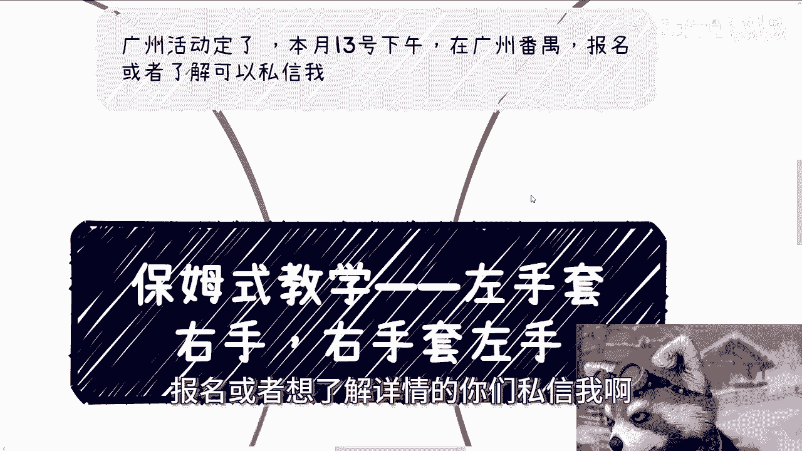
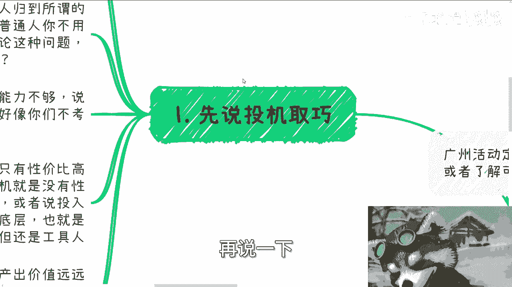
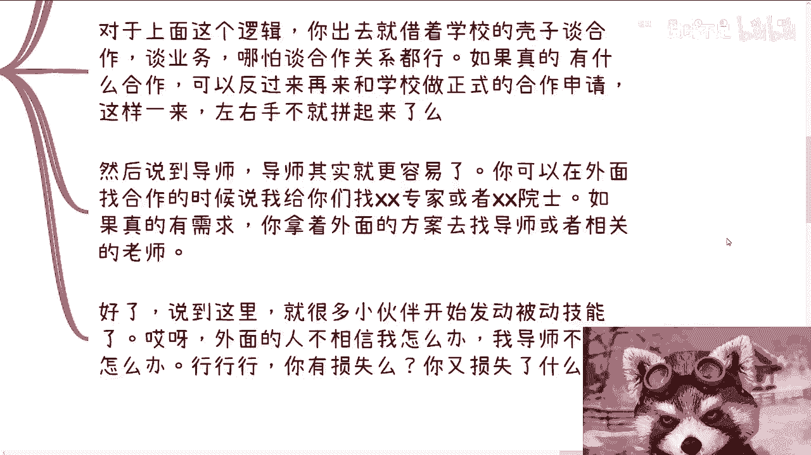
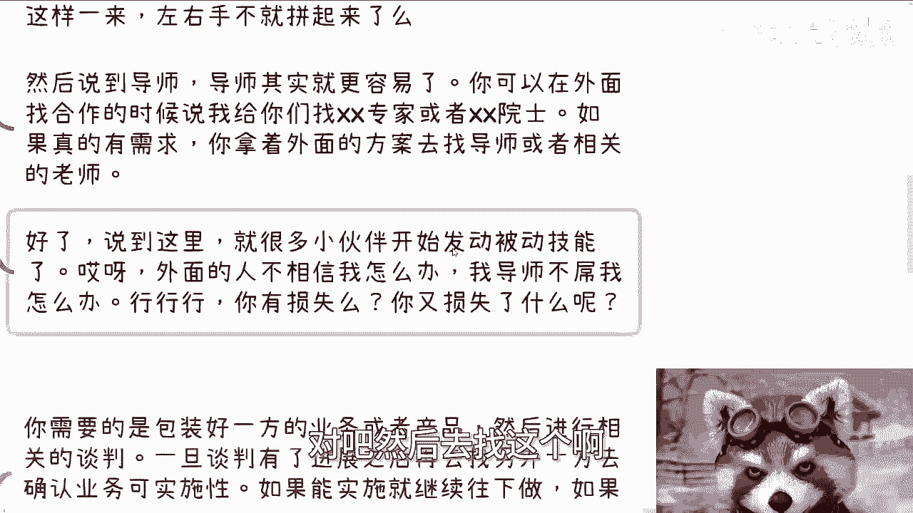
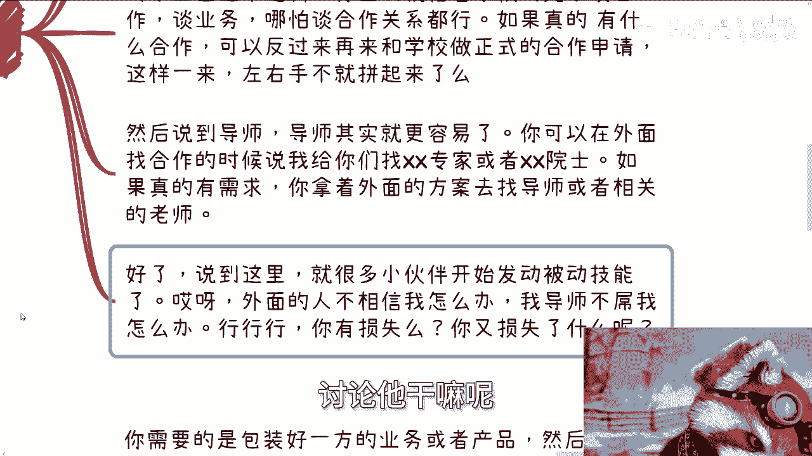
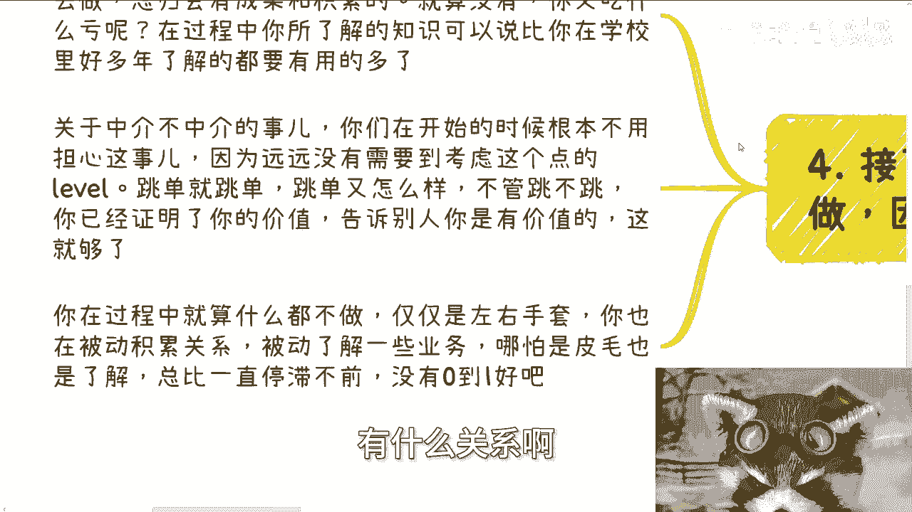
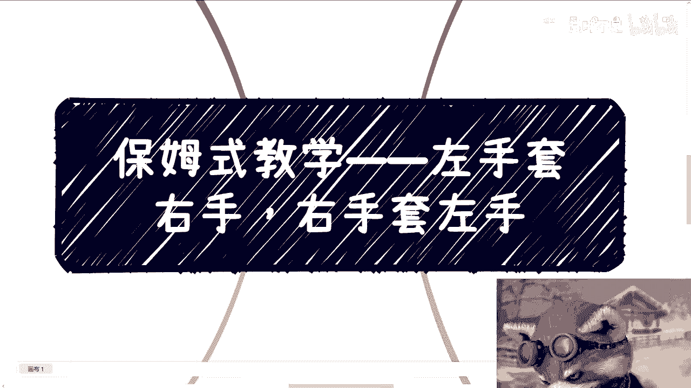
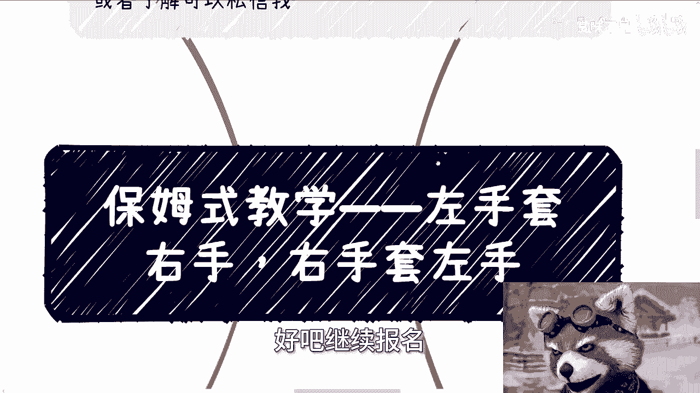

# 保姆式教学 P1：左手套右手，右手套左手 🧤




在本节课中，我们将学习一种被称为“左手套右手”的商业思维与行动方法。这种方法的核心在于利用信息差和资源整合，通过巧妙连接不同方来创造价值与机会。我们将通过具体案例和逻辑拆解，帮助你理解并应用这一策略。




---

## 课程概述 📋

“左手套右手”是一种资源对接与价值创造的策略。它并非投机取巧，而是商业世界中一种高性价比的运作方式。其本质是：**包装好一方的资源或需求，与另一方进行对接，在促成合作的过程中为自己创造价值**。许多人无法实践，往往是因为能力不足或行动力欠缺，而非方法本身的问题。

从商业角度看，没有绝对的“投机”，只有**性价比**的高低。投入产出比低的往往是执行层，而高性价比的收益通常源于**信息差**。能识别并利用信息差的人，更容易获得超额回报。

---

## 核心逻辑与公式 🔧

上一节我们概述了课程主旨，本节中我们来看看“左手套右手”的核心运作逻辑。其过程可以抽象为一个简单的公式：


**核心公式：**
`价值创造 = 包装资源A + 对接需求方B + 确认实施方C`


或者用代码逻辑表示：
```python
def left_hand_right_hand(resource_a, party_b, party_c):
    # 1. 包装资源A
    packaged_resource = package(resource_a)
    # 2. 与需求方B初步洽谈
    interest = negotiate(packaged_resource, party_b)
    if interest:
        # 3. 与实施方C确认可行性
        feasibility = confirm(interest, party_c)
        if feasibility:
            return "Deal Closed & Value Created"
        else:
            # 寻找新的实施方C‘
            return find_alternative(party_b)
    else:
        # 寻找新的需求方B‘
        return find_alternative(resource_a)
```

这个流程的核心是**动态测试与连接**，而非一次性成功。

---

## 具体应用案例 🎓



理解了核心逻辑后，我们通过具体案例来看看如何应用。以下是几个在学校环境中应用此策略的例子。


**案例背景：** 一位在读研究生希望利用学校资源为自己积累关系和创造机会。



**具体操作步骤：**


1.  **利用学校身份积累资源**
    *   学生可以借助学校的名义和组织，对外洽谈合作或业务。
    *   即使没有公司主体，学校的名头本身就是一种信用背书。



2.  **连接外部需求与校内导师**
    *   对外部企业时，可以提出能对接校内专家或导师资源。
    *   获得外部意向或方案后，再带着具体需求去与导师沟通，寻求支持或正式合作。


3.  **应对质疑的积极心态**
    *   **问题：** 对方不信任我或导师不配合怎么办？
    *   **策略：** 被拒绝是常态，损失为零。可以继续寻找其他相信你的合作方或导师。关键在于持续尝试，而非纠结于单次失败。

---

## 行动指南与心态建设 🚀

通过案例我们看到了方法的具体应用，但成功实践还需要正确的心态和行动。以下是开始行动的关键要点。

**行动前需要做的准备：**

*   **领域知识：** 对你想要对接的领域有基本了解。例如，想做AI相关对接，就需要知道主流产品、技术名词和应用场景。
*   **对方调研：** 通过网络等渠道，初步了解你要接触的个人或机构的基本情况。

**必须建立的正确心态：**

*   **拒绝空想，立即行动：** 不要纠结于“是否是中介”、“会不会被跳单”等问题。在从0到1的阶段，这些问题没有意义。行动本身就在积累价值和关系。
*   **过程即收获：** 即使最终没有促成具体项目，你在过程中学到的知识和积累的联系，其价值远高于停滞不前。
*   **广泛尝试，不怕失败：** 市场足够大，总能找到相信你的“左手”和“右手”。用尝试短视频或娱乐的时间去行动，不会有任何损失。


---

## 常见问题与误区 ❌

在行动过程中，初学者常会陷入一些思维误区。本节我们来澄清这些误区，帮助你更顺畅地前进。

以下是几个典型的错误想法及其纠正：



*   **误区一：这是投机取巧，不道德。**
    *   **纠正：** 商业的本质是价值交换和资源整合。能高效连接供需双方，本身就是一种价值创造。许多商业上层建筑都基于此逻辑。


*   **误区二：我没人脉、没经验，根本做不了。**
    *   **纠正：** 社会上并非人人都是专家。中国年人均收入数万元，说明大量市场机会存在于普通层面。从你能接触到的“新手村”级别资源开始尝试即可。

*   **误区三：万一被跳单/合作不成，岂不是白忙？**
    *   **纠正：** 即使合作不成，你也证明了自身的连接价值，并获得了宝贵的行业认知与关系。这些隐性收益是持续发展的基础。

---

## 总结与行动号召 ✅

本节课中，我们一起学习了“左手套右手”的商业思维方法。

**核心要点总结：**
1.  该方法的核心是利用信息差，通过**包装与连接**来创造价值。
2.  其成功关键在于**行动**，而非空想和纠结细节。
3.  在过程中积累的知识、关系和认知，其价值远大于可能的短期失败。
4.  商业世界中，衡量标准是**性价比**，而非空洞的“道德”批判。





**现在就开始行动：** 选择一个你稍有了解的领域，尝试寻找一个潜在的资源方（A）和一个潜在的需求方（B），按照课程中的逻辑进行初步的包装与连接。记住，就像解数学题先设X一样，**先行动起来**是解决问题的第一步。

---


> **附：广州线下活动通知**
> 
> 本月4月13日下午，在广州番禺有一场线下活动。如需报名或了解详情，请私信联系。
> 
> **咨询服务说明**
> 
> 如需职业发展、商业规划、股权融资、项目计划书等方面的咨询，请整理好你的背景与具体问题，再进行预约。