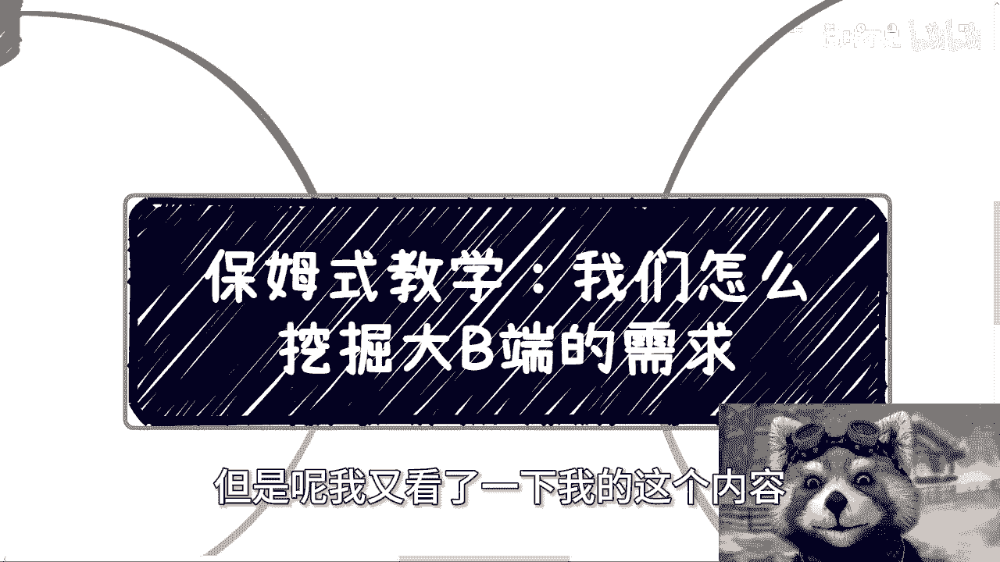
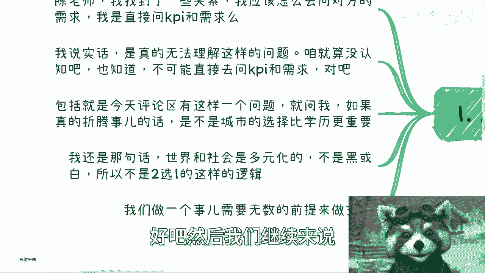

# 保姆式教学：我们怎么挖掘大B端的需求 - P1 - 赏味不足 - BV1Zm42137MS

哦大家好，我我我我今天讲这个主题啊，我好像突然发现我以前还讲过一次，但是呢我又看了一下我的这个内容。

这个内容好像跟之前反正也也不太一样啊，正好交叉，看来反正大家正好交叉着看啊。

呃然后那个深圳活动好吧，就是后天啊30号下午，然后呃反正这个你们要报名的或者要了解的，可以这个私信我啊。

然后嗯今天我们来讲的呢，是这个挖掘大弊端的这个需求啊。

因为什么啊，因为总有人会这么问我，他说陈老师我找到一些关系啊，他说我应该怎么去问对方需求啊，我是不是直接问对方KPI跟需求，就我说实话啊，我我其实真的无法理解这种问题，因为咱就算没有认知啊。

就算不知道啊，但是那那你多多少少也应该知道，就是说这个我们也不可能，也也不可能直接去问别人需求嘛，对吧，也不可能去你直接去问别人KPI嘛，这这这不现实啊，对不对啊，那么包括啊今天评论区有这么一个问题。

他就问我，他说这样陈老师如果真的折腾事，是不是说啊，这个选择城市比选择这个学历更加重要对吧，或者怎么样，我说嗯唉这个让我怎么回答呢，对吧，我还是那句话啊，我说世界跟社会是多元化的，它不是只有黑跟白。

所以这你你你不能这么一个问题给我，你说我二选一，我怎么二选一，对不对，这没法二选一啊，啊嗯啊自动跟进，然后看一下啊，对好吧，然后我们继续来说。

所以说我们需要这个我们需要做一个判断啊，需要一个无数的前提来做这个支撑，你比如说你说是不是直接问别人KPI可以，当然没问题啊，就你可以的啊，腿直接他妈翘人家桌子桌子上的吧，有一说一啊。

我跟你们讲我以前的嘛面试就这样面试的对吧，我大概有几年工作经验之后我就这么面试的，为什么，因为我无所谓，无所吊味对吧，你那爱面试不面试对吧，我又我又不是真的来跳跳槽的对吧，所以说前提是什么。

前提是你得有资本啊对吧，或者你无所谓哦，只我跟你讲，只要你占据主导地位，你想怎么问都行，否则呢，否则你能怎么问呢，否则你只能先套近乎，然后客客气气的对吧，第一次去对吧，一一买点水果，买点伴手礼。

然后低声下气的，不然呢，否则呢，对不对，那是你没办法的呀，对不对，你事实如此啊，你就像我一直跟你们讲的，你可以直接开门见山问问了，凭人家凭什么回答你啊，你你谁啊，你啊你你哪根葱啊，对不对。

你说白了你是不是可以直接问，取决于你们什么关系，以及你有什么，如果你根本就不认识，以及你手上也没有拿得出来的案例跟经验，那基本上你就别想这些了，你先去积累，对不对，你为什么没有东西。

你就先先去想着我怎么对接呢，怎么对接不了啊，对吧，你就哼哼你，你就跟我跟跟前两天那个事一样，你跟我说，你说陈老师，我小学数学还没学完啊，我能不能先去先去这个这个考个高考，你觉得呢对不对啊。

三我们就说这个城市跟学历啊。

我我跟我我就跟你们来分析一下，首先每个城市有不同的政策跟产业的侧重点。

这就看你到底要做什么产业，你比如说前两年你要做直播电商，那南方我就会告诉去杭州，无脑去杭州all in，对不对，因为杭州有钱，杭州政策也扶持，就这么简单啊，你你每个城市都有有对应的。

这个这个这个这个扶持的业务对吧，你不能问我说啊，这个城市跟学历我怎么选啊，然后另外一方面，你说学历不学历的跟你折腾什么事很重要，你比如说你告诉我陈老师我就要去拿大融资，我就想去拿红杉的对吧。

那我就告诉你，你必须是要有学历的，你没有没有关你没有也没关系，但你的团队总归要有对吧，你总不可能说我们几个人都没学历，那融个屁啊，对不对啊，你包括你的业务是需要走那种省级的，市级的正规的招投标的。

而呃呃呃他不是那种就是说呃采购，采购服务的或者怎么样，那么你面子上该有的东西都要有啊对吧，学历啊，软注啊，专利啊啊商标啊，各种各样的，那你得有吧对吧，那我就跟你们讲了，这取决于你做什么事啊。

你包括就是说你业务如果是要跟学学校有关，跟校方有关对吧，你比如说你说你要走那种正规的什么呃，这个这个这个假期的呃，假期的兼职老师啊，或者日常的兼职老师啊，对吧，对诶，那种那种各种各样走那种正规渠道的。

这种兼职老师啊，那么你肯定是需要学历的，你没有学历，你做不了，为什么，因为你单纯填那个表格，你填了之后就审核不了，那还是那句话，社会是多元化的，不是说你知道一些不用学历的业务就得出啊。

这个社会上都不用学历，反之也是一样的，这要看你做什么业务啊。

你懂吗，就是我为什么一直跟你们讲学历不重要，为什么一直跟你们说要懂得用学历，是因为就是说如果你们学历高，那你们就去学会那些高学历。

能够在社会上赚钱的方式，你如果学历低，那么你就去找那些不用学历的社会选方式，不是说我们在这里面就得出个结论啊，有学历高嗯，好学历低嗯，好对吧啊，或者学历重要嗯学历不重要。

但不是得出个二极管的结论吗，啊好然后第四回到主题上，其实挖掘大弊端的需求很简单，我跟你讲啊，你要么就直接沟通，要么就旁敲侧击，但是啊我就跟你们这么说啊，我们曾经是这样来说的啊，我说我们做社会上的业务。

不是想到才去做的，我们需要日常需要10年如一日的去积累，比如说你今天啊想到要跟什么协会啊，企业啊，资本啊合作了哦，马上就去了解，马上来问我，马上临时临临时抱佛脚就没用，你懂吗，也就是说你日常的社交沟通。

要不停的去认识那些和政府和企业，协会合作的人，你比如说我或者其他一些企业，然后不停的从我们这样的人身上去了解，当地的协会或者企业的运作方式，然后以后等到某一天你真的要的时候。

你基本上了解的已经八成八九不离十了，什么情况，那么也能够方便你做准备，而不是说你想到了，然后好，然后临时抱佛脚，我我要么啊找陈老师咨询一下，我要么找找陈陈老师问问一下，你问我没有用的，你明白吗。

这就像我们刚刚说的，你去问别人，哎，我我小学没毕业，我怎么去考个清华。

对不对，就是你你哎就这个话，你让我怎么说，就是就是就是有的人啊是属于懒对吧，就是既要又要又不想付出努力，又想要结果，那有的人呢就是读书读傻的啊，就是你明明日常要去积累的，明明是一个人情世故的事情。

你非要把它变成了一个，就是说好像你有什么方法论，拿到一个什么方法论就能够撬出来一些信息，卧槽那社会上要是这么容易撬出来信息的话，那大家也不会到今天这么困难，对不对。

对吧，所以说就是说就说我我我我我真的我以后啊，如果再有人问我这个问题，我就把这个视频我就扔给他对吧，你你直接问我，我怎么说呢，我怎么可回答你呢，没法回答你啊，你你有时候他们你知道吗，直播的时候跟我说。

因为B站那个对吧，就直播什么评论区只能打20个字对吧，那那你们可能上下班打不了，那你们单纯微信也好，私信也好，问我的时候，你们评论区，那你们至少把上线网打好吧对吧，你就告诉我你做什么。

告诉我你有什么对吧，然后你再来我们再来讨论对吧，城市是不是比学历重要，我上来就问我哎，陈老师，城市是不是比学历重要要命了，我怎么知道对吧啊，行好吧，就这么着啊。

然后那个后天那个活动好吧，要报名的就去报名好吧，私信我就行，然后剩下的话就是说职业规划，商业规划啊，股权期权啊，分红分润啊，包括白皮书，商业计划书啊，你们手上有什么牌，你们没有什么牌，你们希望呃。

有些这个这个这个这个跟我的沟通啊，希望从我的这个认知跟呃一些经验，能够给你们先更更接近于这个地气，更接近于当下社会发展的一些建议跟规划的话，那么你们可以整理好详细的个人背景，跟个人的这个问题好吧。

我们再来走咨询啊。

