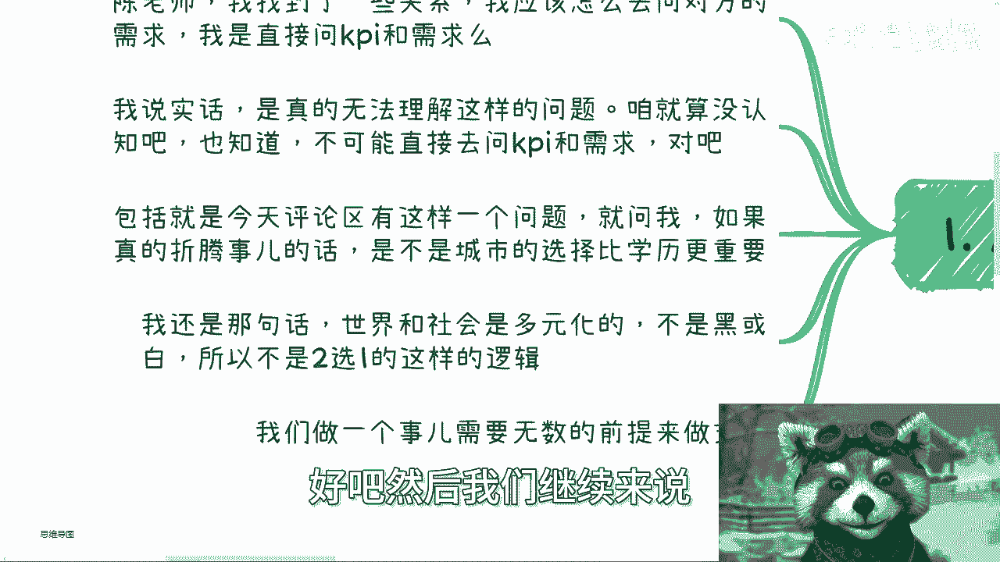
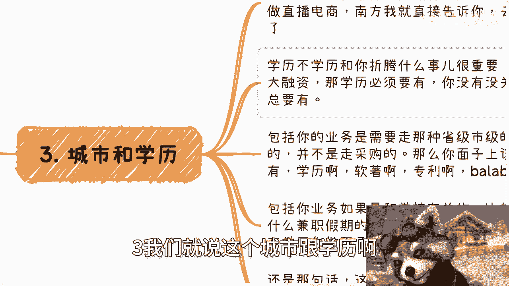

# 保姆式教学：如何挖掘大B端需求 - P1 🎯

在本节课中，我们将学习如何有效地挖掘大型企业客户（大B端）的需求。课程将探讨沟通的前提、方法，并分析影响需求挖掘的关键因素，如城市与学历的选择。我们将通过具体场景和逻辑分析，帮助你建立正确的认知和行动框架。

---

上一节我们提到了挖掘需求不能简单粗暴地直接提问。本节中，我们来看看为什么不能这样做，以及背后的核心逻辑是什么。

能否直接询问对方的需求或KPI，取决于一个核心前提：**双方的关系地位与你的个人资本**。

**公式：能否直接提问 = 关系亲密度 + 个人/案例资本**

如果你占据主导地位或拥有对方认可的资本，你可以采用更直接的沟通方式。反之，如果你与对方关系不熟，且没有拿得出手的成功案例或经验，直接提问通常无效。这时，你需要先通过积累人脉、建立信任或展示价值来创造沟通的前提。

---

理解了沟通的前提后，我们来看看一个常见的困惑：在城市选择和学历背景之间，应该如何权衡？这并非一个简单的二选一问题。

以下是分析这个问题的几个关键维度：

*   **城市政策与产业侧重点**：不同城市有不同的产业扶持政策。例如，前几年专注于直播电商，那么杭州就是更优选择，因为其政策和资金扶持力度大。选择城市应优先考虑其产业环境是否与你的业务方向匹配。
*   **业务性质对资质的要求**：你的业务是否需要高学历或各类资质作为“敲门砖”？例如，寻求大型风险投资、参与政府或学校的正规招投标、从事特定领域的正规兼职等，往往对团队学历、软著、专利等有明确要求。
*   **社会是多元化的**：不存在“学历绝对重要”或“城市绝对重要”的单一结论。高学历者应学习利用学历优势的赚钱方式；低学历者则应寻找并精通那些对学历要求不高的社会路径。关键在于让你的选择服务于具体的业务目标。

---

上一节我们分析了外部条件，本节我们聚焦于挖掘需求本身的方法论。其实，挖掘大B端需求的核心方法可以归结为两种路径。

方法看似简单，但执行的关键在于**日常积累**，而非临时抱佛脚。

以下是两种核心方法及其成功的关键：

1.  **直接沟通**：在拥有足够资本和信任关系的前提下，可以直接、开门见山地交流。
2.  **旁敲侧击**：在关系一般或资本不足时，需要通过建立联系、逐步了解的方式进行。

无论采用哪种方法，成功的关键都在于**长期的、系统性的人脉与认知积累**。你需要在日常社交中，持续接触并与政府、企业、协会的相关人员交流，从他们身上了解组织运作的规则和潜在需求。这样，当机会来临时，你才能有备而来，而不是临时寻求一个“万能方法论”。

---

本节课中我们一起学习了挖掘大B端需求的核心理念。我们明确了**直接提问的可行性取决于关系与资本**，分析了**城市与学历的选择应服务于具体业务目标**，而非二元对立。最后，我们指出了挖掘需求的根本在于**长期的日常积累与人脉建设**，而非寻求一蹴而就的技巧。记住，社会是多元且复杂的，有效的商业沟通建立在持续的认知提升和关系维护之上。