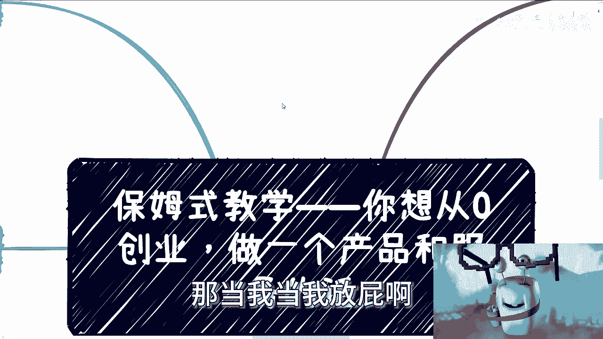
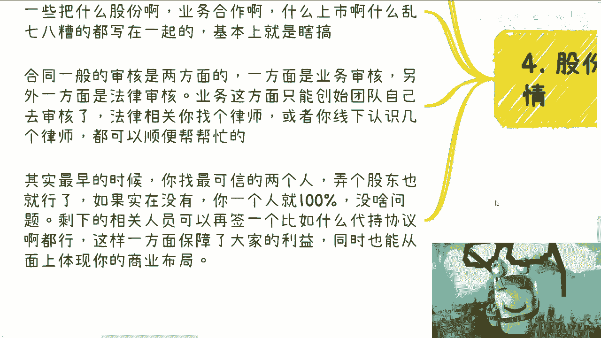
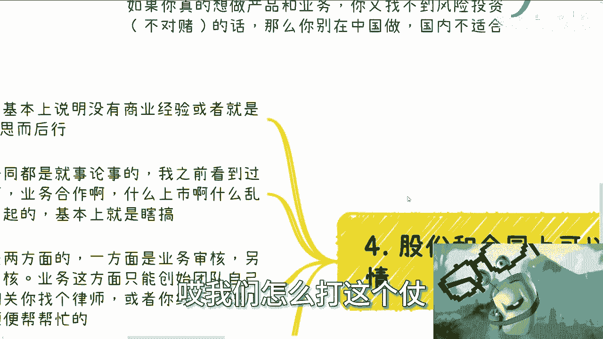
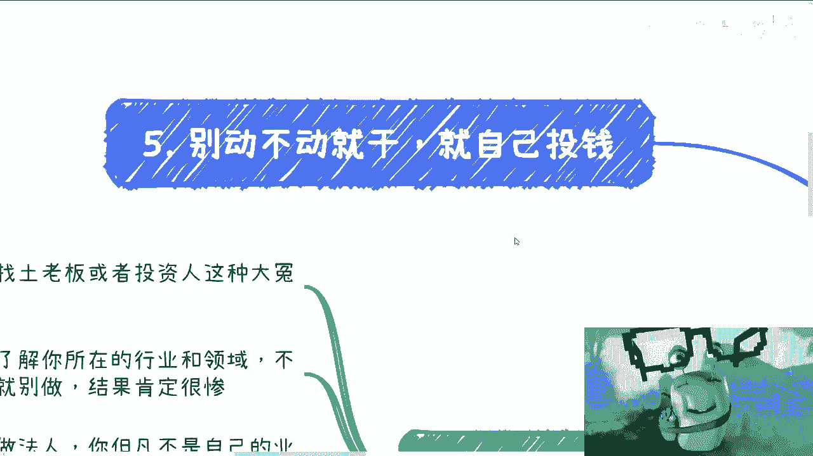

# 保姆式教学——从一个产品和服务，最开始你要关注的点 - P1 - 赏味不足 - BV1sV411Q7vv

好啊大家好啊，呃因为明天礼拜二我要去趟杭州啊，我要去找一位大神大神取取经啊，我也去了解了解现在情况，了解完了就看看有哪些可以说的，我再回来再跟你们分享啊，嗯那么继续啊。

还是说这个保姆式教学在这一期讲的是呃，你如果从零创业做一个产品和服务的话，应该怎么做，呃为什么提到这个东西呢，是因为就是最近给我发呃BP的啊，包括深圳那天线下跟我说创业项目的，包括就是这两天吃饭啊。

跟我提创业项目的，唉老多老多老多老多。

我正好给你们就把这个东西就保姆式教学嘛，对吧。

叫什么喂喂饭，喂到嘴边是吧，先说结论啊，先说结论啊，就是呃总结一下就是几点啊，第一别花自己的钱啊，要做事情，要花钱找土老板或者找投资人，这种冤大冤冤冤冤大头啊，大冤种啊，这第一第二你如果解了不了解资本。

就是你创业之前啊，我不管你做什么，你做任何事情都一样啊，你不了解资本，不了解所在的行业和领域，我指的了解是什么，不是说他妈的你们去看短视频啊，也不是说什么什么，你跟几个朋友聊聊，看。

大家觉得牛逼牛逼牛逼哦，不是的啊，你要更多的去真的，我跟你讲，你要更多的是去问一下这种行业里面的，这个创业者啊对吧，或者说投资人啊，或者怎么样子啊，你得问一些真正的啊，这个叫什么呃。

我们称之为在这个领域里面当一个游泳池嘛，对吧，就真正在里面游泳的，你别管它裸泳还是怎么泳对吧，你真正在里面游的，你多去了解了解啊，你别自己在那边意淫，然后觉得哎呦这个行业牛逼啊，这个行业怎么样。

我后面会给你们展开的，真的这种事情比比皆是，你知道吗啊，你但凡不了解就别做啊，你肯定死的很惨啊，那么第三点呢就是你要自己做呢，那你就做法人啊，你但凡不是自己的业务就别去做法人，什么意思呢。

反过来说就是说你自己要是做，你也别让别人做法人，你懂吧，就不要搞这种，有的没的，你知道吗，因为商业上面就是一码是一码的啊，你别管，现在这个这个这个好像很多人又觉得哎呀，法律怎么样怎么样。

这可不是我们要关心的对吧，你在该遵守的时候，你就要遵守，该去该去，就是说要明确一些事情就明确对吧，你说你自己要做，你让别人做法人，你这这说不好听的，人家就可以有充充足的理由怀疑你在坑他对吧。

同样的股东层面也可以是你一个人对吧，你也别硬，觉得哎我的，是不是一个人不行啊，我要多找点人，你是做商业啊，你是真的去赚钱的，你不是他妈的，我们说过家家啊，就拿两个硬币投进去抓个娃娃。

对不对啊，你这里面事情很多的啊，然后第四点就是所有的股份啊，只要让你五五开的，你记住啊，只要让你五五开的，不管他是谁啊，他可以是你的合伙人，也可以是你的资方，也可以是你的股东啊，就是如果让你五五开的。

我告诉你都是啊，都是啊，一视同仁，那一刀切不会错的，你知道吧，就机关枪扫射不带冤枉的啊，如果你真的想做产品跟业务，你又找不到风险投资啊，而且同时这个风险投资是不对赌的啊。

对赌的其实就已经不叫风险投资了对吧，不对赌的，那么我就告诉你，你在中国别做啊，因为国内现在就不适合，这就是当下的结论，清楚吧啊我不管你们做什么。

我也不管你们什么学历，我也不管你们自我认知到底多大，我就告诉你就这么个结论啊。

自己跟自己过不去，那当然如果你是个富二代，那当我当我放屁啊。

好那么这是第一点，第二点先写PPT啊，第一第二点我一个个来说先写PPT啊。

然后去试客户，什么意思呢，就是说你看啊我收到过很多idea啊，基本上都是天马行空的啊，自己YY出来一个需求，对不对，比如啊比如他跟我说AI客服啊，AI家具啊，比如说什么帮助滴滴啊，做一个调度系统。

还有比如说什么做一个软件相亲的啊等等等，好，首先啊当下这个情况，他就他妈的不适合做产品跟服务啊，我告诉你们为什么，因为大家没有钱做了也没卵用啊，就算是合作啊，你第一步因为我发现很多人跟我聊的时候啊。

他会把很多的细节，很多东西想得很清楚啊，但是也只是在他的脑子里面想的很清楚啊，完全不接地气啊，所以说你第一步要去考虑什么呢，你不要去考虑细节跟产品啊，你第一步要考虑的就是你大概想个框架啊。

大概讲个框架就可以了啊，你别去打磨，别去细想，别去纠结啊，这件事情你花个半天一天就差不多啊，然后接下来你要打磨的是什么，你要打磨的是你的PPT啊，你要打磨的是你的BP啊。

也就是我们称之为的叫传统意义上面的叫做呃，项目计划书，商业计划书对吧好，那么框架，我在这个地方大概给你们列了一下框架，怎么个流程呢，宏观大框架需求是什么，产品是什么，服务是什么。

团队优势是什么产品产品的逻辑是什么，流量怎么来预计未来的这个产品发展如何，市场如何多么大多么的大对吧，然后你这个东西怎么怎么怎么定价的对吧，大概怎么融资的对吧，合作品牌有哪些对吧，就能够帮你装逼的。

又有哪些就写进去啊对吧，然后我跟你讲，你就找客户谈了，你明白吗，你觉得你的客户是谁，你就找谁去谈对吧，你觉得是高校就找高校去谈，你觉得是政府找政府，政府去谈，你总要去谈的呀，对不对，好，我跟你讲。

不用多的，你找那么一两个两三个客户找，再找一个资方，你三个三方聊下来，我就跟你说，你只要找三个聊下来，你你心里面有什么，就是你这个东西靠谱也好，不靠谱也好，到底是天马行空也好，还是怎么样也好。

是骡子是马，你心里就有逼数了，你知道吧，你别我跟你讲啊，你别来问我，你也别来问别人，你知道吗，你问我问别人都没有，你自己去问客户，直接他妈的由客户喷你来的爽，你懂吗啊，好然后别YY需求。

现在整个市场我告诉你，中国现在大市场近10年，我可以告诉你，近10年最大需求就是赚钱没了，你别去搞那些花里胡哨的，你知道吗，你要搞花里胡哨，可以那些花里胡哨又能直接赚钱的也行，你别去搞那些花里胡哨。

但不赚钱对吧，就跟今天有个小伙伴跟我说什么，他说讲一眼，我说好，你觉得他跟我说，他说AI现在有很大的发展，说好你告诉我怎么发展对吧，我说你告诉我怎么解决痛点，他说AI跟智能家居。

智能家居就有很好的结合点啊，就有很很啊这个很大的未来对吧好，我说那什么结合点对吧，你告诉我怎么跟智能家居结合，然后结合了之后怎么解决痛点，解决痛解决什么痛点对吧，然后你解决这个痛点。

难道是因为我觉得你能解决这个痛点之后，我本来一个家具1万块钱，我现在能花2万吗，是你能让客单价提高提高吗，还是怎么样子有吗，你没有啊，你解决什么痛点了对吧，你AI到现在为止。

所有东西都是叫什么叫锦上添花，锦上添花什么意思啊，就是你可以拿来叫什么包装，你可以拿来忽悠，你可以拿来就是叫什么叫叫叫啊，唉就是那个词我就一下子想不起来了，反正就是你可以拿来把它做虚的东西哦。

做噱头对吧，但是你不可能拿它来换钱啊，你告诉我怎么换对吧，你怎么怎么换，换不了啊，那当然了，也有小伙伴要说了，他说那我今天有个有个东西跟AI结合是吧，我我说不定可以放到什么什么博物馆啊。

放到什么旅游景区啊，什么样子，那我告诉你这个逻辑对的，但是这个逻辑就不是赚客户的钱了，这个逻辑就相当于是这个东西完全就是个噱头，完全就是个包装，完全就是个噱呃，这个叫什么，就是一个忽悠，然后去骗啊。

叫做骗这个博物馆或者或者或者政府的钱对吧。

那你这个叫什么发展，啊第三你想好你到底赚的是谁的钱。

我在这个地方已经我觉得我能练的都列出来了，你看啊，你要赚的如果是客户的钱好，那么你就想好打磨产品打磨的细节，然后解决客户的痛点，然后去找冤大头投资，对不对，但是我告诉你们，大部分情况在我看来。

他妈的根本就没有痛点哦，根本或者说就没有解决痛点，痛点是有的，根本没有解决痛点，都是自己YY的对吧。

最低一点，第二点，如果你赚的是补贴，那么你需要的补他妈不是你的产品，而是你的包装，你的背书，你的合作方，你的资方，你的专利也就是说所有可以装逼的东西对吧，所有的比如说什么ISO标准等等等对吧。

但是里面唯独没有你的产品细节，因为你赚很多所谓的补贴，所谓的东西，说我的，谁来看你细节啊，大哥啊啊这第二点第三点，如果你赚的就是投资人的钱，或者所谓的我们说土老板土豪冤大头的钱，对不对，那么我跟你讲。

你就得使用对投资人宝具，什么叫对投资人宝具就是PPT加路演，加故事会加一顿操作猛如虎加自信，对别的你不用考虑别的重要不来啊，你见到过哪个哪个投资人在在他妈投资时候，给你讲细节的投资，给你讲细节对吧好。

那就说明他可能根本不懂投资，或者他根本就就就就就已经看破了，你在忽悠他，那OK啊，换一个冤大头啊，对不对，那说明他不是冤大头吗，是啊最后如果你赚的是散户的钱，那么很有可能我跟你讲，用这个词要换一下啊。

用的这个词要换下什么，就不是赚叫骗啊，毕竟你如果赚的是散户的钱，我大概率觉得如果你能赚到钱，那必然是骗，如果不是骗你赚不到钱啊，那么你如果真的是要赚散户钱，那么往往你也只需要一个prototype对吧。

就是你只要一个MVP或者有一个有个demo，有一个就是试用版就可以了，剩下的付不付费，靠的是你的产品吗，不是靠的是你的营销，靠的是你的故事对吧，我的C端散户什么概念。

散户就是甚至没有产品都他妈可以掏钱啊，对吧好第四个啊，股份跟合同上啊。

你可以判断出很多事情，就像我们刚刚说的股份类五五开的，就是什么叫类五开，就是五纯五开或者49，51或者四十八五十二这种类似的啊，基本上说明他对方就是没有商业经验，或者对方就是故意坑你的。

所以你就要明白三思而后行啊，不要他妈的就是别人说啥是啥啊，第二就是合同本身也是，合同本身都是就事论事的，什么意思，就是一码归一码的啊，我之前看到过一些一些什么狗狗合同啊，就是什么什么业务合作啦。

什么上市啦，什么乱七八糟的，什么退那个那个股票分成了，什么东西都写在上面啊，这种我跟你讲就瞎搞啊，就瞎搞，就对方根本就不懂啊，然后合同一般啊，他审核只有两方面的。

一方面是业务审核，另外一方面是法律审核，业务审核，这方面只能靠你们创始团队自己去审核，因为业务这个东西只有你们懂对吧，我也好，其他人肯定不懂的，法律相关，我觉得最好的就是你找个律师。

或者你线下在搜索的时候，在社交的时候，你认识几个律师哎，就顺便帮帮忙就好了，甚至不用掏钱的，我身边这种律师多了去了，你知道吧啊我跟你讲啊，其实在股份啊，包括就是一开始的这个这个这个创业的时候。

你最早的时候你找两最可信的两个人，弄个股东也行啊，你你当然不是说最可信两个人，最可信一个人就加你两个人，我就弄个股东就行了啊，如果实在没有，你就一个人百分之百也没什么不好的啊，没什么问题，没有说。

就是就是好像这个你说什么公司看上去担保了，或者说一定要要几个人，没有这种规定的，你懂吗，你不能你不能说哦，我我没有，我非要拉点人上去，你不是给自己造点造造风险吗对吧，然后剩下的呢相关人员可以再签一个。

比如说什么代持协议啊，什么样子都可以的，就这样一方面呢，你可以保障啊所有参与人的利益，同时也能在公司这个这个股东上面，来体现出你的商业布局对吧，包括体现出你的地位，这个我觉得一点毛病都没有啊。

但是不要就是那种怎么说呢，就是就是我我我我聊下来很多人啊，就是属于那种就是说啊就是什么哎呀，我觉得好像一个人不行，哎呀，我好像觉得就几个人看上去场面大一点，就是这这怎么说呢。

你我我我我不知道怎么描述这个事情，就有种就是说你明明已经准备要去读清华了，或者你明明要去准备要去打仗了，然后你还在那边用一个，就是就是就或者这么说吧，人家都是真枪实弹对吧。

就是就准备出战场上去开开干了对吧，你还在那边，就是用那个那个那个那个玩具墙，然后在那边啊，再用那个玩具墙的思维在那边说，哎我们怎么打这个仗。

你怎么做对吧，然后最后一点就是什么呢，你就别动不动就干哦，别动不动就他妈自己投钱，你知道吗，你干不干可以，但是你干你得干到点子上，不是说你动不动卧槽他妈的我们写代码了啊，我们这边产品开始，你知道吗。

就前两天还有一个跟我聊的，就是就是客户还没问过，市场都还没摸过，就跟我说哎我们产品都做的差不多了，我尼玛你产品都差不多，你妈牛逼是牛逼的呀，对不对，但是你从商业角度来讲，没有人这么干事情的呀。

你这么干事情就是纯亏本买卖啊，哪里有说我完全不了解，或者我了解的不在点子上，我就干哪，你是要干，但是不是干产品啊，你懂吗，你干的是先要去摸市场啊，你先干一个，干出一个PPT来，干出一个故事，干出一张饼。

你去看看对方吃不吃这个饼啊，对不对啊，然后你就说啊，这个这个如果要投钱，我找些音乐大众来投，对不对，这叫做生意呀，啊没有就不是说怎么怎么怎么怎么什么对吧。

就就上来就什么细节啊，或者怎么样啊啊好。

然后最后我再提一点啊，就是说有些生意是可以空手套白狼套的，有些生意呢是你必须前期投钱的，不投钱是不可能做起来的，或者说不投钱根本就不可能起步的，都有的啊，没有哪个东西对，哪个东西不对的啊。

但是呢你可以选，就像我们上期说的，就是说你是怎么样的人，你可以选对吧，不是说哎呀，吕老师说对吧，这个东西我们做生意要不投钱的啊，吕老师说那个东西投钱的不靠谱的，没有这种说法的，你懂吗，就是投钱也好。

不投钱也好，都是可行的，你们自己可以选啊，对不对，你就像我，我从来就不选那种让我投钱的都不选的，而不靠谱，就这样子的，是不是，那你们可以选，无所谓啊，每个人都可以选选选不同的东西啊。

但是不是说就是说就是说啊因为投钱了，所以靠谱，或者因为不投钱，所以不靠谱，但没有这个因果关系的。

好吧，哎呀就当我帮你们明天补上了好吗啊，行吧，那就这么着吧，反正有啥剩下的职业啊，或者其他的有什么资这个这个这个叫什么聊的。

