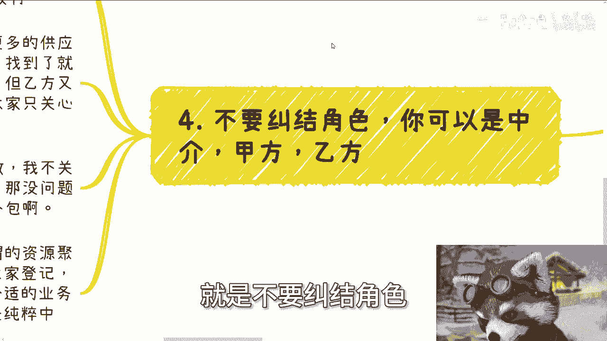
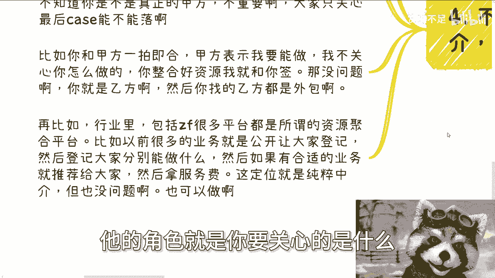

# 保姆式教学——关于避免跳单 - P1 - 赏味不足 - BV1oH4y1T7Ti

大家好，广州活动定了，本月4月13号下午在广州番禺望明。

或者说了解详情的，你们在私信我啊，嗯今天这个东西呢叫做关于避免跳单啊。

就真的我觉得可能有人听完了就会觉得卧槽，陈老师已经疯了是吧，就不是不是手把手嘴对嘴的问题了是吧啊，首先啊我跟你讲啊，跳单这个事情是常态好，虽然我的主题叫做避免跳单，但是不是百分之百避免跳单，对不对啊。

首先跳单是常态，而且毕竟我们说呢你要明白啊，不跳单的啊，在这个社会是正常人，有底线的，在这个社会是正常人，但是这个社会正常人呢少啊，当然了，你也可以简单粗暴的通过量，来减少跳单带带的风险。

比如说你撮合资源，对不对，那你就广撒网啊，你别点对点啊，对不对，那你说我一年就撮合两单，那他妈怪谁啊啊啊，其实我觉得跳单蛮好的，为什么，因为跳单就是告诉你对方是个啊，就是不能合作，而且我跟你讲。

你叫断舍离对吧，你不要就是我跟你讲，就是人类任何的感性的情绪，只会让你继续被坑，没有用的，你懂吗，就是哎呀，就是我跟你讲，你可以保，就是就是怎么说呢，保留你你你仁慈的那一面或者心软的一面。

但是你要看情况啊对吧，你不该心软的时候就不能心软了啊，然后你寻求下一个合作风，当然啊我们也的确需要做一些事情来避免跳单，而且啊其实你在做这些事情的同时呢，你也可以多多试探，看看对方是不是愿意合作。

或者和你呃那个和你合作对吧，或者说承认你的价值，因为但凡不承认，其实很多时候沟通你就能摸得，摸得出个7788来，你懂吗，你不用等到真的跳单哪一个，你说我操他怎么跳单，大哥你之前他妈的沟通的时候。

你就应该能明白他能跳单，只不过你明白不了啊，啊你不够察言观色啊，对不对啊，好然后第二个最好的方式呢，我跟你讲就是纯隔离，这是因为我以前说过啊，就是你我在我在揉碎一点啊，你和甲方聊业务之后，你跟甲方说。

你可以去找乙方，或者你假设X啊，你假设X你说你手上有很多的乙方，尽量多的可以先我呃，呃你要尽量多的跟甲方去聊，获取甲方的需求，同时明确甲方的更多的细节，对不对，同样的你也需要多个乙方。

毕竟因为甲方跟乙方不同，你需要多个乙方呢，来来来来来，作为你的外包，你知道吗，来进来，对你接到的业务的这个这个，保证你接业务的稳定性啊，你需要详细了解每个乙方能做什么，比如说你要问他们团队是什么。

你问他们能做些什么啊，过去的案例是什么，对吧等等等啊对吧，那么他们的区别是什么好，然后你拿自己的公司，或者我不管你从哪弄的公司随便你啊，但是最好你是股东或者法人，因为如果不是呢，啊因为如果不是呢。

你回头签合同或者财务相关的，你不能掌控，你想想看你要不能掌控，你去拉单子，拉的再多，拉的再牛逼，到最后啊，你的那个所谓的朋友或者所谓的关系啊，所谓的亲戚把你踢掉了，那我就问你，你图什么对吧。

而且你要你要这么想，你要么就是跟甲方进行谈判去做，你作为乙方去签，要么你就跟乙方说，你是有单子的，你是甲方让乙方进行交付，那么这种其实具体都看怎么沟通交流啊，那么互联网呃，但但相对来讲啊。

互联网的软件的单子，或者说其他的一种服务类型的单子，就不是交付产品，交付服务的这种方式一般比较好交付，你不要拿着说陈老师我的去做土木啊，做建筑对吧，做做什么什么，我前两天说的那种展厅啊，你跟我说。

你说创始我我我我要做隔离。

你怎么隔离啊啊你怎么隔离呀，对不对啊，那么这种纯隔离的方式是最好的啊，就是你相当于就是代表着甲方跟乙方签。

你代表着乙乙方就跟甲方钱就结束了啊，那当然啊总有隔离不了的case，对不对好，那么总体隔离不了，怎么说呢，我跟你讲也很简单，你一开始就需要去试探合作模式的可能性，比如说你已经摸到了甲方是有需求的。

乙方也能做这件事情，然后呢你跟甲方或者乙方在美，在下一次沟通的时候，你可以旁敲侧击的去提出来说，哎你说啊我这个签署相关的协议对吧，或者怎么样子，你对甲方来讲，签的就是说你能够帮他寻找供应商。

而且寻找的不是一个，你对乙方来讲呢，就是能帮他寻找金主爸爸，而且也不是一个，那么签署对应的协议以及分润比例，大家聊一聊，就是你不用这么认真，你就就就就旁敲侧击聊一下吧，扯那么一嘴，你看看对方反应吗。

对不对，那当然你也可以非常直接的提出三方合同，你就说哎那我作为丙方嘛，对不对，那么你们甲方乙方我怎么样怎么样，这也很常见啊，因为很简单啊，你说哦甲方跟乙方，你你作为一个撮合方怎么了呢。

就中国他妈做做这种聚合平台的多了去了对吧，但是你三方合同的时候，你要明白，你就需要体现出你的价值，这事也简单，我们打个比方，比如说今天你做的是大数据或者软件外包，对不对好，那么你可以跟乙方开始谈的。

说画饼啊啊这这这这时候就看你画饼了，就是你可以跟乙方说，你说我有很多甲方的资源，我有很多金主爸爸，我有非常多的高校政府的资源，那么未来呢我希望能跟你们很多那个长期合作，那乙方不要太开心哦，对不对。

那么你在真的做三方的时候，你那这么说，你你记住一点啊，说是说三方，但是你在关系合作上上面，你一定至少得绑住甲乙两方同中的一方吧，为什么，因为因为你要这么讲啊，大家为什么要跳单。

就是因为甲方跟乙方是对等的，你是不对等的，那你要变得对等怎么办呢，你得提供额外的价值，对不对，那这个时候你给甲方画饼也行啊，你说啊，你是一个非常专业的，一个一个一个一个聚合平台。

一个解决一个solution的这么一个公司，你会帮帮忙聚拢更多的优秀的方案，优秀的乙方，优秀的外包，优秀的专家对吧，帮乙方寻找到寻找到最优秀的方案，最优的方案，这也行啊，对不对。

那就相当于就是说你们三方合同，甲方是金主办法，需求方，乙方是解决方案，就是执行方案，你是什么呢，你更像当中的一个咨询顾问对吧，专家的角色怎么了呢，没问题呀，那照如果说大家觉得这个东西没有作用。

或者怎么样，那全球的那些资源公司都倒闭了算了，对不对，但是是吧啦，你们去看那些资源公司多赚钱啊对吧，那当然啊最好的呢还是呢就是欠一些业务进去，什么意思呢，就是说比如说你公司可以负责一部分。

产品经理的角色啊，你负责一部分项目经理的角色啊，你公司可以提供甲方以额外的咨询服务啊对吧，这就看你自己包装了，看你就说在你们所做的业务里面，还有哪些能够切入的东西，就说白了啊。

就是说你其实就是白做工就送免费送，但是呢你要让他们觉得你是有价值的啊，你相当于就是会有额外的服务，哪怕啊哪怕你这个服务就占甲乙双方合作，就原本的这个case的10%，500%分之一也行啊。

你总不能到最后跟人家说，唉我们来谈个合作啊，三方协议唉，你是甲方，他是乙方啊，我我就是个丙方啊，我丙方就他妈做介绍，那他妈我要你干什么，不踢你踢谁啊，大哥对不对，这不是人之常情嘛，是不是啊。

哦你说陈老师，你跟我说陈老师我要去做中介的，我要我要去做撮合的啊，但是你又不画饼，你又不提供额外价值，你还要跟我说，陈老师，人家把我踢掉，那他妈不把你踢掉，人家是，对不对啊。

然后呢第四个就是不要纠结角色。

什么意思，就是你可以是中介，你也可以是甲方，你也可以是乙方，什么意思呢，就是说好多人他在做之前或者做之后，他都会纠结自己的角色，就如同我们说的见人说人话，见鬼说鬼话，你在不同的上下文，在不同的项目当中。

你的角色肯定是不一样的，不可能天天做任何的角色，都做任何项目，你的角色说我都是中介，我都是甲方，我都是乙方，可能的啦，不可能的呀，对吧，你但凡这么觉得，就说明你压根就没做过项目啊。

比如说你碰见一个甲方业务，就是需要你找更多的供应商，或者说就是要更多的目标客户，你去找啊，然后甲方明确跟你说，你只要找到我就给你签，怎么了呢怎么了呢，那这时候你就是甲方啊对吧，只不过你是乙方的甲方。

你是甲方的乙方，对不对，你你你你你觉得你是中介吗，有意义吗，没有意义的，有什么意义呢，你是什么，不重要啊对吧，重要的是嘛，重要的是你甲方乙方，大家能不能把这个单子落下来，最终大家能不能赚到钱，对不对。

那比如说你跟甲方一拍即合，甲方表示我要能做，我不关心你怎么做的，你整合好资源，我就给你签，那没问题啊，你就是乙方啊，然后你就去你就去找外包啊，有什么关系呢，对不对，你说他妈老子能做，你就切啊。

再比如行业里包括很多政府平台，都是所谓的资源聚合平台，比如说以前比如说杭州啊，上海啊，它有很多业务都是公开让大家登记的，然后登记大家分别能做什么，为什么要登记呢，因为他会告诉你们。

我们这个平台你登记之后，我们会帮大家匹配最合适的业务，然后这个平台就是赚服务费的，就跟就跟很多交易所赚手续费是一个道理，那怎么滴呢，按照你们这个逻辑，你们就那么骂啊，卧槽这个平台这个软毛没有没用啊。

然后这个平台就他妈的割韭菜啊，这个平台就是我们把你踢掉啊，我们要去就怎么样，会稳了，会问啦，不会的呀，啊就你不要去纠结他的角色。

就是你要关心的是什么，就是我们不管是谁。

在商业上，我们要做的是什么，就是大家一起合作，能把钱赚了，这是最重要的，我们不要纠结它究竟在干嘛对吧，你要这么想，你今天就算被踢掉了，我就问你钱赚到了没有，如果你钱没赚到，那就是你的问题。

这跟踢不踢掉没有关系对吧，就但凡你今天没有赚到钱，那就说明人家一开始就没想让你赚钱，或者说你一开始就没有价值，但凡你赚到钱了，对方也不会把你踢掉，哪怕你没有价值，他也不会把你踢掉，就这么简单一件事。

没这么复杂，你知道吗对吧，你说避免跳单，怎么避免跳单，没办法避免的，但是我们退1万步来讲，你作为一个普通人，我作为一个普通人，我跟所有人都说过，我们作为普通人，我们想做甲方，我认为我们这辈子是不可能的。

对吧不现实的，但是有话又说回来，你说我们做乙方吧，那我们怎么卷的过，人家也不一定，那你能怎么办呢，你不是只能利用信息差去做项目吗，你还能怎么办呢，对吧，你要能怎么办，你就不是个普通人，就这么简单一件事。

你为什么要去纠结他呢，好吧，就就已经是到这种地步了啊啊行。

那个广州活动报名去报好吧，然后那个其他的就是关于什么商业啊，职业啊对吧，包括那个融资啊，股权啊啊包括你们手上有什么牌对吧，想用这个呃想想通过我的视角啊，来来看一下你们这牌怎么打的。

或者说有更好的一些规划好吧，你们可以整理好问题的背景列表啊。

