# 保姆式教学——我来罗列下你们做商业前要做的准备 - P1 - 赏味不足 - BV1fc411t78n

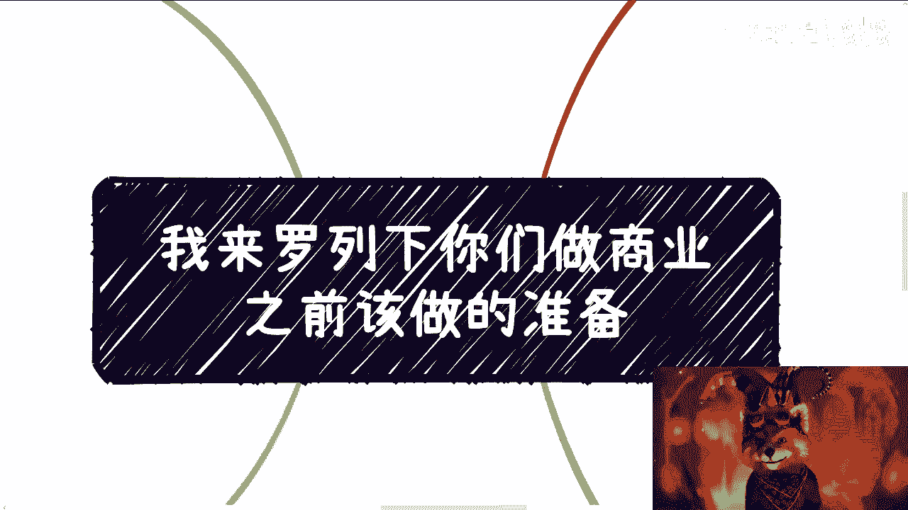

好啊大家好啊啊好啦，继续啊，来讲这个主题啊，就是呃我觉得呢，我不是很想做这种保姆式的手把手的东西，但是啊就咨询下来。

我就发现我不得不去做这种手把手保姆的东西，就是唉就我不说啊，这这就你不点到那个点子上，那很多人都不明白啊，唉这样算了啊，做就做啊，说还还说做也没啥，也没啥成本啊。

啊我来帮你们翻译一遍啊，无来帮能帮他摆一下啊，隔来给个三叉标系统。

超标系统给三成本，首先第一点啊，正所谓不打没有准备的仗啊。

什么意思啊，尼玛我跟你讲，我跟着我，我跟你们讲，我真的发现很多人真的就是说冲就冲来啊，我跟你说啊，就你就你做过准备，这叫这叫什么，这叫商业谈判，这叫积累。

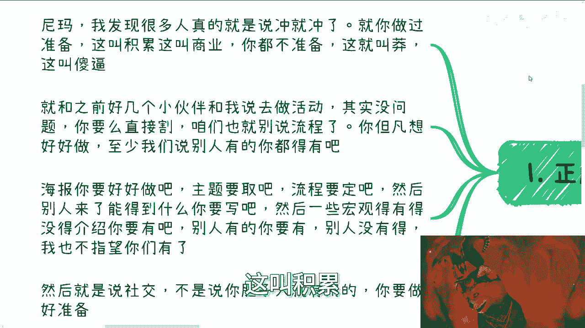

不做准备，这叫莽，这他妈叫，你晓得吧，啊，就是说你就跟我之前好几个小伙伴跟我说，去做活动一样的，我尼玛我问他们要活动的连接，我，你是不知道，我不看不知道，一看他妈的一口老血，你知道吧，就是说你。

你要去做活动，对不对，好没问题，我就这么跟你讲，你要么就直接割，直接开割，你别去说这么多，你懂吗，你直接开割，该怎么割怎么割，怎么怎么锋利，怎么来，你懂吗，呃你但凡真的割了啊，不是那种歌对吧啊。

你但凡真的割了，咱们就是别说流程了，你但凡想好好做啊，你但凡自己想好好做。

你至少我们说别人有的你都得有吧，也就是说你别的活动啊。

你比如说主题呀，描述啊，你该有的都有吧，你比如说你好，海报你得好好做吧对吧，主题你要取一个吧，流程你要定吧对吧，嗯然后然后别人来了能得到什么，你得写吧，然后一些宏观的这这这这这有的没的介绍。

你得有吧对吧，你比如说你可以把一些20大的政策，把一些地方政策都写上去啊对吧，也就是说你看别的活动，别人有的你得有别人没有的，我也不指望你没有，对不对，那好然后来做社交来说社交啊，我跟你讲啊。

不是你胆子多大就有用的，你懂吗，就是我们说你莽，你也得有有有有有有有准备的忙对吧，有策略的莽，你不能真的莽啊，你莽了，这这这对吧。

你你说人家说什么叫伤敌1000，自损800，你莽叫什么叫伤敌零，自损1000有什么用啊。

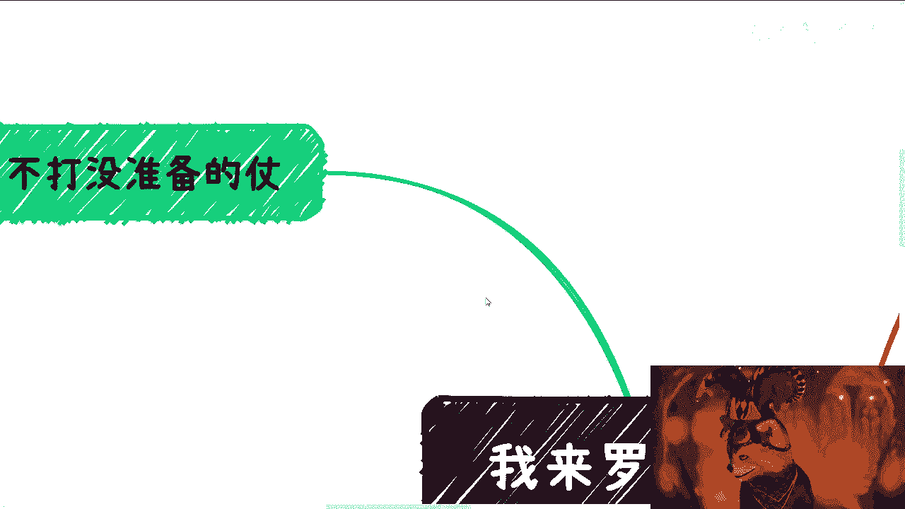

对不对，啊对吧。

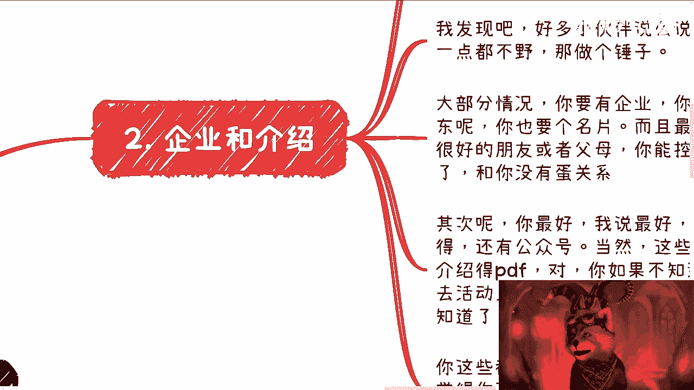

然后呢第二个啊，企业跟介绍。

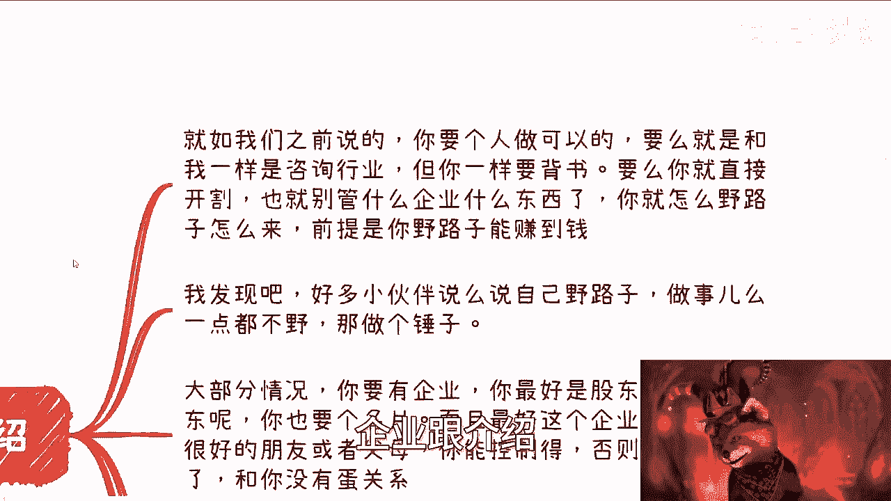

就如我们之前说的啊，你个人做可不可以可以，但是在中国的商业上很少数，也就是说你要么就是跟我一样，做一个以专家身份做这种专业，这种垂直领域的咨询行业对吧，你可以一个人去做没问题，但是你一样要背书。

你不可能跑过去说他妈的老子就是一个人，那么你是一个人，中国14亿人都是人啊，对不对，你有什么区别，你头上不长角，对不对啊，要么我就说了，你就直接开歌啊，你就别管什么企业不企业了。

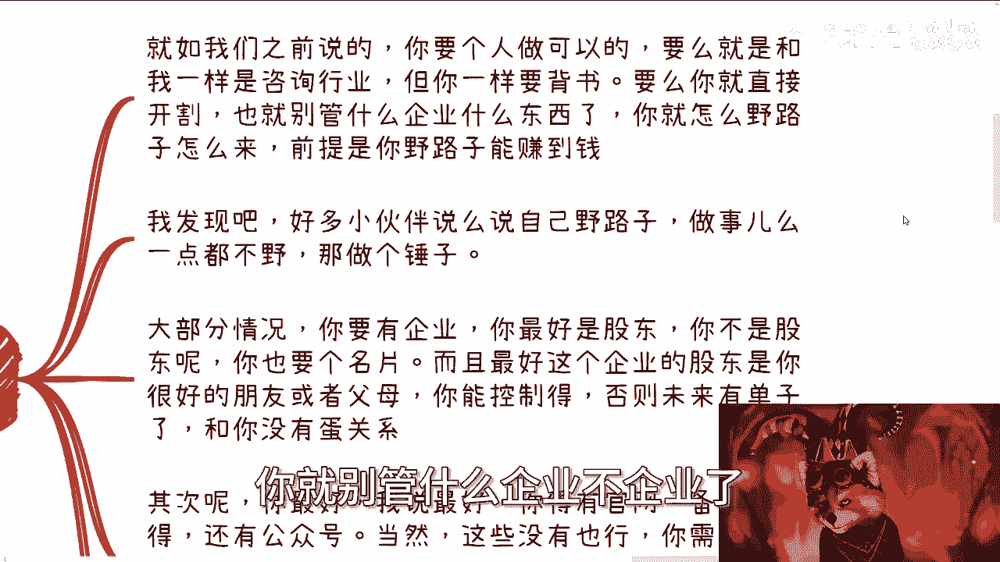

你随便套个壳子，你就干了啊，就是说你就怎么路子野怎么来啊，而且我跟你们说了，这是就是你们做事情一定要走极端，就是你要么就他妈给我野路子，你要么就是正规路子，你别就是也不也正。

就是野猫也不知道野的正规也不正规的。

就这四不像你越你越是这样，越赚不到钱，你懂吗啊，而且我发现很多小伙伴说嘛。

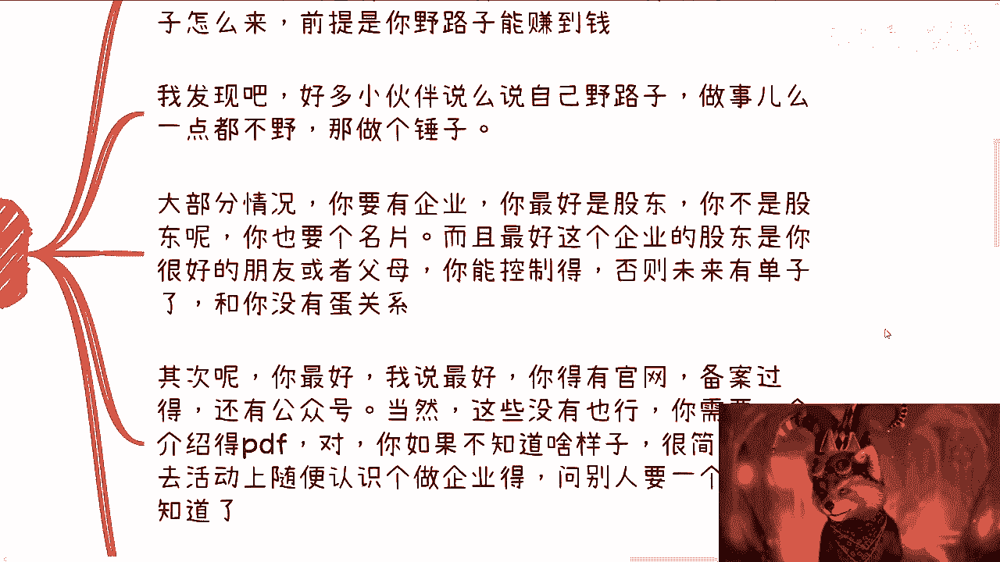

他嘴上口嗨，说自己路子，他做事他真的一点都不嗯嗯你知道吧，就是嗯嗯你你跟他简单聊一下啊，不是说走咨询，你简单聊一下。

做事他一点都不严，那你妈做个锤子啊，对不对，你大部分情况你要有企业，而且你最好是股东，而且最好是企查查上面查得到的，对不对，好你不是股东呢，你也得有个名片，比如说上面至少印一个，比如说什么销售总监啊。

商务总监啊，啊战略总监啊，什么东西，你随便印一个嘛，对不对啊，而且最好这个企业的股东是你很好的朋友，或者父母也就是说你得控制得住啊，否则你说你跑出去，对方有未来有单子了，给别人做嫁衣。

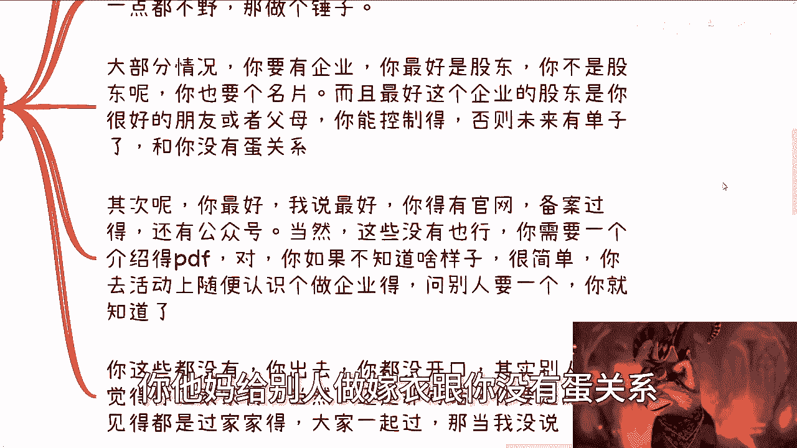

跟你没有蛋关系，你做做个锤子，对不对啊，其次你最好啊，我说最好啊，最好你得有官网，而且是备案过的，还得有公众号，当然这些没有也行啊，你至少你至少需要一个介绍的PDF啊，对好我知道你心里现在想的是。

我他妈的，根本就不知道这个企业的PDF长什么样子，对不对，好，很简单啊，你去活动上随便认识一个创业的，做企业的，你问别人要一个企业介绍，你就知道了啊，好吧好，你这些都没有，你就跑出去了，我告诉你啊。

你还没开口，其实对方大概率都会觉得你是过家家的，大概率就会觉得你是个野路子，不管你是想正规还是想野路子，对方都会觉得你就是个野路子，那说的不好听点，就是你就是个草台班子对吧，当然还是那句话。

你要是原本碰见的，比如说你去拜访的对象，你认识的对象都是过家家，那无所谓，你要一起过，那当我没有说你随便怎么滴，你随便搞啊啊啊无所谓，你爱爱咋地咋地啊。

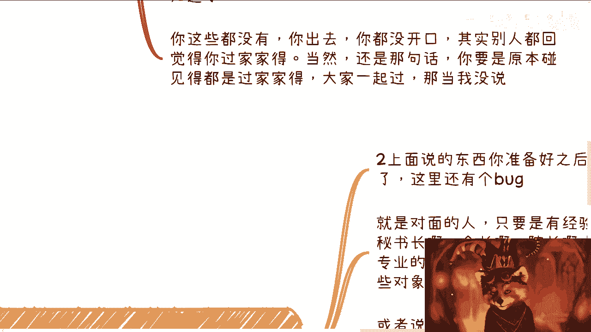

我们来说第三个，然后就是背景问题。

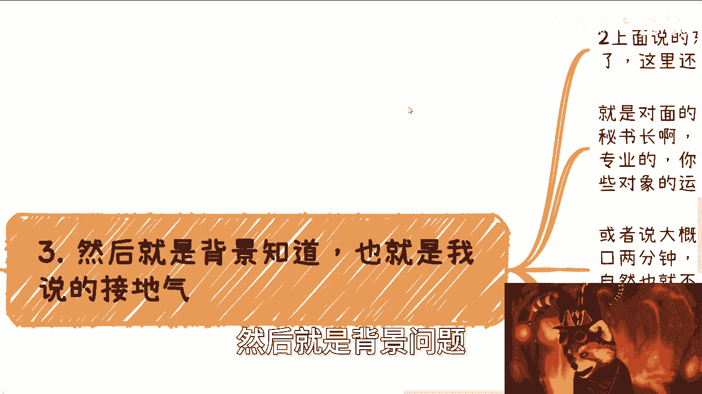

也就是我说的接地气，什么意思啊，在我们上述他东西你都准备好之后对吧好，你说好，我直接去聊了，你这里还有个bug，什么bug呢。

就是你对面的人对不对，无论是我还是说是一些拥有社会地位，拥有政治地位的人，他只要是相关的屁股坐在那边的人啊，比如说秘书长会长，理事会单位对吧，院长他可能是高校的，他有可能是政府的，他有可能是产业园的。

他有可能是科委的，经信委的某些地方的对吧，教育局的对吧好，那么我就问你啊，人家本来就是专业的，也就是说你虽然可以包装，你虽然可以三脚猫的功夫包装。

但是你前提是你要去了解，你拜访的这些客户的最基本的运作逻辑吧对吧，或者来说啊，呃你你不了解这些最基本因素逻辑，你怎么包装，自己YY吗，你YY你开口，我给你讲一到2分钟，对方心里面就会明白，的这叫什么。

是骡子是马，你马上就出来遛遛了，你知道吧啊对吧，你就说对方心里一定会明白，其实你根本就没做过，你知道吧，自然也就不可能有合作了，而且人家不可能跟我一样这么直白，跟你们说的呀，会问了，对不对。

人家一定是表面笑哈哈，心里买买皮就这样子的呀，啊你我跟你讲。

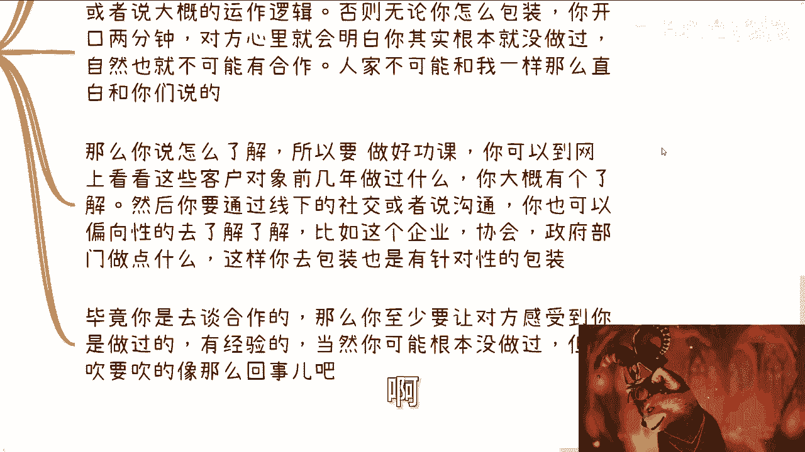

要么你说怎么了解好，所以说你要做功课，怎么做功课，你要到网上去看一下，你去拜访的这些客户近几年做过什么，你大概得有个了解吧对吧，然后你要通过线下的社交或者沟通，你也可以有针对性的啊去了解啊。

比如说这个企业啊，比如说这个协会啊，比如说这个政府部门做点什么的对吧，那这样你包装才叫这个这个有针对性的包装啊。

毕竟啊你是去谈合作的，那么你至少要让对方感受到你是做过的，有经验的对吧好，那么当然你本质上可以没有做过，但是你吹要吹的像那么回事吧对吧，但是你吹要吹的像那么回事，你得做功课吧，啊不是说我跑过去。

我的就直接莽对吧，然后直接一顿操作猛如虎，你操作猛如虎没有用啊。

你明白吗，因为你你们现在所在的，跟他们就好像两个平行宇宙，你懂吗，你懂吗，就是你讲出来的东西，对方可以30秒钟就能判断出来，你到底有没有做过，没有用的啊，好最后一点记住啊，就是就是还是那句话。

记住就是甲方在这个市场上，无论在不在这个市场上吧，在这个地球上永远是比乙方难找的。

尤其是有钱的甲方啊，或者说有预算的甲方，你想想看啊，什么叫商业，商业的本质就是你有单子，对不对，好单子哪来客户给的，对不对，甲方给的对吧好，那么甲方哪来啊，关系给的对不对，好关系哪来哪来啊。

你做业务积累下来的，对不对，好，那你业务哪来啊。

你社交出来的呀，怎么天上掉下来的，对不对，你你你你饭一口一口吃，单子是一个个做雪球慢慢滚大的啊，我发现啊很多人脑子还不清楚，就什么意思啊，就是说如果你要赚钱，你核心是什么，是找到甲方资源。

你要的就是不惜一切代价去寻找到甲方的单子，而且尽可能的把单子要确定下来，别的以后再说，你明白吧，不要再去考虑那些有的没的，就很多人会跟我说，哎呀我学历不行，我这个不行，我那个没有哎，人家揭穿我怎么样。

人家怎么样怎么样，我我就跟你们讲一句话，就是你们所有考虑的事情，但凡跟你们赚钱最终目的不搭嘎的啊。

没有任何因果关系的，不要去考虑，这不是你要考虑的问题，你晓得吧啊你考虑到所有的点，他妈的都不在点子上啊，这就好像我跟你说，有些合作方他就把我当工具人，他从来不告诉我单子的来龙去脉，但是我也不关心啊。

因为大家能赚钱就好了，什么叫商业了，就是1+1大于二，1+1大于三，大家能共赢不就好了吗，对了啊，你就他们一般来讲都是一个直接一个微信，就跟我说出方案要做，你看看能不能做，陈老师，你不能做。

你帮我找别人，对不了，因为这些人都是我合作过的，常年合作下来的，所以我从来不担心被白嫖，因为什么，因为很简单，大家以前赚过钱，赚过钱的人，他白嫖你干嘛呢，没有必要啊，大家是战友啊对吧。

其实问我要方案的时候，我心里也明白，他们基本上谈的7788了，你知道吧，就是要么就是落过框架协议了，要么就是说路过就是第一份的合同了啊，然后怎么敲定对吧，然后就说智若愚啊，所以我就跟你们说啊。

就说就说很多事啊，他没有这么的花里胡哨，没有你们想的就是说有这么复杂，你说复不复杂，就是唉怎么讲呢，就是说你说复杂吧，可能也复杂，就是说你得去了解他们背后的运作逻辑，可能复杂的，对不对。

你说要你要你要去摸索，你可能是复杂的，但是你一旦摸清楚之后，他其实没有这么多花里胡哨，就是你最终你会发现是你能接的，大家谈谈也就能接了，你要不能接的，请再多的饭，吃再多的饭，喝再多的酒，你也接不了。

就这么简单一件事，就是你哪怕舔着对方再舒服，你也接不了。

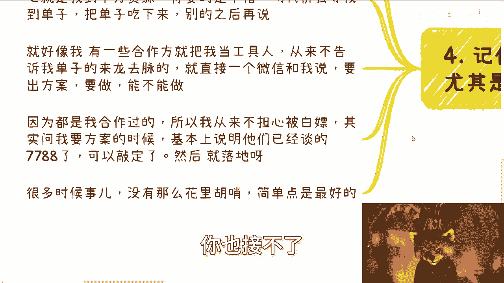

就这么简单，你明白吧啊所以说就说我才为什么说。

就说嗯大家不要这么去在意一些有的没的，你知道吧，你比如说今天你说哎我去谈了。

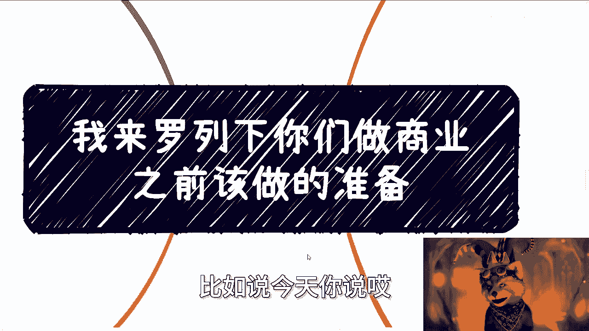

人家不跟我合作对吧，明天我去谈了，哎呀人家好像我谈失败了，好像人家给我吃闭门羹了，我跟你讲，你但凡要赚钱就不能脸皮薄，但凡要但钱就不能玻璃心，但凡要赚钱就不能抠细节，你知道吧，你要做的。

我们以前为什么说高举高打，先把整个框架摸清楚，你才能你你你要一门心思呃，叫什么不择手段的，先去摸到离钱最近的那个环节对吧，你们仔细想想看你们所考虑的所有的问题，你们就问自己。

你考虑这个问题跟赚钱有没有直接关系，他影不影响你直接赚钱，影不影响你从把甲方爸爸这边拿到单子，影不影响你找不找得到甲方爸爸，如果根本就不影响你，就不要去担心他没有用的，你晓得吧对啊。

所以说就是从这个客户上面来讲，我就一直跟你们说客户对吧，你核心就是你得了解他每一年做什么KPI在哪里，钱在哪里，他怎么做的就结束了啊，你说你怎么包装你怎么样子，其实本质上都是从你怎么去迎合他。

怎么让他觉得你是在帮他做KPI，怎么让他觉得你是在帮他赚钱，这个角度是反推的对吧，你不要说哦，我不了解对方，然后我他妈自己在那边啊，一顿操作猛如虎啊，看似非常的牛逼，但其实自我感动没有用的好吧。

就是你们一定要明白，我也好，你们也好，我们都是社会上的一粒尘埃啊，我们唯一能做的就是帮助那些有资源，有地位的既得利益者跟资本家去赚到钱，而我们一开始只能做工具人，就这么简单，至于你以后能不能成为他们。

或者说能不能跟他们有更深度的合作，这个是看天时地利人和的，好吧好卧槽，这已经是保姆式教育了啊，卧槽这哎好吧好行，就这么着吧啊，呃有啥有啥有啥，你们简单的，你们就私信我好吧，不要不要憋着不问我，你不问我。

你方向大概率是错的好吧。

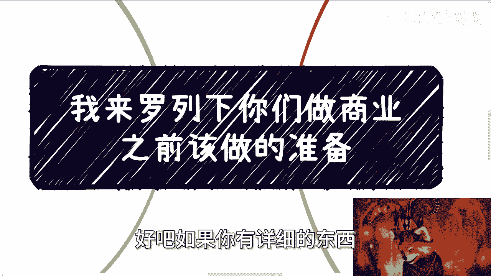

如果你有详细的东西。