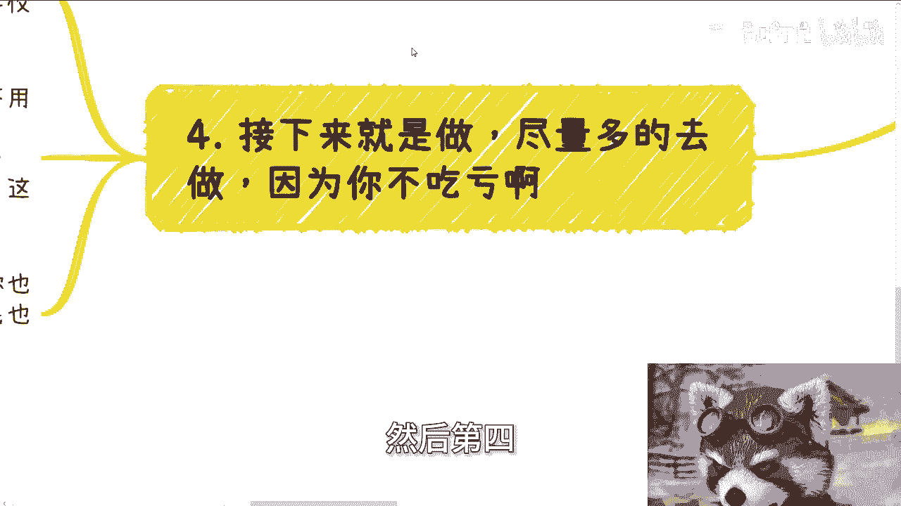
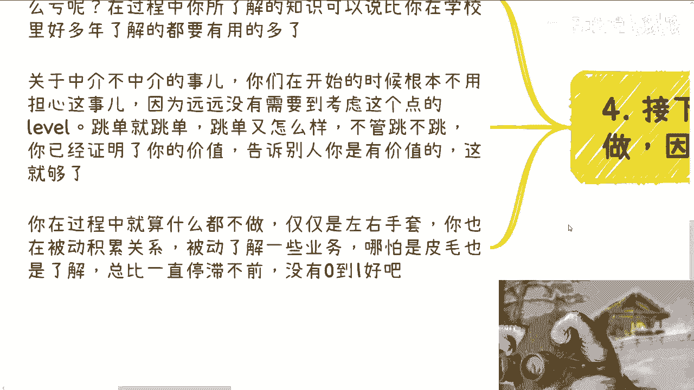

# 保姆式教学：左手套右手，右手套左手 - P1 - 赏味不足 - BV1J1421m78q

好大家好呃，广州活动定了啊，本月4月13号下午在广州番禺好吧，报名或者想了解详情的。

你们私信我啊，呃这个主题是不是看着很开心是吧，嗯嗯唉但其实也没什么卵，怎么说呢，没什么花头。

真的哎我我我我我我再说一下啊，我再说一下。

第一呢我先说一下这个投机取巧的事啊，呃我在今天的那个一起发的那个充电视频里面，也说了这个结论啊，我在这个地方同步给大家，首先啊说投机取巧的，你们可以说个不投机取巧可以赚钱的，真的我我真的我学习一下。

我我我是不知道有没有这种东西存在的啊，当然啊，左手套右手，这种方式呢也会被很多人归为投机需求，那我跟你讲啊，我就这句话，普通人你不用这种方式，你做啥你能做啥对吧，你要么滚啊，别来讨论这种问题。

你要自己做不了，还眼红别人做，那他妈的你你还怪我态度对你不好对吧，最后很多人呢之所以啊这个投机不到，是因为能力不够，说白了我跟你讲，就是能力不够，是因为不想吗啊就因就好像我们不考清华，是他妈。

因为我们自己不想吗，不是啊，对不对啊，记住啊，从商业来讲，没有投机不投机，只有性价比高和不高啊，我来翻译一下什么意思呢，很多人所谓的不投机，就是没有性价比的赚钱对吧，你不投机啊，辛苦钱啊对吧。

也就是说投入跟产出是对等的，或者说投入大于产出的对吧，那么这种一般是商业的底层，也就是我们所谓的执行层，你会发现他们虽然没有在打，没有在打工，但是他们也是工具人，而大部分人呢投入产出比高的。

也就是说产出价值远远高于实际投入价值的，这都是信息差造成的，不是因为你的努力造成的，你明白吗，底层干活的人认为这个单子只有1万，实际上有100万，而越没有信息差的上层，他越能看到钱包。

也越能拿到这100万里面的大头，那什么意思啊，按照你们的说法啊，或者按照那些说投机取巧的人说法，他妈的所有上层都投机需要呗，对吧嗯二啊。

我先举一个，今天就说那个咨询的时候说学校里的例子。

例子啊，今天呢一个咨询的小伙伴正在读研啊，我正好也说到，也说一下他今天这个案例啊，先是说到了一些学生呢，在学校里面弄各种组织啊，我就问他是不是有公司主体呃，但是呢我后来回头一想呢，我觉得也不重要啊。

有有有也可以，没有也无所谓啊，因为其实他们呢就是说为什么要在公司里搞啊，在学校里面搞各种组织呢，就是因为他们想借着学校的名头，可以多积累自己的关系和为自己做点事情，也就是说多去积累为自己做事，你知道吗。

为自己积累这个关系，那么对于上面这个逻辑，你出去就是借着学校的壳子谈合作，谈业务，哪怕谈合作关系也行啊，如果真的有什么合作关系，你可以反过来再来跟学校做正式的合作申请，对不对。

那么这样一来你左右手不就拼起来了吗对吧，那么这个叫左手，叫什么左左手，哎呀左左手这个晃右手啊，对吧。

然后呢就说到这个导师啊，导师其实就更容易了，你可以在外面找合作的时候说，我给你们找叉叉专家或者叉叉院士，对不对，如果真的有需求啊，那么你拿着外面的方案去找导师。

或者来说就是你可以问外面再叫方案嘛对吧，然后去找这个啊。

相关的导师或者相关的老师好了，那我说到这，就有很多小伙伴要开始发动被动技能，就说哎呀外面的人不相信我怎么办，我导师不我怎么办。

行我就问你，他不相信你，你可以再找别人，总有人相信你，你导师不，你，那就算不，你好了，你又损失不了，你又损失了什么呢，对不对，这这这这去讨论他干嘛呢。

你想他干嘛呢，是吧啊，然后第三个啊。

就关于这个我们说左手掏右手的这个逻辑啊，它的核心逻辑其实很简单，什么意思呢，就是你需要的是包装好一方的业务或者产品，然后进行相关的谈判啊，也就是说我不管你跟谁谈判哦，你可以跟甲方。

也可以跟乙方或者跟丙方随便啊，一旦谈判有了进展之后，再去找另外一方去确认业务的可实施性啊，就相当于说我新包装好了，假设F我有A的方案啊，然后我去找B，然后B觉得A的方案不错啊，然后我再去找A跟他说。

哎B这边有这个需求，有这个东西，我再去问A有没有可实施性对吧，如果来说A说可以有，那就继续往下走，如果A说没有，那么我就继续找另外的外包团队，怎么了呢，对不对，怎么了呢，你就像你就像你今天解一个数学题。

你先设X怎么了，今天不知道X是什么，不能设吗，哎奇了怪了，对不对啊，那么其实你在外面也是一样的，当然很多人谈判不了，主要是因为他不知道怎么谈，那退一步就说自己对自己要谈的领域，他不了解对吧。

也不了解对方啊，那我跟你们讲这事比你们应试教育要容易得多，我举个例子啊，你就说人工智能，你看一些视频，看一些PPT，看一些线下大会的介绍，对一些P目前来讲，AIGC里面的专业名词知道一点。

然后国内外最新的一些开源的产品，名字知道一点，然后每个产品大概有什么用，哪些是针对文案的，哪些针对PDF的，哪些针对视频呢，什么区别知道一点，然后你对去聊的这个人或者机构，他网络上总归有点东西可以查吧。

你通过一些简单的对对方的了解，你至至少知道对方是个什么属性的，一个一个一个组织或者一个人吧，对吧好，那我跟你讲，2024年，很多时候你如果还不知道怎么开始，以及不知道怎么包装和不知道怎么吹。

我还是那句话，就是因为你对于知识的缺失，或者说就是什么，就是你懒对吧，你现在网络这么发达，你了解这些东西不难啊，你足够你去套左右手了，怎么会套不出来呢，对不对，怎么会掏不出来，肯定掏的出来呀。

啊然后第四接下来就是做尽量多的去做。

因为你不吃亏呀，你说白了你牺牲的是一些你看短视频的时间，你牺牲的是一些这个叫什么平时娱乐的时间，你多逼逼你自己去做啊，你总归会有成果和积累的，你要这么想，就算最终一个单子都没有，你又吃什么亏了呢。

那么奇了怪了，对不对，在过程当中你所了解的知识可以说就是，哪怕你现在一个kiss都没有做，但是在这过程当中，你所了解到的知识，可以说比你在学校里面这么多年了都要有用的，多得多得多得多得多得多得多对吧。

那关于你关于还有很多人在那边纠结，爱唱的时候，我们是不是做个中介，我跟你讲，你们真的开始做了，在0~1的时候，你们根本就他妈没有到，要去担心是不是中间这个事儿啊，有啥好担心的，你是也好，不是也好。

怎么了呢，怎么了呢，你影响你做事情吗，不影响啊，不要来说跳单不跳单，跳单又怎么样，不管跳不跳，你已经证明了你的价值，告诉甲方跟乙方，你是有价值的，这他妈就够了呀，有什么关系呢。

对不对，你在过程中就算什么都不做，仅仅是左手套右手，你也是在被动积累关系，也被动地了解一些业务，哪怕是皮毛也可以的，总他妈比一直停滞不前好吧。

对吧，我觉得真的现在的人啊，现在就是考虑问题就是这样子的，就是那我我我真的我可以不客气的说，你们所有讲出来的东西都是为自己在找借口，就这么简单，你说陈老师这个东西投机取巧，投机倒把可以啊。

那你又不是投啊，你到底又不能投啊，对吧，你说爱陈老师这个当时被跳单怎么办，你有本事先跳啊，你先他妈做两个业务被跳掉也行啊，你做呀，对不啦，你做了之后，你说啊，我们在讨论我们为什么被套掉对吧，我们在复盘。

那也行啊，你上来这么多假设有什么用呢，没有用的呀，而且你说中国14亿人市场这么大哦，你就找不到一个左手是相信你的，找不到一个右手相信你吗，我不信他对吧，总有的呀。

你就像你就算现在LV1也有新手村给你打吧，怎么会没有呢，哦哦大家都说自己是新手，大家是初心者对吧，大家大家说啊，我没有经验，那怎么了，你们他妈到社会上，社会上都他妈是牛逼的人吗，会吗是吗啊。

我一直这么说，中国人均收入就2万，年收入才2万8，3万2，能牛逼到哪里去啊啊，我跟你们讲，为什么这个主题我以前没讲过，我还真是翻了一下，我还真没说过，好像就保姆式的教学，我还真没说过，我后来想了想。

我为什么没说，因为这多半也没啥好说的呀，这这对吧，这这不就是你解数学题设个X的问题吗，有啥区别呢。

好吧行，那个广州活动好吧，继续报名。

然后那个职业发展商业发展好吧，职业规划，商业规划，然后包括什么股权融资啊，项目计划书啊，啊，包括你们要是觉得你们希望，就是说有些什么未来发展，希望通过我的视角来给你们做规划的，或者怎么样的。

那你们可以整理好背景跟问题啊。

我们再来做咨询啊。