# 课程名称：假如你是协会会长、秘书长或院长（表篇） - P1 🏛️


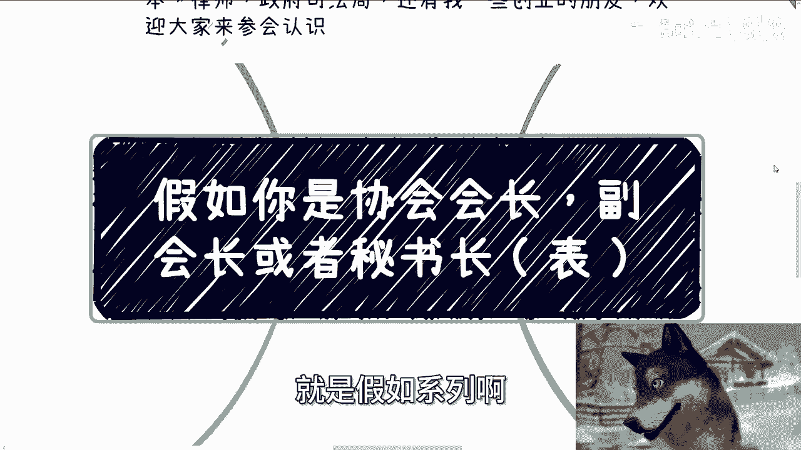

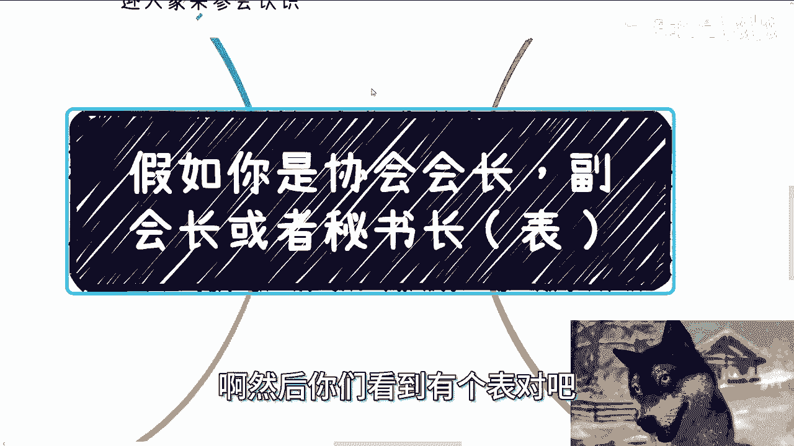

在本节课中，我们将探讨担任协会会长、秘书长或研究院院长等职位时，表面上需要具备的条件和日常职责。我们将从硬件、软件条件到日常工作内容，逐一进行拆解。


---

## 概述 📋


本节内容属于“假如”系列，旨在分析一个协会或研究院领导岗位的“表面”要求。我们将假设你已成为会长、秘书长或院长，并梳理你需要营造的对外形象和履行的常规职责。


---

## 硬件与软件条件 💻

首先，你需要搭建起支撑这个职位的基础框架。这包括物理空间和团队人员。

### 硬件条件：物理空间

你需要一个物理空间。这个空间是用于接待其他企业、进行商务洽谈和展示实力的场所。

**公式表示：**
```
领导职位 = 物理空间 + 团队人员
```

这个空间可以是写字楼，也可以是政府扶持的场地。

### 软件条件：核心团队

在人员层面，你需要组建一个核心团队。这个团队通常由几名下属组成。

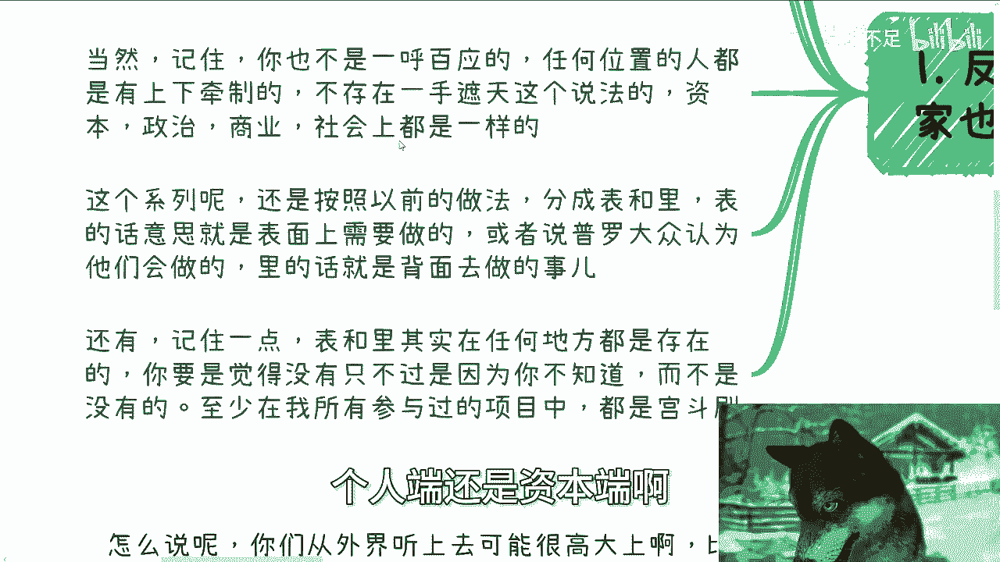


以下是这个核心团队需要承担的几种角色：

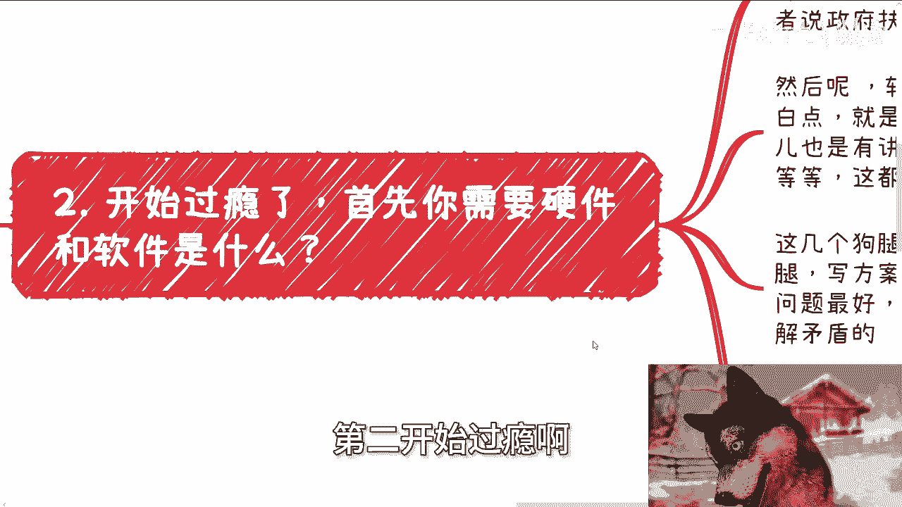

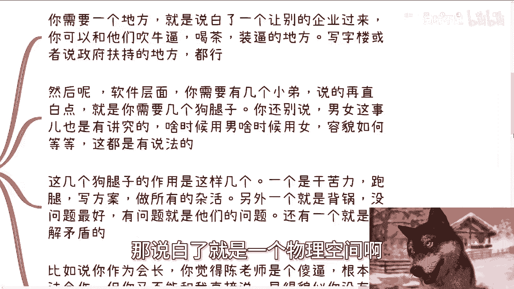

1.  **执行者**：负责处理苦力、跑腿、撰写方案、制作PPT、记录会议纪要以及对接所有杂事。
2.  **责任缓冲带**：在项目出现问题时，承担相应责任。
3.  **矛盾缓解者**：当你需要拒绝合作或处理棘手关系时，由他们出面沟通，为你保留回旋余地。

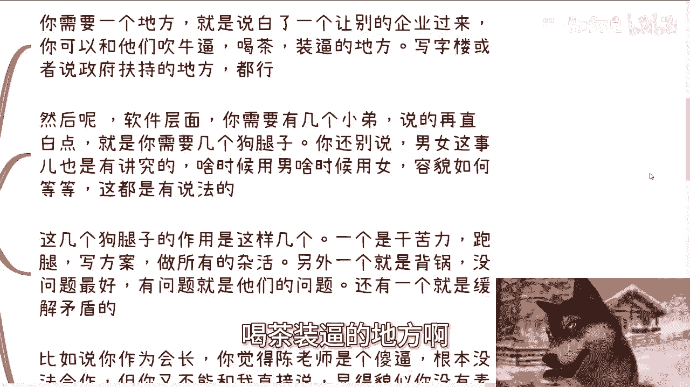

团队中的男女比例配置也有其实际作用，在不同社交与商务场合中，性别搭配能发挥特定效果。

---

## 日常工作与必备素质 🍵

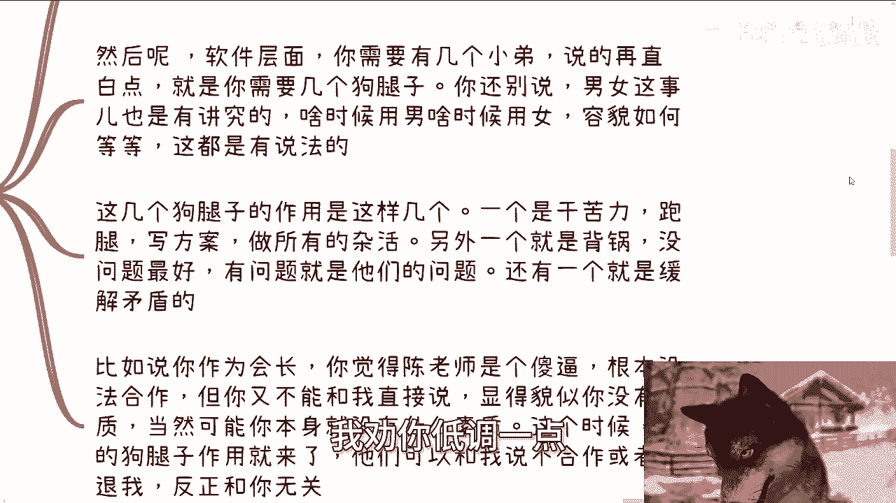

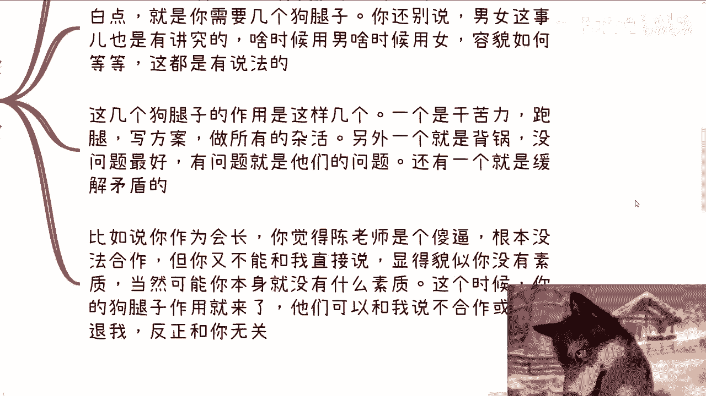

上一节我们介绍了支撑职位的基础条件，本节中我们来看看日常需要做什么，以及需要培养哪些个人素质。

### 核心日常工作

你每天的常规工作可以高度概括为三件事：**喝茶、开会、应酬**。这三项活动的频率会非常高，它们构成了你对外形象展示和关系维护的主要形式。

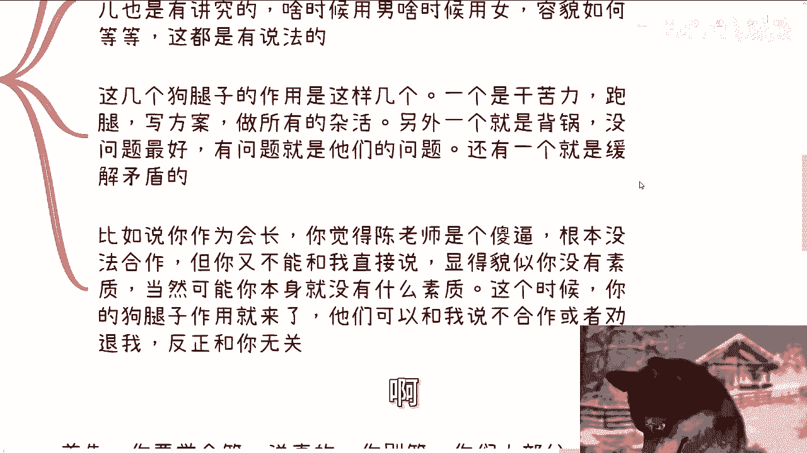

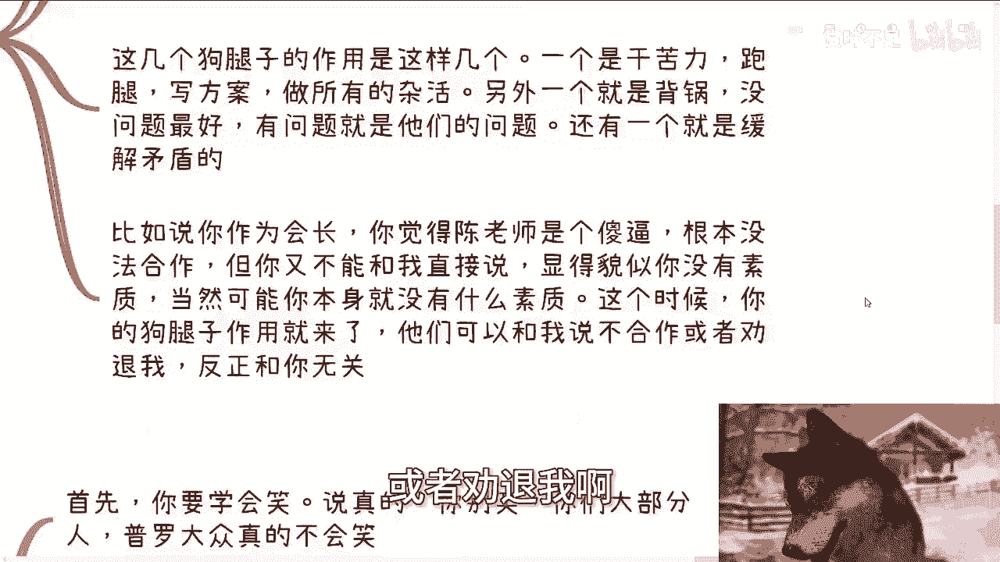

### 必备个人素质

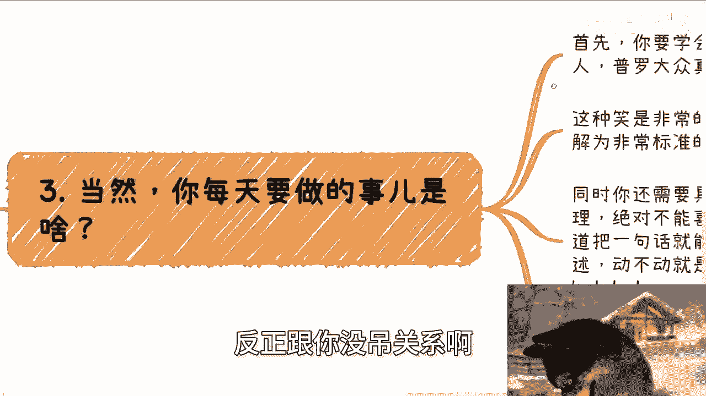

要胜任上述工作，你需要具备两项关键素质：

1.  **情绪管理能力**：无论面对上级领导还是普通访客，都不能将真实喜怒情绪表露在脸上。
2.  **高层话术能力**：你需要学会将简单的事情，用更高的格局（如联系区市政策、国家方针等）进行阐述，也就是“讲车轱辘话”。

同时，你必须掌握一种特定的“笑”：即皮笑肉不笑的、标准的领导式微笑。无论内心感受如何，无论话语多么空洞，都要保持这种自然且官方的微笑。

**代码描述这种状态：**
```python
def daily_routine():
    while True:
        drink_tea()
        attend_meeting()
        socialize()
        smile() # 始终保持领导式微笑
```

---


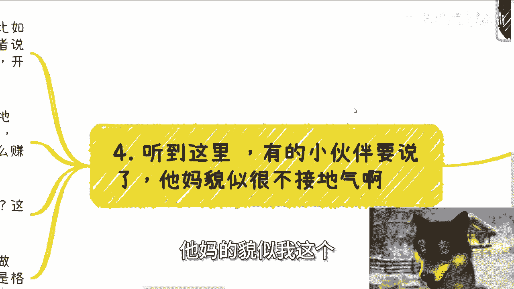

## 对“虚”与“实”的辨析 🤔

听到这里，你可能会觉得这些工作内容非常“虚”，不接地气。这与大众通常认为此类职位“高大上”的印象（如制定产业标准、接待领导、参加揭牌仪式）似乎有出入。

然而，仔细分析便会发现，那些所谓“高大上”的活动，本质上依然属于“喝茶、开会、应酬”的范畴。大众觉得高大上，往往是由于认知局限。

作为一个机构的最高代表，你不能事事“接地气”、亲力亲为。你的核心角色是进行战略布局和关系链接，而非陷入具体执行。日常的喝茶、开会、应酬，都是为后续的商业机会所做的铺垫和营销，其本身并不直接产生收益。

需要指出的是，即便是这些“表面功夫”，也并非人人都能做好。它对个人的格局、思想和情绪控制能力都有相当高的要求。

---

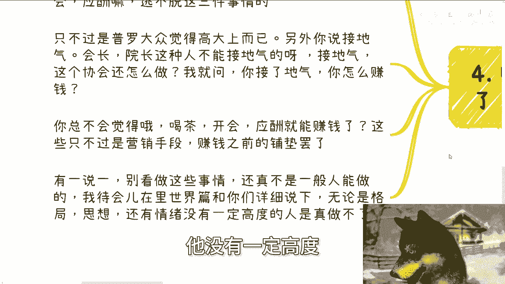


## 总结 ✨

本节课中，我们一起学习了担任协会会长、秘书长或院长等职位的“表面”要求：

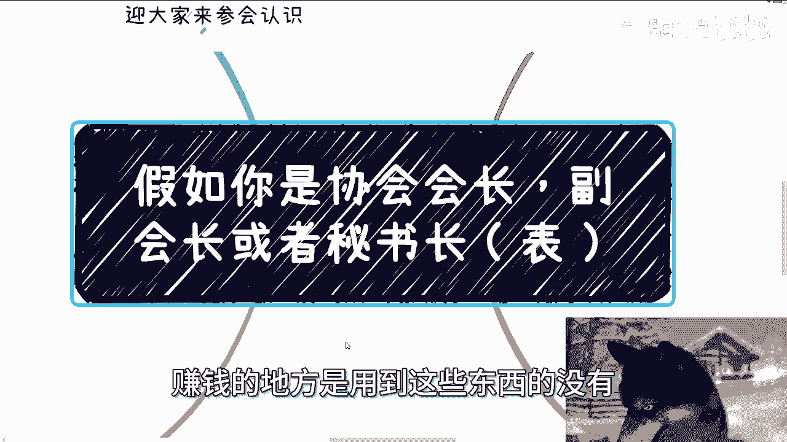


1.  **需要基础条件**：包括物理办公空间和一支承担执行、缓冲、沟通角色的核心团队。
2.  **日常工作高度重复**：核心围绕喝茶、开会、应酬展开，频率极高。
3.  **依赖特定个人素质**：尤其是出色的情绪管理能力、高层话术能力以及标准的官方仪态。
4.  **理解角色定位**：该职位的设计本身就不追求“接地气”，其价值在于战略高度与资源链接，日常活动是为实现商业目标所做的必要铺垫。

认识到这些“表”象，是理解此类职位运作逻辑的第一步。在后续的“里篇”中，我们将深入探讨职位背后的真实运作逻辑和核心利益所在。


---
**附：活动信息**
下期活动已定于9月8日在上海举行，为2024年第二期数字经济大会。详情及报名请参见评论区链接。