# 课程一：协会会长/秘书长/院长的核心职责与生存法则 🎯

在本节课中，我们将学习如何扮演好协会会长、秘书长或院长这类复合型领导角色。这类角色兼具社会、企业和政府属性，其核心挑战在于平衡表面汇报与实质盈利，并有效管理团队。我们将拆解其核心能力，帮助你理解如何在这个位置上生存与发展。

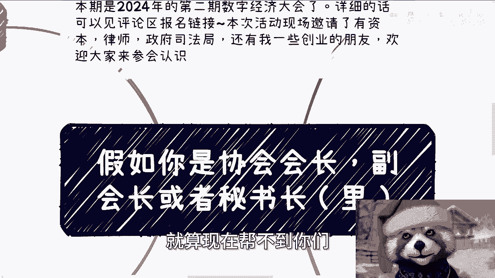

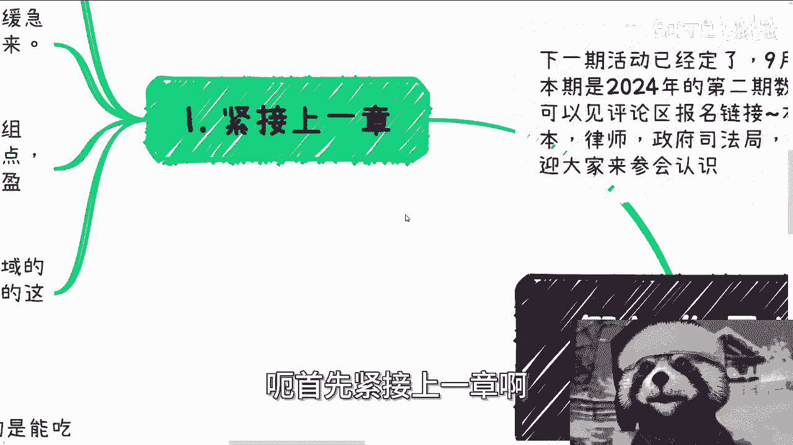

---

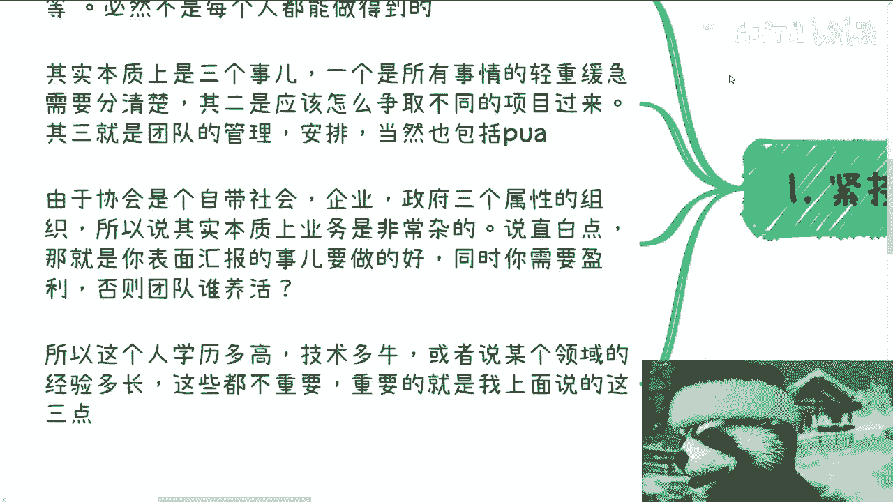

## 一、 活动通知与核心能力回顾 📅

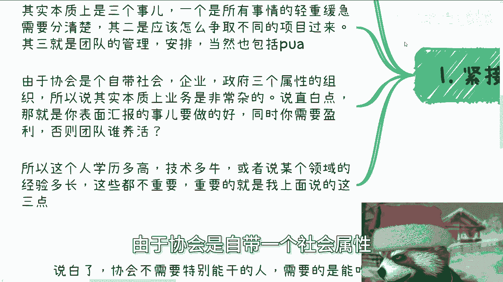

下一期活动已确定，将于9月8日在上海举办，主题为“2024年第二期数字经济大会”。详细信息和报名链接请查看评论区。

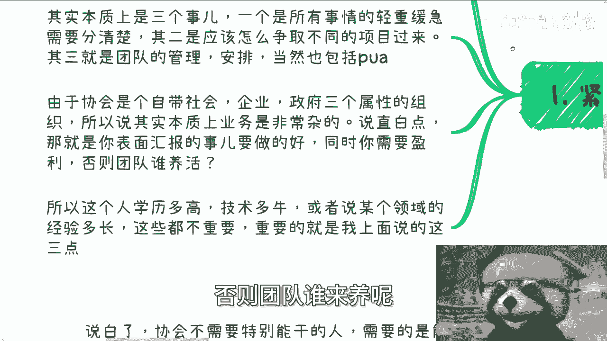

本次活动邀请了资本方、律师以及我的创业伙伴，欢迎大家前来参会交流。

上一章我们谈到了格局、情绪管理和做事方式。这些并非人人都能做到，其本质可归纳为三点：
1.  有能力区分所有事情的**轻重缓急**。
2.  懂得如何**争取不同的项目**。
3.  做好**团队管理**。

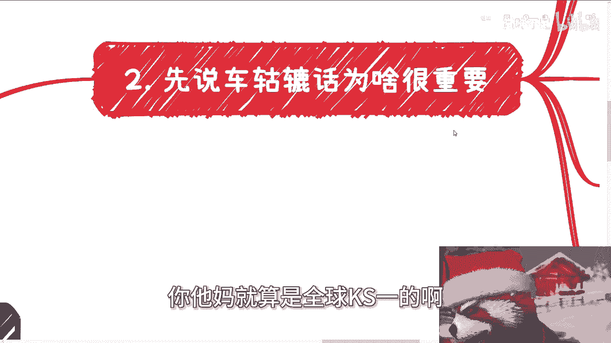

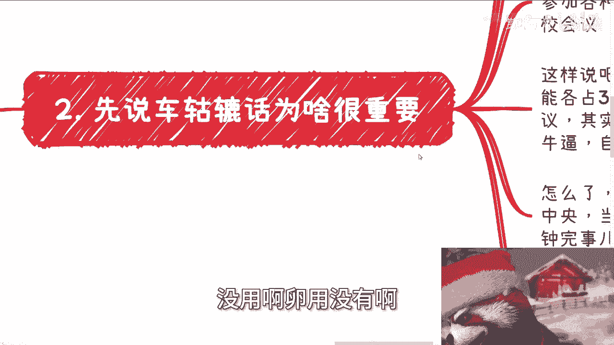

其中，**PV（项目价值）** 的争取至关重要。由于协会是集社会、企业、政府三重属性于一身的组织，业务非常繁杂。这意味着，你既要做好表面汇报的工作，又必须实现盈利，否则团队将无法维持。

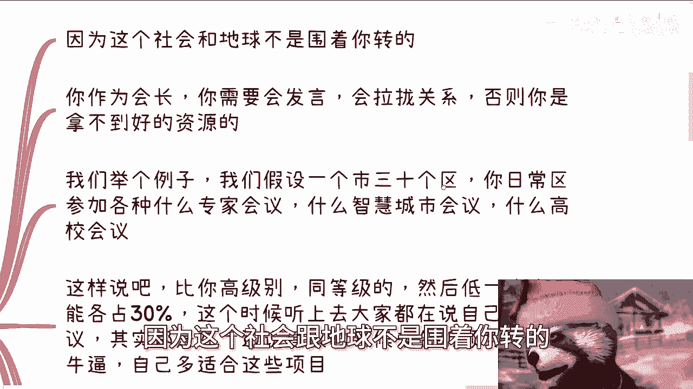

协会无法依靠融资或政府供养来生存。因此，会长角色的关键不在于学历、技术或单一领域经验，而在于上述三点核心能力。如果做不到，即使拥有全球顶尖的资质也毫无用处。

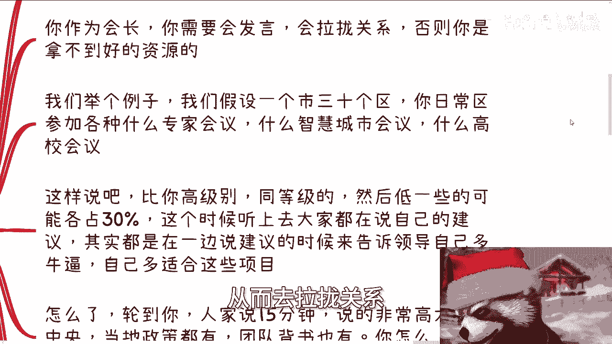

---

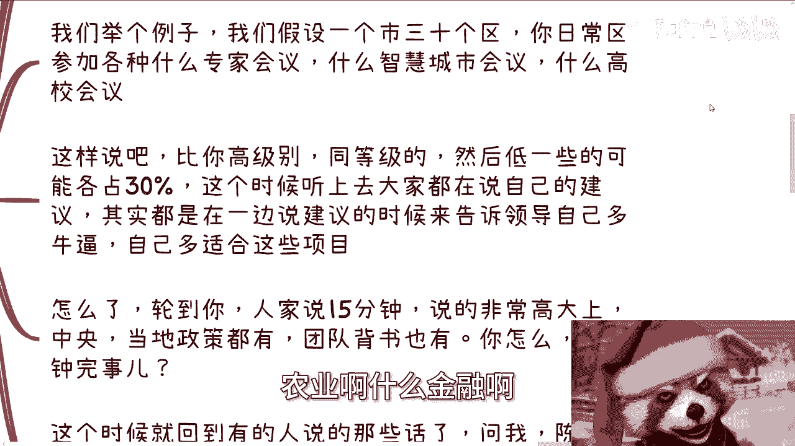

## 二、 核心技能一：掌握“车轱辘话”的艺术 🗣️

首先，我们必须认识到，社会和地球并非围绕个人运转。个人是否认为“车轱辘话”重要无关紧要。但作为会长，你需要在各种场合发言，而发言的目的并非随意表达，而是为了展示自身实力、拉拢关系，从而获取优质资源和项目。否则，会长一职将失去意义。

以下是一个具体场景分析：

假设你在一个拥有30个区的城市工作。由于协会属性及直属单位关系，你需要频繁参加各区、各领域（如智慧城市、公安、农业、金融、高校等）的各类会议。

在这些会议上，与会者通常分为三类：比你等级高的、同等级的和稍低一些的，各占约30%。会议流程往往是领导先发表“车轱辘话”式的讲话，随后轮到参会者发言。

你会发现，许多人都在讲“屁话”，但这些话具有艺术性和逻辑性。他们在提出建议或自我介绍的同时，实际上是在向领导展示自己、团队及组织的实力，暗示自己比在场其他人更适合承接项目。

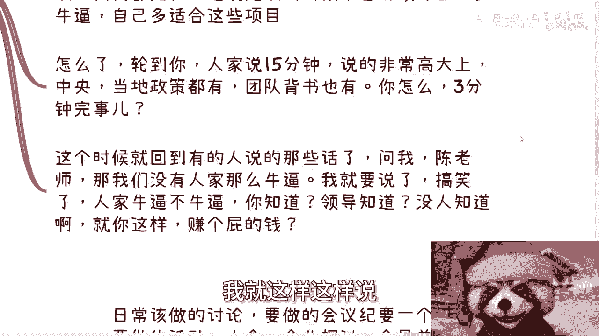

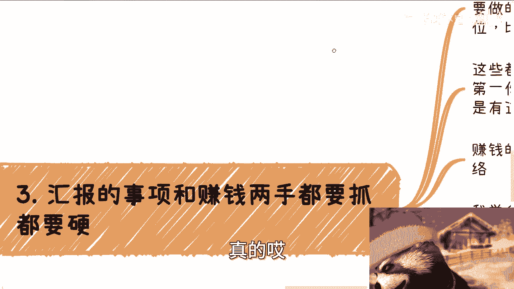

当轮到你发言时，如果别人侃侃而谈15分钟，内容高大上，涵盖政策与实力，而你2分钟草草结束，并向领导抱怨“他们都在说车轱辘话”，那么领导会如何看待你？此时，领导是评判者。

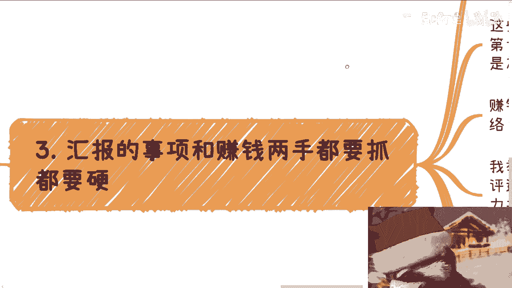

有人可能会问：“陈老师，我们的确没别人那么厉害怎么办？” 这种想法本身就是错误的。别人是否真的厉害，你无从得知，领导也无从得知。**在资源争夺中，敢于并善于“吹牛”是一项关键技能。** 如果连这点都做不到，就很难赚到钱。

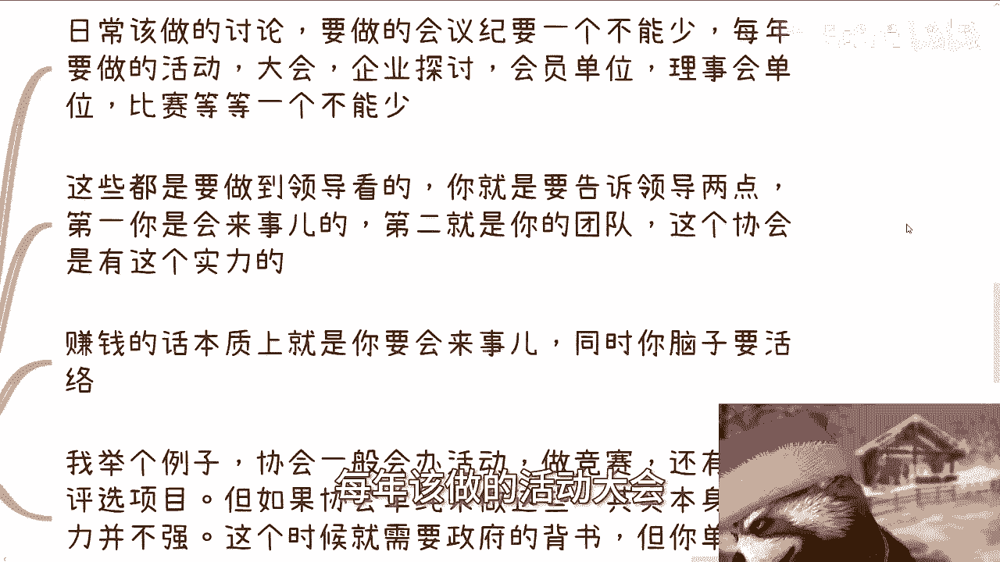

---

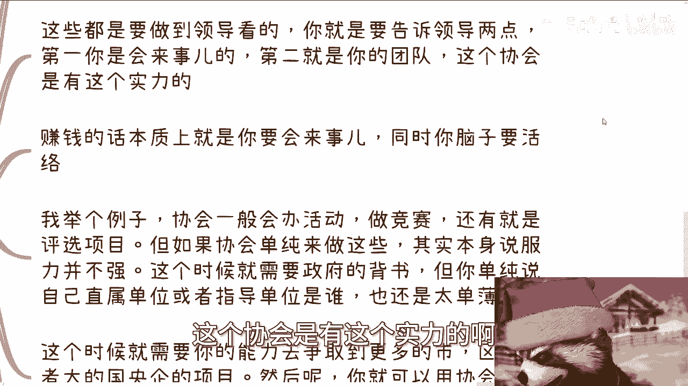

## 三、 核心技能二：汇报与盈利，两手都要硬 💼

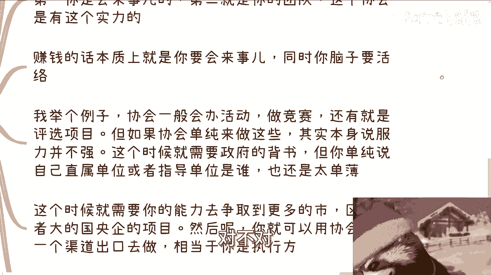

这意味着，日常该做的讨论、会议纪要一个不能少；每年该举办的活动、大会、企业探讨、会员单位服务、理事会会议、比赛等也一个不能少。这些是做给领导看的，旨在传达两点信息：
1.  你很会“来事”。
2.  你的协会团队有实力推动事务。

而赚钱的本质，在于既要会“来事”，又要脑子灵活。下面通过一个例子说明：

协会通常会举办活动、竞赛或项目评审。如果仅以协会名义发起，说服力往往不足，这时就需要政府或大型机构的背书。

你的能力体现在，能否争取到更多市、区级或大型国企、央企的项目，然后以协会作为执行渠道来操作。这些项目正是通过“车轱辘话”争取来的。

当你成为项目执行方，就可以名正言顺地招募参与者。如果有企业想报名，你可以这样回应：
> “我们非常欢迎，但协会优先服务于会员单位。非会员企业也可以报名，但优先级较低。若想提高优先级，可以考虑先加入会员。否则，可能需要等会员报名后有名额剩余。”

言下之意很明确。虽然有人可能选择不加，但总会有人加入。协会的会员费、理事会费从每年2万到20万不等，这就是一种盈利模式。

**这只是一个例子，实际操作方法远不止于此，需要举一反三。**

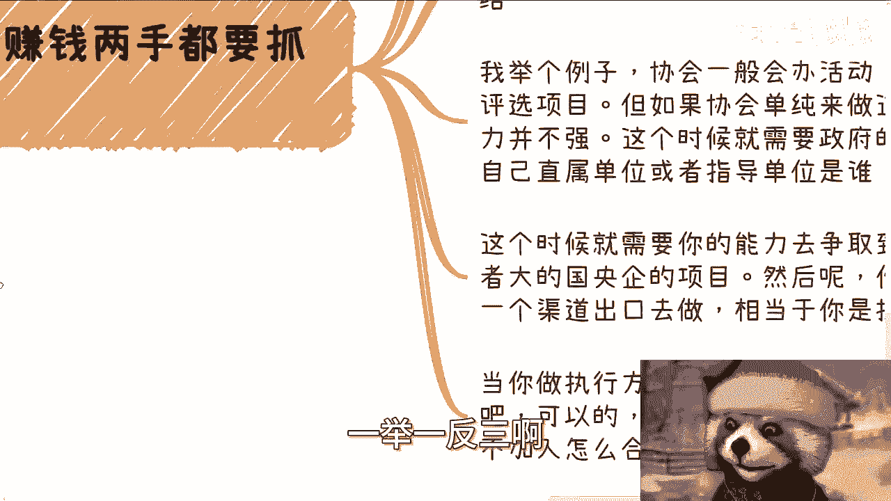

---

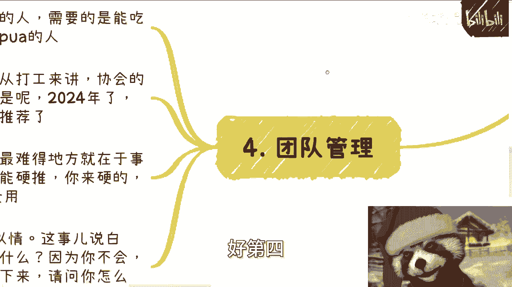

## 四、 核心技能三：团队管理中的“PUA”之术 👥

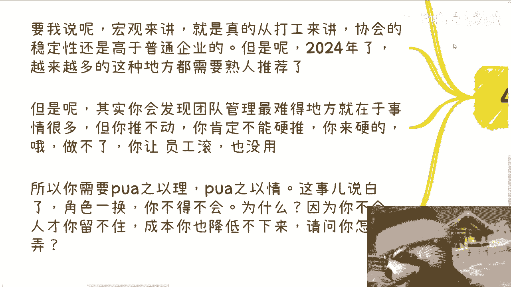

协会不需要能力特别突出的人，更需要能吃苦、任劳任怨、并且能接受持续引导（或称“PUA”）的人。这与协会的属性有关。宏观来看，协会工作的稳定性通常高于普通企业。

但如今，这类职位越来越多依靠熟人推荐。团队管理最大的难点在于事务繁杂却难以推动。即使作为会长，也不可能一手遮天。面对懒惰或推不动的员工，强硬手段往往无效。

因此，必须“刚柔并济”，学会“PUA之以情，PUA之以理”。作为会长，必须掌握这门艺术。原因如下：
*   **留住人才**：如果你不会“画饼”（描绘愿景），而别人会，人才就会被吸引走。
*   **控制成本**：你可以通过“画饼”来管理员工对薪酬的期望，例如以效益为由暂缓加薪，从而用更低的成本留住人。

人类社会驱动力的核心无非两点：**精神信仰** 或 **物质利益**。如果两者都不沾，就无法留住人。

你的最终目的是让协会生存下去，而生存的前提是赚钱。如果不会讲“车轱辘话”、分不清轻重缓急、也不会管理团队，那么即使你是清华高材生也无济于事。

---

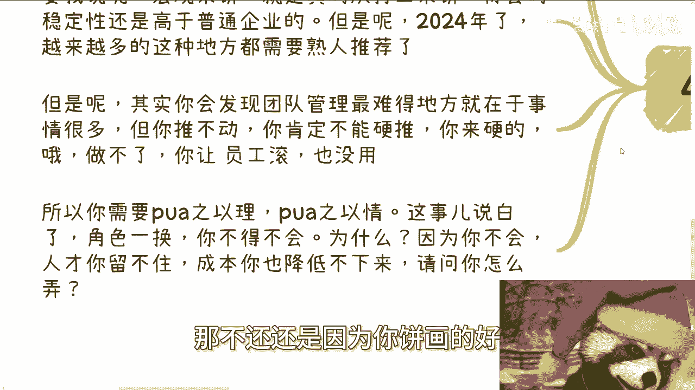

## 五、 总结与行动指南 ✅

本节课我们一起学习了协会会长/秘书长/院长的核心生存法则。

在“里世界”中，我们要明白：表象工作必须做好，但赚钱同样重要，且两者并非完全独立。关键在于，你需要名正言顺地在履行职务的过程中创造收入。

例如，以“会员优先”为由收取会费，就是一个完全合乎逻辑、无可指摘的盈利模式。至于是否真有会员报名，并不影响这个逻辑的成立。类似的操作空间在项目评审、竞赛、日常会议、专家咨询等环节大量存在。

**前提是，你必须有能力争取到项目。** 会长这个职位，远比想象中复杂。

最后，再次提醒上海9月8日的活动正在报名中。此外，关于职业规划、商业规划、副业、合作、合同、商业计划书、分红、投资估值等问题，大家可以整理好具体问题和个人背景，以便进一步交流。

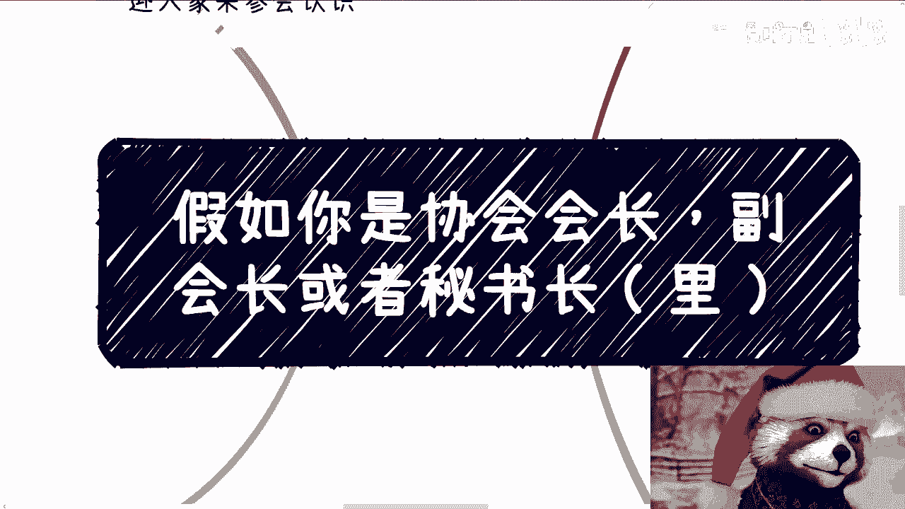

---
**本节课总结**：我们深入探讨了协会领导角色的三大核心技能——**沟通艺术（车轱辘话）**、**平衡之道（汇报与盈利）** 和**团队引导（PUA之术）**。成功的关键在于灵活运用这些技能，在满足组织表面需求的同时，构建可持续的盈利模式，并稳定团队。记住，在这个位置上，实操智慧远高于纸面资质。