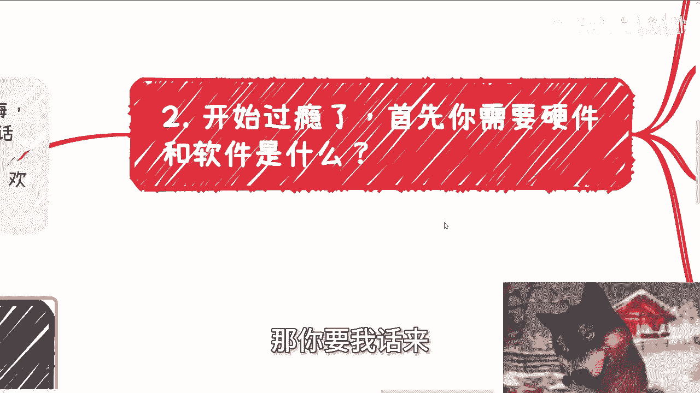

# 假如你是协会会长，秘书长或者院长（表） - P1 - 赏味不足 - BV1Bqs4efEsa

好好大家好，这个因为马上要开学了对吧。

我这不给大家开一个新的坑啊，叫做跟之前漫威啊那个那个剧集是一样的啊，就是假如系列啊。

嗯今天我们这个主题呢，就是假如你是个协会会长啊，或者副会长啊，或者秘书长啊，是个什么情况对吧啊，然后你们看到有个表对吧。

那有表即有礼啊，那么所以说啊，这是一个一起会发的这么一个视频啊。

那么首先先说一下下期活动已经定了好吧，9月8号在上海啊，在上海，本期呢是2024年的第二期的，这个数字经济大会啊，那么详情的话呢，呃你们可以在评论区看一下报名链接，报名链接里面有所有的详情，包括易程。

包括嘉宾啊，那么本次邀请到的呢有资本，有律师啊，有政府，这个都是挂在上面的，我也不吹牛啊，还有一些我的以前创业朋友，就我大概认识十多年的啊，反正都都都人都蛮好的啊，那么欢迎大家也过来参会，都认识认识。

呃我们来讲啊，首先这个第一啊，反正一切都是假如啊。

我觉得给大家呢这个过过干瘾啊，那我们假设啊，假设你现在是一个某某某协会的这个协会长啊，呃副会长或者秘书长啊，你会啊需要各种硬件条件跟软件条件的设施啊。

那么我们一个个来说啊，呃首先呢很多研究院啊有院长和执行院长，所以呢协会呢也是一个道理啊，就会有一些什么叫做叫做会长啊，秘书长啊对吧，或者怎么样啊，就是简单来讲什么意思呢，意思就是说你们记住一点啊。

院长或者协会会长啊，往往是那种名头足的啊，然后呢是在里面做这种关系链接的啊，那就说白了他就是一个纯高举高打的，不会往下接地气的这么一个角色啊，也就是说他不会出，他甚至不会出面啊，他不出力。

但是呢他出的是关系链啊，但是啊而且很有可能就是这个这种人，话语权会还会比较大，那么你像这种叫什么秘书长啊对吧，副会长啊，执行院长啊这种啊，那就是个干活的啊，高级打那个打工仔啊，当然记住啊。

你你如果今天是一个我们说的那种，会长或者院长级别的人，你也不是一呼百应啊，当然啊我在这个地方还得跟你们讲个前提，我在这里面忘记写，就是什么呢，就是你们记住一点啊，协会它的属性有很多。

不是说他一定是个国企啊，很多的协会他其实都是民企，只不过呢它的属性是省级或者市级啊，或者区级的，但是这个省级市级区级呢，主要是跟他的上级单位有关，跟他本身这个单位的属性没有关系啊。

这就好像很多人会会跟我说啊，陈老师，那按照你这个说法，就是说啊，这个这个会长或者这个所谓的怎么说呢，这个院长对吧，他是不是说学历要很高对吧，或者他的这种职称要很高，你有听到过哪家民企里面的CEO。

或者所谓的老板需要学历跟职业那个职称的吗，有吗啊，哪个民企自己跟自己过不去搞这种东西，对不对啊，所以说不要自己PUA自己啊，就是很多人就喜欢不了解，但是他就他妈的喜欢往里面，就是说把把自己。

就是就完全不符合社会现状的东西往上去扣，然后默认变成这样子，那他妈谁告诉你的啊，啊那当然啊回到这边啊，就是说你如果今天是个院长或者是个是个会长，你记住你也不是一呼百应的。

因为任何位置的人都是有上下牵制的啊，不存在一手遮天之举的这个说法啊，资本政治商业社会上都是一样的，那这个系列呢还是会按照以前的做法啊，分成表根里，那么表的意思呢无非就是字面上的意思，就表面上需要去做的。

或者说很多普罗大众认为他们去做的，当然是不是真的这样子，你们听我讲啊，而礼的话呢是背面要去做的事情，那么还有啊记住一点表跟里，其实任何地方都是存在的，而任何一个地方记住任何一个地方，我已经强调三遍。

为什么，因为我相信你们总归会默认，有些地方好像很干净或者非常的怎么说呢，朴实淳朴，我跟你讲不存在的，为什么，因为朴实淳朴是活不长的，你能明白吗，啊也就是说我早就跟你们讲过一件事情。

就是只要在这个社会上还有留有痕迹的，还能活到今天的，你说他朴实，我不信啊，我绝对不信啊，你要是觉得呢没有啊，我就告诉你，只不过是你不知道，而不是不存在啊，至少在我所有参与过的项目当中，不管是企业端。

政府端，高校端，个人端还是资本端啊。

都是宫宫斗剧啊，不存在，你跟我说什么很朴实的，我的，那你要我话来讲就死光了。

我真不我真不相信哦，第二开始过瘾了啊，首先你需要你需要什么硬件条件跟软件条件啊。

你需要一个地方啊，那说白了就是一个物理空间啊。

让别的企业过来，你可以跟他们吹牛逼，喝茶装逼的地方呃。

可以是写字楼，可以是政府扶持的地方都行啊，然后呢软件这种层面呢，你需要有几个小弟啊，那么也不叫软件啊，就是软性层面啊，软件条件啊，你需要有几个小弟，说的再直白一点，就是你需要几个狗腿子啊。

你再说的直白一点是什么，就是你需要一些背锅的，对不对啊啊而且另外一方面你还别说啊，男女比例是有讲究的，真的是有讲究的，因为当你是作为这种社会属性的，这种机构存在的时候，什么时候用男的，什么时候用女的。

其实是有道理，有说法的啊，当然你可以觉得他妈的老老子很牛逼对吧，老老子不想去管这些，他妈的有的没的，这些都是所谓的恶习对吧，所谓的陋习或者所谓的这种叫什么，就是就是腐朽的东西，我不想遵守，可以啊。

那你想想看，我我都不说这个地社会跟地球了，你所在的城市所在的区，所在的市是不是围着你转的，如果不是围着你转的，我劝你低调一点。

对不对啊，该怎么做还怎么做啊，否则否则哼怎么垫。

你制定规则嘛，对吧啊，那么这几个狗腿的作用呢是什么呢，一个是呃几个有这么几个啊，一个是干苦力跑腿啊，写方案，写PPT啊，呃做记录啊，做会议记录，做会议纪要啊，对接所有的杂事，那么另外一个呢就背锅啊。

没问题，就是做的所有项目里面没问题，最好有问题，就是他们的问题，对不对啊，还有一个呢就是缓冲带啊，就是所谓的缓解矛盾，比如说啊你今天做个会长和这个院长啊，你觉得他妈的跟我陈老师合作。

那你觉得陈老师是对吧，根本没法合作，但你又不能跟我直接说啊，显得你好像没有素质啊，虽然我可能是个，但是你不可能直接跟我讲对吧，当然啊，虽然你可能觉得你要是直接跟我讲，显得你没有素质。

但是很有可能你本身就没有什么素质，你你们懂这个意思吗，啊那么这个时候呢你的狗腿子作用就来了啊。

你们就他们可以跟我说不合作或者劝退我啊。

无论话的说的做难听或者最后关系怎么样，反正跟你没吊关系啊。

那么第三当然啊你每天要做的事情有点少量，首先你得学会笑啊，说真的你别笑哈哈，你们你们大部分人普罗大众真的不会笑啊，你别笑哈啊，那这种笑呢什么意思啊，这种笑非常的假啊，皮笑肉不笑的那种啊。

你们可以理解为是非常标准式的领导式的笑啊，什么意思啊，意思就是说我你你就是我下面写的，就是说你需要同时具备另外两个过硬的素质，是什么，一个是情绪管理，所谓情绪管理就是无论你碰到任何的啊。

不管是上面这领导还是下面的这个C端，绝对不能喜怒露于表面对吧，另外一个就是你要知道，你要学会把一句话就能说清楚的事情，从更高的格局来描述，动不动啊就是区政府啊，市政府啊，领导国家方针啊对吧。

巴拉巴拉巴拉，你要学会讲车轱辘话，而我刚刚说你要学会笑是什么意思，就是不管你碰到怎么样的人，不管你内心是怎么样的，也不管你今天就讲这个车轱辘话是多么的虚，你都得微笑，而且让别人觉得很自然，对不对。

OK那当然你们听到这里，你们可以从内心觉得的不屑一顾对吧，嗤之以鼻，对不对，可以啊，我还是那句话，地球不围着你们转，你们想你要是这么想的，OK你们未来赚不到钱，我就很明确在这个地方给你们打打包票。

你们赚不到钱啊，你每天要做的事是什么呢，嗯嗯那回到回到我们的主题啊，就是你作为一个会长或者院长，你每天要做的事是什么呢，喝茶喝茶喝茶喝茶，开会开会开会开会应酬应酬应酬应酬好，没了对吧。

我为什么会把这东西重复这么多，在这个地方的重复不是为了强调，是指你日常过程当中喝茶开会应酬，这个频率会很高啊。

好那么听到这呢，有的小伙伴要说了啊，他妈的，貌似我这个呃呃就是你这个会长跟跟院长做的。

貌似不接地气啊，这老他妈的虚的啊，是这样子的啊，怎么说呢，首先嗯如果你们接触过，那么你们就会明白我刚刚所说的都是真的，当然反过来说，如果你们都没有接触过，那么你们从自己的YY或者从外界听上去。

你们可能回去会觉得这些协会会长或者院长，非常高大上，比如说啊今天参加这个产业标准，明天接待那个区领导，或者怎么样子啊，或者说什么产业园的揭牌仪式，你会觉得很高大上，但是你们仔细想想看。

所谓刚刚说的那些高大上的东西，不还是我说的喝茶喝茶喝茶，开会开会开会应酬应酬应酬嘛，对不对，你逃不脱这三件事情你有什么区别呢，有什么高大上的，对吧啊，那么只不过呢普罗大众觉得高大上。

是因为普罗大众太认知太低啊，呃见到的太少啊，另外你说你接地气的话啊，我跟你讲啊，像你这样子的会长或院长，你是不能接地气的，为什么，因为你一旦接地气了，我就问这企业会要怎么做。

你明白吗啊当然你可能不明白啊，待会在那个里篇，我会跟你们讲，你接你不能接地气，你一旦接地气，你就做不下去对吧，我就问一句话，你接地气了，所有的东西你都到了亲力亲为的这么一个阶段。

或者所有的东西你都是战略战术，你都做，那我就问你，你你这个协会还怎么赚钱啊，谁来管赚钱，你难道指望别人管站管管赚钱吗，不可能的呀，啊你总不会觉得说哦，我每天喝茶喝茶喝茶开会开会开会应酬。

应酬应酬就能赚钱了，我跟你讲啊，以上三个这只不过都是营销手段，赚钱是这都是为了赚钱之前做的铺垫而已，本身是带不来钱的啊，那么有一说一你别看做这些事情了，这还真不是一般人能做的啊。

我待会儿会在里世界篇跟你们详细说一下，无论是格局思想还是情绪，他没有一定高度的人是做不了的对吧。

你包括我讲到现在，其实你们应该也多多少少能明白啊。

就是假设今天真的有这么个位置给到你，你其实也不一定hold得住，而且大部分人可能hold不住对吧，这就像我为什么一直跟你们说啊，这你们的所谓的学校，你们所谓的学历，你们所谓的跟很多所谓的那个垂直领域的。

一些技术知识没有用的原因，因为我实在没有看到过哪个真正性价比高，赚钱的地方是用到这些东西的，没有好吧嗯。

行好吧，就这么着啊，然后那个活动好吧，活动要报名的或者要了解的，反正你们继续额呃私信我好吧，或者还是说就是我我待会也会放到评论区吧，但是我怕我忘了啊，然后这是一个，然后另外一个呢。

就是说呃你们工作上面就职业规划啊，包括你们做副业啊，做些跟别人合作，就是商业规划啊，那么在这里面可能会涉及到合同额，合同啊，估值啊，融资啊，分红分润啊，呃然后那个叫什么就是白皮书啊。

或者商业计划书啊等等等啊，你们希望通过我的认知跟你们沟通之后，能够给你们一些更接地气的一些建议和规划，或者说让你们少走点弯路的话，那么你们可以整理好对应的问题跟个人背景啊。

