# 假如你是协会会长，秘书长或者院长（里） - P1 - 赏味不足 - BV1gVs4ejEDC

好好好好好让我们来讲理啊，讲理啊，呃首先我再说一下啊，下一期活动活动已经定了，9月8号在上海啊，本期是呃2024年第二期数字经济大会啊，详细的话呢，反正你们可以到时候看一下，评论区的这个报名链接啊。

本次活动现场邀请了这个资本啊，律师啊，还有我的一些这个创业的伙伴，反正人都很好啊，放心吧，人都很好啊，欢迎大家来参会，相互认识一下，我是觉得呢反正就是呃就算现在帮不到你们。

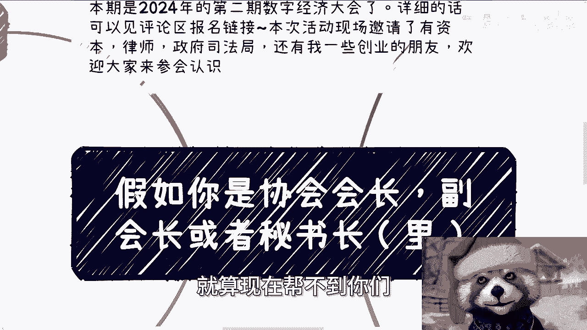

未来找多多少少可能都帮不到大家啊，额首先紧接上一章啊。

紧接上一章，上一次呢我们最后说到了格局啊，情绪管理做事件方式啊，必然不是每个人都做得到的，其实本质上呢就三个事啊，一个是所有事情的轻重缓急，你得有能力分得出来啊，其二就是应该懂得怎么争取不同的项目过来。

其三就是团队管理安排啊，当然其中最重要的一块就是PV啊，由于协会是自带一个社会属性。

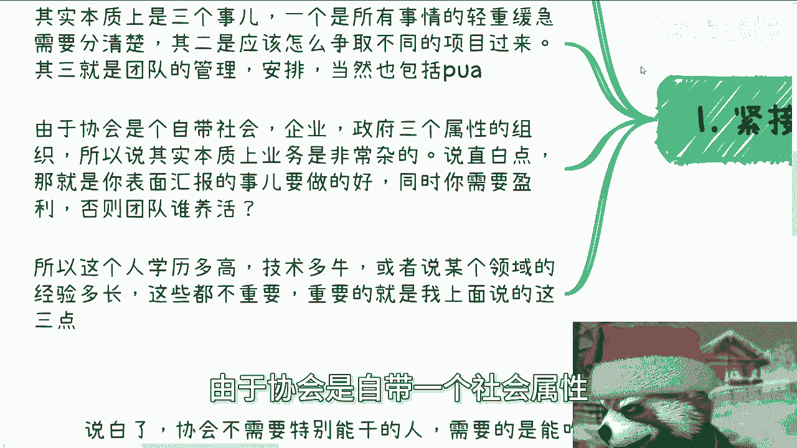

企业属性，政府属性，三个属性的一个组织，所以说其实本质上业务是非常杂的，那说直白一点就是，那就是说你表面汇报的事情要做好，同时你需要又要盈利对吧，你否则团队谁来养呢。

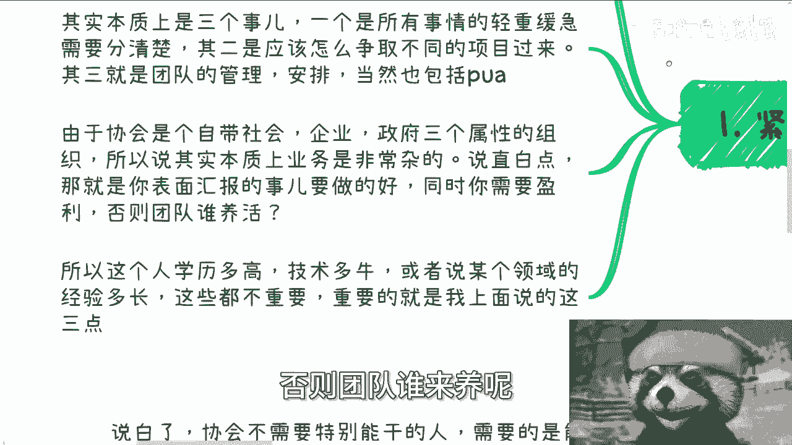

你告诉团团谁来养，对吧啊，你说你说资本嘛，你看到过哪个协会他妈的融资的，你说政府吗，你看到过哪个政府养协会的对吧，没有的，所以啊我们在这里说啊，这个会长这个角色啊，学历多高，技术多牛。

或者说某个领域的经验多长，这些都不重要啊。

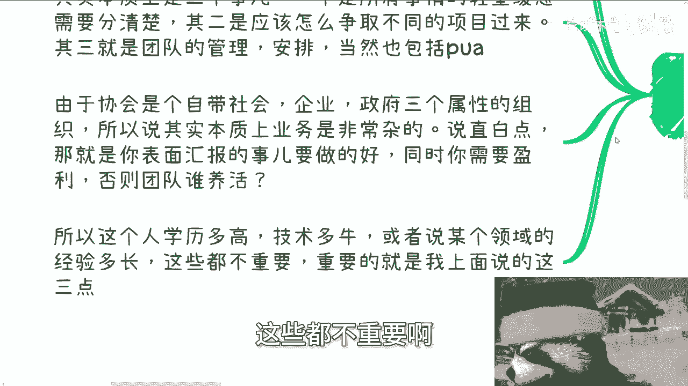

重要的是我上面说的这三点，你但凡做不到啊，就算是全球QSE的啊。

没用啊，卵用没有啊。

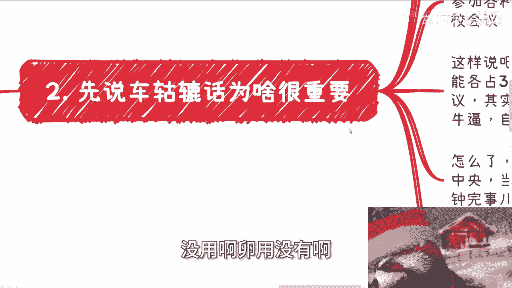

第二先说这个车轱辘话啊，为什么很重要，首先啊因为这个社会跟地球不是围着你转的。

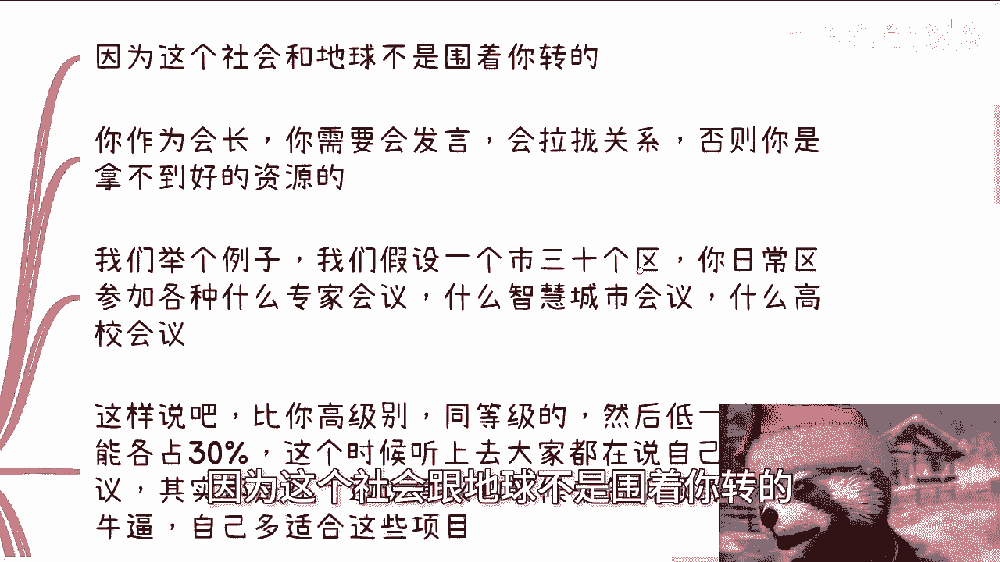

你可以觉得不重要，我也可以觉得不重要，但他妈的跟我没吊关系，对不对啊，你作为会长，你需要发言，而且你需要在不同的场合发言，而你发言不是乱发，你所有的发言都是为了告诉别人你们多牛逼，从而去拉拢关系。

否则你是拿不到好的资源，否则你是拿不到好的项目的，那这个会长有卵用啊，对吧好，那么我们举个例子啊，我们假设假设你你在一个市，这个市有30个区，你日常在这30个区里面啊，呃这个叫什么，就是流水席啊。

你日常会参加各个区的什么专家会议啊，智慧城市啊对吧，什么公安啊，农业啊。

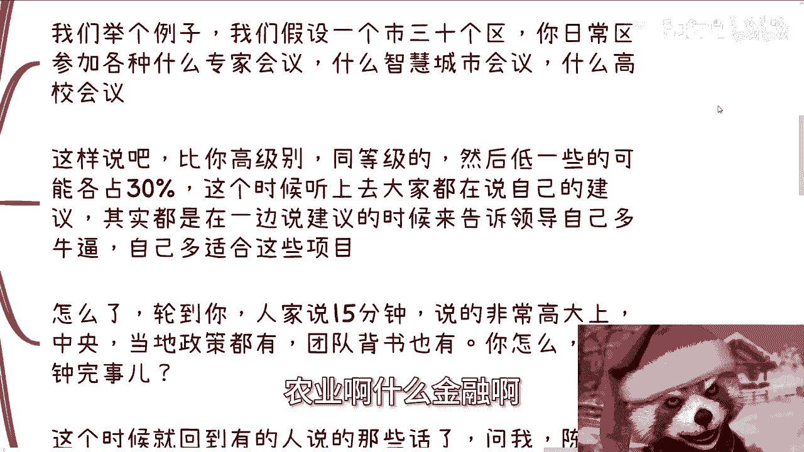

金融啊，什么各种鸟毛的他妈的会议啊，包括各种高校的，反正就是由于你协会的这个属性啊，包括你的这个直属单位，你可能会去各种各样的地方啊，这样说吧，啊你参加的所有活动和你参加所有的会议。

总不可能只有你一个人吧，对不对啊，你比如说今天区长来，就他妈你一个人啊，不现实的呀，啊我给你们宏观上面打个比方吧，比如说111个会议比你等级高的，同等级的，或者说低那么一些的可能更占各占30%。

那么这个时候听上去，大家其实都在说自己的这个建议啊，就领导肯定会说说嘛，先发表意见嘛对吧，领导这个车轱辘话说完，就轮到他妈在下面参加人车轱辘话了啊，你你会发现所有的人都在讲屁话，但是啊就像我刚刚说的。

这些人讲屁话，他是有艺术，它是有逻辑性的啊，就是说虽然是一边在说所谓的建议啊，或者说自我介绍呃，他同时呢也是在告诉领领导自己多牛逼，自己的团队多牛逼，自己的这个组织多牛逼对吧。

自己相比现场其他的人更适合这个项目，怎么了呢啊我就问接下来怎么了，轮到你了啊，轮到你了好，那么人家啊这个头头是道啊，这个叫什么，就是呃微微观里也有宏观点，有人家讲15分钟说的非常高大上啊。

既有中央也有地方政策，既有团队背书，也有这个各种硬性能力，怎么了呢，轮到你啊，2分钟完事，对不对，然后你跟领导说，哎领导他妈的他们都啊，我我我他妈的很很实在的，他们都是他妈车轱辘话，你觉得呢你觉得呢。

那么他是领导，你是领导啊，那么搞笑嘞呀，对不对，那这个时候就回到有的人要说那句话了，他说问我诶，那陈老师，那我们的确没人家这么牛逼啊，那那那我又要笑了啊，我就是想说搞笑了，人家牛不牛逼，你知道唉。

还是人家牛不牛逼，领导知道你知道个屁，领导知道个屁啊，对不对，没人知道啊，我就这样这样说。

你但凡这么想，就你这样的，你就赚不到钱啊，拉他妈倒真的哎搞笑嘞。

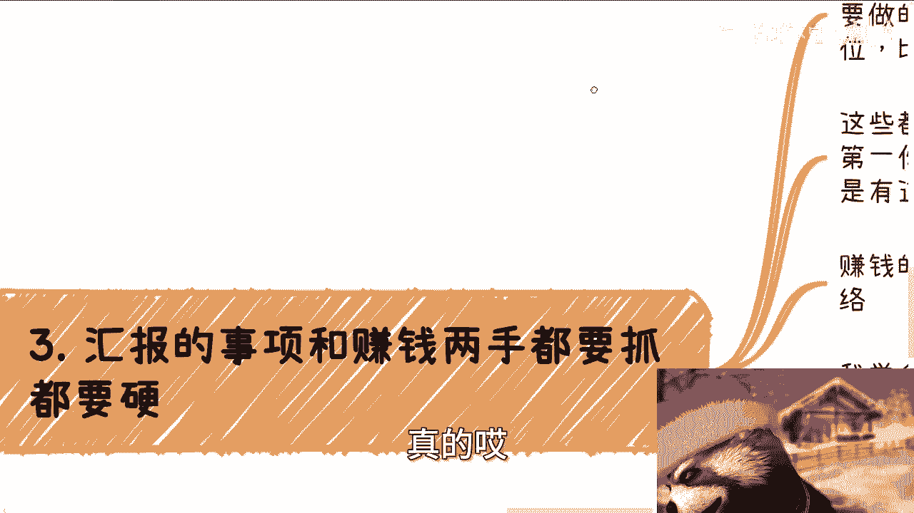

真是哦，别人在那边吹几个牛逼，你就在那边说了，哎我们没有别人牛逼，你怎么知道别人牛逼，哎，奇了怪了，吹牛逼大赛不行。

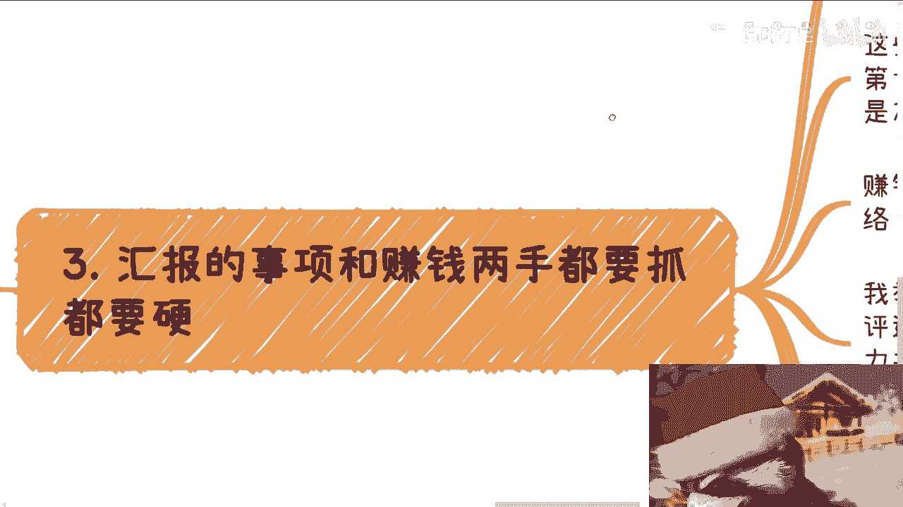

第三汇报的事项跟赚钱两手都要抓，两手都要硬啊，什么意思呢，日常该做的讨论，该做的会议纪要一个不能少啊，每年该做的活动大会。

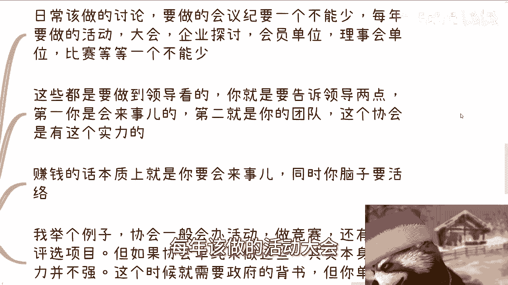

企业探讨会员单位，理事会单位比赛等等也一个不能少啊，这些都是要做给领导看的，你就是要告诉领导两点，第一你是会来事的，第二你的团队这个协会是有这个实力的啊。

当然我指的这个实例，就是说有这个实力把这件事情推动下去，对不对。

好，那么赚钱的话，本质就是你要会来事，同时你的脑子要会灵活啊，什么意思啊，我举个例子，比如说协会，一般你作为会长啊，一般都会办活动，办竞赛，还有就是项目评审对吧，但如果协会单纯来做这些事情。

比如说你跟我说爱陈老师，那个我们啊今年下半年，2023年下半年要做什么什么东西对吧，那我就会问你啊，那那这个东西呃背书是谁啊对吧，到时候这个敲证书上面敲章的是谁啊对吧，这个东西的这个发起单位是谁啊。

就我就算不问你，你所有来参加企业肯定都要问，对不对，那你要是单纯跟我说，你说啊，这个厂商我们这个啊就是我们协会发起的，那么你要明白协会本身说服力并不强啊，那么这个时候就是需要政府的背书。

但是你单纯就跟我说哎陈老师，我们是经信委科委对吧，直属单位，或者来说经信委跟科委，或者来说这个科技厅，工信厅是我们的这个指导单位，太单薄没有用，因为你知不知道单位关我事呢，我关心的是。

我如果要来参加这个什么什么竞赛啊，什么评选项目啊，我我我要知道我的这个活动倍数是谁对吧，那说白了就是说这个活动本身的主主，那个发起单位是谁，那这个时候就需要你的能力去争取到更多的。

市级区级或者来说大的国央企的项目，然后呢，你就可以用协会这样的一个渠道出口去做，因为你相当于是执行方，那我们回到刚刚那个问题上面，这些项目怎么争取来的，不就是靠车葫芦换来的吗，对不对。

那么当你做执行方的时候，你这个会长你就可以跟大家说来报名，对不对，好，那么如果我来，我来跟你说，哎我说哎那那那个张会长啊，王会长啊对吧，我想我想报一下这个，这个我觉得对我来讲蛮重要的对吧。

可能是人工智能啊，数字经济相关的，你到时候就也那个名正言顺啊，就跟我说，唉呀啊陈老师，我们很欢迎啊，但是这个东西呢我们是这样子的啊，我们协会啊你也要理解啊，我们呢都是为了这个呃协会内的会员单位啊。

做那个谋福利的，那么呃一般来讲啊，就是说呃协会外的企业也是可以报名的，但是呢，他的优先级肯定是低于协会内的会员单位啊，那如果来说你要这个呃叫什么，就是呃优先级提高的话呢，你可以先加个会员啊。

如果来说你不加会的话也行，那反正我们就是说呃先让会员单位先参加好吧，后后面的话有名额再给你，言下之意就是你不加会员，滚那把滚滚滚滚远一点，对不对，那怎么办呢，哦当然我可以选择不加，但是总有人会加吧。

对不对，那么一般一个协会的会员单位，理事会单位两年额2万5万10万20万不等啊，那钱怎么来呢，钱就这么来呗，对不对，你们当然举一反举一举一反三啊。

我这地方写的只不过是一个例子，你们要举一反三，不要他妈的只想着说哦，可能就这么一个点不止啊，远远不止啊，好第四团队管理啊。

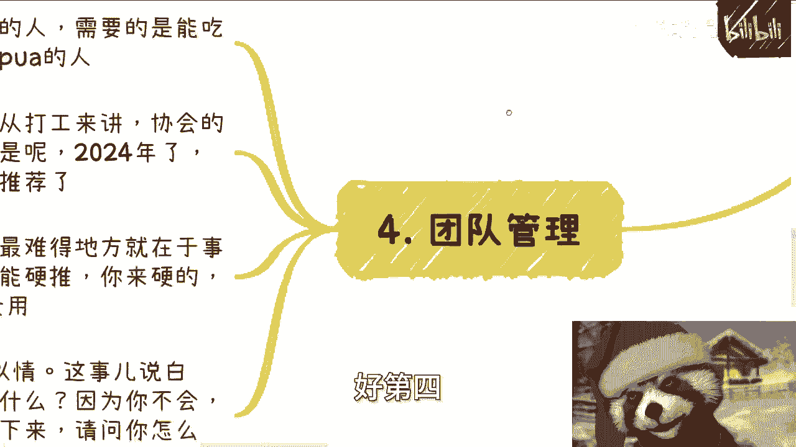

说白了协会不需要特别能干的人，他需要的是什么，他需要的是能吃苦，任劳任怨，还不停的为PUA的人，就就这个跟它的属性有关对吧，你要我说呢，宏观点来讲，就是从真的从打工来讲呢。

协会的稳定性还是高于普通企业的。

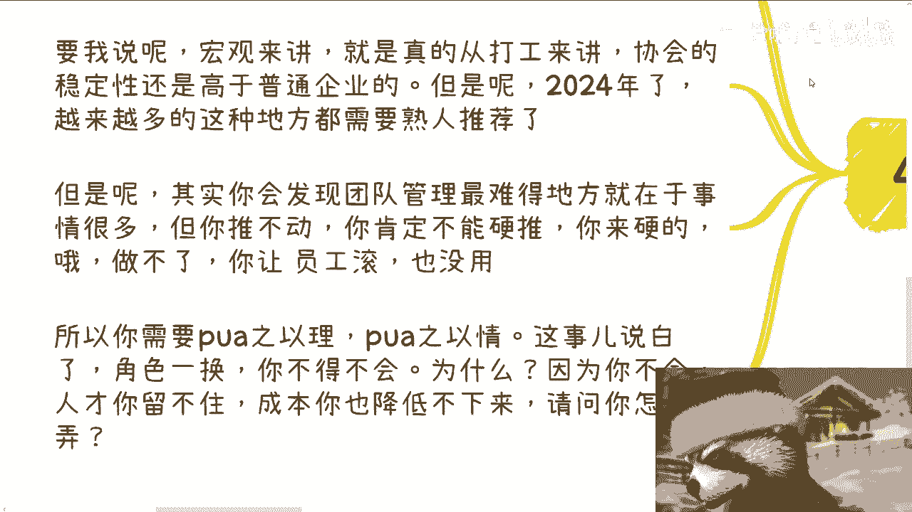

但是2024年了，越来越多，这种地方是需要熟人熟人推荐的，他不是说啊，大家就他妈应聘你，你搞笑了，协会哪里有这么多面试官给你，他妈的每天来面试没空啦啊，但是呢其实你会发现，团队管理最难的地方在于什么。

在于事情很多，但你推不动，就像我一开始说的，在那个表表那个表世界的那个视频里面讲的，你今天就算是会长，你也不可能一手遮天，你明白吗，因为团队很多人比如说很懒惰或者怎么样的，你你你你硬推也没有用。

你做不了，你让员工滚也没有用，这事情推不动啊，所以我们这以前很多事情很多时候才说嘛，就刚柔并进，刚柔并进对吧，所以你需要PUA之以礼，PUA之以情啊，这事说白了你如果是个会长角色一换，你必须得会PUA。

为什么你仔细想想看，如果你不会人才，你是留不住的，对不对啊，那么成本你也降不下来，那为什么人才留不住呢，因为你不会PUA啊，哦你不会画饼，别人就会画饼，别人画的饼很好吃，你人才就肯定会吃别人的饼。

不吃你的饼，你怎么留得住人呢，对不对，你怎么留得住人，靠什么，我们以前说过人人类这个社会就两个东西，要么精神，就精神上面叫什么叫信仰对吧，要么就是钱叫什么叫利益诱惑，对不对，两个东西都不沾。

你怎么留住人啊，那么在搞笑嘛啊那么你要是不PUA他，那么这个人留不下来，同时你也没法以更低的成本去招招到他，或者还说再说直白一点，你就没法用更低的成本去怎么说呢，去去拖住这个人，就比如说你说哎。

我可能2024年6月份说要加工资的，唉那那那我们就说啊，这个呃那个效益不好啊对吧，我们拖到12月份，那人家为什么会会被你拖呢，那不还还是因为你饼画的好吗。

对不对，那如果来说你丙不会画，那请问你怎么弄呢，你怎么弄呢，对不对，因为你到最后你的目的是什么，你的目的是要活下去，活下去的前提是什么，你要赚到钱对吧，你这些东西不会就像我们说的，你你那三大技能。

你车轱辘话也不会讲对吧，呃轻重缓急也不会分，团队管理也不会，那你怎么赚钱，对不对，你就跟我说，你清华高材生滚吧，有屁用啊，啊对不对，所以说就是说就是说在里世界里面，你们要明白的是表象，我们要做的有很多。

但是同样的赚钱的这个东西，你说它是独立的吗，它不是它其实跟表咳咳，表面汇报那些东西呢可能都有关系，但是呢你得名正言顺的在这里面收钱，对不对，你你否则你想想看啊，你们想想看，我单纯，如果你今天做个会长。

你直接问我要钱，唉你碰到哪个不识相的，他妈的直接去举报你，那不是很吗，对不对，但是你想想看，你但凡说哎我们我们今天是那个会员单位优先，或者怎么样子，有什么问题呢，名正言顺，无论谁去举报都是举报不了的。

因为你作为一个协会会员，收会员费，会员优先，这他妈就是逻辑，就这本身就是个逻辑，就像跟人家就跟人家开俱乐部一样的对吧，哦那人家加入俱乐部不优先，他妈给你优先，对不了，没毛病啊对吧。

但是你仔细想想看这个逻辑啊对吧，就是哼哼哼就是他会员单位到底有没有人报，我们也不知道对吧，他有没有会员单位，我们都不知道，但无所谓啊，人家话术可以这么说对吧，那操作空间多了呃，评选竞赛对吧。

日常的会议对吧，专家多啦，能收钱的地方不要太多对吧，但是前提是你得有项目啊，你们想想看啊，这会长真不是这么好当的啊，你们可以对比对比跟你们想象当中有多少差别，好吧行啊，那就这么着啊，然后那个报名的话。

本来大家上海9月8号这个活动继续报名啊，然后剩下的话就是那个呃职业规划，商业规划啊，就工作当中包括副业啊，包括啊你们自己赚钱啊，包括跟别人合作啊，在这里面涉及到一些合同啊，涉及到一些啊这个商业计划书啊。

涉及到一些分红分润啊，投资啊啊就是估值啊等等等啊，你们有相关的一些问题可以整理好，对应的问题跟个人背景好吧。

