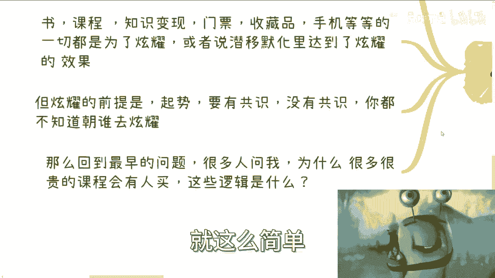

# 课程：商业逻辑的本质与“石头”案例解析 🧠💎

## 概述
在本节课中，我们将通过一个“在海边捡到一块石头并卖出10万元”的虚构案例，来探讨商业运作的本质逻辑。我们将抛开复杂的术语，用简单直白的语言和比喻，帮助你理解商业世界运行的基本规律。

---

## 商业是一个有机的生态系统 🌍

上一节我们概述了本节课的目标，现在我们来深入第一个核心概念。

商业活动并非孤立存在，它更像一个庞大而复杂的生物体。这个生物体由无数血管（资金流）、骨骼（产业结构）和器官（各类企业）组成，它们每时每刻都在协同运作。这个“生物”活着，就意味着商业在运行，财富在创造和流动。

**核心公式：商业生态 ≈ 生物体（血管 + 骨骼 + 器官）**

这个生态系统的健康或生病，并不影响其内部始终存在赚钱的机会。这意味着，无论大环境好坏，总有人能找到赚钱的路径。

---

## 个体如何融入商业生态？ 🔗

理解了商业是一个生态系统后，一个自然的问题是：个人如何参与其中并获利？

个体想要在这个生态中赚钱，只有两种根本途径：
1.  **成为新组件**：作为一个全新的细胞、器官或小生态，被现有系统接纳并融合，从此跟随整个系统的脉搏一起运作。
2.  **强化旧结构**：加入到已有的血管或器官中，使其变得更庞大、更健壮，从而推动整个系统成长。

然而，我们从小接受的教育体系，在很大程度上是游离于这个商业“生物体”之外的。就像旁观奥特曼战斗的观众，我们看到了现象，却没有参与其中的交集。因此，传统的学习过程本身，与“赚钱”并无直接关联。

---

## 案例分析：为什么石头能卖10万？ 💰

现在，让我们将理论应用到开头的具体案例中。假设我们真的在海边捡了块普通石头，并以10万元售出。

面对这个案例，人们通常会陷入几种思维误区：

以下是几种常见的错误分析方向：
*   **研究石头本身**：猜测它是否是稀有矿石、未来钻石，或含有特殊成分。
*   **神化发现过程**：编造曲折的发现故事，撰写自传，塑造“慧眼识珠”的成功学人设。
*   **质疑营销骗局**：研究是否有幕后推手、场景造假，或直接断定这是欺诈，认为“石头不可能值这个价”。

这些反应非常普遍，无论你卖的是石头、课程还是其他任何东西，剧情都大同小异。原因在于，人们总想为单一事件寻找独立的、特殊的“商业逻辑”。但很多时候，一个孤立的交易就像生物体内的一个细胞，它本身可能没有独立的逻辑，它的价值由整个系统决定。

对于“石头为什么能卖10万”这个问题，最直接的回答是：**因为地球上恰好有人认为它值10万，并愿意支付。** 追问“这个人为什么这么想”，就像追问一个细胞为何存在一样，答案深植于整个生态系统的复杂运作中。

那么，这个模式可以复制吗？也许可以，但极其困难。因为它依赖的是特定时刻、特定对象构成的独特系统状态。

---

## 商业的核心驱动力：造势与共识 🚀

既然单一事件难以复制，那么是否存在更普遍的规律？答案是肯定的。任何成功的商业行为，放大到整个生态中看，都遵循一个关键模式：**造势（启事）**。

什么是造势？就是创造声势、引发关注、制造潮流。
*   **高情商说法**：高举高打，战略布局。
*   **中情商说法**：引发冲动消费。
*   **低情商说法**：人来疯，凑热闹。

造势本身就是一种强大的商业模式。以“天价石头”为例：
1.  **自媒体、营销号会跟进**，分析石头可能的好处、加工价值、收藏意义，形成第一波舆论。
2.  **地方政府或机构可能介入**，宣称其有科研或文化价值，呼吁保护，提升其公共形象。
3.  在这个过程中，**共识**被逐渐制造出来。尽管没人真正清楚石头的原始价值，但“它很值钱、很特别”的观念已被植入市场。

一旦共识形成，通过漏斗模型过滤目标人群，最终就会出现愿意花10万、100万购买的买家。你问他们为什么买？背后的动机往往是：
**核心公式：购买动机 = 炫耀（或被视为炫耀） > 实际需求**
无论是买书、买课、买手机还是买收藏品，很多消费行为都是为了传递某种社会信号（炫耀、身份认同、攀比）。而炫耀的前提，正是社会共识——大家都知道这东西“牛”，炫耀才有意义。

---

## 总结与启示 🎯

本节课我们一起学习了商业逻辑的本质。让我们回顾一下核心要点：

1.  **商业是生态系统**：它像生物体一样复杂运作，个人需找到方式融入其中。
2.  **单一事件无孤立逻辑**：“石头卖10万”这类案例，其成因深植于整个系统复杂的互动中，难以简单归因和复制。
3.  **造势创造共识**：普适的商业规律在于创造声势和共识。价值常由市场共识定义，而非物品本身。
4.  **购买的核心动机**：许多交易的核心驱动力是“炫耀”或社会信号传递，这需要共识作为基础。
5.  **行动重于空想**：与其过度分析某个成功案例的细节（如话术、产品设计），不如关注如何为自己的产品“造势”并找到精准的客户群体。商业的本质通常是“一个愿打，一个愿挨”。

因此，当你看到令人费解的商业现象时，不必过度纠结于微观逻辑。更重要的是理解**信息不对称**和**共识塑造**的力量。打磨价值是基础，但让市场认知并接受这份价值，往往需要运用生态层面的规律。

---
**思考与实践**：审视你身边或你感兴趣的一个产品或服务，尝试用“造势”和“共识”的视角去分析它的市场策略，而不是仅仅研究其功能本身。